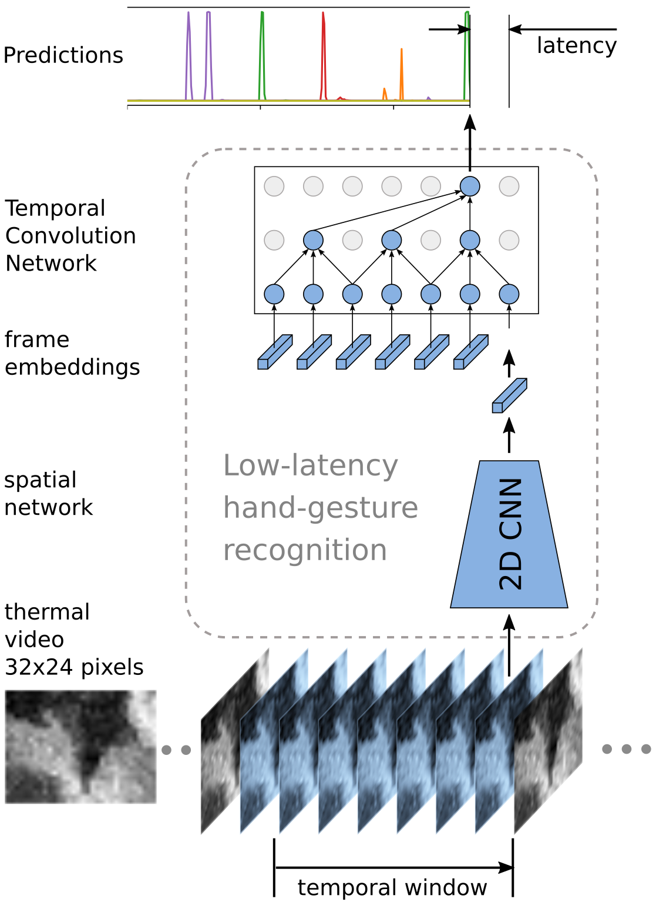

# Hand gesture recognition

This is the implementation of the paper [*Low-latency hand gesture recognition with a low resolution thermal imager*](https://arxiv.org/abs/2004.11623) in PyTorch.
The code of this repository is based on code from [this action recognition](https://github.com/opencv/openvino_training_extensions/tree/develop/pytorch_toolkit/action_recognition) repository.

<p align="center">
&nbsp;&nbsp;&nbsp;&nbsp;&nbsp;&nbsp;&nbsp;&nbsp;&nbsp; <a href="https://www.youtube.com/watch?v=DAjKO0HWW78"> &nbsp;&nbsp;&nbsp;&nbsp;&nbsp;  </a>
</p>

## Install

The code is tested with pytorch 1.3 and python3.5. Other dependencies are listed in `requirements.txt`. You can install required packages with:

```bash
pip install -r requirements.txt
```

## Download the dataset

This work is tested on our own recorded dataset which can be downloaded [here](https://iiw.kuleuven.be/onderzoek/eavise/mlgesture/home).
Unzip `MlGesture.zip` to a folder of choise. Folder `MlGesturePublic/train_val` contains the training and validation set with video level annotations.
`stiched_validation_videos` contains 50% of the validation set videos stiched with frame-wise annotations. See the dataset's incuded README.md for more
details.

Create a symlink in the `data` folder named `MlGesture` that points to the extracted `MlGesturePublic/train_val` folder.

```
ln -s /path/to/MlGesturePublic/train_val data/MlGesture
```

### Generate train/validation annotation data

First we need to generate a .json file which contains a list of all training and test videos with their respective label and metadata.
Use the following command:

```
python utils/mlgesture_json.py data/MlGesture/frame_data data/MlGesture/train.json data/MlGesture/validation.json data/MlGesture/<output filename>.json <modality>
```

where `<output filename>.json` is some output name and `<modality>` is one of the available sensor modalites and viewpoints. Use the `--help` command
to see the available options.

For example:

```
python utils/mlgesture_json.py data/MlGesture/frame_data data/MlGesture/train.json data/MlGesture/validation.json data/MlGesture/mlgesture_mlx90640_front.json mlx90640_front
```

will generate a dataset file `mlgesture_mlx90640_front.json` for training and evaluation on the mlx90640 data from the dashboard camera.

The above command generates label data for training and evaluation with cross-entropy loss. For training and evaluation with CTC loss, we need to have sequence labels.
A dataset file with sequence labels can be generated with the same command, but by starting from `train_seqs.json` and `validation_seqs.json`, which contain these labels.

For example:

```
python utils/mlgesture_json.py data/MlGesture/frame_data data/MlGesture/train_seqs.json data/MlGesture/validation_seqs.json data/MlGesture/mlgesture_mlx90640_front_seqs.json mlx90640_front
```

will generate a dataset file `mlgesture_mlx90640_front_seqs.json` for training and evaluation with CTC loss on the mlx90640 data from the dashboard camera.

Repeat the above two commands for all sensors you want to try.

## Evaluation

We included our *TCN mix2 f128*, *TCN mix2 f164* and *TCN mix2 f64 SqueezeNet* models from the *mlx90640 front* sensor in this repo (see paper for more details).
These models are the proposed low-latency models trained with CTC-loss.

### Video classification with CTC

The following commands evaluate the models on the validation set as a regular video classifier where they get to see the whole video before they
are required to predict a label (non low-latency):

*TCN mix2 f128*:
```
python main.py --root-path ./data --result-path ./data/logs/mlgesture_debug --dataset mlgesture_mlx90640_front_seqs --model resnet18_ms_tcn --mean-dataset mlgesture_mlx --max-pixel-value 3000 --min-pixel-value -400 --ctc-loss --causal-config mix_2 --num-stages 4 --num-layers 4 --num-f-maps 128 --no-train --no-val --pretrain-path data/checkpoints/tcn_mix2_f128.pth
```

*TCN mix2 f64*:
```
python main.py --root-path ./data --result-path ./data/logs/mlgesture_debug --dataset mlgesture_mlx90640_front_seqs --model resnet18_ms_tcn --mean-dataset mlgesture_mlx --max-pixel-value 3000 --min-pixel-value -400 --ctc-loss --causal-config mix_2 --num-stages 4 --num-layers 4 --no-train --no-val --pretrain-path data/checkpoints/tcn_mix2_f64.pth
```

*TCN mix2 f64 SqueezeNet*:
```
 python main.py --root-path ./data --result-path ./data/logs/mlgesture_debug --dataset mlgesture_mlx90640_front_seqs --model squeezenet11_ms_tcn --mean-dataset mlgesture_mlx --max-pixel-value 3000 --min-pixel-value -400 --ctc-loss --causal-config mix_2 --num-stages 4 --num-layers 4 --no-train --no-val --pretrain-path data/checkpoints/tcn_mix2_f64_squeezenet11.pth
```

NOTE: *clip* accuracy is the metric that matters.

### Video classification with CE

```
python main.py --root-path ./data --result-path ./data/logs/mlgesture_debug --dataset mlgesture_mlx90640_front --model resnet18_ms_tcn --mean-dataset mlgesture_mlx --max-pixel-value 3000 --min-pixel-value -400 --num-stages 4 --num-layers 5 --num-f-maps 128 --no-train --no-val --pretrain-path data/checkpoints/tcn_mix2_f128_ce.pth
```

### Low-latency prediction

TODO

## Training

TODO

## Test low latency behavior
