# Comparision of ML classification models to predict the presence of heart disease in the patient

<b>Data:</b>
This database contains 76 attributes, but all published experiments refer to using a subset of 14 of them. <br>
Attribute Information:<br>
age<br>
sex<br>
chest pain type (4 values)<br>
resting blood pressure</br>
serum cholestoral in mg/dl<br>
fasting blood sugar > 120 mg/dl<br>
resting electrocardiographic results (values 0,1,2)<br>
maximum heart rate achieved<br>
exercise induced angina<br>
oldpeak = ST depression induced by exercise relative to rest<br>
the slope of the peak exercise ST segment<br>
number of major vessels (0-3) colored by flourosopy<br>
thal: 3 = normal; 6 = fixed defect; 7 = reversable defect<br>
The "target" field refers to the presence of heart disease in the patient. It is integer 0 or 1(presence).</br>

<h2> 1. Importing modules </h2>


```python
import time

import numpy as np
import pandas as pd
import matplotlib.pyplot as plt
import seaborn as sns

from sklearn.impute import SimpleImputer
from sklearn.ensemble import RandomForestClassifier
from sklearn.tree import DecisionTreeClassifier, export_graphviz
from sklearn.metrics import roc_curve, auc, classification_report, confusion_matrix, mean_squared_error, precision_recall_fscore_support 
from sklearn.model_selection import train_test_split, GridSearchCV, cross_val_score
from sklearn.preprocessing import StandardScaler
from sklearn.linear_model import LogisticRegression
from sklearn.neighbors import KNeighborsClassifier
from sklearn.svm import SVC
from sklearn.naive_bayes import GaussianNB

import tensorflow as tf
from tensorflow.keras.models import Sequential
from tensorflow.keras.layers import MaxPool2D, Dense, Flatten, Dropout
from tensorflow.keras.utils import to_categorical
from tensorflow.keras import regularizers
from hyperopt import hp, STATUS_OK, tpe, Trials, fmin

import xgboost as xgb

```

<h2> 2. Reading data </h2>


```python
data = pd.read_csv(r"heart_disease_dataset.csv", sep = ',')
```


```python
data.head()
```


<div>
<style scoped>
    .dataframe tbody tr th:only-of-type {
        vertical-align: middle;
    }

    .dataframe tbody tr th {
        vertical-align: top;
    }

    .dataframe thead th {
        text-align: right;
    }
</style>
<table border="1" class="dataframe">
  <thead>
    <tr style="text-align: right;">
      <th></th>
      <th>age</th>
      <th>sex</th>
      <th>chest pain type</th>
      <th>resting bp s</th>
      <th>cholesterol</th>
      <th>fasting blood sugar</th>
      <th>resting ecg</th>
      <th>max heart rate</th>
      <th>exercise angina</th>
      <th>oldpeak</th>
      <th>ST slope</th>
      <th>target</th>
    </tr>
  </thead>
  <tbody>
    <tr>
      <th>0</th>
      <td>40.0</td>
      <td>1.0</td>
      <td>2.0</td>
      <td>140.0</td>
      <td>289.0</td>
      <td>0.0</td>
      <td>0.0</td>
      <td>172.0</td>
      <td>0.0</td>
      <td>0.0</td>
      <td>1.0</td>
      <td>0</td>
    </tr>
    <tr>
      <th>1</th>
      <td>49.0</td>
      <td>0.0</td>
      <td>3.0</td>
      <td>160.0</td>
      <td>180.0</td>
      <td>0.0</td>
      <td>0.0</td>
      <td>156.0</td>
      <td>0.0</td>
      <td>1.0</td>
      <td>2.0</td>
      <td>1</td>
    </tr>
    <tr>
      <th>2</th>
      <td>37.0</td>
      <td>1.0</td>
      <td>2.0</td>
      <td>130.0</td>
      <td>283.0</td>
      <td>0.0</td>
      <td>1.0</td>
      <td>98.0</td>
      <td>0.0</td>
      <td>0.0</td>
      <td>1.0</td>
      <td>0</td>
    </tr>
    <tr>
      <th>3</th>
      <td>48.0</td>
      <td>0.0</td>
      <td>4.0</td>
      <td>138.0</td>
      <td>214.0</td>
      <td>0.0</td>
      <td>0.0</td>
      <td>108.0</td>
      <td>1.0</td>
      <td>1.5</td>
      <td>2.0</td>
      <td>1</td>
    </tr>
    <tr>
      <th>4</th>
      <td>54.0</td>
      <td>1.0</td>
      <td>3.0</td>
      <td>150.0</td>
      <td>195.0</td>
      <td>0.0</td>
      <td>0.0</td>
      <td>122.0</td>
      <td>0.0</td>
      <td>0.0</td>
      <td>1.0</td>
      <td>0</td>
    </tr>
  </tbody>
</table>
</div>


<h2> 3. Display correlation matrix </h2>


```python
corr_matrix = data.corr()
corr_matrix
```


<div>
<style scoped>
    .dataframe tbody tr th:only-of-type {
        vertical-align: middle;
    }

    .dataframe tbody tr th {
        vertical-align: top;
    }

    .dataframe thead th {
        text-align: right;
    }
</style>
<table border="1" class="dataframe">
  <thead>
    <tr style="text-align: right;">
      <th></th>
      <th>age</th>
      <th>sex</th>
      <th>chest pain type</th>
      <th>resting bp s</th>
      <th>cholesterol</th>
      <th>fasting blood sugar</th>
      <th>resting ecg</th>
      <th>max heart rate</th>
      <th>exercise angina</th>
      <th>oldpeak</th>
      <th>ST slope</th>
      <th>target</th>
    </tr>
  </thead>
  <tbody>
    <tr>
      <th>age</th>
      <td>1.000000</td>
      <td>0.012722</td>
      <td>0.151827</td>
      <td>0.258470</td>
      <td>-0.042549</td>
      <td>0.172764</td>
      <td>0.186299</td>
      <td>-0.360436</td>
      <td>0.193055</td>
      <td>0.242778</td>
      <td>0.238096</td>
      <td>0.256920</td>
    </tr>
    <tr>
      <th>sex</th>
      <td>0.012722</td>
      <td>1.000000</td>
      <td>0.139314</td>
      <td>-0.008446</td>
      <td>-0.205974</td>
      <td>0.120592</td>
      <td>-0.017216</td>
      <td>-0.181560</td>
      <td>0.195180</td>
      <td>0.097285</td>
      <td>0.132540</td>
      <td>0.318390</td>
    </tr>
    <tr>
      <th>chest pain type</th>
      <td>0.151827</td>
      <td>0.139314</td>
      <td>1.000000</td>
      <td>0.010878</td>
      <td>-0.108402</td>
      <td>0.080263</td>
      <td>0.036959</td>
      <td>-0.339022</td>
      <td>0.405288</td>
      <td>0.224514</td>
      <td>0.274914</td>
      <td>0.458364</td>
    </tr>
    <tr>
      <th>resting bp s</th>
      <td>0.258470</td>
      <td>-0.008446</td>
      <td>0.010878</td>
      <td>1.000000</td>
      <td>0.102911</td>
      <td>0.089332</td>
      <td>0.098644</td>
      <td>-0.105735</td>
      <td>0.139658</td>
      <td>0.174582</td>
      <td>0.092047</td>
      <td>0.118279</td>
    </tr>
    <tr>
      <th>cholesterol</th>
      <td>-0.042549</td>
      <td>-0.205974</td>
      <td>-0.108402</td>
      <td>0.102911</td>
      <td>1.000000</td>
      <td>-0.232546</td>
      <td>0.151813</td>
      <td>0.233512</td>
      <td>-0.027447</td>
      <td>0.063645</td>
      <td>-0.094350</td>
      <td>-0.193333</td>
    </tr>
    <tr>
      <th>fasting blood sugar</th>
      <td>0.172764</td>
      <td>0.120592</td>
      <td>0.080263</td>
      <td>0.089332</td>
      <td>-0.232546</td>
      <td>1.000000</td>
      <td>0.030907</td>
      <td>-0.126016</td>
      <td>0.054053</td>
      <td>0.032149</td>
      <td>0.148071</td>
      <td>0.217403</td>
    </tr>
    <tr>
      <th>resting ecg</th>
      <td>0.186299</td>
      <td>-0.017216</td>
      <td>0.036959</td>
      <td>0.098644</td>
      <td>0.151813</td>
      <td>0.030907</td>
      <td>1.000000</td>
      <td>0.057597</td>
      <td>0.038071</td>
      <td>0.126470</td>
      <td>0.094598</td>
      <td>0.077719</td>
    </tr>
    <tr>
      <th>max heart rate</th>
      <td>-0.360436</td>
      <td>-0.181560</td>
      <td>-0.339022</td>
      <td>-0.105735</td>
      <td>0.233512</td>
      <td>-0.126016</td>
      <td>0.057597</td>
      <td>1.000000</td>
      <td>-0.379650</td>
      <td>-0.188180</td>
      <td>-0.353363</td>
      <td>-0.415688</td>
    </tr>
    <tr>
      <th>exercise angina</th>
      <td>0.193055</td>
      <td>0.195180</td>
      <td>0.405288</td>
      <td>0.139658</td>
      <td>-0.027447</td>
      <td>0.054053</td>
      <td>0.038071</td>
      <td>-0.379650</td>
      <td>1.000000</td>
      <td>0.372813</td>
      <td>0.397726</td>
      <td>0.476837</td>
    </tr>
    <tr>
      <th>oldpeak</th>
      <td>0.242778</td>
      <td>0.097285</td>
      <td>0.224514</td>
      <td>0.174582</td>
      <td>0.063645</td>
      <td>0.032149</td>
      <td>0.126470</td>
      <td>-0.188180</td>
      <td>0.372813</td>
      <td>1.000000</td>
      <td>0.526345</td>
      <td>0.398671</td>
    </tr>
    <tr>
      <th>ST slope</th>
      <td>0.238096</td>
      <td>0.132540</td>
      <td>0.274914</td>
      <td>0.092047</td>
      <td>-0.094350</td>
      <td>0.148071</td>
      <td>0.094598</td>
      <td>-0.353363</td>
      <td>0.397726</td>
      <td>0.526345</td>
      <td>1.000000</td>
      <td>0.504881</td>
    </tr>
    <tr>
      <th>target</th>
      <td>0.256920</td>
      <td>0.318390</td>
      <td>0.458364</td>
      <td>0.118279</td>
      <td>-0.193333</td>
      <td>0.217403</td>
      <td>0.077719</td>
      <td>-0.415688</td>
      <td>0.476837</td>
      <td>0.398671</td>
      <td>0.504881</td>
      <td>1.000000</td>
    </tr>
  </tbody>
</table>
</div>


<h2> 4. Change type of categorical attributes </h2>


```python
cat_cols = ['sex', 'chest pain type', 'fasting blood sugar', 'resting ecg', 'exercise angina', 'ST slope','target']
for cat_col in cat_cols:
    data[cat_col] = data[cat_col].astype('category')
data.dtypes
```


    age                     float64
    sex                    category
    chest pain type        category
    resting bp s            float64
    cholesterol             float64
    fasting blood sugar    category
    resting ecg            category
    max heart rate          float64
    exercise angina        category
    oldpeak                 float64
    ST slope               category
    target                 category
    dtype: object


```python
data.dtypes
```


    age                     float64
    sex                    category
    chest pain type        category
    resting bp s            float64
    cholesterol             float64
    fasting blood sugar    category
    resting ecg            category
    max heart rate          float64
    exercise angina        category
    oldpeak                 float64
    ST slope               category
    target                 category
    dtype: object


<h2> 5. Dealing with misssing values </h2>
Some values were dropped manually to make data more non-trivial


```python
data.isnull().sum()
```


    age                    14
    sex                     7
    chest pain type        11
    resting bp s           23
    cholesterol            14
    fasting blood sugar     3
    resting ecg             2
    max heart rate          9
    exercise angina         3
    oldpeak                 5
    ST slope                3
    target                  0
    dtype: int64


```python
cols_with_missing = [col for col in data.columns
                     if data[col].isnull().any()]
cols_with_missing
```


    ['age',
     'sex',
     'chest pain type',
     'resting bp s',
     'cholesterol',
     'fasting blood sugar',
     'resting ecg',
     'max heart rate',
     'exercise angina',
     'oldpeak',
     'ST slope']


```python
cols = data.columns
```

Below I used SimpleImputer to replace missing data. I needed to use two different strategies - for cathegorical attributes I used 'most_frequent' strategy and for float values I used 'mean' strategy. 


```python
for col in cols:
    if col in cat_cols:
        imputer = SimpleImputer(strategy = 'most_frequent')
        data[col] = pd.DataFrame(imputer.fit_transform(np.array(data[col]).reshape(-1, 1)))
    else:
        imputer = SimpleImputer(strategy = 'mean')
        data[col] = pd.DataFrame(imputer.fit_transform(np.array(data[col]).reshape(-1, 1)))
        scaler = StandardScaler()
        data[col] = pd.DataFrame(scaler.fit_transform(np.array(data[col]).reshape(-1, 1)))
        

    
data.columns = cols

data.head()
```


<div>
<style scoped>
    .dataframe tbody tr th:only-of-type {
        vertical-align: middle;
    }

    .dataframe tbody tr th {
        vertical-align: top;
    }

    .dataframe thead th {
        text-align: right;
    }
</style>
<table border="1" class="dataframe">
  <thead>
    <tr style="text-align: right;">
      <th></th>
      <th>age</th>
      <th>sex</th>
      <th>chest pain type</th>
      <th>resting bp s</th>
      <th>cholesterol</th>
      <th>fasting blood sugar</th>
      <th>resting ecg</th>
      <th>max heart rate</th>
      <th>exercise angina</th>
      <th>oldpeak</th>
      <th>ST slope</th>
      <th>target</th>
    </tr>
  </thead>
  <tbody>
    <tr>
      <th>0</th>
      <td>-1.490946</td>
      <td>1.0</td>
      <td>2.0</td>
      <td>0.438596</td>
      <td>0.777341</td>
      <td>0.0</td>
      <td>0.0</td>
      <td>1.277134</td>
      <td>0.0</td>
      <td>-0.852962</td>
      <td>1.0</td>
      <td>0</td>
    </tr>
    <tr>
      <th>1</th>
      <td>-0.519407</td>
      <td>0.0</td>
      <td>3.0</td>
      <td>1.541630</td>
      <td>-0.304882</td>
      <td>0.0</td>
      <td>0.0</td>
      <td>0.645723</td>
      <td>0.0</td>
      <td>0.069617</td>
      <td>2.0</td>
      <td>1</td>
    </tr>
    <tr>
      <th>2</th>
      <td>-1.814792</td>
      <td>1.0</td>
      <td>2.0</td>
      <td>-0.112921</td>
      <td>0.717769</td>
      <td>0.0</td>
      <td>1.0</td>
      <td>-1.643144</td>
      <td>0.0</td>
      <td>-0.852962</td>
      <td>1.0</td>
      <td>0</td>
    </tr>
    <tr>
      <th>3</th>
      <td>-0.627356</td>
      <td>0.0</td>
      <td>4.0</td>
      <td>0.328293</td>
      <td>0.032692</td>
      <td>0.0</td>
      <td>0.0</td>
      <td>-1.248512</td>
      <td>1.0</td>
      <td>0.530906</td>
      <td>2.0</td>
      <td>1</td>
    </tr>
    <tr>
      <th>4</th>
      <td>0.020337</td>
      <td>1.0</td>
      <td>3.0</td>
      <td>0.990113</td>
      <td>-0.155952</td>
      <td>0.0</td>
      <td>0.0</td>
      <td>-0.696027</td>
      <td>0.0</td>
      <td>-0.852962</td>
      <td>1.0</td>
      <td>0</td>
    </tr>
  </tbody>
</table>
</div>


Here I checked if all missing vales were properly replaced.


```python
data.isnull().sum()
```


    age                    0
    sex                    0
    chest pain type        0
    resting bp s           0
    cholesterol            0
    fasting blood sugar    0
    resting ecg            0
    max heart rate         0
    exercise angina        0
    oldpeak                0
    ST slope               0
    target                 0
    dtype: int64


```python
cat_cols = ['sex', 'chest pain type', 'fasting blood sugar', 'resting ecg', 'exercise angina', 'ST slope','target']
for cat_col in cat_cols:
    data[cat_col] = data[cat_col].astype('category')
data.dtypes
```


    age                     float64
    sex                    category
    chest pain type        category
    resting bp s            float64
    cholesterol             float64
    fasting blood sugar    category
    resting ecg            category
    max heart rate          float64
    exercise angina        category
    oldpeak                 float64
    ST slope               category
    target                 category
    dtype: object


<h2> 6. Encoding categorical attributes  </h2>


```python
data = pd.get_dummies(data, drop_first=True)
```

<h2> 7. Checking class distribution  </h2>


```python
class_distribution = data["target_1"].value_counts()
sns.set_style("whitegrid")
plt.figure(figsize=(16,5))
plt.yticks(np.arange(0,1000,100))
plt.ylabel("Amount of samples")
plt.xlabel("Classes")
sns.barplot(x= ['Positive', 'Negative'], y = class_distribution)
plt.show()
```


    
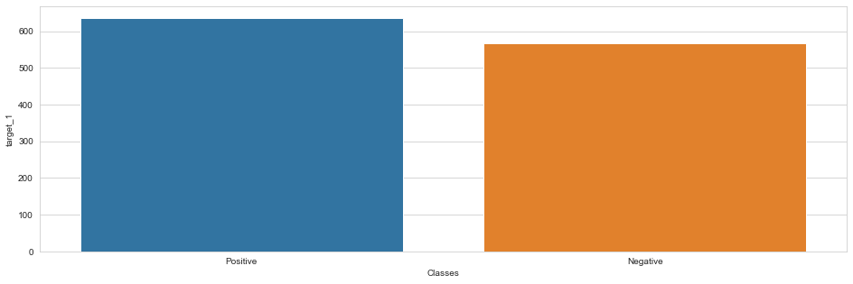
    


<h2> 8. Split data into train and test set. Ratio 8:2 </h2>


```python
X_train, X_test, y_train, y_test = train_test_split(data.drop('target_1', 1), data['target_1'], test_size = 0.2, random_state=42)
```


```python
def calculate_results(model, X_test=X_test, y_test=y_test):
    start = time.time()
    y_predict = model.predict(X_test)
    y_pred_quant = model.predict_proba(X_test)[:, 1]
    y_pred_bin = model.predict(X_test)
    end = time.time()
    eltime = end - start
    
    mse = mean_squared_error(y_test, y_pred_bin)
    cm = confusion_matrix(y_test, y_pred_bin)
    print(cm)
    fpr, tpr, thresholds = roc_curve(y_test, y_pred_quant)

    fig, ax = plt.subplots()
    ax.plot(fpr, tpr)
    ax.plot([0, 1], [0, 1], transform=ax.transAxes, ls="--", c=".3")
    plt.xlim([0.0, 1.0])
    plt.ylim([0.0, 1.0])
    plt.rcParams['font.size'] = 12
    plt.title('ROC curve for Heart Disease classifier')
    plt.xlabel('False Positive Rate (1 - Specificity)')
    plt.ylabel('True Positive Rate (Sensitivity)')
    plt.grid(True)
    AUC =  auc(fpr, tpr)
    print('AUC', AUC)
    print(classification_report(y_test, y_pred_bin))
    
    return {'eltime' : eltime, 'fpr' : fpr, 'tpr' : tpr, 'auc' : AUC, 'confusion_matrix' : cm, 'mse' : mse}
```

<h2> 9. Random Forest Classifier  </h2>


```python
param_grid = [
    {'n_estimators': [2, 4, 5, 8, 10],'max_features': [3,  8, 9, 12], 'criterion': ['gini', 'entropy']}
]

forest_reg = RandomForestClassifier()
crf = GridSearchCV(forest_reg, param_grid, cv=5, scoring = 'f1')
crf.fit(X_train, y_train)
print(crf.best_params_)
print(crf.best_estimator_)
cvres = crf.cv_results_
crf_best = crf.best_estimator_
```

    {'criterion': 'entropy', 'max_features': 8, 'n_estimators': 8}
    RandomForestClassifier(criterion='entropy', max_features=8, n_estimators=8)
    


```python
crf_results = calculate_results(crf_best, X_test=X_test, y_test=y_test)
```

    [[104   7]
     [ 18 112]]
    AUC 0.9480942480942481
                  precision    recall  f1-score   support
    
               0       0.85      0.94      0.89       111
               1       0.94      0.86      0.90       130
    
        accuracy                           0.90       241
       macro avg       0.90      0.90      0.90       241
    weighted avg       0.90      0.90      0.90       241
    
    


    
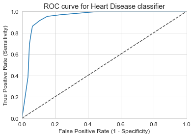
    


<h2> 10. Logistic Regression Classifier  </h2>


```python
param_grid_clgr = [
    {"C":np.logspace(-3,2,6)}
]
clgr_reg = LogisticRegression()
clgr = GridSearchCV(clgr_reg, param_grid_clgr, cv=5, scoring = 'neg_mean_squared_error')
clgr.fit(X_train, y_train)
print(clgr.best_params_)
print(clgr.best_estimator_)
clgr_res = clgr.cv_results_
for mean_score, params in zip(clgr_res["mean_test_score"], clgr_res["params"]):
    print(np.sqrt(-mean_score), params)
clgr_best = clgr.best_estimator_
```

    {'C': 0.1}
    LogisticRegression(C=0.1)
    0.44911037566914297 {'C': 0.001}
    0.4228598456345629 {'C': 0.01}
    0.39882572669818894 {'C': 0.1}
    0.40014974528649866 {'C': 1.0}
    0.40913310349207505 {'C': 10.0}
    0.41039757041569924 {'C': 100.0}
    


```python
clgr_results = calculate_results(clgr_best, X_test=X_test, y_test=y_test)
```

    [[ 95  16]
     [ 18 112]]
    AUC 0.917879417879418
                  precision    recall  f1-score   support
    
               0       0.84      0.86      0.85       111
               1       0.88      0.86      0.87       130
    
        accuracy                           0.86       241
       macro avg       0.86      0.86      0.86       241
    weighted avg       0.86      0.86      0.86       241
    
    


    
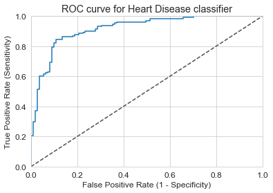
    


<h2> 11. KNNeighbors Classifier  </h2>


```python
param_grid_knn = [
    {"n_neighbors": [3, 5, 7, 9, 11, 13, 15, 20, 25, 30, 35, 40, 50], 'weights': ['uniform', 'distance'], 'metric':['euclidean', 'manhattan']}
]
knn = KNeighborsClassifier()
knn = GridSearchCV(knn, param_grid_knn, cv=5, scoring = 'f1')
knn.fit(X_train, y_train)
print(knn.best_params_)
print(knn.best_estimator_)
knn_res = knn.cv_results_
knn_best = knn.best_estimator_
```

    {'metric': 'manhattan', 'n_neighbors': 9, 'weights': 'distance'}
    KNeighborsClassifier(metric='manhattan', n_neighbors=9, weights='distance')
    


```python
cknn_results = calculate_results(knn_best, X_test=X_test, y_test=y_test)
```

    [[104   7]
     [  9 121]]
    AUC 0.9575190575190575
                  precision    recall  f1-score   support
    
               0       0.92      0.94      0.93       111
               1       0.95      0.93      0.94       130
    
        accuracy                           0.93       241
       macro avg       0.93      0.93      0.93       241
    weighted avg       0.93      0.93      0.93       241
    
    


    
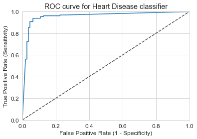
    


<h2> 12. Decision Tree Classifier  </h2>


```python
param_grid_cdt = [
    {'max_leaf_nodes': list(range(2, 10)), 'min_samples_split': [2, 3, 4, 5, 6]}
]
cdt_reg = DecisionTreeClassifier()
cdt = GridSearchCV(cdt_reg, param_grid_cdt, cv=5, scoring = 'f1')
cdt.fit(X_train, y_train)
print(cdt.best_params_)
print(cdt.best_estimator_)
cdt_res = cdt.cv_results_
for mean_score, params in zip(cdt_res["mean_test_score"], cdt_res["params"]):
    print(np.sqrt(-mean_score), params)
cdt_best = cdt.best_estimator_
```

    {'max_leaf_nodes': 8, 'min_samples_split': 2}
    DecisionTreeClassifier(max_leaf_nodes=8)
    nan {'max_leaf_nodes': 2, 'min_samples_split': 2}
    nan {'max_leaf_nodes': 2, 'min_samples_split': 3}
    nan {'max_leaf_nodes': 2, 'min_samples_split': 4}
    nan {'max_leaf_nodes': 2, 'min_samples_split': 5}
    nan {'max_leaf_nodes': 2, 'min_samples_split': 6}
    nan {'max_leaf_nodes': 3, 'min_samples_split': 2}
    nan {'max_leaf_nodes': 3, 'min_samples_split': 3}
    nan {'max_leaf_nodes': 3, 'min_samples_split': 4}
    nan {'max_leaf_nodes': 3, 'min_samples_split': 5}
    nan {'max_leaf_nodes': 3, 'min_samples_split': 6}
    nan {'max_leaf_nodes': 4, 'min_samples_split': 2}
    nan {'max_leaf_nodes': 4, 'min_samples_split': 3}
    nan {'max_leaf_nodes': 4, 'min_samples_split': 4}
    nan {'max_leaf_nodes': 4, 'min_samples_split': 5}
    nan {'max_leaf_nodes': 4, 'min_samples_split': 6}
    nan {'max_leaf_nodes': 5, 'min_samples_split': 2}
    nan {'max_leaf_nodes': 5, 'min_samples_split': 3}
    nan {'max_leaf_nodes': 5, 'min_samples_split': 4}
    nan {'max_leaf_nodes': 5, 'min_samples_split': 5}
    nan {'max_leaf_nodes': 5, 'min_samples_split': 6}
    nan {'max_leaf_nodes': 6, 'min_samples_split': 2}
    nan {'max_leaf_nodes': 6, 'min_samples_split': 3}
    nan {'max_leaf_nodes': 6, 'min_samples_split': 4}
    nan {'max_leaf_nodes': 6, 'min_samples_split': 5}
    nan {'max_leaf_nodes': 6, 'min_samples_split': 6}
    nan {'max_leaf_nodes': 7, 'min_samples_split': 2}
    nan {'max_leaf_nodes': 7, 'min_samples_split': 3}
    nan {'max_leaf_nodes': 7, 'min_samples_split': 4}
    nan {'max_leaf_nodes': 7, 'min_samples_split': 5}
    nan {'max_leaf_nodes': 7, 'min_samples_split': 6}
    nan {'max_leaf_nodes': 8, 'min_samples_split': 2}
    nan {'max_leaf_nodes': 8, 'min_samples_split': 3}
    nan {'max_leaf_nodes': 8, 'min_samples_split': 4}
    nan {'max_leaf_nodes': 8, 'min_samples_split': 5}
    nan {'max_leaf_nodes': 8, 'min_samples_split': 6}
    nan {'max_leaf_nodes': 9, 'min_samples_split': 2}
    nan {'max_leaf_nodes': 9, 'min_samples_split': 3}
    nan {'max_leaf_nodes': 9, 'min_samples_split': 4}
    nan {'max_leaf_nodes': 9, 'min_samples_split': 5}
    nan {'max_leaf_nodes': 9, 'min_samples_split': 6}
    

    C:\Anaconda\envs\tensor\lib\site-packages\ipykernel_launcher.py:11: RuntimeWarning: invalid value encountered in sqrt
      # This is added back by InteractiveShellApp.init_path()
    


```python
cdt_results = calculate_results(cdt_best, X_test=X_test, y_test=y_test)
```

    [[ 95  16]
     [ 28 102]]
    AUC 0.8850311850311849
                  precision    recall  f1-score   support
    
               0       0.77      0.86      0.81       111
               1       0.86      0.78      0.82       130
    
        accuracy                           0.82       241
       macro avg       0.82      0.82      0.82       241
    weighted avg       0.82      0.82      0.82       241
    
    


    
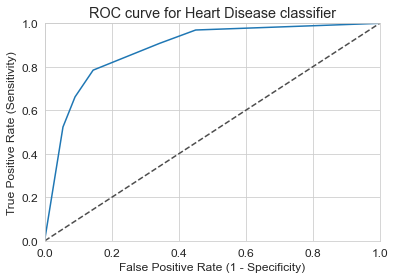
    


<h2> 13. Support Vector Machine Classifier  </h2>


```python
param_grid_csvm = [
    {'C':[1,10,100,1000],'gamma':[1,0.1,0.001,0.0001]}
]
csvm_reg = SVC(probability = True)
csvm = GridSearchCV(csvm_reg, param_grid_csvm, cv=5, scoring = 'neg_mean_squared_error')
csvm.fit(X_train, y_train)
print(csvm.best_params_)
print(csvm.best_estimator_)
csvm_res = csvm.cv_results_
for mean_score, params in zip(csvm_res["mean_test_score"], csvm_res["params"]):
    print(np.sqrt(-mean_score), params)
csvm_best = csvm.best_estimator_
```

    {'C': 1, 'gamma': 1}
    SVC(C=1, gamma=1, probability=True)
    0.36339260897218745 {'C': 1, 'gamma': 1}
    0.38153488535022 {'C': 1, 'gamma': 0.1}
    0.4179169497120802 {'C': 1, 'gamma': 0.001}
    0.6884855159692772 {'C': 1, 'gamma': 0.0001}
    0.3676598849738686 {'C': 10, 'gamma': 1}
    0.3801389392394305 {'C': 10, 'gamma': 0.1}
    0.40273112309946124 {'C': 10, 'gamma': 0.001}
    0.4179169497120802 {'C': 10, 'gamma': 0.0001}
    0.3676598849738686 {'C': 100, 'gamma': 1}
    0.3935605371134878 {'C': 100, 'gamma': 0.1}
    0.4014492313101576 {'C': 100, 'gamma': 0.001}
    0.40273112309946124 {'C': 100, 'gamma': 0.0001}
    0.3676598849738686 {'C': 1000, 'gamma': 1}
    0.4014156189492907 {'C': 1000, 'gamma': 0.1}
    0.3909600247245778 {'C': 1000, 'gamma': 0.001}
    0.39886632309086667 {'C': 1000, 'gamma': 0.0001}
    


```python
csvm_results = calculate_results(csvm_best, X_test=X_test, y_test=y_test)
```

    [[ 90  21]
     [  6 124]]
    AUC 0.9586971586971587
                  precision    recall  f1-score   support
    
               0       0.94      0.81      0.87       111
               1       0.86      0.95      0.90       130
    
        accuracy                           0.89       241
       macro avg       0.90      0.88      0.89       241
    weighted avg       0.89      0.89      0.89       241
    
    


    
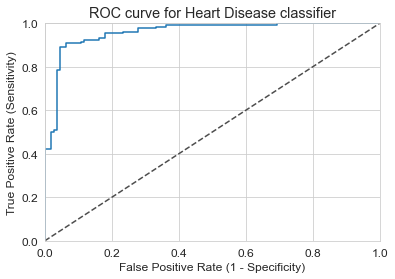
    


<h2> 14. Naive Bayes Classifier - Gaussian  </h2>


```python
cnb = GaussianNB()
cnb.fit(X_train, y_train)
```


    GaussianNB()


```python
cnb_results = calculate_results(cnb, X_test=X_test, y_test=y_test)
```

    [[ 91  20]
     [ 20 110]]
    AUC 0.8976437976437976
                  precision    recall  f1-score   support
    
               0       0.82      0.82      0.82       111
               1       0.85      0.85      0.85       130
    
        accuracy                           0.83       241
       macro avg       0.83      0.83      0.83       241
    weighted avg       0.83      0.83      0.83       241
    
    


    
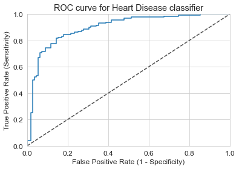
    


<h2> 15. Neural Network with Hyperopt </h2>


```python
def get_model(params):
    return Sequential([
    Dense(int(params['filters']), activation='relu', input_shape = (16,),  kernel_regularizer=regularizers.l2(0.001)),
    Dropout(params['dropout_one']),
    Dense(int(params['filters_two']), activation='relu',  kernel_regularizer=regularizers.l2(0.001)),
    Dropout(params['dropout_two']),
    Dense(int(params['filters_three']), activation='relu',  kernel_regularizer=regularizers.l2(0.001)),
    Dropout(params['dropout_three']),
    Dense(2, activation='softmax')
    ])
```


```python
X_train, X_val, y_train, y_val = train_test_split(X_train, y_train, test_size = 0.2, random_state=42)
def fun_obj(params):
    model = get_model(params)
    model.summary()
    model.compile(loss = 'sparse_categorical_crossentropy', optimizer = params.get('optimizer','RMSprop'), metrics = ['acc'])
    callback = tf.keras.callbacks.EarlyStopping(monitor='loss', patience=5)
    history = model.fit(X_train, y_train, batch_size=int(params.get('batch_size', 16)), validation_data = (X_val, y_val),
    steps_per_epoch=len(X_train) / int(params.get('batch_size', 16)), epochs = int(params.get('epochs', 25)), callbacks=[callback])    
    score = model.evaluate(X_test, y_test)
    y_pred = model.predict_classes(X_test)
    y_pred_proba = model.predict_proba(X_test)
    fpr_cnn, tpr_cnn, thresholds_cnn = roc_curve(y_test, y_pred_proba[:, 1])
    AUC_cnn = auc(fpr_cnn, tpr_cnn)
    accuracy = score[1]
    results = {accuracy : params}
    print(classification_report(y_test, y_pred), 'AUC', AUC_cnn)
    cm_cnn = confusion_matrix(y_test, y_pred)
    print(cm_cnn)
    return {'loss': -AUC_cnn, 'status': STATUS_OK, 'model': model, 'results' : results}
```


```python
space = {
    'batch_size': hp.quniform('batch_size', 16, 64, 4),
    'epochs': hp.quniform('epochs', 4, 200, 4),
    'filters': hp.quniform('filters', 40, 1024, 20),
    'dropout_one': hp.quniform('dropout_one', 0.1, 0.7, 0.1),
    'filters_two': hp.quniform('filters_two', 40, 1024, 20),
    'dropout_two': hp.quniform('dropout_two', 0.1, 0.7, 0.05),
    'filters_three': hp.quniform('filters_three', 40, 1024, 20),
    'dropout_three': hp.quniform('dropout_three', 0.1, 0.7, 0.1),
    'optimizer': hp.choice('optimizer', ['Adam', 'RMSprop', 'SGD'])
}
tpe_trials = Trials()
best = fmin(
    fun_obj,
    space,
    tpe.suggest,
    max_evals = 15,
    trials = tpe_trials
)
print(best)

```

      0%|                                                                           | 0/15 [00:00<?, ?trial/s, best loss=?]WARNING:tensorflow:Large dropout rate: 0.6 (>0.5). In TensorFlow 2.x, dropout() uses dropout rate instead of keep_prob. Please ensure that this is intended.
    Model: "sequential"                                                                                                    
    _________________________________________________________________                                                      
    Layer (type)                 Output Shape              Param #                                                         
    =================================================================                                                      
    dense (Dense)                (None, 940)               15980                                                           
    _________________________________________________________________                                                      
    dropout (Dropout)            (None, 940)               0                                                               
    _________________________________________________________________                                                      
    dense_1 (Dense)              (None, 580)               545780                                                          
    _________________________________________________________________                                                      
    dropout_1 (Dropout)          (None, 580)               0                                                               
    _________________________________________________________________                                                      
    dense_2 (Dense)              (None, 740)               429940                                                          
    _________________________________________________________________                                                      
    dropout_2 (Dropout)          (None, 740)               0                                                               
    _________________________________________________________________                                                      
    dense_3 (Dense)              (None, 2)                 1482                                                            
    =================================================================                                                      
    Total params: 993,182                                                                                                  
    Trainable params: 993,182                                                                                              
    Non-trainable params: 0                                                                                                
    _________________________________________________________________                                                      
    Train on 769 samples, validate on 193 samples                                                                          
    Epoch 1/136                                                                                                            
      0%|                                                                           | 0/15 [00:00<?, ?trial/s, best loss=?]WARNING:tensorflow:Large dropout rate: 0.6 (>0.5). In TensorFlow 2.x, dropout() uses dropout rate instead of keep_prob. Please ensure that this is intended.
    WARNING:tensorflow:Large dropout rate: 0.6 (>0.5). In TensorFlow 2.x, dropout() uses dropout rate instead of keep_prob. Please ensure that this is intended.
     28/769 [>.............................]                                                                               
     - ETA: 21s - loss: 2.1078 - acc: 0.5357                                                                               
                                                                                                                          
    112/769 [===>..........................]                                                                               
     - ETA: 5s - loss: 1.8247 - acc: 0.7500                                                                                
                                                                                                                           
    168/769 [=====>........................]                                                                               
     - ETA: 3s - loss: 1.8230 - acc: 0.7500                                                                                
                                                                                                                           
    252/769 [========>.....................]                                                                               
     - ETA: 2s - loss: 1.7823 - acc: 0.7619                                                                                
                                                                                                                           
    336/769 [============>.................]                                                                               
     - ETA: 1s - loss: 1.7226 - acc: 0.7857                                                                                
                                                                                                                           
    420/769 [===============>..............]                                                                               
     - ETA: 0s - loss: 1.6828 - acc: 0.7929                                                                                
                                                                                                                           
    504/769 [==================>...........]                                                                               
     - ETA: 0s - loss: 1.6511 - acc: 0.7897                                                                                
                                                                                                                           
    588/769 [=====================>........]                                                                               
     - ETA: 0s - loss: 1.6204 - acc: 0.7925                                                                                
                                                                                                                           
    672/769 [=========================>....]                                                                               
     - ETA: 0s - loss: 1.5898 - acc: 0.7961                                                                                
                                                                                                                           
    756/769 [============================>.]                                                                               
     - ETA: 0s - loss: 1.5675 - acc: 0.7989                                                                                
                                                                                                                           
    769/769 [==============================]                                                                               
     - 1s 2ms/sample - loss: 1.5649 - acc: 0.7984 - val_loss: 1.2685 - val_acc: 0.8394                                     
    
    Epoch 2/136                                                                                                            
     28/769 [>.............................]                                                                               
     - ETA: 0s - loss: 1.3126 - acc: 0.7857                                                                                
                                                                                                                           
    112/769 [===>..........................]                                                                               
     - ETA: 0s - loss: 1.3809 - acc: 0.7500                                                                                
                                                                                                                           
    196/769 [======>.......................]                                                                               
     - ETA: 0s - loss: 1.2680 - acc: 0.8214                                                                                
                                                                                                                           
    280/769 [=========>....................]                                                                               
     - ETA: 0s - loss: 1.2238 - acc: 0.8214                                                                                
                                                                                                                           
    364/769 [=============>................]                                                                               
     - ETA: 0s - loss: 1.2137 - acc: 0.8214                                                                                
                                                                                                                           
    448/769 [================>.............]                                                                               
     - ETA: 0s - loss: 1.2031 - acc: 0.8214                                                                                
                                                                                                                           
    532/769 [===================>..........]                                                                               
     - ETA: 0s - loss: 1.2144 - acc: 0.8177                                                                                
                                                                                                                           
    616/769 [=======================>......]                                                                               
     - ETA: 0s - loss: 1.1976 - acc: 0.8182                                                                                
                                                                                                                           
    700/769 [==========================>...]                                                                               
     - ETA: 0s - loss: 1.1888 - acc: 0.8214                                                                                
                                                                                                                           
    769/769 [==============================]                                                                               
     - 1s 779us/sample - loss: 1.1849 - acc: 0.8166 - val_loss: 1.0223 - val_acc: 0.8394                                   
    
    Epoch 3/136                                                                                                            
     28/769 [>.............................]                                                                               
     - ETA: 0s - loss: 1.0595 - acc: 0.8571                                                                                
                                                                                                                           
    112/769 [===>..........................]                                                                               
     - ETA: 0s - loss: 0.9815 - acc: 0.8482                                                                                
                                                                                                                           
    196/769 [======>.......................]                                                                               
     - ETA: 0s - loss: 0.9959 - acc: 0.8673                                                                                
                                                                                                                           
    280/769 [=========>....................]                                                                               
     - ETA: 0s - loss: 1.0387 - acc: 0.8393                                                                                
                                                                                                                           
    364/769 [=============>................]                                                                               
     - ETA: 0s - loss: 1.0137 - acc: 0.8379                                                                                
                                                                                                                           
    448/769 [================>.............]                                                                               
     - ETA: 0s - loss: 0.9874 - acc: 0.8438                                                                                
                                                                                                                           
    532/769 [===================>..........]                                                                               
     - ETA: 0s - loss: 0.9710 - acc: 0.8459                                                                                
                                                                                                                           
    616/769 [=======================>......]                                                                               
     - ETA: 0s - loss: 0.9582 - acc: 0.8425                                                                                
                                                                                                                           
    700/769 [==========================>...]                                                                               
     - ETA: 0s - loss: 0.9478 - acc: 0.8443                                                                                
                                                                                                                           
    769/769 [==============================]                                                                               
     - 1s 768us/sample - loss: 0.9354 - acc: 0.8466 - val_loss: 0.8422 - val_acc: 0.8497                                   
    
    Epoch 4/136                                                                                                            
     28/769 [>.............................]                                                                               
     - ETA: 0s - loss: 0.7956 - acc: 0.8214                                                                                
                                                                                                                           
    112/769 [===>..........................]                                                                               
     - ETA: 0s - loss: 0.8318 - acc: 0.8571                                                                                
                                                                                                                           
    196/769 [======>.......................]                                                                               
     - ETA: 0s - loss: 0.8238 - acc: 0.8520                                                                                
                                                                                                                           
    280/769 [=========>....................]                                                                               
     - ETA: 0s - loss: 0.8408 - acc: 0.8429                                                                                
                                                                                                                           
    336/769 [============>.................]                                                                               
     - ETA: 0s - loss: 0.8044 - acc: 0.8601                                                                                
                                                                                                                           
    420/769 [===============>..............]                                                                               
     - ETA: 0s - loss: 0.7966 - acc: 0.8571                                                                                
                                                                                                                           
    504/769 [==================>...........]                                                                               
     - ETA: 0s - loss: 0.7998 - acc: 0.8512                                                                                
                                                                                                                           
    588/769 [=====================>........]                                                                               
     - ETA: 0s - loss: 0.8162 - acc: 0.8367                                                                                
                                                                                                                           
    672/769 [=========================>....]                                                                               
     - ETA: 0s - loss: 0.8061 - acc: 0.8378                                                                                
                                                                                                                           
    756/769 [============================>.]                                                                               
     - ETA: 0s - loss: 0.7847 - acc: 0.8452                                                                                
                                                                                                                           
    769/769 [==============================]                                                                               
     - 1s 853us/sample - loss: 0.7884 - acc: 0.8440 - val_loss: 0.7329 - val_acc: 0.8290                                   
    
    Epoch 5/136                                                                                                            
     28/769 [>.............................]                                                                               
     - ETA: 0s - loss: 0.7160 - acc: 0.8214                                                                                
                                                                                                                           
    112/769 [===>..........................]                                                                               
     - ETA: 0s - loss: 0.6467 - acc: 0.8839                                                                                
                                                                                                                           
    196/769 [======>.......................]                                                                               
     - ETA: 0s - loss: 0.7077 - acc: 0.8469                                                                                
                                                                                                                           
    280/769 [=========>....................]                                                                               
     - ETA: 0s - loss: 0.6865 - acc: 0.8643                                                                                
                                                                                                                           
    364/769 [=============>................]                                                                               
     - ETA: 0s - loss: 0.6760 - acc: 0.8709                                                                                
                                                                                                                           
    448/769 [================>.............]                                                                               
     - ETA: 0s - loss: 0.6964 - acc: 0.8594                                                                                
                                                                                                                           
    532/769 [===================>..........]                                                                               
     - ETA: 0s - loss: 0.6902 - acc: 0.8515                                                                                
                                                                                                                           
    616/769 [=======================>......]                                                                               
     - ETA: 0s - loss: 0.6850 - acc: 0.8523                                                                                
                                                                                                                           
    700/769 [==========================>...]                                                                               
     - ETA: 0s - loss: 0.6861 - acc: 0.8471                                                                                
                                                                                                                           
    769/769 [==============================]                                                                               
     - 1s 814us/sample - loss: 0.6778 - acc: 0.8518 - val_loss: 0.6329 - val_acc: 0.8756                                   
    
    Epoch 6/136                                                                                                            
     28/769 [>.............................]                                                                               
     - ETA: 0s - loss: 0.4788 - acc: 1.0000                                                                                
                                                                                                                           
    112/769 [===>..........................]                                                                               
     - ETA: 0s - loss: 0.6276 - acc: 0.8661                                                                                
                                                                                                                           
    196/769 [======>.......................]                                                                               
     - ETA: 0s - loss: 0.6492 - acc: 0.8520                                                                                
                                                                                                                           
    280/769 [=========>....................]                                                                               
     - ETA: 0s - loss: 0.6236 - acc: 0.8607                                                                                
                                                                                                                           
    336/769 [============>.................]                                                                               
     - ETA: 0s - loss: 0.6050 - acc: 0.8690                                                                                
                                                                                                                           
    392/769 [==============>...............]                                                                               
     - ETA: 0s - loss: 0.6069 - acc: 0.8648                                                                                
                                                                                                                           
    476/769 [=================>............]                                                                               
     - ETA: 0s - loss: 0.6047 - acc: 0.8634                                                                                
                                                                                                                           
    560/769 [====================>.........]                                                                               
     - ETA: 0s - loss: 0.5982 - acc: 0.8679                                                                                
                                                                                                                           
    644/769 [========================>.....]                                                                               
     - ETA: 0s - loss: 0.5886 - acc: 0.8742                                                                                
                                                                                                                           
    700/769 [==========================>...]                                                                               
     - ETA: 0s - loss: 0.6064 - acc: 0.8657                                                                                
                                                                                                                           
    769/769 [==============================]                                                                               
     - 1s 861us/sample - loss: 0.6043 - acc: 0.8635 - val_loss: 0.5871 - val_acc: 0.8860                                   
    
    Epoch 7/136                                                                                                            
     28/769 [>.............................]                                                                               
     - ETA: 0s - loss: 0.5370 - acc: 0.8929                                                                                
                                                                                                                           
    112/769 [===>..........................]                                                                               
     - ETA: 0s - loss: 0.5074 - acc: 0.9107                                                                                
                                                                                                                           
    196/769 [======>.......................]                                                                               
     - ETA: 0s - loss: 0.5058 - acc: 0.8980                                                                                
                                                                                                                           
    280/769 [=========>....................]                                                                               
     - ETA: 0s - loss: 0.5106 - acc: 0.8929                                                                                
                                                                                                                           
    364/769 [=============>................]                                                                               
     - ETA: 0s - loss: 0.5531 - acc: 0.8791                                                                                
                                                                                                                           
    420/769 [===============>..............]                                                                               
     - ETA: 0s - loss: 0.5488 - acc: 0.8738                                                                                
                                                                                                                           
    504/769 [==================>...........]                                                                               
     - ETA: 0s - loss: 0.5385 - acc: 0.8710                                                                                
                                                                                                                           
    588/769 [=====================>........]                                                                               
     - ETA: 0s - loss: 0.5420 - acc: 0.8741                                                                                
                                                                                                                           
    644/769 [========================>.....]                                                                               
     - ETA: 0s - loss: 0.5443 - acc: 0.8711                                                                                
                                                                                                                           
    700/769 [==========================>...]                                                                               
     - ETA: 0s - loss: 0.5435 - acc: 0.8700                                                                                
                                                                                                                           
    769/769 [==============================]                                                                               
     - 1s 853us/sample - loss: 0.5438 - acc: 0.8661 - val_loss: 0.5410 - val_acc: 0.8705                                   
    
    Epoch 8/136                                                                                                            
     28/769 [>.............................]                                                                               
     - ETA: 0s - loss: 0.3627 - acc: 1.0000                                                                                
                                                                                                                           
     84/769 [==>...........................]                                                                               
     - ETA: 0s - loss: 0.4758 - acc: 0.9167                                                                                
                                                                                                                           
    168/769 [=====>........................]                                                                               
     - ETA: 0s - loss: 0.5013 - acc: 0.8929                                                                                
                                                                                                                           
    252/769 [========>.....................]                                                                               
     - ETA: 0s - loss: 0.5358 - acc: 0.8651                                                                                
                                                                                                                           
    336/769 [============>.................]                                                                               
     - ETA: 0s - loss: 0.5038 - acc: 0.8750                                                                                
                                                                                                                           
    420/769 [===============>..............]                                                                               
     - ETA: 0s - loss: 0.4925 - acc: 0.8738                                                                                
                                                                                                                           
    504/769 [==================>...........]                                                                               
     - ETA: 0s - loss: 0.5010 - acc: 0.8750                                                                                
                                                                                                                           
    588/769 [=====================>........]                                                                               
     - ETA: 0s - loss: 0.5064 - acc: 0.8690                                                                                
                                                                                                                           
    672/769 [=========================>....]                                                                               
     - ETA: 0s - loss: 0.5128 - acc: 0.8676                                                                                
                                                                                                                           
    756/769 [============================>.]                                                                               
     - ETA: 0s - loss: 0.5093 - acc: 0.8730                                                                                
                                                                                                                           
    769/769 [==============================]                                                                               
     - 1s 773us/sample - loss: 0.5055 - acc: 0.8739 - val_loss: 0.5110 - val_acc: 0.8860                                   
    
    Epoch 9/136                                                                                                            
     28/769 [>.............................]                                                                               
     - ETA: 0s - loss: 0.4436 - acc: 0.8214                                                                                
                                                                                                                           
    112/769 [===>..........................]                                                                               
     - ETA: 0s - loss: 0.4189 - acc: 0.9018                                                                                
                                                                                                                           
    196/769 [======>.......................]                                                                               
     - ETA: 0s - loss: 0.4580 - acc: 0.8776                                                                                
                                                                                                                           
    280/769 [=========>....................]                                                                               
     - ETA: 0s - loss: 0.4378 - acc: 0.8964                                                                                
                                                                                                                           
    364/769 [=============>................]                                                                               
     - ETA: 0s - loss: 0.4285 - acc: 0.8956                                                                                
                                                                                                                           
    448/769 [================>.............]                                                                               
     - ETA: 0s - loss: 0.4311 - acc: 0.8906                                                                                
                                                                                                                           
    532/769 [===================>..........]                                                                               
     - ETA: 0s - loss: 0.4313 - acc: 0.8891                                                                                
                                                                                                                           
    616/769 [=======================>......]                                                                               
     - ETA: 0s - loss: 0.4649 - acc: 0.8831                                                                                
                                                                                                                           
    672/769 [=========================>....]                                                                               
     - ETA: 0s - loss: 0.4595 - acc: 0.8854                                                                                
                                                                                                                           
    728/769 [===========================>..]                                                                               
     - ETA: 0s - loss: 0.4602 - acc: 0.8832                                                                                
                                                                                                                           
    769/769 [==============================]                                                                               
     - 1s 873us/sample - loss: 0.4597 - acc: 0.8817 - val_loss: 0.4806 - val_acc: 0.8808                                   
    
    Epoch 10/136                                                                                                           
     28/769 [>.............................]                                                                               
     - ETA: 0s - loss: 0.4256 - acc: 0.8929                                                                                
                                                                                                                           
     84/769 [==>...........................]                                                                               
     - ETA: 0s - loss: 0.3854 - acc: 0.9286                                                                                
                                                                                                                           
    140/769 [====>.........................]                                                                               
     - ETA: 0s - loss: 0.4002 - acc: 0.9071                                                                                
                                                                                                                           
    224/769 [=======>......................]                                                                               
     - ETA: 0s - loss: 0.4389 - acc: 0.8884                                                                                
                                                                                                                           
    280/769 [=========>....................]                                                                               
     - ETA: 0s - loss: 0.4372 - acc: 0.8929                                                                                
                                                                                                                           
    364/769 [=============>................]                                                                               
     - ETA: 0s - loss: 0.4313 - acc: 0.8874                                                                                
                                                                                                                           
    448/769 [================>.............]                                                                               
     - ETA: 0s - loss: 0.4275 - acc: 0.8862                                                                                
                                                                                                                           
    504/769 [==================>...........]                                                                               
     - ETA: 0s - loss: 0.4243 - acc: 0.8849                                                                                
                                                                                                                           
    560/769 [====================>.........]                                                                               
     - ETA: 0s - loss: 0.4175 - acc: 0.8875                                                                                
                                                                                                                           
    644/769 [========================>.....]                                                                               
     - ETA: 0s - loss: 0.4184 - acc: 0.8898                                                                                
                                                                                                                           
    728/769 [===========================>..]                                                                               
     - ETA: 0s - loss: 0.4328 - acc: 0.8860                                                                                
                                                                                                                           
    769/769 [==============================]                                                                               
     - 1s 920us/sample - loss: 0.4371 - acc: 0.8804 - val_loss: 0.4907 - val_acc: 0.8860                                   
    
    Epoch 11/136                                                                                                           
     28/769 [>.............................]                                                                               
     - ETA: 0s - loss: 0.3624 - acc: 0.9286                                                                                
                                                                                                                           
    112/769 [===>..........................]                                                                               
     - ETA: 0s - loss: 0.3898 - acc: 0.8929                                                                                
                                                                                                                           
    196/769 [======>.......................]                                                                               
     - ETA: 0s - loss: 0.4102 - acc: 0.8776                                                                                
                                                                                                                           
    280/769 [=========>....................]                                                                               
     - ETA: 0s - loss: 0.4159 - acc: 0.8857                                                                                
                                                                                                                           
    364/769 [=============>................]                                                                               
     - ETA: 0s - loss: 0.3913 - acc: 0.8984                                                                                
                                                                                                                           
    448/769 [================>.............]                                                                               
     - ETA: 0s - loss: 0.4049 - acc: 0.8906                                                                                
                                                                                                                           
    532/769 [===================>..........]                                                                               
     - ETA: 0s - loss: 0.4137 - acc: 0.8872                                                                                
                                                                                                                           
    616/769 [=======================>......]                                                                               
     - ETA: 0s - loss: 0.4082 - acc: 0.8880                                                                                
                                                                                                                           
    700/769 [==========================>...]                                                                               
     - ETA: 0s - loss: 0.4156 - acc: 0.8843                                                                                
                                                                                                                           
    769/769 [==============================]                                                                               
     - 1s 834us/sample - loss: 0.4144 - acc: 0.8830 - val_loss: 0.4556 - val_acc: 0.8964                                   
    
    Epoch 12/136                                                                                                           
     28/769 [>.............................]                                                                               
     - ETA: 0s - loss: 0.3818 - acc: 0.8929                                                                                
                                                                                                                           
    112/769 [===>..........................]                                                                               
     - ETA: 0s - loss: 0.3652 - acc: 0.8839                                                                                
                                                                                                                           
    196/769 [======>.......................]                                                                               
     - ETA: 0s - loss: 0.3435 - acc: 0.8929                                                                                
                                                                                                                           
    280/769 [=========>....................]                                                                               
     - ETA: 0s - loss: 0.3634 - acc: 0.8786                                                                                
                                                                                                                           
    364/769 [=============>................]                                                                               
     - ETA: 0s - loss: 0.3662 - acc: 0.8736                                                                                
                                                                                                                           
    448/769 [================>.............]                                                                               
     - ETA: 0s - loss: 0.3652 - acc: 0.8772                                                                                
                                                                                                                           
    532/769 [===================>..........]                                                                               
     - ETA: 0s - loss: 0.3767 - acc: 0.8816                                                                                
                                                                                                                           
    616/769 [=======================>......]                                                                               
     - ETA: 0s - loss: 0.3844 - acc: 0.8766                                                                                
                                                                                                                           
    700/769 [==========================>...]                                                                               
     - ETA: 0s - loss: 0.3791 - acc: 0.8786                                                                                
                                                                                                                           
    756/769 [============================>.]                                                                               
     - ETA: 0s - loss: 0.3845 - acc: 0.8770                                                                                
                                                                                                                           
    769/769 [==============================]                                                                               
     - 1s 827us/sample - loss: 0.3822 - acc: 0.8791 - val_loss: 0.4826 - val_acc: 0.8756                                   
    
    Epoch 13/136                                                                                                           
     28/769 [>.............................]                                                                               
     - ETA: 0s - loss: 0.4931 - acc: 0.8929                                                                                
                                                                                                                           
    112/769 [===>..........................]                                                                               
     - ETA: 0s - loss: 0.4413 - acc: 0.8482                                                                                
                                                                                                                           
    196/769 [======>.......................]                                                                               
     - ETA: 0s - loss: 0.4250 - acc: 0.8622                                                                                
                                                                                                                           
    280/769 [=========>....................]                                                                               
     - ETA: 0s - loss: 0.4087 - acc: 0.8750                                                                                
                                                                                                                           
    364/769 [=============>................]                                                                               
     - ETA: 0s - loss: 0.4076 - acc: 0.8764                                                                                
                                                                                                                           
    448/769 [================>.............]                                                                               
     - ETA: 0s - loss: 0.4046 - acc: 0.8750                                                                                
                                                                                                                           
    532/769 [===================>..........]                                                                               
     - ETA: 0s - loss: 0.4022 - acc: 0.8816                                                                                
                                                                                                                           
    616/769 [=======================>......]                                                                               
     - ETA: 0s - loss: 0.3983 - acc: 0.8880                                                                                
                                                                                                                           
    700/769 [==========================>...]                                                                               
     - ETA: 0s - loss: 0.4029 - acc: 0.8814                                                                                
                                                                                                                           
    769/769 [==============================]                                                                               
     - 1s 804us/sample - loss: 0.3972 - acc: 0.8804 - val_loss: 0.4920 - val_acc: 0.8756                                   
    
    Epoch 14/136                                                                                                           
     28/769 [>.............................]                                                                               
     - ETA: 0s - loss: 0.3137 - acc: 0.8929                                                                                
                                                                                                                           
    112/769 [===>..........................]                                                                               
     - ETA: 0s - loss: 0.3592 - acc: 0.8929                                                                                
                                                                                                                           
    196/769 [======>.......................]                                                                               
     - ETA: 0s - loss: 0.3872 - acc: 0.8878                                                                                
                                                                                                                           
    280/769 [=========>....................]                                                                               
     - ETA: 0s - loss: 0.3868 - acc: 0.8821                                                                                
                                                                                                                           
    364/769 [=============>................]                                                                               
     - ETA: 0s - loss: 0.3879 - acc: 0.8956                                                                                
                                                                                                                           
    448/769 [================>.............]                                                                               
     - ETA: 0s - loss: 0.4005 - acc: 0.8839                                                                                
                                                                                                                           
    532/769 [===================>..........]                                                                               
     - ETA: 0s - loss: 0.4011 - acc: 0.8872                                                                                
                                                                                                                           
    616/769 [=======================>......]                                                                               
     - ETA: 0s - loss: 0.3971 - acc: 0.8912                                                                                
                                                                                                                           
    700/769 [==========================>...]                                                                               
     - ETA: 0s - loss: 0.3838 - acc: 0.8971                                                                                
                                                                                                                           
    769/769 [==============================]                                                                               
     - 1s 808us/sample - loss: 0.3788 - acc: 0.8999 - val_loss: 0.4698 - val_acc: 0.8912                                   
    
    Epoch 15/136                                                                                                           
     28/769 [>.............................]                                                                               
     - ETA: 0s - loss: 0.4320 - acc: 0.8214                                                                                
                                                                                                                           
    112/769 [===>..........................]                                                                               
     - ETA: 0s - loss: 0.3835 - acc: 0.8750                                                                                
                                                                                                                           
    196/769 [======>.......................]                                                                               
     - ETA: 0s - loss: 0.3669 - acc: 0.8827                                                                                
                                                                                                                           
    280/769 [=========>....................]                                                                               
     - ETA: 0s - loss: 0.3858 - acc: 0.8857                                                                                
                                                                                                                           
    364/769 [=============>................]                                                                               
     - ETA: 0s - loss: 0.3802 - acc: 0.8901                                                                                
                                                                                                                           
    448/769 [================>.............]                                                                               
     - ETA: 0s - loss: 0.3661 - acc: 0.8929                                                                                
                                                                                                                           
    532/769 [===================>..........]                                                                               
     - ETA: 0s - loss: 0.3540 - acc: 0.9004                                                                                
                                                                                                                           
    616/769 [=======================>......]                                                                               
     - ETA: 0s - loss: 0.3629 - acc: 0.8977                                                                                
                                                                                                                           
    700/769 [==========================>...]                                                                               
     - ETA: 0s - loss: 0.3643 - acc: 0.8914                                                                                
                                                                                                                           
    769/769 [==============================]                                                                               
     - 1s 778us/sample - loss: 0.3639 - acc: 0.8895 - val_loss: 0.4410 - val_acc: 0.8860                                   
    
    Epoch 16/136                                                                                                           
     28/769 [>.............................]                                                                               
     - ETA: 0s - loss: 0.2423 - acc: 0.8929                                                                                
                                                                                                                           
    112/769 [===>..........................]                                                                               
     - ETA: 0s - loss: 0.2368 - acc: 0.9286                                                                                
                                                                                                                           
    196/769 [======>.......................]                                                                               
     - ETA: 0s - loss: 0.2999 - acc: 0.8929                                                                                
                                                                                                                           
    280/769 [=========>....................]                                                                               
     - ETA: 0s - loss: 0.3263 - acc: 0.8929                                                                                
                                                                                                                           
    364/769 [=============>................]                                                                               
     - ETA: 0s - loss: 0.3123 - acc: 0.9038                                                                                
                                                                                                                           
    448/769 [================>.............]                                                                               
     - ETA: 0s - loss: 0.3287 - acc: 0.9040                                                                                
                                                                                                                           
    532/769 [===================>..........]                                                                               
     - ETA: 0s - loss: 0.3317 - acc: 0.9023                                                                                
                                                                                                                           
    616/769 [=======================>......]                                                                               
     - ETA: 0s - loss: 0.3543 - acc: 0.8977                                                                                
                                                                                                                           
    700/769 [==========================>...]                                                                               
     - ETA: 0s - loss: 0.3653 - acc: 0.8943                                                                                
                                                                                                                           
    769/769 [==============================]                                                                               
     - 1s 817us/sample - loss: 0.3632 - acc: 0.8934 - val_loss: 0.5659 - val_acc: 0.8394                                   
    
    Epoch 17/136                                                                                                           
     28/769 [>.............................]                                                                               
     - ETA: 0s - loss: 0.2549 - acc: 0.9643                                                                                
                                                                                                                           
    112/769 [===>..........................]                                                                               
     - ETA: 0s - loss: 0.3826 - acc: 0.8929                                                                                
                                                                                                                           
    196/769 [======>.......................]                                                                               
     - ETA: 0s - loss: 0.3831 - acc: 0.8776                                                                                
                                                                                                                           
    280/769 [=========>....................]                                                                               
     - ETA: 0s - loss: 0.3592 - acc: 0.8857                                                                                
                                                                                                                           
    364/769 [=============>................]                                                                               
     - ETA: 0s - loss: 0.3583 - acc: 0.8984                                                                                
                                                                                                                           
    448/769 [================>.............]                                                                               
     - ETA: 0s - loss: 0.3407 - acc: 0.8996                                                                                
                                                                                                                           
    532/769 [===================>..........]                                                                               
     - ETA: 0s - loss: 0.3373 - acc: 0.8985                                                                                
                                                                                                                           
    616/769 [=======================>......]                                                                               
     - ETA: 0s - loss: 0.3455 - acc: 0.8945                                                                                
                                                                                                                           
    700/769 [==========================>...]                                                                               
     - ETA: 0s - loss: 0.3518 - acc: 0.8900                                                                                
                                                                                                                           
    769/769 [==============================]                                                                               
     - 1s 799us/sample - loss: 0.3499 - acc: 0.8882 - val_loss: 0.4295 - val_acc: 0.9016                                   
    
    Epoch 18/136                                                                                                           
     28/769 [>.............................]                                                                               
     - ETA: 0s - loss: 0.1795 - acc: 1.0000                                                                                
                                                                                                                           
    112/769 [===>..........................]                                                                               
     - ETA: 0s - loss: 0.2732 - acc: 0.9375                                                                                
                                                                                                                           
    196/769 [======>.......................]                                                                               
     - ETA: 0s - loss: 0.2944 - acc: 0.9235                                                                                
                                                                                                                           
    280/769 [=========>....................]                                                                               
     - ETA: 0s - loss: 0.2961 - acc: 0.9250                                                                                
                                                                                                                           
    364/769 [=============>................]                                                                               
     - ETA: 0s - loss: 0.3105 - acc: 0.9176                                                                                
                                                                                                                           
    448/769 [================>.............]                                                                               
     - ETA: 0s - loss: 0.3344 - acc: 0.8996                                                                                
                                                                                                                           
    532/769 [===================>..........]                                                                               
     - ETA: 0s - loss: 0.3348 - acc: 0.8966                                                                                
                                                                                                                           
    616/769 [=======================>......]                                                                               
     - ETA: 0s - loss: 0.3399 - acc: 0.8945                                                                                
                                                                                                                           
    700/769 [==========================>...]                                                                               
     - ETA: 0s - loss: 0.3386 - acc: 0.8943                                                                                
                                                                                                                           
    769/769 [==============================]                                                                               
     - 1s 807us/sample - loss: 0.3412 - acc: 0.8934 - val_loss: 0.4403 - val_acc: 0.8653                                   
    
    Epoch 19/136                                                                                                           
     28/769 [>.............................]                                                                               
     - ETA: 0s - loss: 0.2999 - acc: 0.8571                                                                                
                                                                                                                           
    112/769 [===>..........................]                                                                               
     - ETA: 0s - loss: 0.2690 - acc: 0.9018                                                                                
                                                                                                                           
    196/769 [======>.......................]                                                                               
     - ETA: 0s - loss: 0.2360 - acc: 0.9286                                                                                
                                                                                                                           
    280/769 [=========>....................]                                                                               
     - ETA: 0s - loss: 0.2647 - acc: 0.9214                                                                                
                                                                                                                           
    364/769 [=============>................]                                                                               
     - ETA: 0s - loss: 0.3035 - acc: 0.8984                                                                                
                                                                                                                           
    448/769 [================>.............]                                                                               
     - ETA: 0s - loss: 0.3076 - acc: 0.8996                                                                                
                                                                                                                           
    532/769 [===================>..........]                                                                               
     - ETA: 0s - loss: 0.3238 - acc: 0.8966                                                                                
                                                                                                                           
    616/769 [=======================>......]                                                                               
     - ETA: 0s - loss: 0.3298 - acc: 0.8994                                                                                
                                                                                                                           
    700/769 [==========================>...]                                                                               
     - ETA: 0s - loss: 0.3249 - acc: 0.9014                                                                                
                                                                                                                           
    769/769 [==============================]                                                                               
     - 1s 804us/sample - loss: 0.3276 - acc: 0.9025 - val_loss: 0.4513 - val_acc: 0.8964                                   
    
    Epoch 20/136                                                                                                           
     28/769 [>.............................]                                                                               
     - ETA: 0s - loss: 0.3481 - acc: 0.8929                                                                                
                                                                                                                           
    112/769 [===>..........................]                                                                               
     - ETA: 0s - loss: 0.3642 - acc: 0.9018                                                                                
                                                                                                                           
    196/769 [======>.......................]                                                                               
     - ETA: 0s - loss: 0.3349 - acc: 0.9031                                                                                
                                                                                                                           
    280/769 [=========>....................]                                                                               
     - ETA: 0s - loss: 0.3285 - acc: 0.9107                                                                                
                                                                                                                           
    364/769 [=============>................]                                                                               
     - ETA: 0s - loss: 0.3451 - acc: 0.9038                                                                                
                                                                                                                           
    448/769 [================>.............]                                                                               
     - ETA: 0s - loss: 0.3346 - acc: 0.9040                                                                                
                                                                                                                           
    532/769 [===================>..........]                                                                               
     - ETA: 0s - loss: 0.3585 - acc: 0.8947                                                                                
                                                                                                                           
    616/769 [=======================>......]                                                                               
     - ETA: 0s - loss: 0.3437 - acc: 0.9010                                                                                
                                                                                                                           
    700/769 [==========================>...]                                                                               
     - ETA: 0s - loss: 0.3404 - acc: 0.8986                                                                                
                                                                                                                           
    756/769 [============================>.]                                                                               
     - ETA: 0s - loss: 0.3446 - acc: 0.8955                                                                                
                                                                                                                           
    769/769 [==============================]                                                                               
     - 1s 852us/sample - loss: 0.3433 - acc: 0.8973 - val_loss: 0.4420 - val_acc: 0.8549                                   
    
    Epoch 21/136                                                                                                           
     28/769 [>.............................]                                                                               
     - ETA: 0s - loss: 0.3026 - acc: 0.8929                                                                                
                                                                                                                           
    112/769 [===>..........................]                                                                               
     - ETA: 0s - loss: 0.3279 - acc: 0.9107                                                                                
                                                                                                                           
    196/769 [======>.......................]                                                                               
     - ETA: 0s - loss: 0.2664 - acc: 0.9388                                                                                
                                                                                                                           
    280/769 [=========>....................]                                                                               
     - ETA: 0s - loss: 0.2841 - acc: 0.9357                                                                                
                                                                                                                           
    364/769 [=============>................]                                                                               
     - ETA: 0s - loss: 0.3418 - acc: 0.9011                                                                                
                                                                                                                           
    448/769 [================>.............]                                                                               
     - ETA: 0s - loss: 0.3418 - acc: 0.9018                                                                                
                                                                                                                           
    532/769 [===================>..........]                                                                               
     - ETA: 0s - loss: 0.3434 - acc: 0.9004                                                                                
                                                                                                                           
    616/769 [=======================>......]                                                                               
     - ETA: 0s - loss: 0.3355 - acc: 0.9042                                                                                
                                                                                                                           
    700/769 [==========================>...]                                                                               
     - ETA: 0s - loss: 0.3371 - acc: 0.9043                                                                                
                                                                                                                           
    769/769 [==============================]                                                                               
     - 1s 805us/sample - loss: 0.3283 - acc: 0.9077 - val_loss: 0.4493 - val_acc: 0.9016                                   
    
    Epoch 22/136                                                                                                           
     28/769 [>.............................]                                                                               
     - ETA: 0s - loss: 0.2539 - acc: 0.9286                                                                                
                                                                                                                           
    112/769 [===>..........................]                                                                               
     - ETA: 0s - loss: 0.3357 - acc: 0.9107                                                                                
                                                                                                                           
    196/769 [======>.......................]                                                                               
     - ETA: 0s - loss: 0.2817 - acc: 0.9286                                                                                
                                                                                                                           
    280/769 [=========>....................]                                                                               
     - ETA: 0s - loss: 0.3007 - acc: 0.9179                                                                                
                                                                                                                           
    364/769 [=============>................]                                                                               
     - ETA: 0s - loss: 0.2807 - acc: 0.9258                                                                                
                                                                                                                           
    448/769 [================>.............]                                                                               
     - ETA: 0s - loss: 0.2962 - acc: 0.9219                                                                                
                                                                                                                           
    532/769 [===================>..........]                                                                               
     - ETA: 0s - loss: 0.3040 - acc: 0.9192                                                                                
                                                                                                                           
    616/769 [=======================>......]                                                                               
     - ETA: 0s - loss: 0.3117 - acc: 0.9123                                                                                
                                                                                                                           
    700/769 [==========================>...]                                                                               
     - ETA: 0s - loss: 0.3168 - acc: 0.9071                                                                                
                                                                                                                           
    769/769 [==============================]                                                                               
     - 1s 796us/sample - loss: 0.3146 - acc: 0.9103 - val_loss: 0.4288 - val_acc: 0.8860                                   
    
    Epoch 23/136                                                                                                           
     28/769 [>.............................]                                                                               
     - ETA: 0s - loss: 0.2580 - acc: 0.9286                                                                                
                                                                                                                           
    112/769 [===>..........................]                                                                               
     - ETA: 0s - loss: 0.2587 - acc: 0.9286                                                                                
                                                                                                                           
    196/769 [======>.......................]                                                                               
     - ETA: 0s - loss: 0.2316 - acc: 0.9388                                                                                
                                                                                                                           
    280/769 [=========>....................]                                                                               
     - ETA: 0s - loss: 0.2230 - acc: 0.9357                                                                                
                                                                                                                           
    364/769 [=============>................]                                                                               
     - ETA: 0s - loss: 0.2709 - acc: 0.9258                                                                                
                                                                                                                           
    448/769 [================>.............]                                                                               
     - ETA: 0s - loss: 0.3055 - acc: 0.9062                                                                                
                                                                                                                           
    504/769 [==================>...........]                                                                               
     - ETA: 0s - loss: 0.3085 - acc: 0.9067                                                                                
                                                                                                                           
    588/769 [=====================>........]                                                                               
     - ETA: 0s - loss: 0.3147 - acc: 0.9065                                                                                
                                                                                                                           
    672/769 [=========================>....]                                                                               
     - ETA: 0s - loss: 0.3180 - acc: 0.8958                                                                                
                                                                                                                           
    756/769 [============================>.]                                                                               
     - ETA: 0s - loss: 0.3216 - acc: 0.8981                                                                                
                                                                                                                           
    769/769 [==============================]                                                                               
     - 1s 844us/sample - loss: 0.3192 - acc: 0.8999 - val_loss: 0.4391 - val_acc: 0.8808                                   
    
    Epoch 24/136                                                                                                           
     28/769 [>.............................]                                                                               
     - ETA: 0s - loss: 0.2480 - acc: 0.9643                                                                                
                                                                                                                           
    112/769 [===>..........................]                                                                               
     - ETA: 0s - loss: 0.3526 - acc: 0.9107                                                                                
                                                                                                                           
    196/769 [======>.......................]                                                                               
     - ETA: 0s - loss: 0.3297 - acc: 0.9082                                                                                
                                                                                                                           
    280/769 [=========>....................]                                                                               
     - ETA: 0s - loss: 0.3273 - acc: 0.9107                                                                                
                                                                                                                           
    336/769 [============>.................]                                                                               
     - ETA: 0s - loss: 0.3160 - acc: 0.9107                                                                                
                                                                                                                           
    420/769 [===============>..............]                                                                               
     - ETA: 0s - loss: 0.3004 - acc: 0.9214                                                                                
                                                                                                                           
    504/769 [==================>...........]                                                                               
     - ETA: 0s - loss: 0.3158 - acc: 0.9206                                                                                
                                                                                                                           
    588/769 [=====================>........]                                                                               
     - ETA: 0s - loss: 0.3140 - acc: 0.9235                                                                                
                                                                                                                           
    672/769 [=========================>....]                                                                               
     - ETA: 0s - loss: 0.3195 - acc: 0.9167                                                                                
                                                                                                                           
    756/769 [============================>.]                                                                               
     - ETA: 0s - loss: 0.3178 - acc: 0.9167                                                                                
                                                                                                                           
    769/769 [==============================]                                                                               
     - 1s 842us/sample - loss: 0.3159 - acc: 0.9168 - val_loss: 0.4383 - val_acc: 0.8912                                   
    
    Epoch 25/136                                                                                                           
     28/769 [>.............................]                                                                               
     - ETA: 0s - loss: 0.1971 - acc: 0.9643                                                                                
                                                                                                                           
    112/769 [===>..........................]                                                                               
     - ETA: 0s - loss: 0.3755 - acc: 0.8661                                                                                
                                                                                                                           
    196/769 [======>.......................]                                                                               
     - ETA: 0s - loss: 0.3505 - acc: 0.8776                                                                                
                                                                                                                           
    280/769 [=========>....................]                                                                               
     - ETA: 0s - loss: 0.3200 - acc: 0.9000                                                                                
                                                                                                                           
    364/769 [=============>................]                                                                               
     - ETA: 0s - loss: 0.3035 - acc: 0.9121                                                                                
                                                                                                                           
    448/769 [================>.............]                                                                               
     - ETA: 0s - loss: 0.3176 - acc: 0.9085                                                                                
                                                                                                                           
    532/769 [===================>..........]                                                                               
     - ETA: 0s - loss: 0.3079 - acc: 0.9117                                                                                
                                                                                                                           
    616/769 [=======================>......]                                                                               
     - ETA: 0s - loss: 0.2986 - acc: 0.9140                                                                                
                                                                                                                           
    672/769 [=========================>....]                                                                               
     - ETA: 0s - loss: 0.2999 - acc: 0.9122                                                                                
                                                                                                                           
    756/769 [============================>.]                                                                               
     - ETA: 0s - loss: 0.2949 - acc: 0.9114                                                                                
                                                                                                                           
    769/769 [==============================]                                                                               
     - 1s 821us/sample - loss: 0.2927 - acc: 0.9129 - val_loss: 0.4838 - val_acc: 0.8705                                   
    
    Epoch 26/136                                                                                                           
     28/769 [>.............................]                                                                               
     - ETA: 0s - loss: 0.1518 - acc: 0.9643                                                                                
                                                                                                                           
    112/769 [===>..........................]                                                                               
     - ETA: 0s - loss: 0.2834 - acc: 0.9107                                                                                
                                                                                                                           
    168/769 [=====>........................]                                                                               
     - ETA: 0s - loss: 0.2977 - acc: 0.8988                                                                                
                                                                                                                           
    252/769 [========>.....................]                                                                               
     - ETA: 0s - loss: 0.3236 - acc: 0.9087                                                                                
                                                                                                                           
    336/769 [============>.................]                                                                               
     - ETA: 0s - loss: 0.3529 - acc: 0.8988                                                                                
                                                                                                                           
    420/769 [===============>..............]                                                                               
     - ETA: 0s - loss: 0.3507 - acc: 0.8976                                                                                
                                                                                                                           
    476/769 [=================>............]                                                                               
     - ETA: 0s - loss: 0.3407 - acc: 0.8992                                                                                
                                                                                                                           
    532/769 [===================>..........]                                                                               
     - ETA: 0s - loss: 0.3280 - acc: 0.9060                                                                                
                                                                                                                           
    616/769 [=======================>......]                                                                               
     - ETA: 0s - loss: 0.3104 - acc: 0.9140                                                                                
                                                                                                                           
    700/769 [==========================>...]                                                                               
     - ETA: 0s - loss: 0.3094 - acc: 0.9129                                                                                
                                                                                                                           
    769/769 [==============================]                                                                               
     - 1s 838us/sample - loss: 0.3104 - acc: 0.9142 - val_loss: 0.4910 - val_acc: 0.8653                                   
    
    Epoch 27/136                                                                                                           
     28/769 [>.............................]                                                                               
     - ETA: 0s - loss: 0.2528 - acc: 0.9286                                                                                
                                                                                                                           
    112/769 [===>..........................]                                                                               
     - ETA: 0s - loss: 0.2578 - acc: 0.9196                                                                                
                                                                                                                           
    196/769 [======>.......................]                                                                               
     - ETA: 0s - loss: 0.2703 - acc: 0.9133                                                                                
                                                                                                                           
    280/769 [=========>....................]                                                                               
     - ETA: 0s - loss: 0.2549 - acc: 0.9214                                                                                
                                                                                                                           
    364/769 [=============>................]                                                                               
     - ETA: 0s - loss: 0.2612 - acc: 0.9258                                                                                
                                                                                                                           
    448/769 [================>.............]                                                                               
     - ETA: 0s - loss: 0.2797 - acc: 0.9241                                                                                
                                                                                                                           
    532/769 [===================>..........]                                                                               
     - ETA: 0s - loss: 0.2798 - acc: 0.9211                                                                                
                                                                                                                           
    616/769 [=======================>......]                                                                               
     - ETA: 0s - loss: 0.2757 - acc: 0.9237                                                                                
                                                                                                                           
    672/769 [=========================>....]                                                                               
     - ETA: 0s - loss: 0.2819 - acc: 0.9196                                                                                
                                                                                                                           
    756/769 [============================>.]                                                                               
     - ETA: 0s - loss: 0.2832 - acc: 0.9153                                                                                
                                                                                                                           
    769/769 [==============================]                                                                               
     - 1s 855us/sample - loss: 0.2811 - acc: 0.9168 - val_loss: 0.4949 - val_acc: 0.8653                                   
    
    Epoch 28/136                                                                                                           
     28/769 [>.............................]                                                                               
     - ETA: 0s - loss: 0.3409 - acc: 0.9286                                                                                
                                                                                                                           
    112/769 [===>..........................]                                                                               
     - ETA: 0s - loss: 0.2191 - acc: 0.9643                                                                                
                                                                                                                           
    196/769 [======>.......................]                                                                               
     - ETA: 0s - loss: 0.2036 - acc: 0.9643                                                                                
                                                                                                                           
    280/769 [=========>....................]                                                                               
     - ETA: 0s - loss: 0.2494 - acc: 0.9393                                                                                
                                                                                                                           
    364/769 [=============>................]                                                                               
     - ETA: 0s - loss: 0.2440 - acc: 0.9396                                                                                
                                                                                                                           
    448/769 [================>.............]                                                                               
     - ETA: 0s - loss: 0.2858 - acc: 0.9263                                                                                
                                                                                                                           
    532/769 [===================>..........]                                                                               
     - ETA: 0s - loss: 0.3040 - acc: 0.9135                                                                                
                                                                                                                           
    588/769 [=====================>........]                                                                               
     - ETA: 0s - loss: 0.2965 - acc: 0.9184                                                                                
                                                                                                                           
    672/769 [=========================>....]                                                                               
     - ETA: 0s - loss: 0.2929 - acc: 0.9167                                                                                
                                                                                                                           
    728/769 [===========================>..]                                                                               
     - ETA: 0s - loss: 0.2796 - acc: 0.9231                                                                                
                                                                                                                           
    769/769 [==============================]                                                                               
     - 1s 830us/sample - loss: 0.2904 - acc: 0.9207 - val_loss: 0.4116 - val_acc: 0.8912                                   
    
    Epoch 29/136                                                                                                           
     28/769 [>.............................]                                                                               
     - ETA: 0s - loss: 0.2682 - acc: 0.9286                                                                                
                                                                                                                           
    112/769 [===>..........................]                                                                               
     - ETA: 0s - loss: 0.2671 - acc: 0.9286                                                                                
                                                                                                                           
    196/769 [======>.......................]                                                                               
     - ETA: 0s - loss: 0.2607 - acc: 0.9337                                                                                
                                                                                                                           
    280/769 [=========>....................]                                                                               
     - ETA: 0s - loss: 0.2814 - acc: 0.9286                                                                                
                                                                                                                           
    336/769 [============>.................]                                                                               
     - ETA: 0s - loss: 0.2696 - acc: 0.9286                                                                                
                                                                                                                           
    420/769 [===============>..............]                                                                               
     - ETA: 0s - loss: 0.2600 - acc: 0.9310                                                                                
                                                                                                                           
    504/769 [==================>...........]                                                                               
     - ETA: 0s - loss: 0.2432 - acc: 0.9385                                                                                
                                                                                                                           
    588/769 [=====================>........]                                                                               
     - ETA: 0s - loss: 0.2444 - acc: 0.9388                                                                                
                                                                                                                           
    672/769 [=========================>....]                                                                               
     - ETA: 0s - loss: 0.2714 - acc: 0.9256                                                                                
                                                                                                                           
    756/769 [============================>.]                                                                               
     - ETA: 0s - loss: 0.2727 - acc: 0.9259                                                                                
                                                                                                                           
    769/769 [==============================]                                                                               
     - 1s 822us/sample - loss: 0.2805 - acc: 0.9246 - val_loss: 0.5005 - val_acc: 0.8601                                   
    
    Epoch 30/136                                                                                                           
     28/769 [>.............................]                                                                               
     - ETA: 0s - loss: 0.3302 - acc: 0.9286                                                                                
                                                                                                                           
    112/769 [===>..........................]                                                                               
     - ETA: 0s - loss: 0.2885 - acc: 0.9018                                                                                
                                                                                                                           
    196/769 [======>.......................]                                                                               
     - ETA: 0s - loss: 0.3251 - acc: 0.9031                                                                                
                                                                                                                           
    280/769 [=========>....................]                                                                               
     - ETA: 0s - loss: 0.2961 - acc: 0.9179                                                                                
                                                                                                                           
    364/769 [=============>................]                                                                               
     - ETA: 0s - loss: 0.2962 - acc: 0.9231                                                                                
                                                                                                                           
    448/769 [================>.............]                                                                               
     - ETA: 0s - loss: 0.2809 - acc: 0.9286                                                                                
                                                                                                                           
    532/769 [===================>..........]                                                                               
     - ETA: 0s - loss: 0.2891 - acc: 0.9229                                                                                
                                                                                                                           
    616/769 [=======================>......]                                                                               
     - ETA: 0s - loss: 0.2861 - acc: 0.9237                                                                                
                                                                                                                           
    672/769 [=========================>....]                                                                               
     - ETA: 0s - loss: 0.2794 - acc: 0.9241                                                                                
                                                                                                                           
    728/769 [===========================>..]                                                                               
     - ETA: 0s - loss: 0.2748 - acc: 0.9258                                                                                
                                                                                                                           
    769/769 [==============================]                                                                               
     - 1s 818us/sample - loss: 0.2837 - acc: 0.9220 - val_loss: 0.4412 - val_acc: 0.8860                                   
    
    Epoch 31/136                                                                                                           
     28/769 [>.............................]                                                                               
     - ETA: 0s - loss: 0.2583 - acc: 0.9643                                                                                
                                                                                                                           
    112/769 [===>..........................]                                                                               
     - ETA: 0s - loss: 0.2891 - acc: 0.9554                                                                                
                                                                                                                           
    196/769 [======>.......................]                                                                               
     - ETA: 0s - loss: 0.2964 - acc: 0.9337                                                                                
                                                                                                                           
    280/769 [=========>....................]                                                                               
     - ETA: 0s - loss: 0.2969 - acc: 0.9214                                                                                
                                                                                                                           
    364/769 [=============>................]                                                                               
     - ETA: 0s - loss: 0.2870 - acc: 0.9231                                                                                
                                                                                                                           
    420/769 [===============>..............]                                                                               
     - ETA: 0s - loss: 0.2795 - acc: 0.9286                                                                                
                                                                                                                           
    476/769 [=================>............]                                                                               
     - ETA: 0s - loss: 0.2849 - acc: 0.9244                                                                                
                                                                                                                           
    560/769 [====================>.........]                                                                               
     - ETA: 0s - loss: 0.2770 - acc: 0.9268                                                                                
                                                                                                                           
    644/769 [========================>.....]                                                                               
     - ETA: 0s - loss: 0.2728 - acc: 0.9239                                                                                
                                                                                                                           
    728/769 [===========================>..]                                                                               
     - ETA: 0s - loss: 0.2775 - acc: 0.9231                                                                                
                                                                                                                           
    769/769 [==============================]                                                                               
     - 1s 864us/sample - loss: 0.2737 - acc: 0.9246 - val_loss: 0.4508 - val_acc: 0.8756                                   
    
    Epoch 32/136                                                                                                           
     28/769 [>.............................]                                                                               
     - ETA: 0s - loss: 0.2102 - acc: 1.0000                                                                                
                                                                                                                           
    112/769 [===>..........................]                                                                               
     - ETA: 0s - loss: 0.2480 - acc: 0.9554                                                                                
                                                                                                                           
    196/769 [======>.......................]                                                                               
     - ETA: 0s - loss: 0.2830 - acc: 0.9235                                                                                
                                                                                                                           
    280/769 [=========>....................]                                                                               
     - ETA: 0s - loss: 0.2755 - acc: 0.9214                                                                                
                                                                                                                           
    336/769 [============>.................]                                                                               
     - ETA: 0s - loss: 0.2694 - acc: 0.9256                                                                                
                                                                                                                           
    420/769 [===============>..............]                                                                               
     - ETA: 0s - loss: 0.2785 - acc: 0.9238                                                                                
                                                                                                                           
    504/769 [==================>...........]                                                                               
     - ETA: 0s - loss: 0.2766 - acc: 0.9206                                                                                
                                                                                                                           
    588/769 [=====================>........]                                                                               
     - ETA: 0s - loss: 0.2650 - acc: 0.9269                                                                                
                                                                                                                           
    672/769 [=========================>....]                                                                               
     - ETA: 0s - loss: 0.2577 - acc: 0.9286                                                                                
                                                                                                                           
    728/769 [===========================>..]                                                                               
     - ETA: 0s - loss: 0.2588 - acc: 0.9299                                                                                
                                                                                                                           
    769/769 [==============================]                                                                               
     - 1s 834us/sample - loss: 0.2570 - acc: 0.9324 - val_loss: 0.4350 - val_acc: 0.8705                                   
    
    Epoch 33/136                                                                                                           
     28/769 [>.............................]                                                                               
     - ETA: 0s - loss: 0.1865 - acc: 1.0000                                                                                
                                                                                                                           
    112/769 [===>..........................]                                                                               
     - ETA: 0s - loss: 0.2606 - acc: 0.9196                                                                                
                                                                                                                           
    196/769 [======>.......................]                                                                               
     - ETA: 0s - loss: 0.2556 - acc: 0.9337                                                                                
                                                                                                                           
    280/769 [=========>....................]                                                                               
     - ETA: 0s - loss: 0.2819 - acc: 0.9179                                                                                
                                                                                                                           
    364/769 [=============>................]                                                                               
     - ETA: 0s - loss: 0.2760 - acc: 0.9176                                                                                
                                                                                                                           
    448/769 [================>.............]                                                                               
     - ETA: 0s - loss: 0.2961 - acc: 0.9129                                                                                
                                                                                                                           
    532/769 [===================>..........]                                                                               
     - ETA: 0s - loss: 0.2926 - acc: 0.9098                                                                                
                                                                                                                           
    616/769 [=======================>......]                                                                               
     - ETA: 0s - loss: 0.2825 - acc: 0.9123                                                                                
                                                                                                                           
    700/769 [==========================>...]                                                                               
     - ETA: 0s - loss: 0.2762 - acc: 0.9171                                                                                
                                                                                                                           
    769/769 [==============================]                                                                               
     - 1s 761us/sample - loss: 0.2748 - acc: 0.9168 - val_loss: 0.4563 - val_acc: 0.8705                                   
    
    Epoch 34/136                                                                                                           
     28/769 [>.............................]                                                                               
     - ETA: 0s - loss: 0.1550 - acc: 1.0000                                                                                
                                                                                                                           
    112/769 [===>..........................]                                                                               
     - ETA: 0s - loss: 0.2752 - acc: 0.9286                                                                                
                                                                                                                           
    196/769 [======>.......................]                                                                               
     - ETA: 0s - loss: 0.2515 - acc: 0.9388                                                                                
                                                                                                                           
    280/769 [=========>....................]                                                                               
     - ETA: 0s - loss: 0.2382 - acc: 0.9429                                                                                
                                                                                                                           
    364/769 [=============>................]                                                                               
     - ETA: 0s - loss: 0.2410 - acc: 0.9341                                                                                
                                                                                                                           
    448/769 [================>.............]                                                                               
     - ETA: 0s - loss: 0.2495 - acc: 0.9330                                                                                
                                                                                                                           
    532/769 [===================>..........]                                                                               
     - ETA: 0s - loss: 0.2505 - acc: 0.9342                                                                                
                                                                                                                           
    616/769 [=======================>......]                                                                               
     - ETA: 0s - loss: 0.2547 - acc: 0.9318                                                                                
                                                                                                                           
    700/769 [==========================>...]                                                                               
     - ETA: 0s - loss: 0.2500 - acc: 0.9357                                                                                
                                                                                                                           
    769/769 [==============================]                                                                               
     - 1s 770us/sample - loss: 0.2694 - acc: 0.9298 - val_loss: 0.4186 - val_acc: 0.8912                                   
    
    Epoch 35/136                                                                                                           
     28/769 [>.............................]                                                                               
     - ETA: 0s - loss: 0.2136 - acc: 0.9643                                                                                
                                                                                                                           
    112/769 [===>..........................]                                                                               
     - ETA: 0s - loss: 0.1699 - acc: 0.9821                                                                                
                                                                                                                           
    196/769 [======>.......................]                                                                               
     - ETA: 0s - loss: 0.1940 - acc: 0.9490                                                                                
                                                                                                                           
    280/769 [=========>....................]                                                                               
     - ETA: 0s - loss: 0.2233 - acc: 0.9357                                                                                
                                                                                                                           
    364/769 [=============>................]                                                                               
     - ETA: 0s - loss: 0.2245 - acc: 0.9368                                                                                
                                                                                                                           
    448/769 [================>.............]                                                                               
     - ETA: 0s - loss: 0.2385 - acc: 0.9353                                                                                
                                                                                                                           
    504/769 [==================>...........]                                                                               
     - ETA: 0s - loss: 0.2441 - acc: 0.9306                                                                                
                                                                                                                           
    588/769 [=====================>........]                                                                               
     - ETA: 0s - loss: 0.2543 - acc: 0.9252                                                                                
                                                                                                                           
    672/769 [=========================>....]                                                                               
     - ETA: 0s - loss: 0.2655 - acc: 0.9241                                                                                
                                                                                                                           
    756/769 [============================>.]                                                                               
     - ETA: 0s - loss: 0.2590 - acc: 0.9272                                                                                
                                                                                                                           
    769/769 [==============================]                                                                               
     - 1s 822us/sample - loss: 0.2568 - acc: 0.9285 - val_loss: 0.4966 - val_acc: 0.8705                                   
    
    Epoch 36/136                                                                                                           
     28/769 [>.............................]                                                                               
     - ETA: 0s - loss: 0.1865 - acc: 0.9643                                                                                
                                                                                                                           
    112/769 [===>..........................]                                                                               
     - ETA: 0s - loss: 0.2288 - acc: 0.9643                                                                                
                                                                                                                           
    196/769 [======>.......................]                                                                               
     - ETA: 0s - loss: 0.2550 - acc: 0.9592                                                                                
                                                                                                                           
    280/769 [=========>....................]                                                                               
     - ETA: 0s - loss: 0.2591 - acc: 0.9393                                                                                
                                                                                                                           
    364/769 [=============>................]                                                                               
     - ETA: 0s - loss: 0.2629 - acc: 0.9341                                                                                
                                                                                                                           
    448/769 [================>.............]                                                                               
     - ETA: 0s - loss: 0.2630 - acc: 0.9308                                                                                
                                                                                                                           
    532/769 [===================>..........]                                                                               
     - ETA: 0s - loss: 0.2702 - acc: 0.9305                                                                                
                                                                                                                           
    616/769 [=======================>......]                                                                               
     - ETA: 0s - loss: 0.2769 - acc: 0.9221                                                                                
                                                                                                                           
    700/769 [==========================>...]                                                                               
     - ETA: 0s - loss: 0.2693 - acc: 0.9257                                                                                
                                                                                                                           
    769/769 [==============================]                                                                               
     - 1s 750us/sample - loss: 0.2573 - acc: 0.9324 - val_loss: 0.4909 - val_acc: 0.8860                                   
    
    Epoch 37/136                                                                                                           
     28/769 [>.............................]                                                                               
     - ETA: 0s - loss: 0.3122 - acc: 0.8571                                                                                
                                                                                                                           
    112/769 [===>..........................]                                                                               
     - ETA: 0s - loss: 0.2222 - acc: 0.9107                                                                                
                                                                                                                           
    196/769 [======>.......................]                                                                               
     - ETA: 0s - loss: 0.2737 - acc: 0.9031                                                                                
                                                                                                                           
    280/769 [=========>....................]                                                                               
     - ETA: 0s - loss: 0.2419 - acc: 0.9250                                                                                
                                                                                                                           
    364/769 [=============>................]                                                                               
     - ETA: 0s - loss: 0.2506 - acc: 0.9258                                                                                
                                                                                                                           
    448/769 [================>.............]                                                                               
     - ETA: 0s - loss: 0.2379 - acc: 0.9308                                                                                
                                                                                                                           
    532/769 [===================>..........]                                                                               
     - ETA: 0s - loss: 0.2425 - acc: 0.9323                                                                                
                                                                                                                           
    616/769 [=======================>......]                                                                               
     - ETA: 0s - loss: 0.2625 - acc: 0.9221                                                                                
                                                                                                                           
    700/769 [==========================>...]                                                                               
     - ETA: 0s - loss: 0.2729 - acc: 0.9143                                                                                
                                                                                                                           
    769/769 [==============================]                                                                               
     - 1s 776us/sample - loss: 0.2726 - acc: 0.9168 - val_loss: 0.4415 - val_acc: 0.8860                                   
    
    Epoch 38/136                                                                                                           
     28/769 [>.............................]                                                                               
     - ETA: 0s - loss: 0.2828 - acc: 0.9286                                                                                
                                                                                                                           
    112/769 [===>..........................]                                                                               
     - ETA: 0s - loss: 0.2979 - acc: 0.9375                                                                                
                                                                                                                           
    196/769 [======>.......................]                                                                               
     - ETA: 0s - loss: 0.2639 - acc: 0.9337                                                                                
                                                                                                                           
    280/769 [=========>....................]                                                                               
     - ETA: 0s - loss: 0.2756 - acc: 0.9321                                                                                
                                                                                                                           
    364/769 [=============>................]                                                                               
     - ETA: 0s - loss: 0.2622 - acc: 0.9368                                                                                
                                                                                                                           
    448/769 [================>.............]                                                                               
     - ETA: 0s - loss: 0.2442 - acc: 0.9464                                                                                
                                                                                                                           
    532/769 [===================>..........]                                                                               
     - ETA: 0s - loss: 0.2365 - acc: 0.9474                                                                                
                                                                                                                           
    616/769 [=======================>......]                                                                               
     - ETA: 0s - loss: 0.2307 - acc: 0.9464                                                                                
                                                                                                                           
    700/769 [==========================>...]                                                                               
     - ETA: 0s - loss: 0.2329 - acc: 0.9457                                                                                
                                                                                                                           
    769/769 [==============================]                                                                               
     - 1s 772us/sample - loss: 0.2316 - acc: 0.9454 - val_loss: 0.5623 - val_acc: 0.8601                                   
    
    Epoch 39/136                                                                                                           
     28/769 [>.............................]                                                                               
     - ETA: 0s - loss: 0.2831 - acc: 0.9286                                                                                
                                                                                                                           
    112/769 [===>..........................]                                                                               
     - ETA: 0s - loss: 0.2832 - acc: 0.9375                                                                                
                                                                                                                           
    196/769 [======>.......................]                                                                               
     - ETA: 0s - loss: 0.2607 - acc: 0.9337                                                                                
                                                                                                                           
    252/769 [========>.....................]                                                                               
     - ETA: 0s - loss: 0.2620 - acc: 0.9365                                                                                
                                                                                                                           
    336/769 [============>.................]                                                                               
     - ETA: 0s - loss: 0.2605 - acc: 0.9375                                                                                
                                                                                                                           
    420/769 [===============>..............]                                                                               
     - ETA: 0s - loss: 0.2452 - acc: 0.9381                                                                                
                                                                                                                           
    504/769 [==================>...........]                                                                               
     - ETA: 0s - loss: 0.2478 - acc: 0.9345                                                                                
                                                                                                                           
    588/769 [=====================>........]                                                                               
     - ETA: 0s - loss: 0.2559 - acc: 0.9337                                                                                
                                                                                                                           
    672/769 [=========================>....]                                                                               
     - ETA: 0s - loss: 0.2505 - acc: 0.9315                                                                                
                                                                                                                           
    756/769 [============================>.]                                                                               
     - ETA: 0s - loss: 0.2446 - acc: 0.9339                                                                                
                                                                                                                           
    769/769 [==============================]                                                                               
     - 1s 869us/sample - loss: 0.2445 - acc: 0.9337 - val_loss: 0.4459 - val_acc: 0.8756                                   
    
    Epoch 40/136                                                                                                           
     28/769 [>.............................]                                                                               
     - ETA: 0s - loss: 0.1423 - acc: 1.0000                                                                                
                                                                                                                           
    112/769 [===>..........................]                                                                               
     - ETA: 0s - loss: 0.1713 - acc: 0.9554                                                                                
                                                                                                                           
    196/769 [======>.......................]                                                                               
     - ETA: 0s - loss: 0.2770 - acc: 0.9031                                                                                
                                                                                                                           
    280/769 [=========>....................]                                                                               
     - ETA: 0s - loss: 0.2657 - acc: 0.9071                                                                                
                                                                                                                           
    364/769 [=============>................]                                                                               
     - ETA: 0s - loss: 0.2664 - acc: 0.9093                                                                                
                                                                                                                           
    448/769 [================>.............]                                                                               
     - ETA: 0s - loss: 0.2578 - acc: 0.9152                                                                                
                                                                                                                           
    532/769 [===================>..........]                                                                               
     - ETA: 0s - loss: 0.2605 - acc: 0.9192                                                                                
                                                                                                                           
    588/769 [=====================>........]                                                                               
     - ETA: 0s - loss: 0.2520 - acc: 0.9252                                                                                
                                                                                                                           
    672/769 [=========================>....]                                                                               
     - ETA: 0s - loss: 0.2599 - acc: 0.9211                                                                                
                                                                                                                           
    756/769 [============================>.]                                                                               
     - ETA: 0s - loss: 0.2638 - acc: 0.9206                                                                                
                                                                                                                           
    769/769 [==============================]                                                                               
     - 1s 830us/sample - loss: 0.2658 - acc: 0.9207 - val_loss: 0.4288 - val_acc: 0.8756                                   
    
    Epoch 41/136                                                                                                           
     28/769 [>.............................]                                                                               
     - ETA: 0s - loss: 0.2933 - acc: 0.8571                                                                                
                                                                                                                           
    112/769 [===>..........................]                                                                               
     - ETA: 0s - loss: 0.2885 - acc: 0.9018                                                                                
                                                                                                                           
    196/769 [======>.......................]                                                                               
     - ETA: 0s - loss: 0.2738 - acc: 0.9082                                                                                
                                                                                                                           
    280/769 [=========>....................]                                                                               
     - ETA: 0s - loss: 0.2502 - acc: 0.9214                                                                                
                                                                                                                           
    364/769 [=============>................]                                                                               
     - ETA: 0s - loss: 0.2373 - acc: 0.9286                                                                                
                                                                                                                           
    448/769 [================>.............]                                                                               
     - ETA: 0s - loss: 0.2521 - acc: 0.9286                                                                                
                                                                                                                           
    532/769 [===================>..........]                                                                               
     - ETA: 0s - loss: 0.2538 - acc: 0.9323                                                                                
                                                                                                                           
    616/769 [=======================>......]                                                                               
     - ETA: 0s - loss: 0.2487 - acc: 0.9367                                                                                
                                                                                                                           
    700/769 [==========================>...]                                                                               
     - ETA: 0s - loss: 0.2358 - acc: 0.9429                                                                                
                                                                                                                           
    769/769 [==============================]                                                                               
     - 1s 790us/sample - loss: 0.2434 - acc: 0.9376 - val_loss: 0.4669 - val_acc: 0.8756                                   
    
    Epoch 42/136                                                                                                           
     28/769 [>.............................]                                                                               
     - ETA: 0s - loss: 0.2543 - acc: 0.9643                                                                                
                                                                                                                           
    112/769 [===>..........................]                                                                               
     - ETA: 0s - loss: 0.2968 - acc: 0.9464                                                                                
                                                                                                                           
    196/769 [======>.......................]                                                                               
     - ETA: 0s - loss: 0.2449 - acc: 0.9541                                                                                
                                                                                                                           
    280/769 [=========>....................]                                                                               
     - ETA: 0s - loss: 0.2324 - acc: 0.9571                                                                                
                                                                                                                           
    364/769 [=============>................]                                                                               
     - ETA: 0s - loss: 0.2234 - acc: 0.9560                                                                                
                                                                                                                           
    448/769 [================>.............]                                                                               
     - ETA: 0s - loss: 0.2214 - acc: 0.9509                                                                                
                                                                                                                           
    532/769 [===================>..........]                                                                               
     - ETA: 0s - loss: 0.2266 - acc: 0.9436                                                                                
                                                                                                                           
    588/769 [=====================>........]                                                                               
     - ETA: 0s - loss: 0.2287 - acc: 0.9422                                                                                
                                                                                                                           
    672/769 [=========================>....]                                                                               
     - ETA: 0s - loss: 0.2400 - acc: 0.9405                                                                                
                                                                                                                           
    756/769 [============================>.]                                                                               
     - ETA: 0s - loss: 0.2385 - acc: 0.9431                                                                                
                                                                                                                           
    769/769 [==============================]                                                                               
     - 1s 818us/sample - loss: 0.2371 - acc: 0.9441 - val_loss: 0.4641 - val_acc: 0.8756                                   
    
    Epoch 43/136                                                                                                           
     28/769 [>.............................]                                                                               
     - ETA: 0s - loss: 0.1997 - acc: 0.9286                                                                                
                                                                                                                           
    112/769 [===>..........................]                                                                               
     - ETA: 0s - loss: 0.3193 - acc: 0.8839                                                                                
                                                                                                                           
    196/769 [======>.......................]                                                                               
     - ETA: 0s - loss: 0.2332 - acc: 0.9337                                                                                
                                                                                                                           
    280/769 [=========>....................]                                                                               
     - ETA: 0s - loss: 0.2134 - acc: 0.9464                                                                                
                                                                                                                           
    364/769 [=============>................]                                                                               
     - ETA: 0s - loss: 0.2101 - acc: 0.9478                                                                                
                                                                                                                           
    448/769 [================>.............]                                                                               
     - ETA: 0s - loss: 0.2173 - acc: 0.9464                                                                                
                                                                                                                           
    504/769 [==================>...........]                                                                               
     - ETA: 0s - loss: 0.2110 - acc: 0.9484                                                                                
                                                                                                                           
    588/769 [=====================>........]                                                                               
     - ETA: 0s - loss: 0.2077 - acc: 0.9507                                                                                
                                                                                                                           
    672/769 [=========================>....]                                                                               
     - ETA: 0s - loss: 0.2207 - acc: 0.9435                                                                                
                                                                                                                           
    756/769 [============================>.]                                                                               
     - ETA: 0s - loss: 0.2350 - acc: 0.9392                                                                                
                                                                                                                           
    769/769 [==============================]                                                                               
     - 1s 822us/sample - loss: 0.2330 - acc: 0.9402 - val_loss: 0.4308 - val_acc: 0.8912                                   
    
     32/241 [==>...........................]                                                                               
     - ETA: 0s - loss: 0.4731 - acc: 0.8438                                                                                
                                                                                                                           
    241/241 [==============================]                                                                               
     - 0s 178us/sample - loss: 0.4709 - acc: 0.8714                                                                        
    
                  precision    recall  f1-score   support                                                                  
    
               0       0.83      0.90      0.87       111
               1       0.91      0.85      0.88       130
    
        accuracy                           0.87       241
       macro avg       0.87      0.87      0.87       241
    weighted avg       0.87      0.87      0.87       241
    
    AUC                                                                                                                    
    0.9350658350658351                                                                                                     
    [[100  11]                                                                                                             
     [ 20 110]]
      7%|                                            | 1/15 [00:29<06:48, 29.21s/trial, best loss: -0.9350658350658351]WARNING:tensorflow:Large dropout rate: 0.55 (>0.5). In TensorFlow 2.x, dropout() uses dropout rate instead of keep_prob. Please ensure that this is intended.
    Model: "sequential_1"                                                                                                  
    _________________________________________________________________                                                      
    Layer (type)                 Output Shape              Param #                                                         
    =================================================================                                                      
    dense_4 (Dense)              (None, 960)               16320                                                           
    _________________________________________________________________                                                      
    dropout_3 (Dropout)          (None, 960)               0                                                               
    _________________________________________________________________                                                      
    dense_5 (Dense)              (None, 40)                38440                                                           
    _________________________________________________________________                                                      
    dropout_4 (Dropout)          (None, 40)                0                                                               
    _________________________________________________________________                                                      
    dense_6 (Dense)              (None, 840)               34440                                                           
    _________________________________________________________________                                                      
    dropout_5 (Dropout)          (None, 840)               0                                                               
    _________________________________________________________________                                                      
    dense_7 (Dense)              (None, 2)                 1682                                                            
    =================================================================                                                      
    Total params: 90,882                                                                                                   
    Trainable params: 90,882                                                                                               
    Non-trainable params: 0                                                                                                
    _________________________________________________________________                                                      
    Train on 769 samples, validate on 193 samples                                                                          
    Epoch 1/48                                                                                                             
      7%|                                            | 1/15 [00:29<06:48, 29.21s/trial, best loss: -0.9350658350658351]WARNING:tensorflow:Large dropout rate: 0.55 (>0.5). In TensorFlow 2.x, dropout() uses dropout rate instead of keep_prob. Please ensure that this is intended.
     44/769 [>.............................]                                                                               
     - ETA: 7s - loss: 0.8743 - acc: 0.5227                                                                                
                                                                                                                           
    484/769 [=================>............]                                                                               
     - ETA: 0s - loss: 0.6982 - acc: 0.7479                                                                                
                                                                                                                           
    769/769 [==============================]                                                                               
     - 1s 846us/sample - loss: 0.6724 - acc: 0.7698 - val_loss: 0.5533 - val_acc: 0.8135                                   
    
    Epoch 2/48                                                                                                             
     44/769 [>.............................]                                                                               
     - ETA: 0s - loss: 0.4536 - acc: 0.9318                                                                                
                                                                                                                           
    528/769 [===================>..........]                                                                               
     - ETA: 0s - loss: 0.5740 - acc: 0.8201                                                                                
                                                                                                                           
    769/769 [==============================]                                                                               
     - 0s 136us/sample - loss: 0.5722 - acc: 0.8283 - val_loss: 0.4989 - val_acc: 0.8342                                   
    
    Epoch 3/48                                                                                                             
     44/769 [>.............................]                                                                               
     - ETA: 0s - loss: 0.7212 - acc: 0.7727                                                                                
                                                                                                                           
    572/769 [=====================>........]                                                                               
     - ETA: 0s - loss: 0.5202 - acc: 0.8269                                                                                
                                                                                                                           
    769/769 [==============================]                                                                               
     - 0s 127us/sample - loss: 0.5169 - acc: 0.8296 - val_loss: 0.4932 - val_acc: 0.8238                                   
    
    Epoch 4/48                                                                                                             
     44/769 [>.............................]                                                                               
     - ETA: 0s - loss: 0.5005 - acc: 0.8409                                                                                
                                                                                                                           
    572/769 [=====================>........]                                                                               
     - ETA: 0s - loss: 0.4984 - acc: 0.8444                                                                                
                                                                                                                           
    769/769 [==============================]                                                                               
     - 0s 132us/sample - loss: 0.4936 - acc: 0.8492 - val_loss: 0.4616 - val_acc: 0.8394                                   
    
    Epoch 5/48                                                                                                             
     44/769 [>.............................]                                                                               
     - ETA: 0s - loss: 0.3257 - acc: 0.9545                                                                                
                                                                                                                           
    484/769 [=================>............]                                                                               
     - ETA: 0s - loss: 0.4849 - acc: 0.8533                                                                                
                                                                                                                           
    769/769 [==============================]                                                                               
     - 0s 136us/sample - loss: 0.4889 - acc: 0.8479 - val_loss: 0.4792 - val_acc: 0.8394                                   
    
    Epoch 6/48                                                                                                             
     44/769 [>.............................]                                                                               
     - ETA: 0s - loss: 0.4830 - acc: 0.8182                                                                                
                                                                                                                           
    616/769 [=======================>......]                                                                               
     - ETA: 0s - loss: 0.4409 - acc: 0.8653                                                                                
                                                                                                                           
    769/769 [==============================]                                                                               
     - 0s 127us/sample - loss: 0.4669 - acc: 0.8557 - val_loss: 0.4433 - val_acc: 0.8497                                   
    
    Epoch 7/48                                                                                                             
     44/769 [>.............................]                                                                               
     - ETA: 0s - loss: 0.4243 - acc: 0.9091                                                                                
                                                                                                                           
    572/769 [=====================>........]                                                                               
     - ETA: 0s - loss: 0.4590 - acc: 0.8584                                                                                
                                                                                                                           
    769/769 [==============================]                                                                               
     - 0s 127us/sample - loss: 0.4550 - acc: 0.8557 - val_loss: 0.4467 - val_acc: 0.8497                                   
    
    Epoch 8/48                                                                                                             
     44/769 [>.............................]                                                                               
     - ETA: 0s - loss: 0.4935 - acc: 0.7727                                                                                
                                                                                                                           
    572/769 [=====================>........]                                                                               
     - ETA: 0s - loss: 0.4301 - acc: 0.8671                                                                                
                                                                                                                           
    769/769 [==============================]                                                                               
     - 0s 153us/sample - loss: 0.4458 - acc: 0.8570 - val_loss: 0.4293 - val_acc: 0.8549                                   
    
    Epoch 9/48                                                                                                             
     44/769 [>.............................]                                                                               
     - ETA: 0s - loss: 0.2930 - acc: 0.9318                                                                                
                                                                                                                           
    528/769 [===================>..........]                                                                               
     - ETA: 0s - loss: 0.4216 - acc: 0.8617                                                                                
                                                                                                                           
    769/769 [==============================]                                                                               
     - 0s 134us/sample - loss: 0.4291 - acc: 0.8609 - val_loss: 0.4435 - val_acc: 0.8653                                   
    
    Epoch 10/48                                                                                                            
     44/769 [>.............................]                                                                               
     - ETA: 0s - loss: 0.3445 - acc: 0.9091                                                                                
                                                                                                                           
    572/769 [=====================>........]                                                                               
     - ETA: 0s - loss: 0.4370 - acc: 0.8462                                                                                
                                                                                                                           
    769/769 [==============================]                                                                               
     - 0s 131us/sample - loss: 0.4129 - acc: 0.8609 - val_loss: 0.4383 - val_acc: 0.8653                                   
    
    Epoch 11/48                                                                                                            
     44/769 [>.............................]                                                                               
     - ETA: 0s - loss: 0.3287 - acc: 0.9091                                                                                
                                                                                                                           
    528/769 [===================>..........]                                                                               
     - ETA: 0s - loss: 0.3997 - acc: 0.8788                                                                                
                                                                                                                           
    769/769 [==============================]                                                                               
     - 0s 136us/sample - loss: 0.4071 - acc: 0.8791 - val_loss: 0.4303 - val_acc: 0.8705                                   
    
    Epoch 12/48                                                                                                            
     44/769 [>.............................]                                                                               
     - ETA: 0s - loss: 0.2953 - acc: 0.9091                                                                                
                                                                                                                           
    484/769 [=================>............]                                                                               
     - ETA: 0s - loss: 0.3559 - acc: 0.8946                                                                                
                                                                                                                           
    769/769 [==============================]                                                                               
     - 0s 139us/sample - loss: 0.3820 - acc: 0.8778 - val_loss: 0.4260 - val_acc: 0.8653                                   
    
    Epoch 13/48                                                                                                            
     44/769 [>.............................]                                                                               
     - ETA: 0s - loss: 0.3136 - acc: 0.8864                                                                                
                                                                                                                           
    572/769 [=====================>........]                                                                               
     - ETA: 0s - loss: 0.3870 - acc: 0.8846                                                                                
                                                                                                                           
    769/769 [==============================]                                                                               
     - 0s 131us/sample - loss: 0.3751 - acc: 0.8882 - val_loss: 0.4515 - val_acc: 0.8756                                   
    
    Epoch 14/48                                                                                                            
     44/769 [>.............................]                                                                               
     - ETA: 0s - loss: 0.1861 - acc: 1.0000                                                                                
                                                                                                                           
    572/769 [=====================>........]                                                                               
     - ETA: 0s - loss: 0.3683 - acc: 0.8899                                                                                
                                                                                                                           
    769/769 [==============================]                                                                               
     - 0s 131us/sample - loss: 0.3559 - acc: 0.8973 - val_loss: 0.4542 - val_acc: 0.8808                                   
    
    Epoch 15/48                                                                                                            
     44/769 [>.............................]                                                                               
     - ETA: 0s - loss: 0.5401 - acc: 0.8182                                                                                
                                                                                                                           
    528/769 [===================>..........]                                                                               
     - ETA: 0s - loss: 0.3616 - acc: 0.8883                                                                                
                                                                                                                           
    769/769 [==============================]                                                                               
     - 0s 136us/sample - loss: 0.3581 - acc: 0.8921 - val_loss: 0.4172 - val_acc: 0.8601                                   
    
    Epoch 16/48                                                                                                            
     44/769 [>.............................]                                                                               
     - ETA: 0s - loss: 0.4643 - acc: 0.8636                                                                                
                                                                                                                           
    616/769 [=======================>......]                                                                               
     - ETA: 0s - loss: 0.3575 - acc: 0.8994                                                                                
                                                                                                                           
    769/769 [==============================]                                                                               
     - 0s 125us/sample - loss: 0.3640 - acc: 0.8960 - val_loss: 0.4575 - val_acc: 0.8601                                   
    
    Epoch 17/48                                                                                                            
     44/769 [>.............................]                                                                               
     - ETA: 0s - loss: 0.3310 - acc: 0.8864                                                                                
                                                                                                                           
    572/769 [=====================>........]                                                                               
     - ETA: 0s - loss: 0.3392 - acc: 0.9038                                                                                
                                                                                                                           
    769/769 [==============================]                                                                               
     - 0s 131us/sample - loss: 0.3495 - acc: 0.8986 - val_loss: 0.4381 - val_acc: 0.8705                                   
    
    Epoch 18/48                                                                                                            
     44/769 [>.............................]                                                                               
     - ETA: 0s - loss: 0.1953 - acc: 1.0000                                                                                
                                                                                                                           
    616/769 [=======================>......]                                                                               
     - ETA: 0s - loss: 0.3482 - acc: 0.9091                                                                                
                                                                                                                           
    769/769 [==============================]                                                                               
     - 0s 126us/sample - loss: 0.3395 - acc: 0.9129 - val_loss: 0.4255 - val_acc: 0.8756                                   
    
    Epoch 19/48                                                                                                            
     44/769 [>.............................]                                                                               
     - ETA: 0s - loss: 0.2122 - acc: 0.9773                                                                                
                                                                                                                           
    528/769 [===================>..........]                                                                               
     - ETA: 0s - loss: 0.3402 - acc: 0.8883                                                                                
                                                                                                                           
    769/769 [==============================]                                                                               
     - 0s 136us/sample - loss: 0.3293 - acc: 0.8973 - val_loss: 0.4720 - val_acc: 0.8808                                   
    
    Epoch 20/48                                                                                                            
     44/769 [>.............................]                                                                               
     - ETA: 0s - loss: 0.3279 - acc: 0.9091                                                                                
                                                                                                                           
    572/769 [=====================>........]                                                                               
     - ETA: 0s - loss: 0.3438 - acc: 0.8881                                                                                
                                                                                                                           
    769/769 [==============================]                                                                               
     - 0s 126us/sample - loss: 0.3428 - acc: 0.8908 - val_loss: 0.4393 - val_acc: 0.8394                                   
    
    Epoch 21/48                                                                                                            
     44/769 [>.............................]                                                                               
     - ETA: 0s - loss: 0.3104 - acc: 0.9091                                                                                
                                                                                                                           
    572/769 [=====================>........]                                                                               
     - ETA: 0s - loss: 0.2941 - acc: 0.9161                                                                                
                                                                                                                           
    769/769 [==============================]                                                                               
     - 0s 128us/sample - loss: 0.3021 - acc: 0.9155 - val_loss: 0.4769 - val_acc: 0.8912                                   
    
    Epoch 22/48                                                                                                            
     44/769 [>.............................]                                                                               
     - ETA: 0s - loss: 0.1792 - acc: 0.9545                                                                                
                                                                                                                           
    528/769 [===================>..........]                                                                               
     - ETA: 0s - loss: 0.3232 - acc: 0.8977                                                                                
                                                                                                                           
    769/769 [==============================]                                                                               
     - 0s 131us/sample - loss: 0.3121 - acc: 0.9051 - val_loss: 0.4393 - val_acc: 0.8808                                   
    
    Epoch 23/48                                                                                                            
     44/769 [>.............................]                                                                               
     - ETA: 0s - loss: 0.2537 - acc: 0.9318                                                                                
                                                                                                                           
    528/769 [===================>..........]                                                                               
     - ETA: 0s - loss: 0.3337 - acc: 0.8996                                                                                
                                                                                                                           
    769/769 [==============================]                                                                               
     - 0s 132us/sample - loss: 0.3049 - acc: 0.9077 - val_loss: 0.4902 - val_acc: 0.8756                                   
    
    Epoch 24/48                                                                                                            
     44/769 [>.............................]                                                                               
     - ETA: 0s - loss: 0.1838 - acc: 0.9773                                                                                
                                                                                                                           
    528/769 [===================>..........]                                                                               
     - ETA: 0s - loss: 0.3126 - acc: 0.9072                                                                                
                                                                                                                           
    769/769 [==============================]                                                                               
     - 0s 131us/sample - loss: 0.2904 - acc: 0.9142 - val_loss: 0.5143 - val_acc: 0.8653                                   
    
    Epoch 25/48                                                                                                            
     44/769 [>.............................]                                                                               
     - ETA: 0s - loss: 0.2974 - acc: 0.8864                                                                                
                                                                                                                           
    572/769 [=====================>........]                                                                               
     - ETA: 0s - loss: 0.2682 - acc: 0.9248                                                                                
                                                                                                                           
    769/769 [==============================]                                                                               
     - 0s 134us/sample - loss: 0.2830 - acc: 0.9272 - val_loss: 0.4979 - val_acc: 0.8446                                   
    
    Epoch 26/48                                                                                                            
     44/769 [>.............................]                                                                               
     - ETA: 0s - loss: 0.4969 - acc: 0.8409                                                                                
                                                                                                                           
    572/769 [=====================>........]                                                                               
     - ETA: 0s - loss: 0.2935 - acc: 0.9091                                                                                
                                                                                                                           
    769/769 [==============================]                                                                               
     - 0s 126us/sample - loss: 0.2879 - acc: 0.9168 - val_loss: 0.5160 - val_acc: 0.8653                                   
    
    Epoch 27/48                                                                                                            
     44/769 [>.............................]                                                                               
     - ETA: 0s - loss: 0.1448 - acc: 0.9773                                                                                
                                                                                                                           
    572/769 [=====================>........]                                                                               
     - ETA: 0s - loss: 0.2911 - acc: 0.9283                                                                                
                                                                                                                           
    769/769 [==============================]                                                                               
     - 0s 127us/sample - loss: 0.2782 - acc: 0.9298 - val_loss: 0.4643 - val_acc: 0.8756                                   
    
    Epoch 28/48                                                                                                            
     44/769 [>.............................]                                                                               
     - ETA: 0s - loss: 0.2805 - acc: 0.9318                                                                                
                                                                                                                           
    572/769 [=====================>........]                                                                               
     - ETA: 0s - loss: 0.2364 - acc: 0.9371                                                                                
                                                                                                                           
    769/769 [==============================]                                                                               
     - 0s 128us/sample - loss: 0.2757 - acc: 0.9207 - val_loss: 0.4324 - val_acc: 0.8705                                   
    
    Epoch 29/48                                                                                                            
     44/769 [>.............................]                                                                               
     - ETA: 0s - loss: 0.3441 - acc: 0.9091                                                                                
                                                                                                                           
    616/769 [=======================>......]                                                                               
     - ETA: 0s - loss: 0.2517 - acc: 0.9367                                                                                
                                                                                                                           
    769/769 [==============================]                                                                               
     - 0s 128us/sample - loss: 0.2685 - acc: 0.9246 - val_loss: 0.4473 - val_acc: 0.8705                                   
    
    Epoch 30/48                                                                                                            
     44/769 [>.............................]                                                                               
     - ETA: 0s - loss: 0.2281 - acc: 0.9545                                                                                
                                                                                                                           
    528/769 [===================>..........]                                                                               
     - ETA: 0s - loss: 0.2814 - acc: 0.9186                                                                                
                                                                                                                           
    769/769 [==============================]                                                                               
     - 0s 144us/sample - loss: 0.2598 - acc: 0.9298 - val_loss: 0.5019 - val_acc: 0.8912                                   
    
    Epoch 31/48                                                                                                            
     44/769 [>.............................]                                                                               
     - ETA: 0s - loss: 0.3347 - acc: 0.9318                                                                                
                                                                                                                           
    616/769 [=======================>......]                                                                               
     - ETA: 0s - loss: 0.2709 - acc: 0.9253                                                                                
                                                                                                                           
    769/769 [==============================]                                                                               
     - 0s 125us/sample - loss: 0.2686 - acc: 0.9220 - val_loss: 0.4925 - val_acc: 0.8601                                   
    
    Epoch 32/48                                                                                                            
     44/769 [>.............................]                                                                               
     - ETA: 0s - loss: 0.1710 - acc: 0.9545                                                                                
                                                                                                                           
    616/769 [=======================>......]                                                                               
     - ETA: 0s - loss: 0.2661 - acc: 0.9188                                                                                
                                                                                                                           
    769/769 [==============================]                                                                               
     - 0s 125us/sample - loss: 0.2569 - acc: 0.9220 - val_loss: 0.6025 - val_acc: 0.8705                                   
    
    Epoch 33/48                                                                                                            
     44/769 [>.............................]                                                                               
     - ETA: 0s - loss: 0.1529 - acc: 0.9773                                                                                
                                                                                                                           
    528/769 [===================>..........]                                                                               
     - ETA: 0s - loss: 0.2642 - acc: 0.9280                                                                                
                                                                                                                           
    769/769 [==============================]                                                                               
     - 0s 135us/sample - loss: 0.2591 - acc: 0.9311 - val_loss: 0.4680 - val_acc: 0.8860                                   
    
    Epoch 34/48                                                                                                            
     44/769 [>.............................]                                                                               
     - ETA: 0s - loss: 0.3103 - acc: 0.9091                                                                                
                                                                                                                           
    528/769 [===================>..........]                                                                               
     - ETA: 0s - loss: 0.2649 - acc: 0.9186                                                                                
                                                                                                                           
    769/769 [==============================]                                                                               
     - 0s 135us/sample - loss: 0.2558 - acc: 0.9233 - val_loss: 0.5060 - val_acc: 0.8756                                   
    
    Epoch 35/48                                                                                                            
     44/769 [>.............................]                                                                               
     - ETA: 0s - loss: 0.2674 - acc: 0.9318                                                                                
                                                                                                                           
    572/769 [=====================>........]                                                                               
     - ETA: 0s - loss: 0.2557 - acc: 0.9318                                                                                
                                                                                                                           
    769/769 [==============================]                                                                               
     - 0s 132us/sample - loss: 0.2559 - acc: 0.9298 - val_loss: 0.5081 - val_acc: 0.8497                                   
    
    Epoch 36/48                                                                                                            
     44/769 [>.............................]                                                                               
     - ETA: 0s - loss: 0.2482 - acc: 0.9545                                                                                
                                                                                                                           
    572/769 [=====================>........]                                                                               
     - ETA: 0s - loss: 0.2712 - acc: 0.9143                                                                                
                                                                                                                           
    769/769 [==============================]                                                                               
     - 0s 128us/sample - loss: 0.2626 - acc: 0.9233 - val_loss: 0.5155 - val_acc: 0.8549                                   
    
    Epoch 37/48                                                                                                            
     44/769 [>.............................]                                                                               
     - ETA: 0s - loss: 0.1772 - acc: 0.9318                                                                                
                                                                                                                           
    616/769 [=======================>......]                                                                               
     - ETA: 0s - loss: 0.2315 - acc: 0.9286                                                                                
                                                                                                                           
    769/769 [==============================]                                                                               
     - 0s 130us/sample - loss: 0.2403 - acc: 0.9246 - val_loss: 0.4847 - val_acc: 0.8653                                   
    
    Epoch 38/48                                                                                                            
     44/769 [>.............................]                                                                               
     - ETA: 0s - loss: 0.1611 - acc: 0.9545                                                                                
                                                                                                                           
    572/769 [=====================>........]                                                                               
     - ETA: 0s - loss: 0.2171 - acc: 0.9510                                                                                
                                                                                                                           
    769/769 [==============================]                                                                               
     - 0s 128us/sample - loss: 0.2323 - acc: 0.9402 - val_loss: 0.4886 - val_acc: 0.8497                                   
    
    Epoch 39/48                                                                                                            
     44/769 [>.............................]                                                                               
     - ETA: 0s - loss: 0.2654 - acc: 0.9318                                                                                
                                                                                                                           
    572/769 [=====================>........]                                                                               
     - ETA: 0s - loss: 0.2395 - acc: 0.9371                                                                                
                                                                                                                           
    769/769 [==============================]                                                                               
     - 0s 130us/sample - loss: 0.2494 - acc: 0.9324 - val_loss: 0.5616 - val_acc: 0.8808                                   
    
    Epoch 40/48                                                                                                            
     44/769 [>.............................]                                                                               
     - ETA: 0s - loss: 0.2101 - acc: 0.9773                                                                                
                                                                                                                           
    572/769 [=====================>........]                                                                               
     - ETA: 0s - loss: 0.2590 - acc: 0.9458                                                                                
                                                                                                                           
    769/769 [==============================]                                                                               
     - 0s 131us/sample - loss: 0.2510 - acc: 0.9428 - val_loss: 0.4541 - val_acc: 0.8549                                   
    
    Epoch 41/48                                                                                                            
     44/769 [>.............................]                                                                               
     - ETA: 0s - loss: 0.1961 - acc: 0.9545                                                                                
                                                                                                                           
    572/769 [=====================>........]                                                                               
     - ETA: 0s - loss: 0.2480 - acc: 0.9371                                                                                
                                                                                                                           
    769/769 [==============================]                                                                               
     - 0s 126us/sample - loss: 0.2574 - acc: 0.9363 - val_loss: 0.4538 - val_acc: 0.8549                                   
    
    Epoch 42/48                                                                                                            
     44/769 [>.............................]                                                                               
     - ETA: 0s - loss: 0.2289 - acc: 0.9318                                                                                
                                                                                                                           
    572/769 [=====================>........]                                                                               
     - ETA: 0s - loss: 0.2227 - acc: 0.9423                                                                                
                                                                                                                           
    769/769 [==============================]                                                                               
     - 0s 134us/sample - loss: 0.2532 - acc: 0.9337 - val_loss: 0.5011 - val_acc: 0.8964                                   
    
    Epoch 43/48                                                                                                            
     44/769 [>.............................]                                                                               
     - ETA: 0s - loss: 0.1907 - acc: 0.9545                                                                                
                                                                                                                           
    572/769 [=====================>........]                                                                               
     - ETA: 0s - loss: 0.2361 - acc: 0.9353                                                                                
                                                                                                                           
    769/769 [==============================]                                                                               
     - 0s 131us/sample - loss: 0.2243 - acc: 0.9363 - val_loss: 0.4850 - val_acc: 0.8653                                   
    
    Epoch 44/48                                                                                                            
     44/769 [>.............................]                                                                               
     - ETA: 0s - loss: 0.1658 - acc: 0.9773                                                                                
                                                                                                                           
    572/769 [=====================>........]                                                                               
     - ETA: 0s - loss: 0.2356 - acc: 0.9388                                                                                
                                                                                                                           
    769/769 [==============================]                                                                               
     - 0s 132us/sample - loss: 0.2186 - acc: 0.9454 - val_loss: 0.5029 - val_acc: 0.8705                                   
    
    Epoch 45/48                                                                                                            
     44/769 [>.............................]                                                                               
     - ETA: 0s - loss: 0.3041 - acc: 0.9318                                                                                
                                                                                                                           
    616/769 [=======================>......]                                                                               
     - ETA: 0s - loss: 0.2354 - acc: 0.9416                                                                                
                                                                                                                           
    769/769 [==============================]                                                                               
     - 0s 126us/sample - loss: 0.2391 - acc: 0.9402 - val_loss: 0.4840 - val_acc: 0.8705                                   
    
    Epoch 46/48                                                                                                            
     44/769 [>.............................]                                                                               
     - ETA: 0s - loss: 0.1329 - acc: 0.9773                                                                                
                                                                                                                           
    616/769 [=======================>......]                                                                               
     - ETA: 0s - loss: 0.2271 - acc: 0.9481                                                                                
                                                                                                                           
    769/769 [==============================]                                                                               
     - 0s 123us/sample - loss: 0.2464 - acc: 0.9415 - val_loss: 0.4303 - val_acc: 0.8860                                   
    
    Epoch 47/48                                                                                                            
     44/769 [>.............................]                                                                               
     - ETA: 0s - loss: 0.2085 - acc: 0.9545                                                                                
                                                                                                                           
    616/769 [=======================>......]                                                                               
     - ETA: 0s - loss: 0.2243 - acc: 0.9367                                                                                
                                                                                                                           
    769/769 [==============================]                                                                               
     - 0s 130us/sample - loss: 0.2243 - acc: 0.9350 - val_loss: 0.4898 - val_acc: 0.8601                                   
    
    Epoch 48/48                                                                                                            
     44/769 [>.............................]                                                                               
     - ETA: 0s - loss: 0.1538 - acc: 0.9318                                                                                
                                                                                                                           
    572/769 [=====================>........]                                                                               
     - ETA: 0s - loss: 0.2108 - acc: 0.9371                                                                                
                                                                                                                           
    769/769 [==============================]                                                                               
     - 0s 126us/sample - loss: 0.2142 - acc: 0.9350 - val_loss: 0.5087 - val_acc: 0.8808                                   
    
     32/241 [==>...........................]                                                                               
     - ETA: 0s - loss: 0.4084 - acc: 0.9062                                                                                
                                                                                                                           
    241/241 [==============================]                                                                               
     - 0s 128us/sample - loss: 0.5459 - acc: 0.8755                                                                        
    
                  precision    recall  f1-score   support                                                                  
    
               0       0.87      0.86      0.86       111
               1       0.88      0.89      0.89       130
    
        accuracy                           0.88       241
       macro avg       0.88      0.87      0.87       241
    weighted avg       0.88      0.88      0.88       241
    
    AUC                                                                                                                    
    0.925883575883576                                                                                                      
    [[ 95  16]                                                                                                             
     [ 14 116]]
    Model: "sequential_2"                                                                                                  
    _________________________________________________________________                                                      
    Layer (type)                 Output Shape              Param #                                                         
    =================================================================                                                      
    dense_8 (Dense)              (None, 360)               6120                                                            
    _________________________________________________________________                                                      
    dropout_6 (Dropout)          (None, 360)               0                                                               
    _________________________________________________________________                                                      
    dense_9 (Dense)              (None, 120)               43320                                                           
    _________________________________________________________________                                                      
    dropout_7 (Dropout)          (None, 120)               0                                                               
    _________________________________________________________________                                                      
    dense_10 (Dense)             (None, 980)               118580                                                          
    _________________________________________________________________                                                      
    dropout_8 (Dropout)          (None, 980)               0                                                               
    _________________________________________________________________                                                      
    dense_11 (Dense)             (None, 2)                 1962                                                            
    =================================================================                                                      
    Total params: 169,982                                                                                                  
    Trainable params: 169,982                                                                                              
    Non-trainable params: 0                                                                                                
    _________________________________________________________________                                                      
    Train on 769 samples, validate on 193 samples                                                                          
    Epoch 1/68                                                                                                             
     28/769 [>.............................]                                                                               
     - ETA: 10s - loss: 1.1021 - acc: 0.6071                                                                               
                                                                                                                          
    392/769 [==============>...............]                                                                               
     - ETA: 0s - loss: 1.0374 - acc: 0.6097                                                                                
                                                                                                                           
    700/769 [==========================>...]                                                                               
     - ETA: 0s - loss: 0.9651 - acc: 0.6843                                                                                
                                                                                                                           
    769/769 [==============================]                                                                               
     - 1s 791us/sample - loss: 0.9654 - acc: 0.6918 - val_loss: 0.7606 - val_acc: 0.8394                                   
    
    Epoch 2/68                                                                                                             
     28/769 [>.............................]                                                                               
     - ETA: 0s - loss: 0.9147 - acc: 0.6429                                                                                
                                                                                                                           
    364/769 [=============>................]                                                                               
     - ETA: 0s - loss: 0.8157 - acc: 0.7912                                                                                
                                                                                                                           
    700/769 [==========================>...]                                                                               
     - ETA: 0s - loss: 0.8014 - acc: 0.8000                                                                                
                                                                                                                           
    769/769 [==============================]                                                                               
     - 0s 195us/sample - loss: 0.7861 - acc: 0.8088 - val_loss: 0.6886 - val_acc: 0.8497                                   
    
    Epoch 3/68                                                                                                             
     28/769 [>.............................]                                                                               
     - ETA: 0s - loss: 0.8942 - acc: 0.6786                                                                                
                                                                                                                           
    392/769 [==============>...............]                                                                               
     - ETA: 0s - loss: 0.7230 - acc: 0.8367                                                                                
                                                                                                                           
    728/769 [===========================>..]                                                                               
     - ETA: 0s - loss: 0.7246 - acc: 0.8297                                                                                
                                                                                                                           
    769/769 [==============================]                                                                               
     - 0s 185us/sample - loss: 0.7182 - acc: 0.8322 - val_loss: 0.6411 - val_acc: 0.8394                                   
    
    Epoch 4/68                                                                                                             
     28/769 [>.............................]                                                                               
     - ETA: 0s - loss: 0.7671 - acc: 0.7857                                                                                
                                                                                                                           
    392/769 [==============>...............]                                                                               
     - ETA: 0s - loss: 0.7238 - acc: 0.8214                                                                                
                                                                                                                           
    756/769 [============================>.]                                                                               
     - ETA: 0s - loss: 0.6847 - acc: 0.8294                                                                                
                                                                                                                           
    769/769 [==============================]                                                                               
     - 0s 187us/sample - loss: 0.6812 - acc: 0.8309 - val_loss: 0.6123 - val_acc: 0.8497                                   
    
    Epoch 5/68                                                                                                             
     28/769 [>.............................]                                                                               
     - ETA: 0s - loss: 0.8202 - acc: 0.7500                                                                                
                                                                                                                           
    392/769 [==============>...............]                                                                               
     - ETA: 0s - loss: 0.6548 - acc: 0.8138                                                                                
                                                                                                                           
    756/769 [============================>.]                                                                               
     - ETA: 0s - loss: 0.6338 - acc: 0.8333                                                                                
                                                                                                                           
    769/769 [==============================]                                                                               
     - 0s 178us/sample - loss: 0.6336 - acc: 0.8336 - val_loss: 0.5926 - val_acc: 0.8497                                   
    
    Epoch 6/68                                                                                                             
     28/769 [>.............................]                                                                               
     - ETA: 0s - loss: 0.5093 - acc: 0.9286                                                                                
                                                                                                                           
    420/769 [===============>..............]                                                                               
     - ETA: 0s - loss: 0.6018 - acc: 0.8548                                                                                
                                                                                                                           
    756/769 [============================>.]                                                                               
     - ETA: 0s - loss: 0.6239 - acc: 0.8347                                                                                
                                                                                                                           
    769/769 [==============================]                                                                               
     - 0s 178us/sample - loss: 0.6249 - acc: 0.8362 - val_loss: 0.5754 - val_acc: 0.8601                                   
    
    Epoch 7/68                                                                                                             
     28/769 [>.............................]                                                                               
     - ETA: 0s - loss: 0.5193 - acc: 0.8571                                                                                
                                                                                                                           
    420/769 [===============>..............]                                                                               
     - ETA: 0s - loss: 0.5699 - acc: 0.8619                                                                                
                                                                                                                           
    769/769 [==============================]                                                                               
     - 0s 158us/sample - loss: 0.5815 - acc: 0.8557 - val_loss: 0.5534 - val_acc: 0.8497                                   
    
    Epoch 8/68                                                                                                             
     28/769 [>.............................]                                                                               
     - ETA: 0s - loss: 0.7605 - acc: 0.7143                                                                                
                                                                                                                           
    420/769 [===============>..............]                                                                               
     - ETA: 0s - loss: 0.5189 - acc: 0.8571                                                                                
                                                                                                                           
    728/769 [===========================>..]                                                                               
     - ETA: 0s - loss: 0.5635 - acc: 0.8310                                                                                
                                                                                                                           
    769/769 [==============================]                                                                               
     - 0s 185us/sample - loss: 0.5606 - acc: 0.8322 - val_loss: 0.5401 - val_acc: 0.8601                                   
    
    Epoch 9/68                                                                                                             
     28/769 [>.............................]                                                                               
     - ETA: 0s - loss: 0.3780 - acc: 0.9643                                                                                
                                                                                                                           
    392/769 [==============>...............]                                                                               
     - ETA: 0s - loss: 0.5286 - acc: 0.8801                                                                                
                                                                                                                           
    756/769 [============================>.]                                                                               
     - ETA: 0s - loss: 0.5523 - acc: 0.8598                                                                                
                                                                                                                           
    769/769 [==============================]                                                                               
     - 0s 180us/sample - loss: 0.5550 - acc: 0.8583 - val_loss: 0.5316 - val_acc: 0.8601                                   
    
    Epoch 10/68                                                                                                            
     28/769 [>.............................]                                                                               
     - ETA: 0s - loss: 0.4794 - acc: 0.8214                                                                                
                                                                                                                           
    448/769 [================>.............]                                                                               
     - ETA: 0s - loss: 0.5118 - acc: 0.8616                                                                                
                                                                                                                           
    769/769 [==============================]                                                                               
     - 0s 154us/sample - loss: 0.5338 - acc: 0.8531 - val_loss: 0.5206 - val_acc: 0.8705                                   
    
    Epoch 11/68                                                                                                            
     28/769 [>.............................]                                                                               
     - ETA: 0s - loss: 0.4332 - acc: 0.9286                                                                                
                                                                                                                           
    420/769 [===============>..............]                                                                               
     - ETA: 0s - loss: 0.5234 - acc: 0.8714                                                                                
                                                                                                                           
    769/769 [==============================]                                                                               
     - 0s 157us/sample - loss: 0.5130 - acc: 0.8661 - val_loss: 0.5037 - val_acc: 0.8601                                   
    
    Epoch 12/68                                                                                                            
     28/769 [>.............................]                                                                               
     - ETA: 0s - loss: 0.5671 - acc: 0.8571                                                                                
                                                                                                                           
    392/769 [==============>...............]                                                                               
     - ETA: 0s - loss: 0.5277 - acc: 0.8469                                                                                
                                                                                                                           
    728/769 [===========================>..]                                                                               
     - ETA: 0s - loss: 0.5210 - acc: 0.8530                                                                                
                                                                                                                           
    769/769 [==============================]                                                                               
     - 0s 179us/sample - loss: 0.5219 - acc: 0.8479 - val_loss: 0.4973 - val_acc: 0.8705                                   
    
    Epoch 13/68                                                                                                            
     28/769 [>.............................]                                                                               
     - ETA: 0s - loss: 0.5255 - acc: 0.8929                                                                                
                                                                                                                           
    420/769 [===============>..............]                                                                               
     - ETA: 0s - loss: 0.4826 - acc: 0.8810                                                                                
                                                                                                                           
    769/769 [==============================]                                                                               
     - 0s 157us/sample - loss: 0.4910 - acc: 0.8726 - val_loss: 0.4942 - val_acc: 0.8912                                   
    
    Epoch 14/68                                                                                                            
     28/769 [>.............................]                                                                               
     - ETA: 0s - loss: 0.3839 - acc: 0.9286                                                                                
                                                                                                                           
    420/769 [===============>..............]                                                                               
     - ETA: 0s - loss: 0.5059 - acc: 0.8571                                                                                
                                                                                                                           
    769/769 [==============================]                                                                               
     - 0s 154us/sample - loss: 0.4841 - acc: 0.8687 - val_loss: 0.4866 - val_acc: 0.8756                                   
    
    Epoch 15/68                                                                                                            
     28/769 [>.............................]                                                                               
     - ETA: 0s - loss: 0.5091 - acc: 0.8571                                                                                
                                                                                                                           
    448/769 [================>.............]                                                                               
     - ETA: 0s - loss: 0.4703 - acc: 0.8795                                                                                
                                                                                                                           
    769/769 [==============================]                                                                               
     - 0s 150us/sample - loss: 0.4683 - acc: 0.8765 - val_loss: 0.4696 - val_acc: 0.8860                                   
    
    Epoch 16/68                                                                                                            
     28/769 [>.............................]                                                                               
     - ETA: 0s - loss: 0.3726 - acc: 0.8571                                                                                
                                                                                                                           
    420/769 [===============>..............]                                                                               
     - ETA: 0s - loss: 0.4352 - acc: 0.8857                                                                                
                                                                                                                           
    769/769 [==============================]                                                                               
     - 0s 154us/sample - loss: 0.4717 - acc: 0.8700 - val_loss: 0.4737 - val_acc: 0.8808                                   
    
    Epoch 17/68                                                                                                            
     28/769 [>.............................]                                                                               
     - ETA: 0s - loss: 0.2484 - acc: 1.0000                                                                                
                                                                                                                           
    420/769 [===============>..............]                                                                               
     - ETA: 0s - loss: 0.4258 - acc: 0.8952                                                                                
                                                                                                                           
    769/769 [==============================]                                                                               
     - 0s 160us/sample - loss: 0.4422 - acc: 0.8817 - val_loss: 0.4752 - val_acc: 0.8756                                   
    
    Epoch 18/68                                                                                                            
     28/769 [>.............................]                                                                               
     - ETA: 0s - loss: 0.4049 - acc: 0.8571                                                                                
                                                                                                                           
    420/769 [===============>..............]                                                                               
     - ETA: 0s - loss: 0.4350 - acc: 0.8762                                                                                
                                                                                                                           
    769/769 [==============================]                                                                               
     - 0s 156us/sample - loss: 0.4446 - acc: 0.8765 - val_loss: 0.4620 - val_acc: 0.8912                                   
    
    Epoch 19/68                                                                                                            
     28/769 [>.............................]                                                                               
     - ETA: 0s - loss: 0.4647 - acc: 0.7857                                                                                
                                                                                                                           
    364/769 [=============>................]                                                                               
     - ETA: 0s - loss: 0.4383 - acc: 0.8654                                                                                
                                                                                                                           
    728/769 [===========================>..]                                                                               
     - ETA: 0s - loss: 0.4340 - acc: 0.8750                                                                                
                                                                                                                           
    769/769 [==============================]                                                                               
     - 0s 183us/sample - loss: 0.4403 - acc: 0.8726 - val_loss: 0.4573 - val_acc: 0.8964                                   
    
    Epoch 20/68                                                                                                            
     28/769 [>.............................]                                                                               
     - ETA: 0s - loss: 0.4770 - acc: 0.8571                                                                                
                                                                                                                           
    392/769 [==============>...............]                                                                               
     - ETA: 0s - loss: 0.3994 - acc: 0.8954                                                                                
                                                                                                                           
    756/769 [============================>.]                                                                               
     - ETA: 0s - loss: 0.4162 - acc: 0.8836                                                                                
                                                                                                                           
    769/769 [==============================]                                                                               
     - 0s 176us/sample - loss: 0.4130 - acc: 0.8856 - val_loss: 0.4544 - val_acc: 0.9016                                   
    
    Epoch 21/68                                                                                                            
     28/769 [>.............................]                                                                               
     - ETA: 0s - loss: 0.4315 - acc: 0.8214                                                                                
                                                                                                                           
    420/769 [===============>..............]                                                                               
     - ETA: 0s - loss: 0.4082 - acc: 0.8833                                                                                
                                                                                                                           
    769/769 [==============================]                                                                               
     - 0s 161us/sample - loss: 0.4021 - acc: 0.8921 - val_loss: 0.4403 - val_acc: 0.8964                                   
    
    Epoch 22/68                                                                                                            
     28/769 [>.............................]                                                                               
     - ETA: 0s - loss: 0.4926 - acc: 0.8571                                                                                
                                                                                                                           
    420/769 [===============>..............]                                                                               
     - ETA: 0s - loss: 0.4128 - acc: 0.8952                                                                                
                                                                                                                           
    769/769 [==============================]                                                                               
     - 0s 156us/sample - loss: 0.4201 - acc: 0.8830 - val_loss: 0.4455 - val_acc: 0.8912                                   
    
    Epoch 23/68                                                                                                            
     28/769 [>.............................]                                                                               
     - ETA: 0s - loss: 0.4157 - acc: 0.9643                                                                                
                                                                                                                           
    448/769 [================>.............]                                                                               
     - ETA: 0s - loss: 0.3596 - acc: 0.9129                                                                                
                                                                                                                           
    756/769 [============================>.]                                                                               
     - ETA: 0s - loss: 0.3922 - acc: 0.8915                                                                                
                                                                                                                           
    769/769 [==============================]                                                                               
     - 0s 184us/sample - loss: 0.3895 - acc: 0.8934 - val_loss: 0.4308 - val_acc: 0.8912                                   
    
    Epoch 24/68                                                                                                            
     28/769 [>.............................]                                                                               
     - ETA: 0s - loss: 0.3835 - acc: 0.9286                                                                                
                                                                                                                           
    420/769 [===============>..............]                                                                               
     - ETA: 0s - loss: 0.3542 - acc: 0.9071                                                                                
                                                                                                                           
    769/769 [==============================]                                                                               
     - 0s 157us/sample - loss: 0.3901 - acc: 0.8882 - val_loss: 0.4296 - val_acc: 0.8860                                   
    
    Epoch 25/68                                                                                                            
     28/769 [>.............................]                                                                               
     - ETA: 0s - loss: 0.3403 - acc: 0.8929                                                                                
                                                                                                                           
    420/769 [===============>..............]                                                                               
     - ETA: 0s - loss: 0.3779 - acc: 0.8952                                                                                
                                                                                                                           
    769/769 [==============================]                                                                               
     - 0s 156us/sample - loss: 0.3713 - acc: 0.8947 - val_loss: 0.4363 - val_acc: 0.8860                                   
    
    Epoch 26/68                                                                                                            
     28/769 [>.............................]                                                                               
     - ETA: 0s - loss: 0.4371 - acc: 0.8214                                                                                
                                                                                                                           
    420/769 [===============>..............]                                                                               
     - ETA: 0s - loss: 0.3395 - acc: 0.9000                                                                                
                                                                                                                           
    769/769 [==============================]                                                                               
     - 0s 161us/sample - loss: 0.3731 - acc: 0.8882 - val_loss: 0.4403 - val_acc: 0.8808                                   
    
    Epoch 27/68                                                                                                            
     28/769 [>.............................]                                                                               
     - ETA: 0s - loss: 0.2883 - acc: 0.9286                                                                                
                                                                                                                           
    392/769 [==============>...............]                                                                               
     - ETA: 0s - loss: 0.3424 - acc: 0.8878                                                                                
                                                                                                                           
    756/769 [============================>.]                                                                               
     - ETA: 0s - loss: 0.3581 - acc: 0.8929                                                                                
                                                                                                                           
    769/769 [==============================]                                                                               
     - 0s 172us/sample - loss: 0.3571 - acc: 0.8934 - val_loss: 0.4553 - val_acc: 0.8756                                   
    
    Epoch 28/68                                                                                                            
     28/769 [>.............................]                                                                               
     - ETA: 0s - loss: 0.4196 - acc: 0.8571                                                                                
                                                                                                                           
    448/769 [================>.............]                                                                               
     - ETA: 0s - loss: 0.3751 - acc: 0.8817                                                                                
                                                                                                                           
    769/769 [==============================]                                                                               
     - 0s 150us/sample - loss: 0.3702 - acc: 0.8921 - val_loss: 0.4311 - val_acc: 0.8860                                   
    
    Epoch 29/68                                                                                                            
     28/769 [>.............................]                                                                               
     - ETA: 0s - loss: 0.3495 - acc: 0.9643                                                                                
                                                                                                                           
    420/769 [===============>..............]                                                                               
     - ETA: 0s - loss: 0.3793 - acc: 0.8857                                                                                
                                                                                                                           
    769/769 [==============================]                                                                               
     - 0s 161us/sample - loss: 0.3725 - acc: 0.8921 - val_loss: 0.4520 - val_acc: 0.8860                                   
    
    Epoch 30/68                                                                                                            
     28/769 [>.............................]                                                                               
     - ETA: 0s - loss: 0.2869 - acc: 0.9286                                                                                
                                                                                                                           
    420/769 [===============>..............]                                                                               
     - ETA: 0s - loss: 0.3051 - acc: 0.9286                                                                                
                                                                                                                           
    769/769 [==============================]                                                                               
     - 0s 158us/sample - loss: 0.3333 - acc: 0.9129 - val_loss: 0.4348 - val_acc: 0.8808                                   
    
    Epoch 31/68                                                                                                            
     28/769 [>.............................]                                                                               
     - ETA: 0s - loss: 0.2932 - acc: 0.9286                                                                                
                                                                                                                           
    420/769 [===============>..............]                                                                               
     - ETA: 0s - loss: 0.3871 - acc: 0.8690                                                                                
                                                                                                                           
    769/769 [==============================]                                                                               
     - 0s 158us/sample - loss: 0.3602 - acc: 0.8843 - val_loss: 0.4359 - val_acc: 0.8964                                   
    
    Epoch 32/68                                                                                                            
     28/769 [>.............................]                                                                               
     - ETA: 0s - loss: 0.1686 - acc: 1.0000                                                                                
                                                                                                                           
    420/769 [===============>..............]                                                                               
     - ETA: 0s - loss: 0.3068 - acc: 0.9214                                                                                
                                                                                                                           
    769/769 [==============================]                                                                               
     - 0s 157us/sample - loss: 0.3255 - acc: 0.9129 - val_loss: 0.4371 - val_acc: 0.8808                                   
    
    Epoch 33/68                                                                                                            
     28/769 [>.............................]                                                                               
     - ETA: 0s - loss: 0.2385 - acc: 0.9286                                                                                
                                                                                                                           
    392/769 [==============>...............]                                                                               
     - ETA: 0s - loss: 0.3597 - acc: 0.9056                                                                                
                                                                                                                           
    756/769 [============================>.]                                                                               
     - ETA: 0s - loss: 0.3453 - acc: 0.9087                                                                                
                                                                                                                           
    769/769 [==============================]                                                                               
     - 0s 176us/sample - loss: 0.3472 - acc: 0.9064 - val_loss: 0.4259 - val_acc: 0.9016                                   
    
    Epoch 34/68                                                                                                            
     28/769 [>.............................]                                                                               
     - ETA: 0s - loss: 0.4449 - acc: 0.8214                                                                                
                                                                                                                           
    420/769 [===============>..............]                                                                               
     - ETA: 0s - loss: 0.3185 - acc: 0.9048                                                                                
                                                                                                                           
    769/769 [==============================]                                                                               
     - 0s 161us/sample - loss: 0.3326 - acc: 0.8986 - val_loss: 0.4323 - val_acc: 0.8964                                   
    
    Epoch 35/68                                                                                                            
     28/769 [>.............................]                                                                               
     - ETA: 0s - loss: 0.1835 - acc: 0.9643                                                                                
                                                                                                                           
    420/769 [===============>..............]                                                                               
     - ETA: 0s - loss: 0.3053 - acc: 0.9190                                                                                
                                                                                                                           
    756/769 [============================>.]                                                                               
     - ETA: 0s - loss: 0.3156 - acc: 0.9153                                                                                
                                                                                                                           
    769/769 [==============================]                                                                               
     - 0s 183us/sample - loss: 0.3170 - acc: 0.9142 - val_loss: 0.4160 - val_acc: 0.9067                                   
    
    Epoch 36/68                                                                                                            
     28/769 [>.............................]                                                                               
     - ETA: 0s - loss: 0.2229 - acc: 1.0000                                                                                
                                                                                                                           
    420/769 [===============>..............]                                                                               
     - ETA: 0s - loss: 0.3073 - acc: 0.9214                                                                                
                                                                                                                           
    769/769 [==============================]                                                                               
     - 0s 154us/sample - loss: 0.3373 - acc: 0.9077 - val_loss: 0.4285 - val_acc: 0.8756                                   
    
    Epoch 37/68                                                                                                            
     28/769 [>.............................]                                                                               
     - ETA: 0s - loss: 0.3111 - acc: 0.8929                                                                                
                                                                                                                           
    392/769 [==============>...............]                                                                               
     - ETA: 0s - loss: 0.2924 - acc: 0.9286                                                                                
                                                                                                                           
    756/769 [============================>.]                                                                               
     - ETA: 0s - loss: 0.3175 - acc: 0.9114                                                                                
                                                                                                                           
    769/769 [==============================]                                                                               
     - 0s 178us/sample - loss: 0.3185 - acc: 0.9103 - val_loss: 0.4437 - val_acc: 0.8756                                   
    
    Epoch 38/68                                                                                                            
     28/769 [>.............................]                                                                               
     - ETA: 0s - loss: 0.2440 - acc: 0.9286                                                                                
                                                                                                                           
    252/769 [========>.....................]                                                                               
     - ETA: 0s - loss: 0.3376 - acc: 0.8849                                                                                
                                                                                                                           
    560/769 [====================>.........]                                                                               
     - ETA: 0s - loss: 0.3067 - acc: 0.9018                                                                                
                                                                                                                           
    769/769 [==============================]                                                                               
     - 0s 209us/sample - loss: 0.3118 - acc: 0.9012 - val_loss: 0.4324 - val_acc: 0.8912                                   
    
    Epoch 39/68                                                                                                            
     28/769 [>.............................]                                                                               
     - ETA: 0s - loss: 0.3281 - acc: 0.9286                                                                                
                                                                                                                           
    420/769 [===============>..............]                                                                               
     - ETA: 0s - loss: 0.3264 - acc: 0.9143                                                                                
                                                                                                                           
    769/769 [==============================]                                                                               
     - 0s 157us/sample - loss: 0.3211 - acc: 0.9168 - val_loss: 0.4310 - val_acc: 0.8860                                   
    
    Epoch 40/68                                                                                                            
     28/769 [>.............................]                                                                               
     - ETA: 0s - loss: 0.2685 - acc: 0.8929                                                                                
                                                                                                                           
    420/769 [===============>..............]                                                                               
     - ETA: 0s - loss: 0.3200 - acc: 0.9024                                                                                
                                                                                                                           
    769/769 [==============================]                                                                               
     - 0s 157us/sample - loss: 0.3119 - acc: 0.9077 - val_loss: 0.4397 - val_acc: 0.8860                                   
    
    Epoch 41/68                                                                                                            
     28/769 [>.............................]                                                                               
     - ETA: 0s - loss: 0.1759 - acc: 1.0000                                                                                
                                                                                                                           
    420/769 [===============>..............]                                                                               
     - ETA: 0s - loss: 0.3364 - acc: 0.9119                                                                                
                                                                                                                           
    769/769 [==============================]                                                                               
     - 0s 154us/sample - loss: 0.3046 - acc: 0.9259 - val_loss: 0.4410 - val_acc: 0.8964                                   
    
    Epoch 42/68                                                                                                            
     28/769 [>.............................]                                                                               
     - ETA: 0s - loss: 0.2406 - acc: 0.9286                                                                                
                                                                                                                           
    420/769 [===============>..............]                                                                               
     - ETA: 0s - loss: 0.2813 - acc: 0.9310                                                                                
                                                                                                                           
    769/769 [==============================]                                                                               
     - 0s 157us/sample - loss: 0.2878 - acc: 0.9220 - val_loss: 0.4435 - val_acc: 0.8964                                   
    
    Epoch 43/68                                                                                                            
     28/769 [>.............................]                                                                               
     - ETA: 0s - loss: 0.2697 - acc: 0.8929                                                                                
                                                                                                                           
    420/769 [===============>..............]                                                                               
     - ETA: 0s - loss: 0.2362 - acc: 0.9429                                                                                
                                                                                                                           
    769/769 [==============================]                                                                               
     - 0s 153us/sample - loss: 0.2960 - acc: 0.9207 - val_loss: 0.4647 - val_acc: 0.8912                                   
    
    Epoch 44/68                                                                                                            
     28/769 [>.............................]                                                                               
     - ETA: 0s - loss: 0.2140 - acc: 0.9643                                                                                
                                                                                                                           
    420/769 [===============>..............]                                                                               
     - ETA: 0s - loss: 0.2746 - acc: 0.9310                                                                                
                                                                                                                           
    769/769 [==============================]                                                                               
     - 0s 149us/sample - loss: 0.2771 - acc: 0.9298 - val_loss: 0.4512 - val_acc: 0.8912                                   
    
    Epoch 45/68                                                                                                            
     28/769 [>.............................]                                                                               
     - ETA: 0s - loss: 0.3125 - acc: 0.9286                                                                                
                                                                                                                           
    420/769 [===============>..............]                                                                               
     - ETA: 0s - loss: 0.2764 - acc: 0.9190                                                                                
                                                                                                                           
    769/769 [==============================]                                                                               
     - 0s 156us/sample - loss: 0.2912 - acc: 0.9168 - val_loss: 0.4505 - val_acc: 0.9016                                   
    
    Epoch 46/68                                                                                                            
     28/769 [>.............................]                                                                               
     - ETA: 0s - loss: 0.4760 - acc: 0.8571                                                                                
                                                                                                                           
    420/769 [===============>..............]                                                                               
     - ETA: 0s - loss: 0.2557 - acc: 0.9405                                                                                
                                                                                                                           
    769/769 [==============================]                                                                               
     - 0s 158us/sample - loss: 0.2749 - acc: 0.9337 - val_loss: 0.4529 - val_acc: 0.8912                                   
    
    Epoch 47/68                                                                                                            
     28/769 [>.............................]                                                                               
     - ETA: 0s - loss: 0.3127 - acc: 0.8929                                                                                
                                                                                                                           
    420/769 [===============>..............]                                                                               
     - ETA: 0s - loss: 0.2859 - acc: 0.9167                                                                                
                                                                                                                           
    769/769 [==============================]                                                                               
     - 0s 156us/sample - loss: 0.2949 - acc: 0.9090 - val_loss: 0.4569 - val_acc: 0.8964                                   
    
    Epoch 48/68                                                                                                            
     28/769 [>.............................]                                                                               
     - ETA: 0s - loss: 0.2369 - acc: 0.9643                                                                                
                                                                                                                           
    420/769 [===============>..............]                                                                               
     - ETA: 0s - loss: 0.2713 - acc: 0.9333                                                                                
                                                                                                                           
    769/769 [==============================]                                                                               
     - 0s 158us/sample - loss: 0.2831 - acc: 0.9220 - val_loss: 0.4304 - val_acc: 0.8860                                   
    
    Epoch 49/68                                                                                                            
     28/769 [>.............................]                                                                               
     - ETA: 0s - loss: 0.3215 - acc: 0.8571                                                                                
                                                                                                                           
    420/769 [===============>..............]                                                                               
     - ETA: 0s - loss: 0.2765 - acc: 0.9238                                                                                
                                                                                                                           
    769/769 [==============================]                                                                               
     - 0s 158us/sample - loss: 0.2909 - acc: 0.9155 - val_loss: 0.4445 - val_acc: 0.8912                                   
    
    Epoch 50/68                                                                                                            
     28/769 [>.............................]                                                                               
     - ETA: 0s - loss: 0.3817 - acc: 0.8571                                                                                
                                                                                                                           
    448/769 [================>.............]                                                                               
     - ETA: 0s - loss: 0.2604 - acc: 0.9330                                                                                
                                                                                                                           
    769/769 [==============================]                                                                               
     - 0s 149us/sample - loss: 0.2690 - acc: 0.9324 - val_loss: 0.4808 - val_acc: 0.8860                                   
    
    Epoch 51/68                                                                                                            
     28/769 [>.............................]                                                                               
     - ETA: 0s - loss: 0.2696 - acc: 0.9286                                                                                
                                                                                                                           
    420/769 [===============>..............]                                                                               
     - ETA: 0s - loss: 0.3071 - acc: 0.9095                                                                                
                                                                                                                           
    769/769 [==============================]                                                                               
     - 0s 153us/sample - loss: 0.2867 - acc: 0.9272 - val_loss: 0.4352 - val_acc: 0.8860                                   
    
    Epoch 52/68                                                                                                            
     28/769 [>.............................]                                                                               
     - ETA: 0s - loss: 0.3690 - acc: 0.9286                                                                                
                                                                                                                           
    448/769 [================>.............]                                                                               
     - ETA: 0s - loss: 0.2938 - acc: 0.9263                                                                                
                                                                                                                           
    769/769 [==============================]                                                                               
     - 0s 154us/sample - loss: 0.2805 - acc: 0.9285 - val_loss: 0.4336 - val_acc: 0.8860                                   
    
    Epoch 53/68                                                                                                            
     28/769 [>.............................]                                                                               
     - ETA: 0s - loss: 0.1540 - acc: 0.9643                                                                                
                                                                                                                           
    420/769 [===============>..............]                                                                               
     - ETA: 0s - loss: 0.2260 - acc: 0.9429                                                                                
                                                                                                                           
    769/769 [==============================]                                                                               
     - 0s 158us/sample - loss: 0.2495 - acc: 0.9285 - val_loss: 0.4267 - val_acc: 0.8964                                   
    
    Epoch 54/68                                                                                                            
     28/769 [>.............................]                                                                               
     - ETA: 0s - loss: 0.3036 - acc: 0.8929                                                                                
                                                                                                                           
    336/769 [============>.................]                                                                               
     - ETA: 0s - loss: 0.2730 - acc: 0.9435                                                                                
                                                                                                                           
    700/769 [==========================>...]                                                                               
     - ETA: 0s - loss: 0.2829 - acc: 0.9300                                                                                
                                                                                                                           
    769/769 [==============================]                                                                               
     - 0s 185us/sample - loss: 0.2793 - acc: 0.9311 - val_loss: 0.4484 - val_acc: 0.8912                                   
    
    Epoch 55/68                                                                                                            
     28/769 [>.............................]                                                                               
     - ETA: 0s - loss: 0.2679 - acc: 0.9286                                                                                
                                                                                                                           
    420/769 [===============>..............]                                                                               
     - ETA: 0s - loss: 0.2632 - acc: 0.9381                                                                                
                                                                                                                           
    769/769 [==============================]                                                                               
     - 0s 154us/sample - loss: 0.2699 - acc: 0.9298 - val_loss: 0.4325 - val_acc: 0.8912                                   
    
    Epoch 56/68                                                                                                            
     28/769 [>.............................]                                                                               
     - ETA: 0s - loss: 0.2296 - acc: 0.9286                                                                                
                                                                                                                           
    420/769 [===============>..............]                                                                               
     - ETA: 0s - loss: 0.2477 - acc: 0.9429                                                                                
                                                                                                                           
    769/769 [==============================]                                                                               
     - 0s 156us/sample - loss: 0.2616 - acc: 0.9376 - val_loss: 0.4256 - val_acc: 0.8808                                   
    
    Epoch 57/68                                                                                                            
     28/769 [>.............................]                                                                               
     - ETA: 0s - loss: 0.1862 - acc: 0.9643                                                                                
                                                                                                                           
    420/769 [===============>..............]                                                                               
     - ETA: 0s - loss: 0.2299 - acc: 0.9595                                                                                
                                                                                                                           
    769/769 [==============================]                                                                               
     - 0s 160us/sample - loss: 0.2536 - acc: 0.9519 - val_loss: 0.4280 - val_acc: 0.8964                                   
    
    Epoch 58/68                                                                                                            
     28/769 [>.............................]                                                                               
     - ETA: 0s - loss: 0.3009 - acc: 0.9643                                                                                
                                                                                                                           
    420/769 [===============>..............]                                                                               
     - ETA: 0s - loss: 0.2590 - acc: 0.9286                                                                                
                                                                                                                           
    769/769 [==============================]                                                                               
     - 0s 156us/sample - loss: 0.2560 - acc: 0.9363 - val_loss: 0.4387 - val_acc: 0.8964                                   
    
     32/241 [==>...........................]                                                                               
     - ETA: 0s - loss: 0.4564 - acc: 0.8750                                                                                
                                                                                                                           
    241/241 [==============================]                                                                               
     - 0s 79us/sample - loss: 0.4987 - acc: 0.8631                                                                         
    
                  precision    recall  f1-score   support                                                                  
    
               0       0.87      0.83      0.85       111
               1       0.86      0.89      0.88       130
    
        accuracy                           0.86       241
       macro avg       0.86      0.86      0.86       241
    weighted avg       0.86      0.86      0.86       241
    
    AUC                                                                                                                    
    0.9295218295218295                                                                                                     
    [[ 92  19]                                                                                                             
     [ 14 116]]
    Model: "sequential_3"                                                                                                  
    _________________________________________________________________                                                      
    Layer (type)                 Output Shape              Param #                                                         
    =================================================================                                                      
    dense_12 (Dense)             (None, 660)               11220                                                           
    _________________________________________________________________                                                      
    dropout_9 (Dropout)          (None, 660)               0                                                               
    _________________________________________________________________                                                      
    dense_13 (Dense)             (None, 140)               92540                                                           
    _________________________________________________________________                                                      
    dropout_10 (Dropout)         (None, 140)               0                                                               
    _________________________________________________________________                                                      
    dense_14 (Dense)             (None, 360)               50760                                                           
    _________________________________________________________________                                                      
    dropout_11 (Dropout)         (None, 360)               0                                                               
    _________________________________________________________________                                                      
    dense_15 (Dense)             (None, 2)                 722                                                             
    =================================================================                                                      
    Total params: 155,242                                                                                                  
    Trainable params: 155,242                                                                                              
    Non-trainable params: 0                                                                                                
    _________________________________________________________________                                                      
    Train on 769 samples, validate on 193 samples                                                                          
    Epoch 1/108                                                                                                            
     24/769 [..............................]                                                                               
     - ETA: 9s - loss: 1.1709 - acc: 0.4167                                                                                
                                                                                                                           
    360/769 [=============>................]                                                                               
     - ETA: 0s - loss: 1.1482 - acc: 0.5611                                                                                
                                                                                                                           
    696/769 [==========================>...]                                                                               
     - ETA: 0s - loss: 1.1469 - acc: 0.5345                                                                                
                                                                                                                           
    769/769 [==============================]                                                                               
     - 1s 669us/sample - loss: 1.1433 - acc: 0.5449 - val_loss: 1.1264 - val_acc: 0.7668                                   
    
    Epoch 2/108                                                                                                            
     24/769 [..............................]                                                                               
     - ETA: 0s - loss: 1.1145 - acc: 0.6250                                                                                
                                                                                                                           
    384/769 [=============>................]                                                                               
     - ETA: 0s - loss: 1.1291 - acc: 0.6198                                                                                
                                                                                                                           
    720/769 [===========================>..]                                                                               
     - ETA: 0s - loss: 1.1218 - acc: 0.6250                                                                                
                                                                                                                           
    769/769 [==============================]                                                                               
     - 0s 189us/sample - loss: 1.1214 - acc: 0.6216 - val_loss: 1.1051 - val_acc: 0.7979                                   
    
    Epoch 3/108                                                                                                            
     24/769 [..............................]                                                                               
     - ETA: 0s - loss: 1.1155 - acc: 0.5833                                                                                
                                                                                                                           
    384/769 [=============>................]                                                                               
     - ETA: 0s - loss: 1.1157 - acc: 0.6276                                                                                
                                                                                                                           
    744/769 [============================>.]                                                                               
     - ETA: 0s - loss: 1.1034 - acc: 0.6546                                                                                
                                                                                                                           
    769/769 [==============================]                                                                               
     - 0s 182us/sample - loss: 1.1024 - acc: 0.6554 - val_loss: 1.0817 - val_acc: 0.7565                                   
    
    Epoch 4/108                                                                                                            
     24/769 [..............................]                                                                               
     - ETA: 0s - loss: 1.0708 - acc: 0.8333                                                                                
                                                                                                                           
    384/769 [=============>................]                                                                               
     - ETA: 0s - loss: 1.0924 - acc: 0.6745                                                                                
                                                                                                                           
    696/769 [==========================>...]                                                                               
     - ETA: 0s - loss: 1.0803 - acc: 0.6868                                                                                
                                                                                                                           
    769/769 [==============================]                                                                               
     - 0s 196us/sample - loss: 1.0789 - acc: 0.6827 - val_loss: 1.0510 - val_acc: 0.8083                                   
    
    Epoch 5/108                                                                                                            
     24/769 [..............................]                                                                               
     - ETA: 0s - loss: 1.0283 - acc: 0.7917                                                                                
                                                                                                                           
    312/769 [===========>..................]                                                                               
     - ETA: 0s - loss: 1.0502 - acc: 0.7212                                                                                
                                                                                                                           
    648/769 [========================>.....]                                                                               
     - ETA: 0s - loss: 1.0600 - acc: 0.7083                                                                                
                                                                                                                           
    769/769 [==============================]                                                                               
     - 0s 197us/sample - loss: 1.0587 - acc: 0.7113 - val_loss: 1.0231 - val_acc: 0.7876                                   
    
    Epoch 6/108                                                                                                            
     24/769 [..............................]                                                                               
     - ETA: 0s - loss: 1.0828 - acc: 0.6667                                                                                
                                                                                                                           
    360/769 [=============>................]                                                                               
     - ETA: 0s - loss: 1.0262 - acc: 0.7472                                                                                
                                                                                                                           
    696/769 [==========================>...]                                                                               
     - ETA: 0s - loss: 1.0279 - acc: 0.7601                                                                                
                                                                                                                           
    769/769 [==============================]                                                                               
     - 0s 192us/sample - loss: 1.0262 - acc: 0.7607 - val_loss: 0.9882 - val_acc: 0.8446                                   
    
    Epoch 7/108                                                                                                            
     24/769 [..............................]                                                                               
     - ETA: 0s - loss: 0.9954 - acc: 0.8750                                                                                
                                                                                                                           
    360/769 [=============>................]                                                                               
     - ETA: 0s - loss: 1.0102 - acc: 0.7694                                                                                
                                                                                                                           
    696/769 [==========================>...]                                                                               
     - ETA: 0s - loss: 1.0228 - acc: 0.7342                                                                                
                                                                                                                           
    769/769 [==============================]                                                                               
     - 0s 191us/sample - loss: 1.0190 - acc: 0.7347 - val_loss: 0.9591 - val_acc: 0.8342                                   
    
    Epoch 8/108                                                                                                            
     24/769 [..............................]                                                                               
     - ETA: 0s - loss: 1.0405 - acc: 0.6667                                                                                
                                                                                                                           
    384/769 [=============>................]                                                                               
     - ETA: 0s - loss: 0.9904 - acc: 0.7865                                                                                
                                                                                                                           
    720/769 [===========================>..]                                                                               
     - ETA: 0s - loss: 0.9848 - acc: 0.7806                                                                                
                                                                                                                           
    769/769 [==============================]                                                                               
     - 0s 189us/sample - loss: 0.9843 - acc: 0.7802 - val_loss: 0.9301 - val_acc: 0.8342                                   
    
    Epoch 9/108                                                                                                            
     24/769 [..............................]                                                                               
     - ETA: 0s - loss: 0.9481 - acc: 0.7083                                                                                
                                                                                                                           
    384/769 [=============>................]                                                                               
     - ETA: 0s - loss: 0.9529 - acc: 0.7630                                                                                
                                                                                                                           
    720/769 [===========================>..]                                                                               
     - ETA: 0s - loss: 0.9602 - acc: 0.7694                                                                                
                                                                                                                           
    769/769 [==============================]                                                                               
     - 0s 187us/sample - loss: 0.9591 - acc: 0.7711 - val_loss: 0.9070 - val_acc: 0.8394                                   
    
    Epoch 10/108                                                                                                           
     24/769 [..............................]                                                                               
     - ETA: 0s - loss: 0.7924 - acc: 1.0000                                                                                
                                                                                                                           
    384/769 [=============>................]                                                                               
     - ETA: 0s - loss: 0.9443 - acc: 0.7891                                                                                
                                                                                                                           
    720/769 [===========================>..]                                                                               
     - ETA: 0s - loss: 0.9420 - acc: 0.8028                                                                                
                                                                                                                           
    769/769 [==============================]                                                                               
     - 0s 187us/sample - loss: 0.9452 - acc: 0.8023 - val_loss: 0.8881 - val_acc: 0.8394                                   
    
    Epoch 11/108                                                                                                           
     24/769 [..............................]                                                                               
     - ETA: 0s - loss: 0.8949 - acc: 0.8333                                                                                
                                                                                                                           
    360/769 [=============>................]                                                                               
     - ETA: 0s - loss: 0.9360 - acc: 0.7889                                                                                
                                                                                                                           
    696/769 [==========================>...]                                                                               
     - ETA: 0s - loss: 0.9275 - acc: 0.8046                                                                                
                                                                                                                           
    769/769 [==============================]                                                                               
     - 0s 195us/sample - loss: 0.9334 - acc: 0.8036 - val_loss: 0.8729 - val_acc: 0.8394                                   
    
    Epoch 12/108                                                                                                           
     24/769 [..............................]                                                                               
     - ETA: 0s - loss: 0.9015 - acc: 0.7083                                                                                
                                                                                                                           
    384/769 [=============>................]                                                                               
     - ETA: 0s - loss: 0.8968 - acc: 0.8125                                                                                
                                                                                                                           
    720/769 [===========================>..]                                                                               
     - ETA: 0s - loss: 0.8976 - acc: 0.8083                                                                                
                                                                                                                           
    769/769 [==============================]                                                                               
     - 0s 184us/sample - loss: 0.9068 - acc: 0.8010 - val_loss: 0.8683 - val_acc: 0.8394                                   
    
    Epoch 13/108                                                                                                           
     24/769 [..............................]                                                                               
     - ETA: 0s - loss: 0.9154 - acc: 0.8750                                                                                
                                                                                                                           
    384/769 [=============>................]                                                                               
     - ETA: 0s - loss: 0.8815 - acc: 0.8229                                                                                
                                                                                                                           
    720/769 [===========================>..]                                                                               
     - ETA: 0s - loss: 0.8958 - acc: 0.8194                                                                                
                                                                                                                           
    769/769 [==============================]                                                                               
     - 0s 188us/sample - loss: 0.9016 - acc: 0.8153 - val_loss: 0.8560 - val_acc: 0.8342                                   
    
    Epoch 14/108                                                                                                           
     24/769 [..............................]                                                                               
     - ETA: 0s - loss: 0.8772 - acc: 0.8750                                                                                
                                                                                                                           
    384/769 [=============>................]                                                                               
     - ETA: 0s - loss: 0.9194 - acc: 0.7969                                                                                
                                                                                                                           
    720/769 [===========================>..]                                                                               
     - ETA: 0s - loss: 0.9012 - acc: 0.8000                                                                                
                                                                                                                           
    769/769 [==============================]                                                                               
     - 0s 184us/sample - loss: 0.8979 - acc: 0.8036 - val_loss: 0.8524 - val_acc: 0.8394                                   
    
    Epoch 15/108                                                                                                           
     24/769 [..............................]                                                                               
     - ETA: 0s - loss: 0.9263 - acc: 0.7917                                                                                
                                                                                                                           
    384/769 [=============>................]                                                                               
     - ETA: 0s - loss: 0.8926 - acc: 0.8073                                                                                
                                                                                                                           
    720/769 [===========================>..]                                                                               
     - ETA: 0s - loss: 0.8895 - acc: 0.8097                                                                                
                                                                                                                           
    769/769 [==============================]                                                                               
     - 0s 180us/sample - loss: 0.8839 - acc: 0.8101 - val_loss: 0.8495 - val_acc: 0.8394                                   
    
    Epoch 16/108                                                                                                           
     24/769 [..............................]                                                                               
     - ETA: 0s - loss: 0.8126 - acc: 0.9167                                                                                
                                                                                                                           
    312/769 [===========>..................]                                                                               
     - ETA: 0s - loss: 0.9001 - acc: 0.8205                                                                                
                                                                                                                           
    552/769 [====================>.........]                                                                               
     - ETA: 0s - loss: 0.9041 - acc: 0.8134                                                                                
                                                                                                                           
    769/769 [==============================]                                                                               
     - 0s 219us/sample - loss: 0.8879 - acc: 0.8205 - val_loss: 0.8444 - val_acc: 0.8394                                   
    
    Epoch 17/108                                                                                                           
     24/769 [..............................]                                                                               
     - ETA: 0s - loss: 0.9205 - acc: 0.8750                                                                                
                                                                                                                           
    384/769 [=============>................]                                                                               
     - ETA: 0s - loss: 0.9104 - acc: 0.7943                                                                                
                                                                                                                           
    744/769 [============================>.]                                                                               
     - ETA: 0s - loss: 0.8843 - acc: 0.8145                                                                                
                                                                                                                           
    769/769 [==============================]                                                                               
     - 0s 184us/sample - loss: 0.8809 - acc: 0.8140 - val_loss: 0.8440 - val_acc: 0.8394                                   
    
    Epoch 18/108                                                                                                           
     24/769 [..............................]                                                                               
     - ETA: 0s - loss: 0.8682 - acc: 0.7917                                                                                
                                                                                                                           
    312/769 [===========>..................]                                                                               
     - ETA: 0s - loss: 0.8422 - acc: 0.8365                                                                                
                                                                                                                           
    576/769 [=====================>........]                                                                               
     - ETA: 0s - loss: 0.8889 - acc: 0.8038                                                                                
                                                                                                                           
    769/769 [==============================]                                                                               
     - 0s 209us/sample - loss: 0.8801 - acc: 0.8179 - val_loss: 0.8313 - val_acc: 0.8290                                   
    
    Epoch 19/108                                                                                                           
     24/769 [..............................]                                                                               
     - ETA: 0s - loss: 0.8752 - acc: 0.8333                                                                                
                                                                                                                           
    408/769 [==============>...............]                                                                               
     - ETA: 0s - loss: 0.8566 - acc: 0.8113                                                                                
                                                                                                                           
    744/769 [============================>.]                                                                               
     - ETA: 0s - loss: 0.8803 - acc: 0.8091                                                                                
                                                                                                                           
    769/769 [==============================]                                                                               
     - 0s 180us/sample - loss: 0.8819 - acc: 0.8088 - val_loss: 0.8295 - val_acc: 0.8497                                   
    
    Epoch 20/108                                                                                                           
     24/769 [..............................]                                                                               
     - ETA: 0s - loss: 0.9733 - acc: 0.7083                                                                                
                                                                                                                           
    384/769 [=============>................]                                                                               
     - ETA: 0s - loss: 0.8852 - acc: 0.8151                                                                                
                                                                                                                           
    720/769 [===========================>..]                                                                               
     - ETA: 0s - loss: 0.8855 - acc: 0.8153                                                                                
                                                                                                                           
    769/769 [==============================]                                                                               
     - 0s 188us/sample - loss: 0.8835 - acc: 0.8153 - val_loss: 0.8251 - val_acc: 0.8342                                   
    
    Epoch 21/108                                                                                                           
     24/769 [..............................]                                                                               
     - ETA: 0s - loss: 0.8877 - acc: 0.8750                                                                                
                                                                                                                           
    384/769 [=============>................]                                                                               
     - ETA: 0s - loss: 0.8399 - acc: 0.8516                                                                                
                                                                                                                           
    624/769 [=======================>......]                                                                               
     - ETA: 0s - loss: 0.8604 - acc: 0.8381                                                                                
                                                                                                                           
    769/769 [==============================]                                                                               
     - 0s 206us/sample - loss: 0.8668 - acc: 0.8283 - val_loss: 0.8297 - val_acc: 0.8394                                   
    
    Epoch 22/108                                                                                                           
     24/769 [..............................]                                                                               
     - ETA: 0s - loss: 0.8437 - acc: 0.8750                                                                                
                                                                                                                           
    384/769 [=============>................]                                                                               
     - ETA: 0s - loss: 0.8371 - acc: 0.8359                                                                                
                                                                                                                           
    720/769 [===========================>..]                                                                               
     - ETA: 0s - loss: 0.8690 - acc: 0.8236                                                                                
                                                                                                                           
    769/769 [==============================]                                                                               
     - 0s 188us/sample - loss: 0.8782 - acc: 0.8205 - val_loss: 0.8222 - val_acc: 0.8497                                   
    
    Epoch 23/108                                                                                                           
     24/769 [..............................]                                                                               
     - ETA: 0s - loss: 0.6530 - acc: 1.0000                                                                                
                                                                                                                           
    384/769 [=============>................]                                                                               
     - ETA: 0s - loss: 0.8706 - acc: 0.8307                                                                                
                                                                                                                           
    720/769 [===========================>..]                                                                               
     - ETA: 0s - loss: 0.8553 - acc: 0.8417                                                                                
                                                                                                                           
    769/769 [==============================]                                                                               
     - 0s 192us/sample - loss: 0.8544 - acc: 0.8401 - val_loss: 0.8240 - val_acc: 0.8394                                   
    
    Epoch 24/108                                                                                                           
     24/769 [..............................]                                                                               
     - ETA: 0s - loss: 1.0382 - acc: 0.7917                                                                                
                                                                                                                           
    384/769 [=============>................]                                                                               
     - ETA: 0s - loss: 0.8734 - acc: 0.8307                                                                                
                                                                                                                           
    744/769 [============================>.]                                                                               
     - ETA: 0s - loss: 0.8682 - acc: 0.8280                                                                                
                                                                                                                           
    769/769 [==============================]                                                                               
     - 0s 180us/sample - loss: 0.8642 - acc: 0.8296 - val_loss: 0.8194 - val_acc: 0.8497                                   
    
    Epoch 25/108                                                                                                           
     24/769 [..............................]                                                                               
     - ETA: 0s - loss: 0.7315 - acc: 0.9583                                                                                
                                                                                                                           
    384/769 [=============>................]                                                                               
     - ETA: 0s - loss: 0.8573 - acc: 0.8359                                                                                
                                                                                                                           
    768/769 [============================>.]                                                                               
     - ETA: 0s - loss: 0.8592 - acc: 0.8359                                                                                
                                                                                                                           
    769/769 [==============================]                                                                               
     - 0s 183us/sample - loss: 0.8590 - acc: 0.8362 - val_loss: 0.8172 - val_acc: 0.8446                                   
    
    Epoch 26/108                                                                                                           
     24/769 [..............................]                                                                               
     - ETA: 0s - loss: 1.0494 - acc: 0.7917                                                                                
                                                                                                                           
    360/769 [=============>................]                                                                               
     - ETA: 0s - loss: 0.8438 - acc: 0.8333                                                                                
                                                                                                                           
    696/769 [==========================>...]                                                                               
     - ETA: 0s - loss: 0.8598 - acc: 0.8290                                                                                
                                                                                                                           
    769/769 [==============================]                                                                               
     - 0s 195us/sample - loss: 0.8598 - acc: 0.8296 - val_loss: 0.8125 - val_acc: 0.8497                                   
    
    Epoch 27/108                                                                                                           
     24/769 [..............................]                                                                               
     - ETA: 0s - loss: 1.0647 - acc: 0.7500                                                                                
                                                                                                                           
    384/769 [=============>................]                                                                               
     - ETA: 0s - loss: 0.8485 - acc: 0.8438                                                                                
                                                                                                                           
    744/769 [============================>.]                                                                               
     - ETA: 0s - loss: 0.8390 - acc: 0.8468                                                                                
                                                                                                                           
    769/769 [==============================]                                                                               
     - 0s 184us/sample - loss: 0.8413 - acc: 0.8453 - val_loss: 0.8114 - val_acc: 0.8446                                   
    
    Epoch 28/108                                                                                                           
     24/769 [..............................]                                                                               
     - ETA: 0s - loss: 1.0533 - acc: 0.8333                                                                                
                                                                                                                           
    384/769 [=============>................]                                                                               
     - ETA: 0s - loss: 0.8478 - acc: 0.8438                                                                                
                                                                                                                           
    744/769 [============================>.]                                                                               
     - ETA: 0s - loss: 0.8381 - acc: 0.8427                                                                                
                                                                                                                           
    769/769 [==============================]                                                                               
     - 0s 179us/sample - loss: 0.8397 - acc: 0.8427 - val_loss: 0.8082 - val_acc: 0.8549                                   
    
    Epoch 29/108                                                                                                           
     24/769 [..............................]                                                                               
     - ETA: 0s - loss: 0.8371 - acc: 0.7500                                                                                
                                                                                                                           
    384/769 [=============>................]                                                                               
     - ETA: 0s - loss: 0.8736 - acc: 0.8047                                                                                
                                                                                                                           
    744/769 [============================>.]                                                                               
     - ETA: 0s - loss: 0.8573 - acc: 0.8172                                                                                
                                                                                                                           
    769/769 [==============================]                                                                               
     - 0s 182us/sample - loss: 0.8578 - acc: 0.8192 - val_loss: 0.8109 - val_acc: 0.8394                                   
    
    Epoch 30/108                                                                                                           
     24/769 [..............................]                                                                               
     - ETA: 0s - loss: 0.8791 - acc: 0.7500                                                                                
                                                                                                                           
    384/769 [=============>................]                                                                               
     - ETA: 0s - loss: 0.8776 - acc: 0.8125                                                                                
                                                                                                                           
    744/769 [============================>.]                                                                               
     - ETA: 0s - loss: 0.8572 - acc: 0.8253                                                                                
                                                                                                                           
    769/769 [==============================]                                                                               
     - 0s 175us/sample - loss: 0.8538 - acc: 0.8257 - val_loss: 0.8168 - val_acc: 0.8342                                   
    
    Epoch 31/108                                                                                                           
     24/769 [..............................]                                                                               
     - ETA: 0s - loss: 0.7156 - acc: 0.8750                                                                                
                                                                                                                           
    384/769 [=============>................]                                                                               
     - ETA: 0s - loss: 0.8212 - acc: 0.8464                                                                                
                                                                                                                           
    672/769 [=========================>....]                                                                               
     - ETA: 0s - loss: 0.8286 - acc: 0.8318                                                                                
                                                                                                                           
    769/769 [==============================]                                                                               
     - 0s 202us/sample - loss: 0.8334 - acc: 0.8296 - val_loss: 0.8094 - val_acc: 0.8394                                   
    
    Epoch 32/108                                                                                                           
     24/769 [..............................]                                                                               
     - ETA: 0s - loss: 0.9208 - acc: 0.8333                                                                                
                                                                                                                           
    384/769 [=============>................]                                                                               
     - ETA: 0s - loss: 0.8502 - acc: 0.8281                                                                                
                                                                                                                           
    744/769 [============================>.]                                                                               
     - ETA: 0s - loss: 0.8558 - acc: 0.8266                                                                                
                                                                                                                           
    769/769 [==============================]                                                                               
     - 0s 187us/sample - loss: 0.8581 - acc: 0.8244 - val_loss: 0.8045 - val_acc: 0.8497                                   
    
    Epoch 33/108                                                                                                           
     24/769 [..............................]                                                                               
     - ETA: 0s - loss: 0.7805 - acc: 0.8333                                                                                
                                                                                                                           
    360/769 [=============>................]                                                                               
     - ETA: 0s - loss: 0.8064 - acc: 0.8528                                                                                
                                                                                                                           
    672/769 [=========================>....]                                                                               
     - ETA: 0s - loss: 0.8352 - acc: 0.8378                                                                                
                                                                                                                           
    769/769 [==============================]                                                                               
     - 0s 202us/sample - loss: 0.8392 - acc: 0.8349 - val_loss: 0.8026 - val_acc: 0.8497                                   
    
    Epoch 34/108                                                                                                           
     24/769 [..............................]                                                                               
     - ETA: 0s - loss: 0.7464 - acc: 0.8333                                                                                
                                                                                                                           
    336/769 [============>.................]                                                                               
     - ETA: 0s - loss: 0.8460 - acc: 0.8185                                                                                
                                                                                                                           
    552/769 [====================>.........]                                                                               
     - ETA: 0s - loss: 0.8460 - acc: 0.8207                                                                                
                                                                                                                           
    769/769 [==============================]                                                                               
     - 0s 214us/sample - loss: 0.8289 - acc: 0.8322 - val_loss: 0.8015 - val_acc: 0.8497                                   
    
    Epoch 35/108                                                                                                           
     24/769 [..............................]                                                                               
     - ETA: 0s - loss: 1.1317 - acc: 0.6250                                                                                
                                                                                                                           
    384/769 [=============>................]                                                                               
     - ETA: 0s - loss: 0.8516 - acc: 0.8151                                                                                
                                                                                                                           
    696/769 [==========================>...]                                                                               
     - ETA: 0s - loss: 0.8358 - acc: 0.8305                                                                                
                                                                                                                           
    769/769 [==============================]                                                                               
     - 0s 201us/sample - loss: 0.8384 - acc: 0.8336 - val_loss: 0.7999 - val_acc: 0.8446                                   
    
    Epoch 36/108                                                                                                           
     24/769 [..............................]                                                                               
     - ETA: 0s - loss: 0.7012 - acc: 0.9583                                                                                
                                                                                                                           
    384/769 [=============>................]                                                                               
     - ETA: 0s - loss: 0.8141 - acc: 0.8359                                                                                
                                                                                                                           
    720/769 [===========================>..]                                                                               
     - ETA: 0s - loss: 0.8202 - acc: 0.8333                                                                                
                                                                                                                           
    769/769 [==============================]                                                                               
     - 0s 192us/sample - loss: 0.8250 - acc: 0.8322 - val_loss: 0.7983 - val_acc: 0.8446                                   
    
    Epoch 37/108                                                                                                           
     24/769 [..............................]                                                                               
     - ETA: 0s - loss: 0.7608 - acc: 0.8333                                                                                
                                                                                                                           
    360/769 [=============>................]                                                                               
     - ETA: 0s - loss: 0.7900 - acc: 0.8500                                                                                
                                                                                                                           
    648/769 [========================>.....]                                                                               
     - ETA: 0s - loss: 0.8217 - acc: 0.8472                                                                                
                                                                                                                           
    769/769 [==============================]                                                                               
     - 0s 198us/sample - loss: 0.8308 - acc: 0.8401 - val_loss: 0.7963 - val_acc: 0.8446                                   
    
    Epoch 38/108                                                                                                           
     24/769 [..............................]                                                                               
     - ETA: 0s - loss: 0.8152 - acc: 0.7917                                                                                
                                                                                                                           
    336/769 [============>.................]                                                                               
     - ETA: 0s - loss: 0.8657 - acc: 0.8125                                                                                
                                                                                                                           
    648/769 [========================>.....]                                                                               
     - ETA: 0s - loss: 0.8266 - acc: 0.8241                                                                                
                                                                                                                           
    769/769 [==============================]                                                                               
     - 0s 205us/sample - loss: 0.8113 - acc: 0.8362 - val_loss: 0.7957 - val_acc: 0.8394                                   
    
    Epoch 39/108                                                                                                           
     24/769 [..............................]                                                                               
     - ETA: 0s - loss: 0.6852 - acc: 0.9167                                                                                
                                                                                                                           
    336/769 [============>.................]                                                                               
     - ETA: 0s - loss: 0.8269 - acc: 0.8333                                                                                
                                                                                                                           
    624/769 [=======================>......]                                                                               
     - ETA: 0s - loss: 0.8285 - acc: 0.8413                                                                                
                                                                                                                           
    769/769 [==============================]                                                                               
     - 0s 210us/sample - loss: 0.8265 - acc: 0.8414 - val_loss: 0.7921 - val_acc: 0.8549                                   
    
    Epoch 40/108                                                                                                           
     24/769 [..............................]                                                                               
     - ETA: 0s - loss: 0.7932 - acc: 0.7917                                                                                
                                                                                                                           
    312/769 [===========>..................]                                                                               
     - ETA: 0s - loss: 0.8492 - acc: 0.8269                                                                                
                                                                                                                           
    600/769 [======================>.......]                                                                               
     - ETA: 0s - loss: 0.8201 - acc: 0.8450                                                                                
                                                                                                                           
    769/769 [==============================]                                                                               
     - 0s 213us/sample - loss: 0.8283 - acc: 0.8401 - val_loss: 0.7916 - val_acc: 0.8549                                   
    
    Epoch 41/108                                                                                                           
     24/769 [..............................]                                                                               
     - ETA: 0s - loss: 0.8005 - acc: 0.8750                                                                                
                                                                                                                           
    360/769 [=============>................]                                                                               
     - ETA: 0s - loss: 0.8083 - acc: 0.8472                                                                                
                                                                                                                           
    720/769 [===========================>..]                                                                               
     - ETA: 0s - loss: 0.8241 - acc: 0.8361                                                                                
                                                                                                                           
    769/769 [==============================]                                                                               
     - 0s 202us/sample - loss: 0.8163 - acc: 0.8427 - val_loss: 0.7900 - val_acc: 0.8394                                   
    
    Epoch 42/108                                                                                                           
     24/769 [..............................]                                                                               
     - ETA: 0s - loss: 0.8522 - acc: 0.7500                                                                                
                                                                                                                           
    360/769 [=============>................]                                                                               
     - ETA: 0s - loss: 0.8234 - acc: 0.8167                                                                                
                                                                                                                           
    696/769 [==========================>...]                                                                               
     - ETA: 0s - loss: 0.8235 - acc: 0.8276                                                                                
                                                                                                                           
    769/769 [==============================]                                                                               
     - 0s 195us/sample - loss: 0.8220 - acc: 0.8270 - val_loss: 0.7887 - val_acc: 0.8394                                   
    
    Epoch 43/108                                                                                                           
     24/769 [..............................]                                                                               
     - ETA: 0s - loss: 1.0069 - acc: 0.7500                                                                                
                                                                                                                           
    360/769 [=============>................]                                                                               
     - ETA: 0s - loss: 0.7922 - acc: 0.8583                                                                                
                                                                                                                           
    696/769 [==========================>...]                                                                               
     - ETA: 0s - loss: 0.8097 - acc: 0.8477                                                                                
                                                                                                                           
    769/769 [==============================]                                                                               
     - 0s 208us/sample - loss: 0.8145 - acc: 0.8453 - val_loss: 0.7869 - val_acc: 0.8549                                   
    
     32/241 [==>...........................]                                                                               
     - ETA: 0s - loss: 0.7723 - acc: 0.9062                                                                                
                                                                                                                           
    241/241 [==============================]                                                                               
     - 0s 87us/sample - loss: 0.8053 - acc: 0.8589                                                                         
    
                  precision    recall  f1-score   support                                                                  
    
               0       0.85      0.84      0.85       111
               1       0.86      0.88      0.87       130
    
        accuracy                           0.86       241
       macro avg       0.86      0.86      0.86       241
    weighted avg       0.86      0.86      0.86       241
    
    AUC                                                                                                                    
    0.9171171171171172                                                                                                     
    [[ 93  18]                                                                                                             
     [ 16 114]]
    Model: "sequential_4"                                                                                                  
    _________________________________________________________________                                                      
    Layer (type)                 Output Shape              Param #                                                         
    =================================================================                                                      
    dense_16 (Dense)             (None, 280)               4760                                                            
    _________________________________________________________________                                                      
    dropout_12 (Dropout)         (None, 280)               0                                                               
    _________________________________________________________________                                                      
    dense_17 (Dense)             (None, 360)               101160                                                          
    _________________________________________________________________                                                      
    dropout_13 (Dropout)         (None, 360)               0                                                               
    _________________________________________________________________                                                      
    dense_18 (Dense)             (None, 180)               64980                                                           
    _________________________________________________________________                                                      
    dropout_14 (Dropout)         (None, 180)               0                                                               
    _________________________________________________________________                                                      
    dense_19 (Dense)             (None, 2)                 362                                                             
    =================================================================                                                      
    Total params: 171,262                                                                                                  
    Trainable params: 171,262                                                                                              
    Non-trainable params: 0                                                                                                
    _________________________________________________________________                                                      
    Train on 769 samples, validate on 193 samples                                                                          
    Epoch 1/100                                                                                                            
     32/769 [>.............................]                                                                               
     - ETA: 8s - loss: 1.3197 - acc: 0.5312                                                                                
                                                                                                                           
    448/769 [================>.............]                                                                               
     - ETA: 0s - loss: 1.1706 - acc: 0.6696                                                                                
                                                                                                                           
    480/769 [=================>............]                                                                               
     - ETA: 0s - loss: 1.1618 - acc: 0.6750                                                                                
                                                                                                                           
    769/769 [==============================]                                                                               
     - 1s 857us/sample - loss: 1.1038 - acc: 0.7191 - val_loss: 0.9091 - val_acc: 0.8394                                   
    
    Epoch 2/100                                                                                                            
     32/769 [>.............................]                                                                               
     - ETA: 0s - loss: 1.1380 - acc: 0.7188                                                                                
                                                                                                                           
    416/769 [===============>..............]                                                                               
     - ETA: 0s - loss: 0.9489 - acc: 0.8125                                                                                
                                                                                                                           
    769/769 [==============================]                                                                               
     - 0s 157us/sample - loss: 0.9096 - acc: 0.8205 - val_loss: 0.8162 - val_acc: 0.8394                                   
    
    Epoch 3/100                                                                                                            
     32/769 [>.............................]                                                                               
     - ETA: 0s - loss: 0.7895 - acc: 0.8125                                                                                
                                                                                                                           
    448/769 [================>.............]                                                                               
     - ETA: 0s - loss: 0.8430 - acc: 0.8214                                                                                
                                                                                                                           
    769/769 [==============================]                                                                               
     - 0s 158us/sample - loss: 0.8346 - acc: 0.8244 - val_loss: 0.7670 - val_acc: 0.8446                                   
    
    Epoch 4/100                                                                                                            
     32/769 [>.............................]                                                                               
     - ETA: 0s - loss: 0.7227 - acc: 0.8125                                                                                
                                                                                                                           
    448/769 [================>.............]                                                                               
     - ETA: 0s - loss: 0.8043 - acc: 0.8304                                                                                
                                                                                                                           
    769/769 [==============================]                                                                               
     - 0s 158us/sample - loss: 0.7804 - acc: 0.8388 - val_loss: 0.7215 - val_acc: 0.8446                                   
    
    Epoch 5/100                                                                                                            
     32/769 [>.............................]                                                                               
     - ETA: 0s - loss: 0.6711 - acc: 0.8438                                                                                
                                                                                                                           
    416/769 [===============>..............]                                                                               
     - ETA: 0s - loss: 0.6722 - acc: 0.8606                                                                                
                                                                                                                           
    768/769 [============================>.]                                                                               
     - ETA: 0s - loss: 0.7471 - acc: 0.8411                                                                                
                                                                                                                           
    769/769 [==============================]                                                                               
     - 0s 179us/sample - loss: 0.7466 - acc: 0.8414 - val_loss: 0.6928 - val_acc: 0.8653                                   
    
    Epoch 6/100                                                                                                            
     32/769 [>.............................]                                                                               
     - ETA: 0s - loss: 0.6886 - acc: 0.8438                                                                                
                                                                                                                           
    384/769 [=============>................]                                                                               
     - ETA: 0s - loss: 0.7503 - acc: 0.8021                                                                                
                                                                                                                           
    768/769 [============================>.]                                                                               
     - ETA: 0s - loss: 0.7026 - acc: 0.8307                                                                                
                                                                                                                           
    769/769 [==============================]                                                                               
     - 0s 179us/sample - loss: 0.7028 - acc: 0.8309 - val_loss: 0.6553 - val_acc: 0.8601                                   
    
    Epoch 7/100                                                                                                            
     32/769 [>.............................]                                                                               
     - ETA: 0s - loss: 0.7090 - acc: 0.8125                                                                                
                                                                                                                           
    416/769 [===============>..............]                                                                               
     - ETA: 0s - loss: 0.6851 - acc: 0.8317                                                                                
                                                                                                                           
    769/769 [==============================]                                                                               
     - 0s 154us/sample - loss: 0.6674 - acc: 0.8414 - val_loss: 0.6381 - val_acc: 0.8549                                   
    
    Epoch 8/100                                                                                                            
     32/769 [>.............................]                                                                               
     - ETA: 0s - loss: 0.7109 - acc: 0.8438                                                                                
                                                                                                                           
    480/769 [=================>............]                                                                               
     - ETA: 0s - loss: 0.6547 - acc: 0.8417                                                                                
                                                                                                                           
    769/769 [==============================]                                                                               
     - 0s 158us/sample - loss: 0.6544 - acc: 0.8453 - val_loss: 0.6150 - val_acc: 0.8653                                   
    
    Epoch 9/100                                                                                                            
     32/769 [>.............................]                                                                               
     - ETA: 0s - loss: 0.7479 - acc: 0.8125                                                                                
                                                                                                                           
    448/769 [================>.............]                                                                               
     - ETA: 0s - loss: 0.6223 - acc: 0.8638                                                                                
                                                                                                                           
    769/769 [==============================]                                                                               
     - 0s 154us/sample - loss: 0.6159 - acc: 0.8648 - val_loss: 0.5969 - val_acc: 0.8653                                   
    
    Epoch 10/100                                                                                                           
     32/769 [>.............................]                                                                               
     - ETA: 0s - loss: 0.6065 - acc: 0.8750                                                                                
                                                                                                                           
    416/769 [===============>..............]                                                                               
     - ETA: 0s - loss: 0.6453 - acc: 0.8389                                                                                
                                                                                                                           
    576/769 [=====================>........]                                                                               
     - ETA: 0s - loss: 0.6106 - acc: 0.8594                                                                                
                                                                                                                           
    769/769 [==============================]                                                                               
     - 0s 211us/sample - loss: 0.5966 - acc: 0.8674 - val_loss: 0.5821 - val_acc: 0.8756                                   
    
    Epoch 11/100                                                                                                           
     32/769 [>.............................]                                                                               
     - ETA: 0s - loss: 0.6256 - acc: 0.8125                                                                                
                                                                                                                           
    448/769 [================>.............]                                                                               
     - ETA: 0s - loss: 0.5917 - acc: 0.8683                                                                                
                                                                                                                           
    769/769 [==============================]                                                                               
     - 0s 157us/sample - loss: 0.5768 - acc: 0.8726 - val_loss: 0.5752 - val_acc: 0.8808                                   
    
    Epoch 12/100                                                                                                           
     32/769 [>.............................]                                                                               
     - ETA: 0s - loss: 0.4872 - acc: 0.9375                                                                                
                                                                                                                           
    416/769 [===============>..............]                                                                               
     - ETA: 0s - loss: 0.5485 - acc: 0.8942                                                                                
                                                                                                                           
    768/769 [============================>.]                                                                               
     - ETA: 0s - loss: 0.5510 - acc: 0.8854                                                                                
                                                                                                                           
    769/769 [==============================]                                                                               
     - 0s 179us/sample - loss: 0.5507 - acc: 0.8856 - val_loss: 0.5585 - val_acc: 0.8912                                   
    
    Epoch 13/100                                                                                                           
     32/769 [>.............................]                                                                               
     - ETA: 0s - loss: 0.5908 - acc: 0.9062                                                                                
                                                                                                                           
    448/769 [================>.............]                                                                               
     - ETA: 0s - loss: 0.5578 - acc: 0.8728                                                                                
                                                                                                                           
    769/769 [==============================]                                                                               
     - 0s 157us/sample - loss: 0.5336 - acc: 0.8830 - val_loss: 0.5542 - val_acc: 0.8860                                   
    
    Epoch 14/100                                                                                                           
     32/769 [>.............................]                                                                               
     - ETA: 0s - loss: 0.7052 - acc: 0.8750                                                                                
                                                                                                                           
    448/769 [================>.............]                                                                               
     - ETA: 0s - loss: 0.4954 - acc: 0.8973                                                                                
                                                                                                                           
    769/769 [==============================]                                                                               
     - 0s 153us/sample - loss: 0.5073 - acc: 0.8843 - val_loss: 0.5556 - val_acc: 0.8860                                   
    
    Epoch 15/100                                                                                                           
     32/769 [>.............................]                                                                               
     - ETA: 0s - loss: 0.4529 - acc: 0.8750                                                                                
                                                                                                                           
    480/769 [=================>............]                                                                               
     - ETA: 0s - loss: 0.4908 - acc: 0.8938                                                                                
                                                                                                                           
    769/769 [==============================]                                                                               
     - 0s 148us/sample - loss: 0.4839 - acc: 0.9025 - val_loss: 0.5410 - val_acc: 0.8964                                   
    
    Epoch 16/100                                                                                                           
     32/769 [>.............................]                                                                               
     - ETA: 0s - loss: 0.4737 - acc: 0.8750                                                                                
                                                                                                                           
    416/769 [===============>..............]                                                                               
     - ETA: 0s - loss: 0.4943 - acc: 0.8654                                                                                
                                                                                                                           
    768/769 [============================>.]                                                                               
     - ETA: 0s - loss: 0.4844 - acc: 0.8776                                                                                
                                                                                                                           
    769/769 [==============================]                                                                               
     - 0s 187us/sample - loss: 0.4841 - acc: 0.8778 - val_loss: 0.5416 - val_acc: 0.8860                                   
    
    Epoch 17/100                                                                                                           
     32/769 [>.............................]                                                                               
     - ETA: 0s - loss: 0.4214 - acc: 0.9375                                                                                
                                                                                                                           
    448/769 [================>.............]                                                                               
     - ETA: 0s - loss: 0.4712 - acc: 0.8929                                                                                
                                                                                                                           
    769/769 [==============================]                                                                               
     - 0s 154us/sample - loss: 0.4562 - acc: 0.8986 - val_loss: 0.5480 - val_acc: 0.8860                                   
    
    Epoch 18/100                                                                                                           
     32/769 [>.............................]                                                                               
     - ETA: 0s - loss: 0.3853 - acc: 0.9688                                                                                
                                                                                                                           
    448/769 [================>.............]                                                                               
     - ETA: 0s - loss: 0.4119 - acc: 0.9263                                                                                
                                                                                                                           
    769/769 [==============================]                                                                               
     - 0s 157us/sample - loss: 0.4305 - acc: 0.9168 - val_loss: 0.5445 - val_acc: 0.8705                                   
    
    Epoch 19/100                                                                                                           
     32/769 [>.............................]                                                                               
     - ETA: 0s - loss: 0.3276 - acc: 0.9688                                                                                
                                                                                                                           
    448/769 [================>.............]                                                                               
     - ETA: 0s - loss: 0.4152 - acc: 0.9018                                                                                
                                                                                                                           
    769/769 [==============================]                                                                               
     - 0s 156us/sample - loss: 0.4485 - acc: 0.8895 - val_loss: 0.5369 - val_acc: 0.8756                                   
    
    Epoch 20/100                                                                                                           
     32/769 [>.............................]                                                                               
     - ETA: 0s - loss: 0.3911 - acc: 0.9375                                                                                
                                                                                                                           
    480/769 [=================>............]                                                                               
     - ETA: 0s - loss: 0.4098 - acc: 0.9167                                                                                
                                                                                                                           
    769/769 [==============================]                                                                               
     - 0s 150us/sample - loss: 0.4401 - acc: 0.9038 - val_loss: 0.5448 - val_acc: 0.8860                                   
    
    Epoch 21/100                                                                                                           
     32/769 [>.............................]                                                                               
     - ETA: 0s - loss: 0.4107 - acc: 0.9062                                                                                
                                                                                                                           
    448/769 [================>.............]                                                                               
     - ETA: 0s - loss: 0.4399 - acc: 0.9040                                                                                
                                                                                                                           
    769/769 [==============================]                                                                               
     - 0s 157us/sample - loss: 0.4412 - acc: 0.9025 - val_loss: 0.5506 - val_acc: 0.8705                                   
    
    Epoch 22/100                                                                                                           
     32/769 [>.............................]                                                                               
     - ETA: 0s - loss: 0.3581 - acc: 0.9375                                                                                
                                                                                                                           
    448/769 [================>.............]                                                                               
     - ETA: 0s - loss: 0.3881 - acc: 0.9286                                                                                
                                                                                                                           
    769/769 [==============================]                                                                               
     - 0s 157us/sample - loss: 0.4059 - acc: 0.9207 - val_loss: 0.5487 - val_acc: 0.8808                                   
    
    Epoch 23/100                                                                                                           
     32/769 [>.............................]                                                                               
     - ETA: 0s - loss: 0.3059 - acc: 0.9375                                                                                
                                                                                                                           
    448/769 [================>.............]                                                                               
     - ETA: 0s - loss: 0.3906 - acc: 0.9196                                                                                
                                                                                                                           
    768/769 [============================>.]                                                                               
     - ETA: 0s - loss: 0.4040 - acc: 0.9154                                                                                
                                                                                                                           
    769/769 [==============================]                                                                               
     - 0s 192us/sample - loss: 0.4037 - acc: 0.9155 - val_loss: 0.5454 - val_acc: 0.9016                                   
    
    Epoch 24/100                                                                                                           
     32/769 [>.............................]                                                                               
     - ETA: 0s - loss: 0.3772 - acc: 0.9375                                                                                
                                                                                                                           
    416/769 [===============>..............]                                                                               
     - ETA: 0s - loss: 0.3900 - acc: 0.9183                                                                                
                                                                                                                           
    768/769 [============================>.]                                                                               
     - ETA: 0s - loss: 0.3930 - acc: 0.9154                                                                                
                                                                                                                           
    769/769 [==============================]                                                                               
     - 0s 183us/sample - loss: 0.3928 - acc: 0.9155 - val_loss: 0.5444 - val_acc: 0.8964                                   
    
    Epoch 25/100                                                                                                           
     32/769 [>.............................]                                                                               
     - ETA: 0s - loss: 0.3087 - acc: 0.9688                                                                                
                                                                                                                           
    416/769 [===============>..............]                                                                               
     - ETA: 0s - loss: 0.3803 - acc: 0.9279                                                                                
                                                                                                                           
    769/769 [==============================]                                                                               
     - 0s 157us/sample - loss: 0.3852 - acc: 0.9220 - val_loss: 0.5719 - val_acc: 0.8808                                   
    
    Epoch 26/100                                                                                                           
     32/769 [>.............................]                                                                               
     - ETA: 0s - loss: 0.3962 - acc: 0.9375                                                                                
                                                                                                                           
    384/769 [=============>................]                                                                               
     - ETA: 0s - loss: 0.3798 - acc: 0.9193                                                                                
                                                                                                                           
    768/769 [============================>.]                                                                               
     - ETA: 0s - loss: 0.3783 - acc: 0.9180                                                                                
                                                                                                                           
    769/769 [==============================]                                                                               
     - 0s 183us/sample - loss: 0.3781 - acc: 0.9181 - val_loss: 0.5253 - val_acc: 0.8756                                   
    
    Epoch 27/100                                                                                                           
     32/769 [>.............................]                                                                               
     - ETA: 0s - loss: 0.2603 - acc: 1.0000                                                                                
                                                                                                                           
    416/769 [===============>..............]                                                                               
     - ETA: 0s - loss: 0.3529 - acc: 0.9231                                                                                
                                                                                                                           
    769/769 [==============================]                                                                               
     - 0s 154us/sample - loss: 0.3488 - acc: 0.9298 - val_loss: 0.5263 - val_acc: 0.9067                                   
    
    Epoch 28/100                                                                                                           
     32/769 [>.............................]                                                                               
     - ETA: 0s - loss: 0.3995 - acc: 0.9062                                                                                
                                                                                                                           
    416/769 [===============>..............]                                                                               
     - ETA: 0s - loss: 0.3277 - acc: 0.9375                                                                                
                                                                                                                           
    769/769 [==============================]                                                                               
     - 0s 154us/sample - loss: 0.3438 - acc: 0.9285 - val_loss: 0.5520 - val_acc: 0.8860                                   
    
    Epoch 29/100                                                                                                           
     32/769 [>.............................]                                                                               
     - ETA: 0s - loss: 0.2937 - acc: 0.9375                                                                                
                                                                                                                           
    448/769 [================>.............]                                                                               
     - ETA: 0s - loss: 0.3490 - acc: 0.9196                                                                                
                                                                                                                           
    769/769 [==============================]                                                                               
     - 0s 152us/sample - loss: 0.3607 - acc: 0.9155 - val_loss: 0.5686 - val_acc: 0.8756                                   
    
    Epoch 30/100                                                                                                           
     32/769 [>.............................]                                                                               
     - ETA: 0s - loss: 0.3372 - acc: 0.9062                                                                                
                                                                                                                           
    448/769 [================>.............]                                                                               
     - ETA: 0s - loss: 0.3246 - acc: 0.9263                                                                                
                                                                                                                           
    769/769 [==============================]                                                                               
     - 0s 160us/sample - loss: 0.3555 - acc: 0.9155 - val_loss: 0.5560 - val_acc: 0.8549                                   
    
    Epoch 31/100                                                                                                           
     32/769 [>.............................]                                                                               
     - ETA: 0s - loss: 0.4294 - acc: 0.8750                                                                                
                                                                                                                           
    416/769 [===============>..............]                                                                               
     - ETA: 0s - loss: 0.3631 - acc: 0.9231                                                                                
                                                                                                                           
    769/769 [==============================]                                                                               
     - 0s 161us/sample - loss: 0.3404 - acc: 0.9324 - val_loss: 0.5114 - val_acc: 0.8964                                   
    
    Epoch 32/100                                                                                                           
     32/769 [>.............................]                                                                               
     - ETA: 0s - loss: 0.3990 - acc: 0.9062                                                                                
                                                                                                                           
    416/769 [===============>..............]                                                                               
     - ETA: 0s - loss: 0.3363 - acc: 0.9279                                                                                
                                                                                                                           
    769/769 [==============================]                                                                               
     - 0s 160us/sample - loss: 0.3282 - acc: 0.9298 - val_loss: 0.5384 - val_acc: 0.8860                                   
    
    Epoch 33/100                                                                                                           
     32/769 [>.............................]                                                                               
     - ETA: 0s - loss: 0.4242 - acc: 0.9062                                                                                
                                                                                                                           
    416/769 [===============>..............]                                                                               
     - ETA: 0s - loss: 0.3182 - acc: 0.9231                                                                                
                                                                                                                           
    768/769 [============================>.]                                                                               
     - ETA: 0s - loss: 0.3325 - acc: 0.9193                                                                                
                                                                                                                           
    769/769 [==============================]                                                                               
     - 0s 183us/sample - loss: 0.3324 - acc: 0.9194 - val_loss: 0.5164 - val_acc: 0.8756                                   
    
    Epoch 34/100                                                                                                           
     32/769 [>.............................]                                                                               
     - ETA: 0s - loss: 0.2457 - acc: 0.9375                                                                                
                                                                                                                           
    416/769 [===============>..............]                                                                               
     - ETA: 0s - loss: 0.3293 - acc: 0.9327                                                                                
                                                                                                                           
    769/769 [==============================]                                                                               
     - 0s 160us/sample - loss: 0.3158 - acc: 0.9350 - val_loss: 0.5229 - val_acc: 0.8912                                   
    
    Epoch 35/100                                                                                                           
     32/769 [>.............................]                                                                               
     - ETA: 0s - loss: 0.2294 - acc: 1.0000                                                                                
                                                                                                                           
    416/769 [===============>..............]                                                                               
     - ETA: 0s - loss: 0.3009 - acc: 0.9519                                                                                
                                                                                                                           
    768/769 [============================>.]                                                                               
     - ETA: 0s - loss: 0.3168 - acc: 0.9453                                                                                
                                                                                                                           
    769/769 [==============================]                                                                               
     - 0s 184us/sample - loss: 0.3165 - acc: 0.9454 - val_loss: 0.5275 - val_acc: 0.8860                                   
    
    Epoch 36/100                                                                                                           
     32/769 [>.............................]                                                                               
     - ETA: 0s - loss: 0.4292 - acc: 0.9375                                                                                
                                                                                                                           
    416/769 [===============>..............]                                                                               
     - ETA: 0s - loss: 0.2984 - acc: 0.9423                                                                                
                                                                                                                           
    769/769 [==============================]                                                                               
     - 0s 162us/sample - loss: 0.2896 - acc: 0.9519 - val_loss: 0.5290 - val_acc: 0.8860                                   
    
    Epoch 37/100                                                                                                           
     32/769 [>.............................]                                                                               
     - ETA: 0s - loss: 0.3203 - acc: 0.9062                                                                                
                                                                                                                           
    448/769 [================>.............]                                                                               
     - ETA: 0s - loss: 0.3318 - acc: 0.9375                                                                                
                                                                                                                           
    769/769 [==============================]                                                                               
     - 0s 157us/sample - loss: 0.3297 - acc: 0.9363 - val_loss: 0.5829 - val_acc: 0.8860                                   
    
    Epoch 38/100                                                                                                           
     32/769 [>.............................]                                                                               
     - ETA: 0s - loss: 0.3840 - acc: 0.9062                                                                                
                                                                                                                           
    416/769 [===============>..............]                                                                               
     - ETA: 0s - loss: 0.3355 - acc: 0.9351                                                                                
                                                                                                                           
    768/769 [============================>.]                                                                               
     - ETA: 0s - loss: 0.3335 - acc: 0.9284                                                                                
                                                                                                                           
    769/769 [==============================]                                                                               
     - 0s 183us/sample - loss: 0.3333 - acc: 0.9285 - val_loss: 0.5311 - val_acc: 0.8912                                   
    
    Epoch 39/100                                                                                                           
     32/769 [>.............................]                                                                               
     - ETA: 0s - loss: 0.4901 - acc: 0.8750                                                                                
                                                                                                                           
    416/769 [===============>..............]                                                                               
     - ETA: 0s - loss: 0.3329 - acc: 0.9279                                                                                
                                                                                                                           
    736/769 [===========================>..]                                                                               
     - ETA: 0s - loss: 0.3070 - acc: 0.9389                                                                                
                                                                                                                           
    769/769 [==============================]                                                                               
     - 0s 191us/sample - loss: 0.3031 - acc: 0.9415 - val_loss: 0.5604 - val_acc: 0.8601                                   
    
    Epoch 40/100                                                                                                           
     32/769 [>.............................]                                                                               
     - ETA: 0s - loss: 0.2244 - acc: 0.9375                                                                                
                                                                                                                           
    416/769 [===============>..............]                                                                               
     - ETA: 0s - loss: 0.2859 - acc: 0.9567                                                                                
                                                                                                                           
    769/769 [==============================]                                                                               
     - 0s 157us/sample - loss: 0.2824 - acc: 0.9493 - val_loss: 0.5494 - val_acc: 0.8705                                   
    
    Epoch 41/100                                                                                                           
     32/769 [>.............................]                                                                               
     - ETA: 0s - loss: 0.3271 - acc: 0.9375                                                                                
                                                                                                                           
    416/769 [===============>..............]                                                                               
     - ETA: 0s - loss: 0.2692 - acc: 0.9567                                                                                
                                                                                                                           
    768/769 [============================>.]                                                                               
     - ETA: 0s - loss: 0.2690 - acc: 0.9583                                                                                
                                                                                                                           
    769/769 [==============================]                                                                               
     - 0s 191us/sample - loss: 0.2689 - acc: 0.9584 - val_loss: 0.5627 - val_acc: 0.8860                                   
    
    Epoch 42/100                                                                                                           
     32/769 [>.............................]                                                                               
     - ETA: 0s - loss: 0.1990 - acc: 1.0000                                                                                
                                                                                                                           
    448/769 [================>.............]                                                                               
     - ETA: 0s - loss: 0.2742 - acc: 0.9531                                                                                
                                                                                                                           
    769/769 [==============================]                                                                               
     - 0s 162us/sample - loss: 0.2710 - acc: 0.9519 - val_loss: 0.5612 - val_acc: 0.9016                                   
    
    Epoch 43/100                                                                                                           
     32/769 [>.............................]                                                                               
     - ETA: 0s - loss: 0.2788 - acc: 0.9688                                                                                
                                                                                                                           
    448/769 [================>.............]                                                                               
     - ETA: 0s - loss: 0.2551 - acc: 0.9598                                                                                
                                                                                                                           
    769/769 [==============================]                                                                               
     - 0s 163us/sample - loss: 0.2581 - acc: 0.9610 - val_loss: 0.5175 - val_acc: 0.8808                                   
    
    Epoch 44/100                                                                                                           
     32/769 [>.............................]                                                                               
     - ETA: 0s - loss: 0.2329 - acc: 0.9062                                                                                
                                                                                                                           
    448/769 [================>.............]                                                                               
     - ETA: 0s - loss: 0.2419 - acc: 0.9554                                                                                
                                                                                                                           
    768/769 [============================>.]                                                                               
     - ETA: 0s - loss: 0.2485 - acc: 0.9596                                                                                
                                                                                                                           
    769/769 [==============================]                                                                               
     - 0s 185us/sample - loss: 0.2484 - acc: 0.9597 - val_loss: 0.5496 - val_acc: 0.8912                                   
    
    Epoch 45/100                                                                                                           
     32/769 [>.............................]                                                                               
     - ETA: 0s - loss: 0.2778 - acc: 0.9688                                                                                
                                                                                                                           
    416/769 [===============>..............]                                                                               
     - ETA: 0s - loss: 0.2439 - acc: 0.9639                                                                                
                                                                                                                           
    769/769 [==============================]                                                                               
     - 0s 161us/sample - loss: 0.2504 - acc: 0.9623 - val_loss: 0.5390 - val_acc: 0.8808                                   
    
    Epoch 46/100                                                                                                           
     32/769 [>.............................]                                                                               
     - ETA: 0s - loss: 0.2055 - acc: 0.9688                                                                                
                                                                                                                           
    256/769 [========>.....................]                                                                               
     - ETA: 0s - loss: 0.2531 - acc: 0.9492                                                                                
                                                                                                                           
    608/769 [======================>.......]                                                                               
     - ETA: 0s - loss: 0.2292 - acc: 0.9688                                                                                
                                                                                                                           
    769/769 [==============================]                                                                               
     - 0s 209us/sample - loss: 0.2278 - acc: 0.9701 - val_loss: 0.5654 - val_acc: 0.8653                                   
    
    Epoch 47/100                                                                                                           
     32/769 [>.............................]                                                                               
     - ETA: 0s - loss: 0.2429 - acc: 0.9688                                                                                
                                                                                                                           
    448/769 [================>.............]                                                                               
     - ETA: 0s - loss: 0.2388 - acc: 0.9665                                                                                
                                                                                                                           
    769/769 [==============================]                                                                               
     - 0s 156us/sample - loss: 0.2383 - acc: 0.9610 - val_loss: 0.5635 - val_acc: 0.9016                                   
    
    Epoch 48/100                                                                                                           
     32/769 [>.............................]                                                                               
     - ETA: 0s - loss: 0.1863 - acc: 1.0000                                                                                
                                                                                                                           
    416/769 [===============>..............]                                                                               
     - ETA: 0s - loss: 0.2491 - acc: 0.9615                                                                                
                                                                                                                           
    768/769 [============================>.]                                                                               
     - ETA: 0s - loss: 0.2562 - acc: 0.9531                                                                                
                                                                                                                           
    769/769 [==============================]                                                                               
     - 0s 187us/sample - loss: 0.2561 - acc: 0.9532 - val_loss: 0.5709 - val_acc: 0.8653                                   
    
    Epoch 49/100                                                                                                           
     32/769 [>.............................]                                                                               
     - ETA: 0s - loss: 0.1998 - acc: 1.0000                                                                                
                                                                                                                           
    448/769 [================>.............]                                                                               
     - ETA: 0s - loss: 0.2264 - acc: 0.9688                                                                                
                                                                                                                           
    769/769 [==============================]                                                                               
     - 0s 154us/sample - loss: 0.2398 - acc: 0.9636 - val_loss: 0.5406 - val_acc: 0.8808                                   
    
    Epoch 50/100                                                                                                           
     32/769 [>.............................]                                                                               
     - ETA: 0s - loss: 0.1885 - acc: 0.9688                                                                                
                                                                                                                           
    448/769 [================>.............]                                                                               
     - ETA: 0s - loss: 0.1961 - acc: 0.9732                                                                                
                                                                                                                           
    769/769 [==============================]                                                                               
     - 0s 154us/sample - loss: 0.2242 - acc: 0.9610 - val_loss: 0.5204 - val_acc: 0.9016                                   
    
    Epoch 51/100                                                                                                           
     32/769 [>.............................]                                                                               
     - ETA: 0s - loss: 0.1717 - acc: 1.0000                                                                                
                                                                                                                           
    448/769 [================>.............]                                                                               
     - ETA: 0s - loss: 0.2447 - acc: 0.9598                                                                                
                                                                                                                           
    769/769 [==============================]                                                                               
     - 0s 156us/sample - loss: 0.2290 - acc: 0.9649 - val_loss: 0.5677 - val_acc: 0.8808                                   
    
    Epoch 52/100                                                                                                           
     32/769 [>.............................]                                                                               
     - ETA: 0s - loss: 0.1400 - acc: 1.0000                                                                                
                                                                                                                           
    416/769 [===============>..............]                                                                               
     - ETA: 0s - loss: 0.2019 - acc: 0.9688                                                                                
                                                                                                                           
    736/769 [===========================>..]                                                                               
     - ETA: 0s - loss: 0.2176 - acc: 0.9633                                                                                
                                                                                                                           
    769/769 [==============================]                                                                               
     - 0s 193us/sample - loss: 0.2163 - acc: 0.9636 - val_loss: 0.5203 - val_acc: 0.9016                                   
    
    Epoch 53/100                                                                                                           
     32/769 [>.............................]                                                                               
     - ETA: 0s - loss: 0.2082 - acc: 0.9688                                                                                
                                                                                                                           
    448/769 [================>.............]                                                                               
     - ETA: 0s - loss: 0.1926 - acc: 0.9777                                                                                
                                                                                                                           
    769/769 [==============================]                                                                               
     - 0s 161us/sample - loss: 0.1879 - acc: 0.9805 - val_loss: 0.5894 - val_acc: 0.8756                                   
    
    Epoch 54/100                                                                                                           
     32/769 [>.............................]                                                                               
     - ETA: 0s - loss: 0.1649 - acc: 0.9688                                                                                
                                                                                                                           
    448/769 [================>.............]                                                                               
     - ETA: 0s - loss: 0.2145 - acc: 0.9621                                                                                
                                                                                                                           
    769/769 [==============================]                                                                               
     - 0s 160us/sample - loss: 0.2072 - acc: 0.9675 - val_loss: 0.5615 - val_acc: 0.8808                                   
    
    Epoch 55/100                                                                                                           
     32/769 [>.............................]                                                                               
     - ETA: 0s - loss: 0.1477 - acc: 1.0000                                                                                
                                                                                                                           
    416/769 [===============>..............]                                                                               
     - ETA: 0s - loss: 0.1972 - acc: 0.9784                                                                                
                                                                                                                           
    769/769 [==============================]                                                                               
     - 0s 160us/sample - loss: 0.2115 - acc: 0.9740 - val_loss: 0.5685 - val_acc: 0.8860                                   
    
    Epoch 56/100                                                                                                           
     32/769 [>.............................]                                                                               
     - ETA: 0s - loss: 0.1887 - acc: 1.0000                                                                                
                                                                                                                           
    416/769 [===============>..............]                                                                               
     - ETA: 0s - loss: 0.2067 - acc: 0.9615                                                                                
                                                                                                                           
    768/769 [============================>.]                                                                               
     - ETA: 0s - loss: 0.2100 - acc: 0.9648                                                                                
                                                                                                                           
    769/769 [==============================]                                                                               
     - 0s 180us/sample - loss: 0.2099 - acc: 0.9649 - val_loss: 0.5666 - val_acc: 0.8808                                   
    
    Epoch 57/100                                                                                                           
     32/769 [>.............................]                                                                               
     - ETA: 0s - loss: 0.2117 - acc: 0.9688                                                                                
                                                                                                                           
    448/769 [================>.............]                                                                               
     - ETA: 0s - loss: 0.2170 - acc: 0.9621                                                                                
                                                                                                                           
    769/769 [==============================]                                                                               
     - 0s 158us/sample - loss: 0.2183 - acc: 0.9623 - val_loss: 0.5644 - val_acc: 0.8860                                   
    
    Epoch 58/100                                                                                                           
     32/769 [>.............................]                                                                               
     - ETA: 0s - loss: 0.1830 - acc: 0.9688                                                                                
                                                                                                                           
    416/769 [===============>..............]                                                                               
     - ETA: 0s - loss: 0.1949 - acc: 0.9688                                                                                
                                                                                                                           
    736/769 [===========================>..]                                                                               
     - ETA: 0s - loss: 0.1991 - acc: 0.9688                                                                                
                                                                                                                           
    769/769 [==============================]                                                                               
     - 0s 188us/sample - loss: 0.2018 - acc: 0.9688 - val_loss: 0.5795 - val_acc: 0.8912                                   
    
     32/241 [==>...........................]                                                                               
     - ETA: 0s - loss: 0.5732 - acc: 0.8750                                                                                
                                                                                                                           
    241/241 [==============================]                                                                               
     - 0s 83us/sample - loss: 0.6442 - acc: 0.8797                                                                         
    
                  precision    recall  f1-score   support                                                                  
    
               0       0.89      0.85      0.87       111
               1       0.87      0.91      0.89       130
    
        accuracy                           0.88       241
       macro avg       0.88      0.88      0.88       241
    weighted avg       0.88      0.88      0.88       241
    
    AUC                                                                                                                    
    0.9277893277893278                                                                                                     
    [[ 94  17]                                                                                                             
     [ 12 118]]
    Model: "sequential_5"                                                                                                  
    _________________________________________________________________                                                      
    Layer (type)                 Output Shape              Param #                                                         
    =================================================================                                                      
    dense_20 (Dense)             (None, 300)               5100                                                            
    _________________________________________________________________                                                      
    dropout_15 (Dropout)         (None, 300)               0                                                               
    _________________________________________________________________                                                      
    dense_21 (Dense)             (None, 220)               66220                                                           
    _________________________________________________________________                                                      
    dropout_16 (Dropout)         (None, 220)               0                                                               
    _________________________________________________________________                                                      
    dense_22 (Dense)             (None, 400)               88400                                                           
    _________________________________________________________________                                                      
    dropout_17 (Dropout)         (None, 400)               0                                                               
    _________________________________________________________________                                                      
    dense_23 (Dense)             (None, 2)                 802                                                             
    =================================================================                                                      
    Total params: 160,522                                                                                                  
    Trainable params: 160,522                                                                                              
    Non-trainable params: 0                                                                                                
    _________________________________________________________________                                                      
    Train on 769 samples, validate on 193 samples                                                                          
    Epoch 1/132                                                                                                            
     24/769 [..............................]                                                                               
     - ETA: 14s - loss: 1.3151 - acc: 0.2917                                                                               
                                                                                                                          
    336/769 [============>.................]                                                                               
     - ETA: 0s - loss: 1.0699 - acc: 0.7232                                                                                
                                                                                                                           
    624/769 [=======================>......]                                                                               
     - ETA: 0s - loss: 1.0067 - acc: 0.7612                                                                                
                                                                                                                           
    769/769 [==============================]                                                                               
     - 1s 932us/sample - loss: 0.9727 - acc: 0.7789 - val_loss: 0.8322 - val_acc: 0.8238                                   
    
    Epoch 2/132                                                                                                            
     24/769 [..............................]                                                                               
     - ETA: 0s - loss: 0.8850 - acc: 0.8333                                                                                
                                                                                                                           
    336/769 [============>.................]                                                                               
     - ETA: 0s - loss: 0.8290 - acc: 0.8542                                                                                
                                                                                                                           
    624/769 [=======================>......]                                                                               
     - ETA: 0s - loss: 0.8020 - acc: 0.8462                                                                                
                                                                                                                           
    769/769 [==============================]                                                                               
     - 0s 204us/sample - loss: 0.8104 - acc: 0.8375 - val_loss: 0.7246 - val_acc: 0.8446                                   
    
    Epoch 3/132                                                                                                            
     24/769 [..............................]                                                                               
     - ETA: 0s - loss: 0.5771 - acc: 0.9167                                                                                
                                                                                                                           
    360/769 [=============>................]                                                                               
     - ETA: 0s - loss: 0.7738 - acc: 0.8306                                                                                
                                                                                                                           
    648/769 [========================>.....]                                                                               
     - ETA: 0s - loss: 0.7547 - acc: 0.8287                                                                                
                                                                                                                           
    769/769 [==============================]                                                                               
     - 0s 206us/sample - loss: 0.7566 - acc: 0.8244 - val_loss: 0.6725 - val_acc: 0.8394                                   
    
    Epoch 4/132                                                                                                            
     24/769 [..............................]                                                                               
     - ETA: 0s - loss: 0.6760 - acc: 0.8333                                                                                
                                                                                                                           
    336/769 [============>.................]                                                                               
     - ETA: 0s - loss: 0.6710 - acc: 0.8482                                                                                
                                                                                                                           
    624/769 [=======================>......]                                                                               
     - ETA: 0s - loss: 0.6669 - acc: 0.8478                                                                                
                                                                                                                           
    769/769 [==============================]                                                                               
     - 0s 205us/sample - loss: 0.6830 - acc: 0.8453 - val_loss: 0.6268 - val_acc: 0.8549                                   
    
    Epoch 5/132                                                                                                            
     24/769 [..............................]                                                                               
     - ETA: 0s - loss: 0.6703 - acc: 0.8750                                                                                
                                                                                                                           
    312/769 [===========>..................]                                                                               
     - ETA: 0s - loss: 0.7050 - acc: 0.8141                                                                                
                                                                                                                           
    600/769 [======================>.......]                                                                               
     - ETA: 0s - loss: 0.6448 - acc: 0.8467                                                                                
                                                                                                                           
    769/769 [==============================]                                                                               
     - 0s 214us/sample - loss: 0.6477 - acc: 0.8414 - val_loss: 0.6042 - val_acc: 0.8653                                   
    
    Epoch 6/132                                                                                                            
     24/769 [..............................]                                                                               
     - ETA: 0s - loss: 0.7495 - acc: 0.7500                                                                                
                                                                                                                           
    336/769 [============>.................]                                                                               
     - ETA: 0s - loss: 0.6066 - acc: 0.8363                                                                                
                                                                                                                           
    624/769 [=======================>......]                                                                               
     - ETA: 0s - loss: 0.6072 - acc: 0.8429                                                                                
                                                                                                                           
    769/769 [==============================]                                                                               
     - 0s 205us/sample - loss: 0.5942 - acc: 0.8492 - val_loss: 0.5773 - val_acc: 0.8705                                   
    
    Epoch 7/132                                                                                                            
     24/769 [..............................]                                                                               
     - ETA: 0s - loss: 0.7480 - acc: 0.7917                                                                                
                                                                                                                           
    360/769 [=============>................]                                                                               
     - ETA: 0s - loss: 0.6091 - acc: 0.8500                                                                                
                                                                                                                           
    672/769 [=========================>....]                                                                               
     - ETA: 0s - loss: 0.5779 - acc: 0.8542                                                                                
                                                                                                                           
    769/769 [==============================]                                                                               
     - 0s 200us/sample - loss: 0.5806 - acc: 0.8557 - val_loss: 0.5597 - val_acc: 0.8601                                   
    
    Epoch 8/132                                                                                                            
     24/769 [..............................]                                                                               
     - ETA: 0s - loss: 0.3714 - acc: 1.0000                                                                                
                                                                                                                           
    336/769 [============>.................]                                                                               
     - ETA: 0s - loss: 0.5163 - acc: 0.8720                                                                                
                                                                                                                           
    600/769 [======================>.......]                                                                               
     - ETA: 0s - loss: 0.5292 - acc: 0.8617                                                                                
                                                                                                                           
    769/769 [==============================]                                                                               
     - 0s 209us/sample - loss: 0.5334 - acc: 0.8570 - val_loss: 0.5856 - val_acc: 0.8342                                   
    
    Epoch 9/132                                                                                                            
     24/769 [..............................]                                                                               
     - ETA: 0s - loss: 0.5293 - acc: 0.8333                                                                                
                                                                                                                           
    336/769 [============>.................]                                                                               
     - ETA: 0s - loss: 0.5263 - acc: 0.8452                                                                                
                                                                                                                           
    624/769 [=======================>......]                                                                               
     - ETA: 0s - loss: 0.5183 - acc: 0.8542                                                                                
                                                                                                                           
    769/769 [==============================]                                                                               
     - 0s 208us/sample - loss: 0.5153 - acc: 0.8557 - val_loss: 0.5061 - val_acc: 0.8756                                   
    
    Epoch 10/132                                                                                                           
     24/769 [..............................]                                                                               
     - ETA: 0s - loss: 0.4631 - acc: 0.8750                                                                                
                                                                                                                           
    336/769 [============>.................]                                                                               
     - ETA: 0s - loss: 0.5029 - acc: 0.8601                                                                                
                                                                                                                           
    600/769 [======================>.......]                                                                               
     - ETA: 0s - loss: 0.4878 - acc: 0.8583                                                                                
                                                                                                                           
    769/769 [==============================]                                                                               
     - 0s 218us/sample - loss: 0.4916 - acc: 0.8557 - val_loss: 0.4791 - val_acc: 0.8705                                   
    
    Epoch 11/132                                                                                                           
     24/769 [..............................]                                                                               
     - ETA: 0s - loss: 0.6678 - acc: 0.8750                                                                                
                                                                                                                           
    312/769 [===========>..................]                                                                               
     - ETA: 0s - loss: 0.4694 - acc: 0.8750                                                                                
                                                                                                                           
    600/769 [======================>.......]                                                                               
     - ETA: 0s - loss: 0.4811 - acc: 0.8667                                                                                
                                                                                                                           
    769/769 [==============================]                                                                               
     - 0s 220us/sample - loss: 0.4839 - acc: 0.8635 - val_loss: 0.4709 - val_acc: 0.8705                                   
    
    Epoch 12/132                                                                                                           
     24/769 [..............................]                                                                               
     - ETA: 0s - loss: 0.3950 - acc: 0.9167                                                                                
                                                                                                                           
    312/769 [===========>..................]                                                                               
     - ETA: 0s - loss: 0.4327 - acc: 0.8782                                                                                
                                                                                                                           
    600/769 [======================>.......]                                                                               
     - ETA: 0s - loss: 0.4340 - acc: 0.8650                                                                                
                                                                                                                           
    769/769 [==============================]                                                                               
     - 0s 215us/sample - loss: 0.4369 - acc: 0.8687 - val_loss: 0.4866 - val_acc: 0.8601                                   
    
    Epoch 13/132                                                                                                           
     24/769 [..............................]                                                                               
     - ETA: 0s - loss: 0.5167 - acc: 0.8333                                                                                
                                                                                                                           
    336/769 [============>.................]                                                                               
     - ETA: 0s - loss: 0.4438 - acc: 0.8750                                                                                
                                                                                                                           
    600/769 [======================>.......]                                                                               
     - ETA: 0s - loss: 0.4209 - acc: 0.8850                                                                                
                                                                                                                           
    769/769 [==============================]                                                                               
     - 0s 220us/sample - loss: 0.4390 - acc: 0.8778 - val_loss: 0.4674 - val_acc: 0.8705                                   
    
    Epoch 14/132                                                                                                           
     24/769 [..............................]                                                                               
     - ETA: 0s - loss: 0.4505 - acc: 0.7917                                                                                
                                                                                                                           
    336/769 [============>.................]                                                                               
     - ETA: 0s - loss: 0.3807 - acc: 0.8929                                                                                
                                                                                                                           
    624/769 [=======================>......]                                                                               
     - ETA: 0s - loss: 0.4278 - acc: 0.8686                                                                                
                                                                                                                           
    769/769 [==============================]                                                                               
     - 0s 211us/sample - loss: 0.4135 - acc: 0.8765 - val_loss: 0.4926 - val_acc: 0.8705                                   
    
    Epoch 15/132                                                                                                           
     24/769 [..............................]                                                                               
     - ETA: 0s - loss: 0.4112 - acc: 0.9583                                                                                
                                                                                                                           
    312/769 [===========>..................]                                                                               
     - ETA: 0s - loss: 0.4073 - acc: 0.8846                                                                                
                                                                                                                           
    600/769 [======================>.......]                                                                               
     - ETA: 0s - loss: 0.4117 - acc: 0.8883                                                                                
                                                                                                                           
    769/769 [==============================]                                                                               
     - 0s 214us/sample - loss: 0.4171 - acc: 0.8882 - val_loss: 0.4217 - val_acc: 0.8756                                   
    
    Epoch 16/132                                                                                                           
     24/769 [..............................]                                                                               
     - ETA: 0s - loss: 0.4216 - acc: 0.9167                                                                                
                                                                                                                           
    360/769 [=============>................]                                                                               
     - ETA: 0s - loss: 0.3810 - acc: 0.8694                                                                                
                                                                                                                           
    648/769 [========================>.....]                                                                               
     - ETA: 0s - loss: 0.3782 - acc: 0.8781                                                                                
                                                                                                                           
    769/769 [==============================]                                                                               
     - 0s 213us/sample - loss: 0.4016 - acc: 0.8674 - val_loss: 0.4625 - val_acc: 0.8705                                   
    
    Epoch 17/132                                                                                                           
     24/769 [..............................]                                                                               
     - ETA: 0s - loss: 0.5277 - acc: 0.7917                                                                                
                                                                                                                           
    312/769 [===========>..................]                                                                               
     - ETA: 0s - loss: 0.3647 - acc: 0.8910                                                                                
                                                                                                                           
    600/769 [======================>.......]                                                                               
     - ETA: 0s - loss: 0.4070 - acc: 0.8733                                                                                
                                                                                                                           
    769/769 [==============================]                                                                               
     - 0s 213us/sample - loss: 0.3990 - acc: 0.8752 - val_loss: 0.4686 - val_acc: 0.8601                                   
    
    Epoch 18/132                                                                                                           
     24/769 [..............................]                                                                               
     - ETA: 0s - loss: 0.4002 - acc: 0.8333                                                                                
                                                                                                                           
    312/769 [===========>..................]                                                                               
     - ETA: 0s - loss: 0.3914 - acc: 0.8782                                                                                
                                                                                                                           
    504/769 [==================>...........]                                                                               
     - ETA: 0s - loss: 0.4133 - acc: 0.8810                                                                                
                                                                                                                           
    744/769 [============================>.]                                                                               
     - ETA: 0s - loss: 0.3869 - acc: 0.8871                                                                                
                                                                                                                           
    769/769 [==============================]                                                                               
     - 0s 259us/sample - loss: 0.3842 - acc: 0.8882 - val_loss: 0.4149 - val_acc: 0.9016                                   
    
    Epoch 19/132                                                                                                           
     24/769 [..............................]                                                                               
     - ETA: 0s - loss: 0.3646 - acc: 0.9167                                                                                
                                                                                                                           
    336/769 [============>.................]                                                                               
     - ETA: 0s - loss: 0.3341 - acc: 0.8958                                                                                
                                                                                                                           
    624/769 [=======================>......]                                                                               
     - ETA: 0s - loss: 0.3716 - acc: 0.8814                                                                                
                                                                                                                           
    769/769 [==============================]                                                                               
     - 0s 218us/sample - loss: 0.3839 - acc: 0.8778 - val_loss: 0.4083 - val_acc: 0.8756                                   
    
    Epoch 20/132                                                                                                           
     24/769 [..............................]                                                                               
     - ETA: 0s - loss: 0.2622 - acc: 0.9583                                                                                
                                                                                                                           
    336/769 [============>.................]                                                                               
     - ETA: 0s - loss: 0.3482 - acc: 0.8899                                                                                
                                                                                                                           
    600/769 [======================>.......]                                                                               
     - ETA: 0s - loss: 0.3645 - acc: 0.8833                                                                                
                                                                                                                           
    769/769 [==============================]                                                                               
     - 0s 210us/sample - loss: 0.3622 - acc: 0.8843 - val_loss: 0.4096 - val_acc: 0.8912                                   
    
    Epoch 21/132                                                                                                           
     24/769 [..............................]                                                                               
     - ETA: 0s - loss: 0.2377 - acc: 0.9167                                                                                
                                                                                                                           
    288/769 [==========>...................]                                                                               
     - ETA: 0s - loss: 0.3486 - acc: 0.8854                                                                                
                                                                                                                           
    576/769 [=====================>........]                                                                               
     - ETA: 0s - loss: 0.3663 - acc: 0.8889                                                                                
                                                                                                                           
    769/769 [==============================]                                                                               
     - 0s 217us/sample - loss: 0.3713 - acc: 0.8869 - val_loss: 0.4139 - val_acc: 0.8964                                   
    
    Epoch 22/132                                                                                                           
     24/769 [..............................]                                                                               
     - ETA: 0s - loss: 0.4493 - acc: 0.7917                                                                                
                                                                                                                           
    336/769 [============>.................]                                                                               
     - ETA: 0s - loss: 0.3518 - acc: 0.9018                                                                                
                                                                                                                           
    624/769 [=======================>......]                                                                               
     - ETA: 0s - loss: 0.3709 - acc: 0.8862                                                                                
                                                                                                                           
    769/769 [==============================]                                                                               
     - 0s 222us/sample - loss: 0.3617 - acc: 0.8947 - val_loss: 0.4192 - val_acc: 0.8912                                   
    
    Epoch 23/132                                                                                                           
     24/769 [..............................]                                                                               
     - ETA: 0s - loss: 0.4858 - acc: 0.7917                                                                                
                                                                                                                           
    336/769 [============>.................]                                                                               
     - ETA: 0s - loss: 0.3354 - acc: 0.8958                                                                                
                                                                                                                           
    648/769 [========================>.....]                                                                               
     - ETA: 0s - loss: 0.3406 - acc: 0.8951                                                                                
                                                                                                                           
    769/769 [==============================]                                                                               
     - 0s 206us/sample - loss: 0.3541 - acc: 0.8934 - val_loss: 0.4170 - val_acc: 0.8756                                   
    
    Epoch 24/132                                                                                                           
     24/769 [..............................]                                                                               
     - ETA: 0s - loss: 0.2259 - acc: 0.9583                                                                                
                                                                                                                           
    312/769 [===========>..................]                                                                               
     - ETA: 0s - loss: 0.3343 - acc: 0.8942                                                                                
                                                                                                                           
    600/769 [======================>.......]                                                                               
     - ETA: 0s - loss: 0.3216 - acc: 0.8933                                                                                
                                                                                                                           
    769/769 [==============================]                                                                               
     - 0s 219us/sample - loss: 0.3351 - acc: 0.8895 - val_loss: 0.4073 - val_acc: 0.8705                                   
    
    Epoch 25/132                                                                                                           
     24/769 [..............................]                                                                               
     - ETA: 0s - loss: 0.2598 - acc: 0.9167                                                                                
                                                                                                                           
    312/769 [===========>..................]                                                                               
     - ETA: 0s - loss: 0.3500 - acc: 0.8878                                                                                
                                                                                                                           
    600/769 [======================>.......]                                                                               
     - ETA: 0s - loss: 0.3495 - acc: 0.8900                                                                                
                                                                                                                           
    769/769 [==============================]                                                                               
     - 0s 217us/sample - loss: 0.3424 - acc: 0.8934 - val_loss: 0.4051 - val_acc: 0.8912                                   
    
    Epoch 26/132                                                                                                           
     24/769 [..............................]                                                                               
     - ETA: 0s - loss: 0.2084 - acc: 1.0000                                                                                
                                                                                                                           
    360/769 [=============>................]                                                                               
     - ETA: 0s - loss: 0.3429 - acc: 0.8944                                                                                
                                                                                                                           
    648/769 [========================>.....]                                                                               
     - ETA: 0s - loss: 0.3080 - acc: 0.9028                                                                                
                                                                                                                           
    769/769 [==============================]                                                                               
     - 0s 220us/sample - loss: 0.3300 - acc: 0.8986 - val_loss: 0.4054 - val_acc: 0.8860                                   
    
    Epoch 27/132                                                                                                           
     24/769 [..............................]                                                                               
     - ETA: 0s - loss: 0.3662 - acc: 0.9167                                                                                
                                                                                                                           
    288/769 [==========>...................]                                                                               
     - ETA: 0s - loss: 0.3206 - acc: 0.9340                                                                                
                                                                                                                           
    480/769 [=================>............]                                                                               
     - ETA: 0s - loss: 0.3256 - acc: 0.9229                                                                                
                                                                                                                           
    720/769 [===========================>..]                                                                               
     - ETA: 0s - loss: 0.3458 - acc: 0.9083                                                                                
                                                                                                                           
    769/769 [==============================]                                                                               
     - 0s 272us/sample - loss: 0.3428 - acc: 0.9090 - val_loss: 0.4038 - val_acc: 0.8860                                   
    
    Epoch 28/132                                                                                                           
     24/769 [..............................]                                                                               
     - ETA: 0s - loss: 0.3407 - acc: 0.8750                                                                                
                                                                                                                           
    288/769 [==========>...................]                                                                               
     - ETA: 0s - loss: 0.3415 - acc: 0.8785                                                                                
                                                                                                                           
    528/769 [===================>..........]                                                                               
     - ETA: 0s - loss: 0.3357 - acc: 0.8845                                                                                
                                                                                                                           
    768/769 [============================>.]                                                                               
     - ETA: 0s - loss: 0.3237 - acc: 0.8958                                                                                
                                                                                                                           
    769/769 [==============================]                                                                               
     - 0s 278us/sample - loss: 0.3234 - acc: 0.8960 - val_loss: 0.4275 - val_acc: 0.8860                                   
    
    Epoch 29/132                                                                                                           
     24/769 [..............................]                                                                               
     - ETA: 0s - loss: 0.4181 - acc: 0.8333                                                                                
                                                                                                                           
    240/769 [========>.....................]                                                                               
     - ETA: 0s - loss: 0.2812 - acc: 0.9333                                                                                
                                                                                                                           
    432/769 [===============>..............]                                                                               
     - ETA: 0s - loss: 0.3259 - acc: 0.9236                                                                                
                                                                                                                           
    648/769 [========================>.....]                                                                               
     - ETA: 0s - loss: 0.3267 - acc: 0.9090                                                                                
                                                                                                                           
    769/769 [==============================]                                                                               
     - 0s 306us/sample - loss: 0.3235 - acc: 0.9025 - val_loss: 0.5379 - val_acc: 0.8601                                   
    
    Epoch 30/132                                                                                                           
     24/769 [..............................]                                                                               
     - ETA: 0s - loss: 0.2470 - acc: 0.9167                                                                                
                                                                                                                           
    288/769 [==========>...................]                                                                               
     - ETA: 0s - loss: 0.3658 - acc: 0.8993                                                                                
                                                                                                                           
    504/769 [==================>...........]                                                                               
     - ETA: 0s - loss: 0.3541 - acc: 0.9048                                                                                
                                                                                                                           
    744/769 [============================>.]                                                                               
     - ETA: 0s - loss: 0.3299 - acc: 0.9059                                                                                
                                                                                                                           
    769/769 [==============================]                                                                               
     - 0s 274us/sample - loss: 0.3341 - acc: 0.9025 - val_loss: 0.4009 - val_acc: 0.8808                                   
    
    Epoch 31/132                                                                                                           
     24/769 [..............................]                                                                               
     - ETA: 0s - loss: 0.2694 - acc: 0.9583                                                                                
                                                                                                                           
    288/769 [==========>...................]                                                                               
     - ETA: 0s - loss: 0.3686 - acc: 0.9097                                                                                
                                                                                                                           
    504/769 [==================>...........]                                                                               
     - ETA: 0s - loss: 0.3569 - acc: 0.9008                                                                                
                                                                                                                           
    744/769 [============================>.]                                                                               
     - ETA: 0s - loss: 0.3298 - acc: 0.8992                                                                                
                                                                                                                           
    769/769 [==============================]                                                                               
     - 0s 270us/sample - loss: 0.3263 - acc: 0.8999 - val_loss: 0.3956 - val_acc: 0.8808                                   
    
    Epoch 32/132                                                                                                           
     24/769 [..............................]                                                                               
     - ETA: 0s - loss: 0.2399 - acc: 0.9167                                                                                
                                                                                                                           
    288/769 [==========>...................]                                                                               
     - ETA: 0s - loss: 0.3004 - acc: 0.9097                                                                                
                                                                                                                           
    480/769 [=================>............]                                                                               
     - ETA: 0s - loss: 0.3006 - acc: 0.9062                                                                                
                                                                                                                           
    720/769 [===========================>..]                                                                               
     - ETA: 0s - loss: 0.3203 - acc: 0.9014                                                                                
                                                                                                                           
    769/769 [==============================]                                                                               
     - 0s 278us/sample - loss: 0.3188 - acc: 0.9012 - val_loss: 0.4143 - val_acc: 0.8756                                   
    
    Epoch 33/132                                                                                                           
     24/769 [..............................]                                                                               
     - ETA: 0s - loss: 0.2949 - acc: 0.9167                                                                                
                                                                                                                           
    288/769 [==========>...................]                                                                               
     - ETA: 0s - loss: 0.3302 - acc: 0.8854                                                                                
                                                                                                                           
    504/769 [==================>...........]                                                                               
     - ETA: 0s - loss: 0.3066 - acc: 0.8988                                                                                
                                                                                                                           
    696/769 [==========================>...]                                                                               
     - ETA: 0s - loss: 0.3017 - acc: 0.9009                                                                                
                                                                                                                           
    769/769 [==============================]                                                                               
     - 0s 291us/sample - loss: 0.2958 - acc: 0.9038 - val_loss: 0.4879 - val_acc: 0.8860                                   
    
    Epoch 34/132                                                                                                           
     24/769 [..............................]                                                                               
     - ETA: 0s - loss: 0.3406 - acc: 0.8750                                                                                
                                                                                                                           
    264/769 [=========>....................]                                                                               
     - ETA: 0s - loss: 0.3209 - acc: 0.8864                                                                                
                                                                                                                           
    432/769 [===============>..............]                                                                               
     - ETA: 0s - loss: 0.3134 - acc: 0.8935                                                                                
                                                                                                                           
    600/769 [======================>.......]                                                                               
     - ETA: 0s - loss: 0.3113 - acc: 0.8967                                                                                
                                                                                                                           
    769/769 [==============================]                                                                               
     - 0s 280us/sample - loss: 0.3056 - acc: 0.9038 - val_loss: 0.4074 - val_acc: 0.8964                                   
    
    Epoch 35/132                                                                                                           
     24/769 [..............................]                                                                               
     - ETA: 0s - loss: 0.1700 - acc: 0.9583                                                                                
                                                                                                                           
    360/769 [=============>................]                                                                               
     - ETA: 0s - loss: 0.2661 - acc: 0.9167                                                                                
                                                                                                                           
    672/769 [=========================>....]                                                                               
     - ETA: 0s - loss: 0.2864 - acc: 0.9033                                                                                
                                                                                                                           
    769/769 [==============================]                                                                               
     - 0s 204us/sample - loss: 0.2883 - acc: 0.9051 - val_loss: 0.3882 - val_acc: 0.8964                                   
    
    Epoch 36/132                                                                                                           
     24/769 [..............................]                                                                               
     - ETA: 0s - loss: 0.2087 - acc: 0.9167                                                                                
                                                                                                                           
    336/769 [============>.................]                                                                               
     - ETA: 0s - loss: 0.2698 - acc: 0.9226                                                                                
                                                                                                                           
    528/769 [===================>..........]                                                                               
     - ETA: 0s - loss: 0.2898 - acc: 0.9091                                                                                
                                                                                                                           
    768/769 [============================>.]                                                                               
     - ETA: 0s - loss: 0.3068 - acc: 0.8997                                                                                
                                                                                                                           
    769/769 [==============================]                                                                               
     - 0s 261us/sample - loss: 0.3072 - acc: 0.8999 - val_loss: 0.4286 - val_acc: 0.8756                                   
    
    Epoch 37/132                                                                                                           
     24/769 [..............................]                                                                               
     - ETA: 0s - loss: 0.4306 - acc: 0.7500                                                                                
                                                                                                                           
    312/769 [===========>..................]                                                                               
     - ETA: 0s - loss: 0.2842 - acc: 0.9103                                                                                
                                                                                                                           
    600/769 [======================>.......]                                                                               
     - ETA: 0s - loss: 0.2991 - acc: 0.9083                                                                                
                                                                                                                           
    769/769 [==============================]                                                                               
     - 0s 215us/sample - loss: 0.2984 - acc: 0.9077 - val_loss: 0.3988 - val_acc: 0.8964                                   
    
    Epoch 38/132                                                                                                           
     24/769 [..............................]                                                                               
     - ETA: 0s - loss: 0.2009 - acc: 0.9167                                                                                
                                                                                                                           
    312/769 [===========>..................]                                                                               
     - ETA: 0s - loss: 0.2884 - acc: 0.9135                                                                                
                                                                                                                           
    624/769 [=======================>......]                                                                               
     - ETA: 0s - loss: 0.2902 - acc: 0.9087                                                                                
                                                                                                                           
    769/769 [==============================]                                                                               
     - 0s 206us/sample - loss: 0.3106 - acc: 0.9064 - val_loss: 0.4324 - val_acc: 0.8808                                   
    
    Epoch 39/132                                                                                                           
     24/769 [..............................]                                                                               
     - ETA: 0s - loss: 0.5721 - acc: 0.8333                                                                                
                                                                                                                           
    336/769 [============>.................]                                                                               
     - ETA: 0s - loss: 0.2811 - acc: 0.9167                                                                                
                                                                                                                           
    648/769 [========================>.....]                                                                               
     - ETA: 0s - loss: 0.3007 - acc: 0.9074                                                                                
                                                                                                                           
    769/769 [==============================]                                                                               
     - 0s 200us/sample - loss: 0.2953 - acc: 0.9103 - val_loss: 0.4035 - val_acc: 0.8912                                   
    
    Epoch 40/132                                                                                                           
     24/769 [..............................]                                                                               
     - ETA: 0s - loss: 0.2259 - acc: 0.9583                                                                                
                                                                                                                           
    288/769 [==========>...................]                                                                               
     - ETA: 0s - loss: 0.2820 - acc: 0.9132                                                                                
                                                                                                                           
    528/769 [===================>..........]                                                                               
     - ETA: 0s - loss: 0.2752 - acc: 0.9205                                                                                
                                                                                                                           
    769/769 [==============================]                                                                               
     - 0s 222us/sample - loss: 0.2883 - acc: 0.9220 - val_loss: 0.3975 - val_acc: 0.8808                                   
    
     32/241 [==>...........................]                                                                               
     - ETA: 0s - loss: 0.4033 - acc: 0.8750                                                                                
                                                                                                                           
    241/241 [==============================]                                                                               
     - 0s 79us/sample - loss: 0.4179 - acc: 0.8672                                                                         
    
                  precision    recall  f1-score   support                                                                  
    
               0       0.84      0.87      0.86       111
               1       0.89      0.86      0.88       130
    
        accuracy                           0.87       241
       macro avg       0.87      0.87      0.87       241
    weighted avg       0.87      0.87      0.87       241
    
    AUC                                                                                                                    
    0.9358281358281358                                                                                                     
    [[ 97  14]                                                                                                             
     [ 18 112]]
    Model: "sequential_6"                                                                                                  
    _________________________________________________________________                                                      
    Layer (type)                 Output Shape              Param #                                                         
    =================================================================                                                      
    dense_24 (Dense)             (None, 260)               4420                                                            
    _________________________________________________________________                                                      
    dropout_18 (Dropout)         (None, 260)               0                                                               
    _________________________________________________________________                                                      
    dense_25 (Dense)             (None, 220)               57420                                                           
    _________________________________________________________________                                                      
    dropout_19 (Dropout)         (None, 220)               0                                                               
    _________________________________________________________________                                                      
    dense_26 (Dense)             (None, 780)               172380                                                          
    _________________________________________________________________                                                      
    dropout_20 (Dropout)         (None, 780)               0                                                               
    _________________________________________________________________                                                      
    dense_27 (Dense)             (None, 2)                 1562                                                            
    =================================================================                                                      
    Total params: 235,782                                                                                                  
    Trainable params: 235,782                                                                                              
    Non-trainable params: 0                                                                                                
    _________________________________________________________________                                                      
    Train on 769 samples, validate on 193 samples                                                                          
    Epoch 1/24                                                                                                             
     16/769 [..............................]                                                                               
     - ETA: 24s - loss: 1.3305 - acc: 0.3750                                                                               
                                                                                                                          
    192/769 [======>.......................]                                                                               
     - ETA: 1s - loss: 1.0614 - acc: 0.6875                                                                                
                                                                                                                           
    368/769 [=============>................]                                                                               
     - ETA: 0s - loss: 1.0435 - acc: 0.7092                                                                                
                                                                                                                           
    544/769 [====================>.........]                                                                               
     - ETA: 0s - loss: 1.0008 - acc: 0.7371                                                                                
                                                                                                                           
    736/769 [===========================>..]                                                                               
     - ETA: 0s - loss: 0.9453 - acc: 0.7649                                                                                
                                                                                                                           
    769/769 [==============================]                                                                               
     - 1s 1ms/sample - loss: 0.9445 - acc: 0.7646 - val_loss: 0.7626 - val_acc: 0.8446                                     
    
    Epoch 2/24                                                                                                             
     16/769 [..............................]                                                                               
     - ETA: 0s - loss: 0.6711 - acc: 0.8750                                                                                
                                                                                                                           
    224/769 [=======>......................]                                                                               
     - ETA: 0s - loss: 0.7412 - acc: 0.8348                                                                                
                                                                                                                           
    384/769 [=============>................]                                                                               
     - ETA: 0s - loss: 0.7257 - acc: 0.8438                                                                                
                                                                                                                           
    560/769 [====================>.........]                                                                               
     - ETA: 0s - loss: 0.7262 - acc: 0.8375                                                                                
                                                                                                                           
    736/769 [===========================>..]                                                                               
     - ETA: 0s - loss: 0.7164 - acc: 0.8424                                                                                
                                                                                                                           
    769/769 [==============================]                                                                               
     - 0s 341us/sample - loss: 0.7163 - acc: 0.8414 - val_loss: 0.6736 - val_acc: 0.8342                                   
    
    Epoch 3/24                                                                                                             
     16/769 [..............................]                                                                               
     - ETA: 0s - loss: 0.8451 - acc: 0.7500                                                                                
                                                                                                                           
    224/769 [=======>......................]                                                                               
     - ETA: 0s - loss: 0.6873 - acc: 0.8304                                                                                
                                                                                                                           
    384/769 [=============>................]                                                                               
     - ETA: 0s - loss: 0.6644 - acc: 0.8333                                                                                
                                                                                                                           
    560/769 [====================>.........]                                                                               
     - ETA: 0s - loss: 0.6643 - acc: 0.8339                                                                                
                                                                                                                           
    736/769 [===========================>..]                                                                               
     - ETA: 0s - loss: 0.6497 - acc: 0.8383                                                                                
                                                                                                                           
    769/769 [==============================]                                                                               
     - 0s 344us/sample - loss: 0.6462 - acc: 0.8388 - val_loss: 0.5903 - val_acc: 0.8549                                   
    
    Epoch 4/24                                                                                                             
     16/769 [..............................]                                                                               
     - ETA: 0s - loss: 0.3854 - acc: 0.8750                                                                                
                                                                                                                           
    192/769 [======>.......................]                                                                               
     - ETA: 0s - loss: 0.5308 - acc: 0.8750                                                                                
                                                                                                                           
    368/769 [=============>................]                                                                               
     - ETA: 0s - loss: 0.5440 - acc: 0.8533                                                                                
                                                                                                                           
    560/769 [====================>.........]                                                                               
     - ETA: 0s - loss: 0.5678 - acc: 0.8429                                                                                
                                                                                                                           
    752/769 [============================>.]                                                                               
     - ETA: 0s - loss: 0.5736 - acc: 0.8391                                                                                
                                                                                                                           
    769/769 [==============================]                                                                               
     - 0s 341us/sample - loss: 0.5730 - acc: 0.8388 - val_loss: 0.5404 - val_acc: 0.8653                                   
    
    Epoch 5/24                                                                                                             
     16/769 [..............................]                                                                               
     - ETA: 0s - loss: 0.6424 - acc: 0.8125                                                                                
                                                                                                                           
    208/769 [=======>......................]                                                                               
     - ETA: 0s - loss: 0.4727 - acc: 0.8558                                                                                
                                                                                                                           
    384/769 [=============>................]                                                                               
     - ETA: 0s - loss: 0.5113 - acc: 0.8438                                                                                
                                                                                                                           
    560/769 [====================>.........]                                                                               
     - ETA: 0s - loss: 0.5428 - acc: 0.8393                                                                                
                                                                                                                           
    736/769 [===========================>..]                                                                               
     - ETA: 0s - loss: 0.5171 - acc: 0.8546                                                                                
                                                                                                                           
    769/769 [==============================]                                                                               
     - 0s 337us/sample - loss: 0.5245 - acc: 0.8531 - val_loss: 0.5318 - val_acc: 0.8342                                   
    
    Epoch 6/24                                                                                                             
     16/769 [..............................]                                                                               
     - ETA: 0s - loss: 0.4435 - acc: 0.8750                                                                                
                                                                                                                           
    208/769 [=======>......................]                                                                               
     - ETA: 0s - loss: 0.5230 - acc: 0.8606                                                                                
                                                                                                                           
    384/769 [=============>................]                                                                               
     - ETA: 0s - loss: 0.5234 - acc: 0.8542                                                                                
                                                                                                                           
    544/769 [====================>.........]                                                                               
     - ETA: 0s - loss: 0.4958 - acc: 0.8658                                                                                
                                                                                                                           
    720/769 [===========================>..]                                                                               
     - ETA: 0s - loss: 0.4951 - acc: 0.8681                                                                                
                                                                                                                           
    769/769 [==============================]                                                                               
     - 0s 342us/sample - loss: 0.4912 - acc: 0.8700 - val_loss: 0.4962 - val_acc: 0.8653                                   
    
    Epoch 7/24                                                                                                             
     16/769 [..............................]                                                                               
     - ETA: 0s - loss: 0.6200 - acc: 0.7500                                                                                
                                                                                                                           
    208/769 [=======>......................]                                                                               
     - ETA: 0s - loss: 0.4297 - acc: 0.8846                                                                                
                                                                                                                           
    384/769 [=============>................]                                                                               
     - ETA: 0s - loss: 0.4417 - acc: 0.8724                                                                                
                                                                                                                           
    560/769 [====================>.........]                                                                               
     - ETA: 0s - loss: 0.4498 - acc: 0.8679                                                                                
                                                                                                                           
    736/769 [===========================>..]                                                                               
     - ETA: 0s - loss: 0.4626 - acc: 0.8696                                                                                
                                                                                                                           
    769/769 [==============================]                                                                               
     - 0s 355us/sample - loss: 0.4599 - acc: 0.8700 - val_loss: 0.5007 - val_acc: 0.8808                                   
    
    Epoch 8/24                                                                                                             
     16/769 [..............................]                                                                               
     - ETA: 0s - loss: 0.3609 - acc: 0.8125                                                                                
                                                                                                                           
    208/769 [=======>......................]                                                                               
     - ETA: 0s - loss: 0.4651 - acc: 0.8798                                                                                
                                                                                                                           
    384/769 [=============>................]                                                                               
     - ETA: 0s - loss: 0.4359 - acc: 0.8724                                                                                
                                                                                                                           
    560/769 [====================>.........]                                                                               
     - ETA: 0s - loss: 0.4425 - acc: 0.8679                                                                                
                                                                                                                           
    752/769 [============================>.]                                                                               
     - ETA: 0s - loss: 0.4494 - acc: 0.8697                                                                                
                                                                                                                           
    769/769 [==============================]                                                                               
     - 0s 340us/sample - loss: 0.4470 - acc: 0.8713 - val_loss: 0.4678 - val_acc: 0.8912                                   
    
    Epoch 9/24                                                                                                             
     16/769 [..............................]                                                                               
     - ETA: 0s - loss: 0.4407 - acc: 0.8750                                                                                
                                                                                                                           
    208/769 [=======>......................]                                                                               
     - ETA: 0s - loss: 0.3900 - acc: 0.9087                                                                                
                                                                                                                           
    400/769 [==============>...............]                                                                               
     - ETA: 0s - loss: 0.4109 - acc: 0.8975                                                                                
                                                                                                                           
    576/769 [=====================>........]                                                                               
     - ETA: 0s - loss: 0.4409 - acc: 0.8785                                                                                
                                                                                                                           
    768/769 [============================>.]                                                                               
     - ETA: 0s - loss: 0.4392 - acc: 0.8724                                                                                
                                                                                                                           
    769/769 [==============================]                                                                               
     - 0s 327us/sample - loss: 0.4411 - acc: 0.8713 - val_loss: 0.4488 - val_acc: 0.8860                                   
    
    Epoch 10/24                                                                                                            
     16/769 [..............................]                                                                               
     - ETA: 0s - loss: 0.5829 - acc: 0.8750                                                                                
                                                                                                                           
    208/769 [=======>......................]                                                                               
     - ETA: 0s - loss: 0.4389 - acc: 0.8702                                                                                
                                                                                                                           
    368/769 [=============>................]                                                                               
     - ETA: 0s - loss: 0.4292 - acc: 0.8750                                                                                
                                                                                                                           
    544/769 [====================>.........]                                                                               
     - ETA: 0s - loss: 0.4261 - acc: 0.8824                                                                                
                                                                                                                           
    736/769 [===========================>..]                                                                               
     - ETA: 0s - loss: 0.4016 - acc: 0.8899                                                                                
                                                                                                                           
    769/769 [==============================]                                                                               
     - 0s 337us/sample - loss: 0.4166 - acc: 0.8830 - val_loss: 0.4519 - val_acc: 0.8705                                   
    
    Epoch 11/24                                                                                                            
     16/769 [..............................]                                                                               
     - ETA: 0s - loss: 0.4203 - acc: 0.9375                                                                                
                                                                                                                           
    192/769 [======>.......................]                                                                               
     - ETA: 0s - loss: 0.3488 - acc: 0.9115                                                                                
                                                                                                                           
    368/769 [=============>................]                                                                               
     - ETA: 0s - loss: 0.3899 - acc: 0.8913                                                                                
                                                                                                                           
    544/769 [====================>.........]                                                                               
     - ETA: 0s - loss: 0.4009 - acc: 0.8842                                                                                
                                                                                                                           
    720/769 [===========================>..]                                                                               
     - ETA: 0s - loss: 0.3969 - acc: 0.8806                                                                                
                                                                                                                           
    769/769 [==============================]                                                                               
     - 0s 337us/sample - loss: 0.3951 - acc: 0.8804 - val_loss: 0.4499 - val_acc: 0.8860                                   
    
    Epoch 12/24                                                                                                            
     16/769 [..............................]                                                                               
     - ETA: 0s - loss: 0.2358 - acc: 1.0000                                                                                
                                                                                                                           
    208/769 [=======>......................]                                                                               
     - ETA: 0s - loss: 0.3939 - acc: 0.8894                                                                                
                                                                                                                           
    416/769 [===============>..............]                                                                               
     - ETA: 0s - loss: 0.3833 - acc: 0.8942                                                                                
                                                                                                                           
    608/769 [======================>.......]                                                                               
     - ETA: 0s - loss: 0.3962 - acc: 0.8931                                                                                
                                                                                                                           
    769/769 [==============================]                                                                               
     - 0s 305us/sample - loss: 0.4012 - acc: 0.8921 - val_loss: 0.4505 - val_acc: 0.8808                                   
    
    Epoch 13/24                                                                                                            
     16/769 [..............................]                                                                               
     - ETA: 0s - loss: 0.4029 - acc: 0.8125                                                                                
                                                                                                                           
    224/769 [=======>......................]                                                                               
     - ETA: 0s - loss: 0.3932 - acc: 0.8482                                                                                
                                                                                                                           
    416/769 [===============>..............]                                                                               
     - ETA: 0s - loss: 0.3845 - acc: 0.8702                                                                                
                                                                                                                           
    608/769 [======================>.......]                                                                               
     - ETA: 0s - loss: 0.3796 - acc: 0.8816                                                                                
                                                                                                                           
    769/769 [==============================]                                                                               
     - 0s 300us/sample - loss: 0.3760 - acc: 0.8830 - val_loss: 0.4560 - val_acc: 0.8808                                   
    
    Epoch 14/24                                                                                                            
     16/769 [..............................]                                                                               
     - ETA: 0s - loss: 0.3954 - acc: 0.8750                                                                                
                                                                                                                           
    192/769 [======>.......................]                                                                               
     - ETA: 0s - loss: 0.3384 - acc: 0.8958                                                                                
                                                                                                                           
    368/769 [=============>................]                                                                               
     - ETA: 0s - loss: 0.3129 - acc: 0.9185                                                                                
                                                                                                                           
    528/769 [===================>..........]                                                                               
     - ETA: 0s - loss: 0.3288 - acc: 0.9129                                                                                
                                                                                                                           
    704/769 [==========================>...]                                                                               
     - ETA: 0s - loss: 0.3554 - acc: 0.8949                                                                                
                                                                                                                           
    769/769 [==============================]                                                                               
     - 0s 353us/sample - loss: 0.3594 - acc: 0.8960 - val_loss: 0.4283 - val_acc: 0.8912                                   
    
    Epoch 15/24                                                                                                            
     16/769 [..............................]                                                                               
     - ETA: 0s - loss: 0.2905 - acc: 0.8750                                                                                
                                                                                                                           
    224/769 [=======>......................]                                                                               
     - ETA: 0s - loss: 0.3415 - acc: 0.8973                                                                                
                                                                                                                           
    400/769 [==============>...............]                                                                               
     - ETA: 0s - loss: 0.3419 - acc: 0.8925                                                                                
                                                                                                                           
    576/769 [=====================>........]                                                                               
     - ETA: 0s - loss: 0.3631 - acc: 0.8889                                                                                
                                                                                                                           
    720/769 [===========================>..]                                                                               
     - ETA: 0s - loss: 0.3678 - acc: 0.8931                                                                                
                                                                                                                           
    769/769 [==============================]                                                                               
     - 0s 346us/sample - loss: 0.3639 - acc: 0.8947 - val_loss: 0.4177 - val_acc: 0.8756                                   
    
    Epoch 16/24                                                                                                            
     16/769 [..............................]                                                                               
     - ETA: 0s - loss: 0.4847 - acc: 0.8125                                                                                
                                                                                                                           
    208/769 [=======>......................]                                                                               
     - ETA: 0s - loss: 0.3279 - acc: 0.9038                                                                                
                                                                                                                           
    400/769 [==============>...............]                                                                               
     - ETA: 0s - loss: 0.3620 - acc: 0.8900                                                                                
                                                                                                                           
    576/769 [=====================>........]                                                                               
     - ETA: 0s - loss: 0.3528 - acc: 0.8976                                                                                
                                                                                                                           
    752/769 [============================>.]                                                                               
     - ETA: 0s - loss: 0.3488 - acc: 0.9003                                                                                
                                                                                                                           
    769/769 [==============================]                                                                               
     - 0s 335us/sample - loss: 0.3478 - acc: 0.9012 - val_loss: 0.4223 - val_acc: 0.8912                                   
    
    Epoch 17/24                                                                                                            
     16/769 [..............................]                                                                               
     - ETA: 0s - loss: 0.3151 - acc: 0.9375                                                                                
                                                                                                                           
    192/769 [======>.......................]                                                                               
     - ETA: 0s - loss: 0.2833 - acc: 0.9167                                                                                
                                                                                                                           
    384/769 [=============>................]                                                                               
     - ETA: 0s - loss: 0.3412 - acc: 0.8854                                                                                
                                                                                                                           
    560/769 [====================>.........]                                                                               
     - ETA: 0s - loss: 0.3336 - acc: 0.8929                                                                                
                                                                                                                           
    752/769 [============================>.]                                                                               
     - ETA: 0s - loss: 0.3424 - acc: 0.8910                                                                                
                                                                                                                           
    769/769 [==============================]                                                                               
     - 0s 335us/sample - loss: 0.3383 - acc: 0.8934 - val_loss: 0.4609 - val_acc: 0.8860                                   
    
    Epoch 18/24                                                                                                            
     16/769 [..............................]                                                                               
     - ETA: 0s - loss: 0.4432 - acc: 0.8750                                                                                
                                                                                                                           
    208/769 [=======>......................]                                                                               
     - ETA: 0s - loss: 0.3369 - acc: 0.8654                                                                                
                                                                                                                           
    400/769 [==============>...............]                                                                               
     - ETA: 0s - loss: 0.3509 - acc: 0.8775                                                                                
                                                                                                                           
    592/769 [======================>.......]                                                                               
     - ETA: 0s - loss: 0.3575 - acc: 0.8784                                                                                
                                                                                                                           
    768/769 [============================>.]                                                                               
     - ETA: 0s - loss: 0.3397 - acc: 0.8893                                                                                
                                                                                                                           
    769/769 [==============================]                                                                               
     - 0s 331us/sample - loss: 0.3394 - acc: 0.8895 - val_loss: 0.4157 - val_acc: 0.8860                                   
    
    Epoch 19/24                                                                                                            
     16/769 [..............................]                                                                               
     - ETA: 0s - loss: 0.2923 - acc: 0.9375                                                                                
                                                                                                                           
    208/769 [=======>......................]                                                                               
     - ETA: 0s - loss: 0.3134 - acc: 0.9183                                                                                
                                                                                                                           
    384/769 [=============>................]                                                                               
     - ETA: 0s - loss: 0.3463 - acc: 0.9062                                                                                
                                                                                                                           
    544/769 [====================>.........]                                                                               
     - ETA: 0s - loss: 0.3358 - acc: 0.9026                                                                                
                                                                                                                           
    720/769 [===========================>..]                                                                               
     - ETA: 0s - loss: 0.3332 - acc: 0.8958                                                                                
                                                                                                                           
    769/769 [==============================]                                                                               
     - 0s 341us/sample - loss: 0.3316 - acc: 0.8947 - val_loss: 0.4272 - val_acc: 0.8912                                   
    
    Epoch 20/24                                                                                                            
     16/769 [..............................]                                                                               
     - ETA: 0s - loss: 0.2571 - acc: 0.8750                                                                                
                                                                                                                           
    224/769 [=======>......................]                                                                               
     - ETA: 0s - loss: 0.3247 - acc: 0.9018                                                                                
                                                                                                                           
    400/769 [==============>...............]                                                                               
     - ETA: 0s - loss: 0.3064 - acc: 0.9125                                                                                
                                                                                                                           
    576/769 [=====================>........]                                                                               
     - ETA: 0s - loss: 0.3107 - acc: 0.9097                                                                                
                                                                                                                           
    752/769 [============================>.]                                                                               
     - ETA: 0s - loss: 0.3153 - acc: 0.9122                                                                                
                                                                                                                           
    769/769 [==============================]                                                                               
     - 0s 329us/sample - loss: 0.3110 - acc: 0.9142 - val_loss: 0.4532 - val_acc: 0.8705                                   
    
    Epoch 21/24                                                                                                            
     16/769 [..............................]                                                                               
     - ETA: 0s - loss: 0.2158 - acc: 0.9375                                                                                
                                                                                                                           
    208/769 [=======>......................]                                                                               
     - ETA: 0s - loss: 0.3195 - acc: 0.8798                                                                                
                                                                                                                           
    384/769 [=============>................]                                                                               
     - ETA: 0s - loss: 0.3310 - acc: 0.8724                                                                                
                                                                                                                           
    560/769 [====================>.........]                                                                               
     - ETA: 0s - loss: 0.3365 - acc: 0.8821                                                                                
                                                                                                                           
    720/769 [===========================>..]                                                                               
     - ETA: 0s - loss: 0.3295 - acc: 0.8847                                                                                
                                                                                                                           
    769/769 [==============================]                                                                               
     - 0s 338us/sample - loss: 0.3277 - acc: 0.8869 - val_loss: 0.4204 - val_acc: 0.9016                                   
    
    Epoch 22/24                                                                                                            
     16/769 [..............................]                                                                               
     - ETA: 0s - loss: 0.2309 - acc: 0.9375                                                                                
                                                                                                                           
    208/769 [=======>......................]                                                                               
     - ETA: 0s - loss: 0.3163 - acc: 0.9231                                                                                
                                                                                                                           
    384/769 [=============>................]                                                                               
     - ETA: 0s - loss: 0.2961 - acc: 0.9167                                                                                
                                                                                                                           
    576/769 [=====================>........]                                                                               
     - ETA: 0s - loss: 0.2909 - acc: 0.9219                                                                                
                                                                                                                           
    672/769 [=========================>....]                                                                               
     - ETA: 0s - loss: 0.3053 - acc: 0.9167                                                                                
                                                                                                                           
    769/769 [==============================]                                                                               
     - 0s 358us/sample - loss: 0.3134 - acc: 0.9090 - val_loss: 0.4084 - val_acc: 0.8756                                   
    
    Epoch 23/24                                                                                                            
     16/769 [..............................]                                                                               
     - ETA: 0s - loss: 0.2598 - acc: 0.9375                                                                                
                                                                                                                           
    208/769 [=======>......................]                                                                               
     - ETA: 0s - loss: 0.3188 - acc: 0.9038                                                                                
                                                                                                                           
    384/769 [=============>................]                                                                               
     - ETA: 0s - loss: 0.2929 - acc: 0.9115                                                                                
                                                                                                                           
    560/769 [====================>.........]                                                                               
     - ETA: 0s - loss: 0.2905 - acc: 0.9089                                                                                
                                                                                                                           
    720/769 [===========================>..]                                                                               
     - ETA: 0s - loss: 0.3010 - acc: 0.9097                                                                                
                                                                                                                           
    769/769 [==============================]                                                                               
     - 0s 349us/sample - loss: 0.3036 - acc: 0.9051 - val_loss: 0.4395 - val_acc: 0.8756                                   
    
    Epoch 24/24                                                                                                            
     16/769 [..............................]                                                                               
     - ETA: 0s - loss: 0.2378 - acc: 0.9375                                                                                
                                                                                                                           
    224/769 [=======>......................]                                                                               
     - ETA: 0s - loss: 0.3240 - acc: 0.9152                                                                                
                                                                                                                           
    384/769 [=============>................]                                                                               
     - ETA: 0s - loss: 0.2869 - acc: 0.9323                                                                                
                                                                                                                           
    576/769 [=====================>........]                                                                               
     - ETA: 0s - loss: 0.2895 - acc: 0.9201                                                                                
                                                                                                                           
    768/769 [============================>.]                                                                               
     - ETA: 0s - loss: 0.2837 - acc: 0.9232                                                                                
                                                                                                                           
    769/769 [==============================]                                                                               
     - 0s 332us/sample - loss: 0.2837 - acc: 0.9233 - val_loss: 0.4836 - val_acc: 0.8860                                   
    
     32/241 [==>...........................]                                                                               
     - ETA: 0s - loss: 0.3162 - acc: 0.9375                                                                                
                                                                                                                           
    241/241 [==============================]                                                                               
     - 0s 91us/sample - loss: 0.4917 - acc: 0.8672                                                                         
    
                  precision    recall  f1-score   support                                                                  
    
               0       0.91      0.79      0.85       111
               1       0.84      0.93      0.88       130
    
        accuracy                           0.87       241
       macro avg       0.87      0.86      0.86       241
    weighted avg       0.87      0.87      0.87       241
    
    AUC                                                                                                                    
    0.9366597366597367                                                                                                     
    [[ 88  23]                                                                                                             
     [  9 121]]
    Model: "sequential_7"                                                                                                  
    _________________________________________________________________                                                      
    Layer (type)                 Output Shape              Param #                                                         
    =================================================================                                                      
    dense_28 (Dense)             (None, 640)               10880                                                           
    _________________________________________________________________                                                      
    dropout_21 (Dropout)         (None, 640)               0                                                               
    _________________________________________________________________                                                      
    dense_29 (Dense)             (None, 760)               487160                                                          
    _________________________________________________________________                                                      
    dropout_22 (Dropout)         (None, 760)               0                                                               
    _________________________________________________________________                                                      
    dense_30 (Dense)             (None, 180)               136980                                                          
    _________________________________________________________________                                                      
    dropout_23 (Dropout)         (None, 180)               0                                                               
    _________________________________________________________________                                                      
    dense_31 (Dense)             (None, 2)                 362                                                             
    =================================================================                                                      
    Total params: 635,382                                                                                                  
    Trainable params: 635,382                                                                                              
    Non-trainable params: 0                                                                                                
    _________________________________________________________________                                                      
    Train on 769 samples, validate on 193 samples                                                                          
    Epoch 1/28                                                                                                             
     44/769 [>.............................]                                                                               
     - ETA: 7s - loss: 1.7344 - acc: 0.4545                                                                                
                                                                                                                           
    220/769 [=======>......................]                                                                               
     - ETA: 1s - loss: 1.6306 - acc: 0.6136                                                                                
                                                                                                                           
    396/769 [==============>...............]                                                                               
     - ETA: 0s - loss: 1.5306 - acc: 0.6818                                                                                
                                                                                                                           
    572/769 [=====================>........]                                                                               
     - ETA: 0s - loss: 1.4694 - acc: 0.7255                                                                                
                                                                                                                           
    748/769 [============================>.]                                                                               
     - ETA: 0s - loss: 1.4079 - acc: 0.7513                                                                                
                                                                                                                           
    769/769 [==============================]                                                                               
     - 1s 1ms/sample - loss: 1.3993 - acc: 0.7542 - val_loss: 1.1994 - val_acc: 0.8187                                     
    
    Epoch 2/28                                                                                                             
     44/769 [>.............................]                                                                               
     - ETA: 0s - loss: 1.4950 - acc: 0.7273                                                                                
                                                                                                                           
    220/769 [=======>......................]                                                                               
     - ETA: 0s - loss: 1.3005 - acc: 0.7727                                                                                
                                                                                                                           
    396/769 [==============>...............]                                                                               
     - ETA: 0s - loss: 1.2404 - acc: 0.7904                                                                                
                                                                                                                           
    572/769 [=====================>........]                                                                               
     - ETA: 0s - loss: 1.1974 - acc: 0.8129                                                                                
                                                                                                                           
    748/769 [============================>.]                                                                               
     - ETA: 0s - loss: 1.1639 - acc: 0.8195                                                                                
                                                                                                                           
    769/769 [==============================]                                                                               
     - 0s 366us/sample - loss: 1.1601 - acc: 0.8179 - val_loss: 1.0445 - val_acc: 0.8497                                   
    
    Epoch 3/28                                                                                                             
     44/769 [>.............................]                                                                               
     - ETA: 0s - loss: 1.2313 - acc: 0.8182                                                                                
                                                                                                                           
    220/769 [=======>......................]                                                                               
     - ETA: 0s - loss: 1.0786 - acc: 0.8364                                                                                
                                                                                                                           
    396/769 [==============>...............]                                                                               
     - ETA: 0s - loss: 1.0482 - acc: 0.8409                                                                                
                                                                                                                           
    528/769 [===================>..........]                                                                               
     - ETA: 0s - loss: 1.0350 - acc: 0.8390                                                                                
                                                                                                                           
    704/769 [==========================>...]                                                                               
     - ETA: 0s - loss: 1.0066 - acc: 0.8523                                                                                
                                                                                                                           
    769/769 [==============================]                                                                               
     - 0s 412us/sample - loss: 1.0068 - acc: 0.8479 - val_loss: 0.9206 - val_acc: 0.8705                                   
    
    Epoch 4/28                                                                                                             
     44/769 [>.............................]                                                                               
     - ETA: 0s - loss: 1.0679 - acc: 0.7727                                                                                
                                                                                                                           
    220/769 [=======>......................]                                                                               
     - ETA: 0s - loss: 0.9109 - acc: 0.8455                                                                                
                                                                                                                           
    396/769 [==============>...............]                                                                               
     - ETA: 0s - loss: 0.8730 - acc: 0.8586                                                                                
                                                                                                                           
    572/769 [=====================>........]                                                                               
     - ETA: 0s - loss: 0.8825 - acc: 0.8549                                                                                
                                                                                                                           
    748/769 [============================>.]                                                                               
     - ETA: 0s - loss: 0.8990 - acc: 0.8342                                                                                
                                                                                                                           
    769/769 [==============================]                                                                               
     - 0s 376us/sample - loss: 0.8968 - acc: 0.8362 - val_loss: 0.8248 - val_acc: 0.8653                                   
    
    Epoch 5/28                                                                                                             
     44/769 [>.............................]                                                                               
     - ETA: 0s - loss: 0.7958 - acc: 0.8864                                                                                
                                                                                                                           
    220/769 [=======>......................]                                                                               
     - ETA: 0s - loss: 0.8184 - acc: 0.8364                                                                                
                                                                                                                           
    396/769 [==============>...............]                                                                               
     - ETA: 0s - loss: 0.7978 - acc: 0.8586                                                                                
                                                                                                                           
    572/769 [=====================>........]                                                                               
     - ETA: 0s - loss: 0.8089 - acc: 0.8444                                                                                
                                                                                                                           
    748/769 [============================>.]                                                                               
     - ETA: 0s - loss: 0.8127 - acc: 0.8396                                                                                
                                                                                                                           
    769/769 [==============================]                                                                               
     - 0s 383us/sample - loss: 0.8082 - acc: 0.8414 - val_loss: 0.8012 - val_acc: 0.8549                                   
    
    Epoch 6/28                                                                                                             
     44/769 [>.............................]                                                                               
     - ETA: 0s - loss: 0.7239 - acc: 0.9318                                                                                
                                                                                                                           
    220/769 [=======>......................]                                                                               
     - ETA: 0s - loss: 0.7860 - acc: 0.8636                                                                                
                                                                                                                           
    396/769 [==============>...............]                                                                               
     - ETA: 0s - loss: 0.7398 - acc: 0.8737                                                                                
                                                                                                                           
    572/769 [=====================>........]                                                                               
     - ETA: 0s - loss: 0.7436 - acc: 0.8531                                                                                
                                                                                                                           
    748/769 [============================>.]                                                                               
     - ETA: 0s - loss: 0.7214 - acc: 0.8543                                                                                
                                                                                                                           
    769/769 [==============================]                                                                               
     - 0s 377us/sample - loss: 0.7199 - acc: 0.8531 - val_loss: 0.7360 - val_acc: 0.8549                                   
    
    Epoch 7/28                                                                                                             
     44/769 [>.............................]                                                                               
     - ETA: 0s - loss: 0.5737 - acc: 0.9091                                                                                
                                                                                                                           
    220/769 [=======>......................]                                                                               
     - ETA: 0s - loss: 0.6205 - acc: 0.8682                                                                                
                                                                                                                           
    352/769 [============>.................]                                                                               
     - ETA: 0s - loss: 0.6347 - acc: 0.8750                                                                                
                                                                                                                           
    528/769 [===================>..........]                                                                               
     - ETA: 0s - loss: 0.6378 - acc: 0.8674                                                                                
                                                                                                                           
    704/769 [==========================>...]                                                                               
     - ETA: 0s - loss: 0.6346 - acc: 0.8636                                                                                
                                                                                                                           
    769/769 [==============================]                                                                               
     - 0s 389us/sample - loss: 0.6541 - acc: 0.8557 - val_loss: 0.6654 - val_acc: 0.8756                                   
    
    Epoch 8/28                                                                                                             
     44/769 [>.............................]                                                                               
     - ETA: 0s - loss: 0.5977 - acc: 0.8409                                                                                
                                                                                                                           
    220/769 [=======>......................]                                                                               
     - ETA: 0s - loss: 0.5900 - acc: 0.8955                                                                                
                                                                                                                           
    396/769 [==============>...............]                                                                               
     - ETA: 0s - loss: 0.6177 - acc: 0.8687                                                                                
                                                                                                                           
    572/769 [=====================>........]                                                                               
     - ETA: 0s - loss: 0.6160 - acc: 0.8671                                                                                
                                                                                                                           
    748/769 [============================>.]                                                                               
     - ETA: 0s - loss: 0.6133 - acc: 0.8596                                                                                
                                                                                                                           
    769/769 [==============================]                                                                               
     - 0s 376us/sample - loss: 0.6082 - acc: 0.8622 - val_loss: 0.6296 - val_acc: 0.8601                                   
    
    Epoch 9/28                                                                                                             
     44/769 [>.............................]                                                                               
     - ETA: 0s - loss: 0.6050 - acc: 0.8182                                                                                
                                                                                                                           
    220/769 [=======>......................]                                                                               
     - ETA: 0s - loss: 0.5487 - acc: 0.8636                                                                                
                                                                                                                           
    396/769 [==============>...............]                                                                               
     - ETA: 0s - loss: 0.5953 - acc: 0.8485                                                                                
                                                                                                                           
    572/769 [=====================>........]                                                                               
     - ETA: 0s - loss: 0.5818 - acc: 0.8584                                                                                
                                                                                                                           
    748/769 [============================>.]                                                                               
     - ETA: 0s - loss: 0.5698 - acc: 0.8690                                                                                
                                                                                                                           
    769/769 [==============================]                                                                               
     - 0s 379us/sample - loss: 0.5691 - acc: 0.8674 - val_loss: 0.5885 - val_acc: 0.8705                                   
    
    Epoch 10/28                                                                                                            
     44/769 [>.............................]                                                                               
     - ETA: 0s - loss: 0.5228 - acc: 0.9091                                                                                
                                                                                                                           
    220/769 [=======>......................]                                                                               
     - ETA: 0s - loss: 0.5332 - acc: 0.8773                                                                                
                                                                                                                           
    352/769 [============>.................]                                                                               
     - ETA: 0s - loss: 0.5240 - acc: 0.8693                                                                                
                                                                                                                           
    528/769 [===================>..........]                                                                               
     - ETA: 0s - loss: 0.5176 - acc: 0.8769                                                                                
                                                                                                                           
    704/769 [==========================>...]                                                                               
     - ETA: 0s - loss: 0.5277 - acc: 0.8736                                                                                
                                                                                                                           
    769/769 [==============================]                                                                               
     - 0s 393us/sample - loss: 0.5353 - acc: 0.8687 - val_loss: 0.5706 - val_acc: 0.8756                                   
    
    Epoch 11/28                                                                                                            
     44/769 [>.............................]                                                                               
     - ETA: 0s - loss: 0.4179 - acc: 0.9318                                                                                
                                                                                                                           
    220/769 [=======>......................]                                                                               
     - ETA: 0s - loss: 0.4950 - acc: 0.8864                                                                                
                                                                                                                           
    352/769 [============>.................]                                                                               
     - ETA: 0s - loss: 0.5119 - acc: 0.8807                                                                                
                                                                                                                           
    528/769 [===================>..........]                                                                               
     - ETA: 0s - loss: 0.5058 - acc: 0.8845                                                                                
                                                                                                                           
    660/769 [========================>.....]                                                                               
     - ETA: 0s - loss: 0.5015 - acc: 0.8818                                                                                
                                                                                                                           
    769/769 [==============================]                                                                               
     - 0s 418us/sample - loss: 0.5090 - acc: 0.8778 - val_loss: 0.5920 - val_acc: 0.8497                                   
    
    Epoch 12/28                                                                                                            
     44/769 [>.............................]                                                                               
     - ETA: 0s - loss: 0.5967 - acc: 0.7727                                                                                
                                                                                                                           
    220/769 [=======>......................]                                                                               
     - ETA: 0s - loss: 0.5225 - acc: 0.8455                                                                                
                                                                                                                           
    396/769 [==============>...............]                                                                               
     - ETA: 0s - loss: 0.4887 - acc: 0.8712                                                                                
                                                                                                                           
    528/769 [===================>..........]                                                                               
     - ETA: 0s - loss: 0.4695 - acc: 0.8864                                                                                
                                                                                                                           
    704/769 [==========================>...]                                                                               
     - ETA: 0s - loss: 0.4726 - acc: 0.8807                                                                                
                                                                                                                           
    769/769 [==============================]                                                                               
     - 0s 397us/sample - loss: 0.4673 - acc: 0.8830 - val_loss: 0.5467 - val_acc: 0.8705                                   
    
    Epoch 13/28                                                                                                            
     44/769 [>.............................]                                                                               
     - ETA: 0s - loss: 0.4145 - acc: 0.9318                                                                                
                                                                                                                           
    220/769 [=======>......................]                                                                               
     - ETA: 0s - loss: 0.4028 - acc: 0.9136                                                                                
                                                                                                                           
    352/769 [============>.................]                                                                               
     - ETA: 0s - loss: 0.4354 - acc: 0.8892                                                                                
                                                                                                                           
    484/769 [=================>............]                                                                               
     - ETA: 0s - loss: 0.4286 - acc: 0.8905                                                                                
                                                                                                                           
    616/769 [=======================>......]                                                                               
     - ETA: 0s - loss: 0.4461 - acc: 0.8831                                                                                
                                                                                                                           
    748/769 [============================>.]                                                                               
     - ETA: 0s - loss: 0.4510 - acc: 0.8837                                                                                
                                                                                                                           
    769/769 [==============================]                                                                               
     - 0s 416us/sample - loss: 0.4544 - acc: 0.8817 - val_loss: 0.5330 - val_acc: 0.8601                                   
    
    Epoch 14/28                                                                                                            
     44/769 [>.............................]                                                                               
     - ETA: 0s - loss: 0.3747 - acc: 0.8864                                                                                
                                                                                                                           
    220/769 [=======>......................]                                                                               
     - ETA: 0s - loss: 0.4552 - acc: 0.8682                                                                                
                                                                                                                           
    396/769 [==============>...............]                                                                               
     - ETA: 0s - loss: 0.4429 - acc: 0.8889                                                                                
                                                                                                                           
    572/769 [=====================>........]                                                                               
     - ETA: 0s - loss: 0.4546 - acc: 0.8724                                                                                
                                                                                                                           
    748/769 [============================>.]                                                                               
     - ETA: 0s - loss: 0.4415 - acc: 0.8810                                                                                
                                                                                                                           
    769/769 [==============================]                                                                               
     - 0s 379us/sample - loss: 0.4383 - acc: 0.8830 - val_loss: 0.4977 - val_acc: 0.8860                                   
    
    Epoch 15/28                                                                                                            
     44/769 [>.............................]                                                                               
     - ETA: 0s - loss: 0.4187 - acc: 0.9091                                                                                
                                                                                                                           
    220/769 [=======>......................]                                                                               
     - ETA: 0s - loss: 0.4190 - acc: 0.8909                                                                                
                                                                                                                           
    352/769 [============>.................]                                                                               
     - ETA: 0s - loss: 0.3932 - acc: 0.8920                                                                                
                                                                                                                           
    484/769 [=================>............]                                                                               
     - ETA: 0s - loss: 0.4227 - acc: 0.8802                                                                                
                                                                                                                           
    616/769 [=======================>......]                                                                               
     - ETA: 0s - loss: 0.4193 - acc: 0.8864                                                                                
                                                                                                                           
    748/769 [============================>.]                                                                               
     - ETA: 0s - loss: 0.4156 - acc: 0.8864                                                                                
                                                                                                                           
    769/769 [==============================]                                                                               
     - 0s 451us/sample - loss: 0.4160 - acc: 0.8869 - val_loss: 0.4955 - val_acc: 0.8756                                   
    
    Epoch 16/28                                                                                                            
     44/769 [>.............................]                                                                               
     - ETA: 0s - loss: 0.5312 - acc: 0.8409                                                                                
                                                                                                                           
    220/769 [=======>......................]                                                                               
     - ETA: 0s - loss: 0.3769 - acc: 0.9000                                                                                
                                                                                                                           
    352/769 [============>.................]                                                                               
     - ETA: 0s - loss: 0.3928 - acc: 0.8920                                                                                
                                                                                                                           
    484/769 [=================>............]                                                                               
     - ETA: 0s - loss: 0.4118 - acc: 0.8802                                                                                
                                                                                                                           
    572/769 [=====================>........]                                                                               
     - ETA: 0s - loss: 0.4338 - acc: 0.8689                                                                                
                                                                                                                           
    704/769 [==========================>...]                                                                               
     - ETA: 0s - loss: 0.4201 - acc: 0.8750                                                                                
                                                                                                                           
    769/769 [==============================]                                                                               
     - 0s 502us/sample - loss: 0.4120 - acc: 0.8791 - val_loss: 0.6113 - val_acc: 0.8238                                   
    
    Epoch 17/28                                                                                                            
     44/769 [>.............................]                                                                               
     - ETA: 0s - loss: 0.4825 - acc: 0.8864                                                                                
                                                                                                                           
    220/769 [=======>......................]                                                                               
     - ETA: 0s - loss: 0.4464 - acc: 0.8818                                                                                
                                                                                                                           
    352/769 [============>.................]                                                                               
     - ETA: 0s - loss: 0.4259 - acc: 0.8892                                                                                
                                                                                                                           
    528/769 [===================>..........]                                                                               
     - ETA: 0s - loss: 0.4020 - acc: 0.8883                                                                                
                                                                                                                           
    660/769 [========================>.....]                                                                               
     - ETA: 0s - loss: 0.3932 - acc: 0.8894                                                                                
                                                                                                                           
    769/769 [==============================]                                                                               
     - 0s 434us/sample - loss: 0.3865 - acc: 0.8921 - val_loss: 0.4808 - val_acc: 0.8860                                   
    
    Epoch 18/28                                                                                                            
     44/769 [>.............................]                                                                               
     - ETA: 0s - loss: 0.3605 - acc: 0.9318                                                                                
                                                                                                                           
    220/769 [=======>......................]                                                                               
     - ETA: 0s - loss: 0.3855 - acc: 0.8955                                                                                
                                                                                                                           
    352/769 [============>.................]                                                                               
     - ETA: 0s - loss: 0.3970 - acc: 0.8807                                                                                
                                                                                                                           
    484/769 [=================>............]                                                                               
     - ETA: 0s - loss: 0.3902 - acc: 0.8843                                                                                
                                                                                                                           
    616/769 [=======================>......]                                                                               
     - ETA: 0s - loss: 0.3945 - acc: 0.8864                                                                                
                                                                                                                           
    769/769 [==============================]                                                                               
     - 0s 423us/sample - loss: 0.3894 - acc: 0.8869 - val_loss: 0.4493 - val_acc: 0.8860                                   
    
    Epoch 19/28                                                                                                            
     44/769 [>.............................]                                                                               
     - ETA: 0s - loss: 0.4338 - acc: 0.8409                                                                                
                                                                                                                           
    176/769 [=====>........................]                                                                               
     - ETA: 0s - loss: 0.3565 - acc: 0.9034                                                                                
                                                                                                                           
    308/769 [===========>..................]                                                                               
     - ETA: 0s - loss: 0.3610 - acc: 0.8994                                                                                
                                                                                                                           
    440/769 [================>.............]                                                                               
     - ETA: 0s - loss: 0.3589 - acc: 0.8932                                                                                
                                                                                                                           
    572/769 [=====================>........]                                                                               
     - ETA: 0s - loss: 0.3570 - acc: 0.8951                                                                                
                                                                                                                           
    704/769 [==========================>...]                                                                               
     - ETA: 0s - loss: 0.3637 - acc: 0.8991                                                                                
                                                                                                                           
    769/769 [==============================]                                                                               
     - 0s 462us/sample - loss: 0.3650 - acc: 0.8986 - val_loss: 0.4912 - val_acc: 0.8756                                   
    
    Epoch 20/28                                                                                                            
     44/769 [>.............................]                                                                               
     - ETA: 0s - loss: 0.2968 - acc: 0.9318                                                                                
                                                                                                                           
    220/769 [=======>......................]                                                                               
     - ETA: 0s - loss: 0.3385 - acc: 0.9136                                                                                
                                                                                                                           
    396/769 [==============>...............]                                                                               
     - ETA: 0s - loss: 0.3694 - acc: 0.8939                                                                                
                                                                                                                           
    572/769 [=====================>........]                                                                               
     - ETA: 0s - loss: 0.3595 - acc: 0.9056                                                                                
                                                                                                                           
    704/769 [==========================>...]                                                                               
     - ETA: 0s - loss: 0.3641 - acc: 0.9048                                                                                
                                                                                                                           
    769/769 [==============================]                                                                               
     - 0s 425us/sample - loss: 0.3633 - acc: 0.9038 - val_loss: 0.4508 - val_acc: 0.8808                                   
    
    Epoch 21/28                                                                                                            
     44/769 [>.............................]                                                                               
     - ETA: 0s - loss: 0.4052 - acc: 0.8636                                                                                
                                                                                                                           
    220/769 [=======>......................]                                                                               
     - ETA: 0s - loss: 0.4180 - acc: 0.8636                                                                                
                                                                                                                           
    352/769 [============>.................]                                                                               
     - ETA: 0s - loss: 0.3786 - acc: 0.8920                                                                                
                                                                                                                           
    484/769 [=================>............]                                                                               
     - ETA: 0s - loss: 0.3986 - acc: 0.8884                                                                                
                                                                                                                           
    616/769 [=======================>......]                                                                               
     - ETA: 0s - loss: 0.3843 - acc: 0.8896                                                                                
                                                                                                                           
    748/769 [============================>.]                                                                               
     - ETA: 0s - loss: 0.3674 - acc: 0.8944                                                                                
                                                                                                                           
    769/769 [==============================]                                                                               
     - 0s 450us/sample - loss: 0.3735 - acc: 0.8921 - val_loss: 0.4878 - val_acc: 0.8705                                   
    
    Epoch 22/28                                                                                                            
     44/769 [>.............................]                                                                               
     - ETA: 0s - loss: 0.3154 - acc: 0.9545                                                                                
                                                                                                                           
    220/769 [=======>......................]                                                                               
     - ETA: 0s - loss: 0.3297 - acc: 0.9045                                                                                
                                                                                                                           
    396/769 [==============>...............]                                                                               
     - ETA: 0s - loss: 0.3240 - acc: 0.9091                                                                                
                                                                                                                           
    572/769 [=====================>........]                                                                               
     - ETA: 0s - loss: 0.3323 - acc: 0.9091                                                                                
                                                                                                                           
    704/769 [==========================>...]                                                                               
     - ETA: 0s - loss: 0.3297 - acc: 0.9091                                                                                
                                                                                                                           
    769/769 [==============================]                                                                               
     - 0s 427us/sample - loss: 0.3331 - acc: 0.9077 - val_loss: 0.5241 - val_acc: 0.8808                                   
    
    Epoch 23/28                                                                                                            
     44/769 [>.............................]                                                                               
     - ETA: 0s - loss: 0.2029 - acc: 0.9545                                                                                
                                                                                                                           
    220/769 [=======>......................]                                                                               
     - ETA: 0s - loss: 0.3276 - acc: 0.9182                                                                                
                                                                                                                           
    352/769 [============>.................]                                                                               
     - ETA: 0s - loss: 0.3620 - acc: 0.9006                                                                                
                                                                                                                           
    528/769 [===================>..........]                                                                               
     - ETA: 0s - loss: 0.3515 - acc: 0.9110                                                                                
                                                                                                                           
    704/769 [==========================>...]                                                                               
     - ETA: 0s - loss: 0.3405 - acc: 0.9062                                                                                
                                                                                                                           
    769/769 [==============================]                                                                               
     - 0s 425us/sample - loss: 0.3366 - acc: 0.9090 - val_loss: 0.4791 - val_acc: 0.8860                                   
    
    Epoch 24/28                                                                                                            
     44/769 [>.............................]                                                                               
     - ETA: 0s - loss: 0.3610 - acc: 0.8864                                                                                
                                                                                                                           
    220/769 [=======>......................]                                                                               
     - ETA: 0s - loss: 0.3965 - acc: 0.8773                                                                                
                                                                                                                           
    396/769 [==============>...............]                                                                               
     - ETA: 0s - loss: 0.3771 - acc: 0.8838                                                                                
                                                                                                                           
    572/769 [=====================>........]                                                                               
     - ETA: 0s - loss: 0.3614 - acc: 0.8969                                                                                
                                                                                                                           
    748/769 [============================>.]                                                                               
     - ETA: 0s - loss: 0.3273 - acc: 0.9104                                                                                
                                                                                                                           
    769/769 [==============================]                                                                               
     - 0s 397us/sample - loss: 0.3289 - acc: 0.9090 - val_loss: 0.5094 - val_acc: 0.8808                                   
    
    Epoch 25/28                                                                                                            
     44/769 [>.............................]                                                                               
     - ETA: 0s - loss: 0.2665 - acc: 0.9773                                                                                
                                                                                                                           
    176/769 [=====>........................]                                                                               
     - ETA: 0s - loss: 0.3401 - acc: 0.9261                                                                                
                                                                                                                           
    308/769 [===========>..................]                                                                               
     - ETA: 0s - loss: 0.3482 - acc: 0.8994                                                                                
                                                                                                                           
    440/769 [================>.............]                                                                               
     - ETA: 0s - loss: 0.3374 - acc: 0.8977                                                                                
                                                                                                                           
    616/769 [=======================>......]                                                                               
     - ETA: 0s - loss: 0.3274 - acc: 0.9042                                                                                
                                                                                                                           
    748/769 [============================>.]                                                                               
     - ETA: 0s - loss: 0.3366 - acc: 0.8997                                                                                
                                                                                                                           
    769/769 [==============================]                                                                               
     - 0s 457us/sample - loss: 0.3398 - acc: 0.8986 - val_loss: 0.4475 - val_acc: 0.8860                                   
    
    Epoch 26/28                                                                                                            
     44/769 [>.............................]                                                                               
     - ETA: 0s - loss: 0.3470 - acc: 0.9091                                                                                
                                                                                                                           
    220/769 [=======>......................]                                                                               
     - ETA: 0s - loss: 0.3249 - acc: 0.9091                                                                                
                                                                                                                           
    352/769 [============>.................]                                                                               
     - ETA: 0s - loss: 0.3540 - acc: 0.8892                                                                                
                                                                                                                           
    484/769 [=================>............]                                                                               
     - ETA: 0s - loss: 0.3328 - acc: 0.8967                                                                                
                                                                                                                           
    616/769 [=======================>......]                                                                               
     - ETA: 0s - loss: 0.3079 - acc: 0.9091                                                                                
                                                                                                                           
    748/769 [============================>.]                                                                               
     - ETA: 0s - loss: 0.3077 - acc: 0.9091                                                                                
                                                                                                                           
    769/769 [==============================]                                                                               
     - 0s 440us/sample - loss: 0.3146 - acc: 0.9077 - val_loss: 0.4544 - val_acc: 0.8808                                   
    
    Epoch 27/28                                                                                                            
     44/769 [>.............................]                                                                               
     - ETA: 0s - loss: 0.3565 - acc: 0.8409                                                                                
                                                                                                                           
    220/769 [=======>......................]                                                                               
     - ETA: 0s - loss: 0.3289 - acc: 0.8864                                                                                
                                                                                                                           
    396/769 [==============>...............]                                                                               
     - ETA: 0s - loss: 0.3111 - acc: 0.9015                                                                                
                                                                                                                           
    528/769 [===================>..........]                                                                               
     - ETA: 0s - loss: 0.3024 - acc: 0.9072                                                                                
                                                                                                                           
    660/769 [========================>.....]                                                                               
     - ETA: 0s - loss: 0.3066 - acc: 0.9076                                                                                
                                                                                                                           
    769/769 [==============================]                                                                               
     - 0s 411us/sample - loss: 0.3080 - acc: 0.9116 - val_loss: 0.4727 - val_acc: 0.8705                                   
    
    Epoch 28/28                                                                                                            
     44/769 [>.............................]                                                                               
     - ETA: 0s - loss: 0.2882 - acc: 0.8864                                                                                
                                                                                                                           
    220/769 [=======>......................]                                                                               
     - ETA: 0s - loss: 0.2528 - acc: 0.9227                                                                                
                                                                                                                           
    396/769 [==============>...............]                                                                               
     - ETA: 0s - loss: 0.3021 - acc: 0.9066                                                                                
                                                                                                                           
    572/769 [=====================>........]                                                                               
     - ETA: 0s - loss: 0.3078 - acc: 0.9038                                                                                
                                                                                                                           
    748/769 [============================>.]                                                                               
     - ETA: 0s - loss: 0.3124 - acc: 0.9078                                                                                
                                                                                                                           
    769/769 [==============================]                                                                               
     - 0s 379us/sample - loss: 0.3211 - acc: 0.9064 - val_loss: 0.4197 - val_acc: 0.8860                                   
    
     32/241 [==>...........................]                                                                               
     - ETA: 0s - loss: 0.4113 - acc: 0.9062                                                                                
                                                                                                                           
    241/241 [==============================]                                                                               
     - 0s 178us/sample - loss: 0.4264 - acc: 0.8797                                                                        
    
                  precision    recall  f1-score   support                                                                  
    
               0       0.87      0.86      0.87       111
               1       0.89      0.89      0.89       130
    
        accuracy                           0.88       241
       macro avg       0.88      0.88      0.88       241
    weighted avg       0.88      0.88      0.88       241
    
    AUC                                                                                                                    
    0.9365211365211364                                                                                                     
    [[ 96  15]                                                                                                             
     [ 14 116]]
    Model: "sequential_8"                                                                                                  
    _________________________________________________________________                                                      
    Layer (type)                 Output Shape              Param #                                                         
    =================================================================                                                      
    dense_32 (Dense)             (None, 140)               2380                                                            
    _________________________________________________________________                                                      
    dropout_24 (Dropout)         (None, 140)               0                                                               
    _________________________________________________________________                                                      
    dense_33 (Dense)             (None, 220)               31020                                                           
    _________________________________________________________________                                                      
    dropout_25 (Dropout)         (None, 220)               0                                                               
    _________________________________________________________________                                                      
    dense_34 (Dense)             (None, 920)               203320                                                          
    _________________________________________________________________                                                      
    dropout_26 (Dropout)         (None, 920)               0                                                               
    _________________________________________________________________                                                      
    dense_35 (Dense)             (None, 2)                 1842                                                            
    =================================================================                                                      
    Total params: 238,562                                                                                                  
    Trainable params: 238,562                                                                                              
    Non-trainable params: 0                                                                                                
    _________________________________________________________________                                                      
    Train on 769 samples, validate on 193 samples                                                                          
    Epoch 1/68                                                                                                             
     64/769 [=>............................]                                                                               
     - ETA: 4s - loss: 1.2414 - acc: 0.4844                                                                                
                                                                                                                           
    576/769 [=====================>........]                                                                               
     - ETA: 0s - loss: 1.0694 - acc: 0.7431                                                                                
                                                                                                                           
    769/769 [==============================]                                                                               
     - 1s 696us/sample - loss: 1.0298 - acc: 0.7620 - val_loss: 0.8816 - val_acc: 0.8446                                   
    
    Epoch 2/68                                                                                                             
     64/769 [=>............................]                                                                               
     - ETA: 0s - loss: 0.9159 - acc: 0.8125                                                                                
                                                                                                                           
    576/769 [=====================>........]                                                                               
     - ETA: 0s - loss: 0.8773 - acc: 0.8368                                                                                
                                                                                                                           
    769/769 [==============================]                                                                               
     - 0s 138us/sample - loss: 0.8562 - acc: 0.8375 - val_loss: 0.7811 - val_acc: 0.8446                                   
    
    Epoch 3/68                                                                                                             
     64/769 [=>............................]                                                                               
     - ETA: 0s - loss: 0.8182 - acc: 0.7969                                                                                
                                                                                                                           
    576/769 [=====================>........]                                                                               
     - ETA: 0s - loss: 0.8115 - acc: 0.8385                                                                                
                                                                                                                           
    769/769 [==============================]                                                                               
     - 0s 131us/sample - loss: 0.7901 - acc: 0.8427 - val_loss: 0.7186 - val_acc: 0.8342                                   
    
    Epoch 4/68                                                                                                             
     64/769 [=>............................]                                                                               
     - ETA: 0s - loss: 0.7419 - acc: 0.8438                                                                                
                                                                                                                           
    576/769 [=====================>........]                                                                               
     - ETA: 0s - loss: 0.7329 - acc: 0.8490                                                                                
                                                                                                                           
    769/769 [==============================]                                                                               
     - 0s 141us/sample - loss: 0.7281 - acc: 0.8505 - val_loss: 0.7104 - val_acc: 0.8549                                   
    
    Epoch 5/68                                                                                                             
     64/769 [=>............................]                                                                               
     - ETA: 0s - loss: 0.7391 - acc: 0.8594                                                                                
                                                                                                                           
    640/769 [=======================>......]                                                                               
     - ETA: 0s - loss: 0.7296 - acc: 0.8250                                                                                
                                                                                                                           
    769/769 [==============================]                                                                               
     - 0s 145us/sample - loss: 0.7117 - acc: 0.8349 - val_loss: 0.6600 - val_acc: 0.8497                                   
    
    Epoch 6/68                                                                                                             
     64/769 [=>............................]                                                                               
     - ETA: 0s - loss: 0.6226 - acc: 0.8906                                                                                
                                                                                                                           
    448/769 [================>.............]                                                                               
     - ETA: 0s - loss: 0.6517 - acc: 0.8616                                                                                
                                                                                                                           
    769/769 [==============================]                                                                               
     - 0s 149us/sample - loss: 0.6585 - acc: 0.8544 - val_loss: 0.6317 - val_acc: 0.8549                                   
    
    Epoch 7/68                                                                                                             
     64/769 [=>............................]                                                                               
     - ETA: 0s - loss: 0.6328 - acc: 0.8438                                                                                
                                                                                                                           
    576/769 [=====================>........]                                                                               
     - ETA: 0s - loss: 0.6439 - acc: 0.8542                                                                                
                                                                                                                           
    769/769 [==============================]                                                                               
     - 0s 141us/sample - loss: 0.6405 - acc: 0.8622 - val_loss: 0.6045 - val_acc: 0.8601                                   
    
    Epoch 8/68                                                                                                             
     64/769 [=>............................]                                                                               
     - ETA: 0s - loss: 0.6495 - acc: 0.8125                                                                                
                                                                                                                           
    576/769 [=====================>........]                                                                               
     - ETA: 0s - loss: 0.6025 - acc: 0.8542                                                                                
                                                                                                                           
    769/769 [==============================]                                                                               
     - 0s 144us/sample - loss: 0.6097 - acc: 0.8531 - val_loss: 0.5963 - val_acc: 0.8653                                   
    
    Epoch 9/68                                                                                                             
     64/769 [=>............................]                                                                               
     - ETA: 0s - loss: 0.6046 - acc: 0.8750                                                                                
                                                                                                                           
    576/769 [=====================>........]                                                                               
     - ETA: 0s - loss: 0.6157 - acc: 0.8316                                                                                
                                                                                                                           
    769/769 [==============================]                                                                               
     - 0s 139us/sample - loss: 0.5895 - acc: 0.8518 - val_loss: 0.6051 - val_acc: 0.8653                                   
    
    Epoch 10/68                                                                                                            
     64/769 [=>............................]                                                                               
     - ETA: 0s - loss: 0.5591 - acc: 0.8750                                                                                
                                                                                                                           
    640/769 [=======================>......]                                                                               
     - ETA: 0s - loss: 0.6032 - acc: 0.8516                                                                                
                                                                                                                           
    769/769 [==============================]                                                                               
     - 0s 139us/sample - loss: 0.5917 - acc: 0.8544 - val_loss: 0.5925 - val_acc: 0.8653                                   
    
    Epoch 11/68                                                                                                            
     64/769 [=>............................]                                                                               
     - ETA: 0s - loss: 0.5133 - acc: 0.9062                                                                                
                                                                                                                           
    512/769 [==================>...........]                                                                               
     - ETA: 0s - loss: 0.5870 - acc: 0.8359                                                                                
                                                                                                                           
    769/769 [==============================]                                                                               
     - 0s 149us/sample - loss: 0.5966 - acc: 0.8336 - val_loss: 0.6046 - val_acc: 0.8653                                   
    
    Epoch 12/68                                                                                                            
     64/769 [=>............................]                                                                               
     - ETA: 0s - loss: 0.6450 - acc: 0.8594                                                                                
                                                                                                                           
    576/769 [=====================>........]                                                                               
     - ETA: 0s - loss: 0.5858 - acc: 0.8507                                                                                
                                                                                                                           
    769/769 [==============================]                                                                               
     - 0s 136us/sample - loss: 0.5811 - acc: 0.8466 - val_loss: 0.5683 - val_acc: 0.8446                                   
    
    Epoch 13/68                                                                                                            
     64/769 [=>............................]                                                                               
     - ETA: 0s - loss: 0.6229 - acc: 0.8438                                                                                
                                                                                                                           
    576/769 [=====================>........]                                                                               
     - ETA: 0s - loss: 0.5333 - acc: 0.8646                                                                                
                                                                                                                           
    769/769 [==============================]                                                                               
     - 0s 131us/sample - loss: 0.5421 - acc: 0.8648 - val_loss: 0.5616 - val_acc: 0.8756                                   
    
    Epoch 14/68                                                                                                            
     64/769 [=>............................]                                                                               
     - ETA: 0s - loss: 0.4802 - acc: 0.9219                                                                                
                                                                                                                           
    576/769 [=====================>........]                                                                               
     - ETA: 0s - loss: 0.5169 - acc: 0.8733                                                                                
                                                                                                                           
    769/769 [==============================]                                                                               
     - 0s 139us/sample - loss: 0.5292 - acc: 0.8726 - val_loss: 0.5441 - val_acc: 0.8756                                   
    
    Epoch 15/68                                                                                                            
     64/769 [=>............................]                                                                               
     - ETA: 0s - loss: 0.6201 - acc: 0.8438                                                                                
                                                                                                                           
    576/769 [=====================>........]                                                                               
     - ETA: 0s - loss: 0.5358 - acc: 0.8698                                                                                
                                                                                                                           
    769/769 [==============================]                                                                               
     - 0s 137us/sample - loss: 0.5127 - acc: 0.8791 - val_loss: 0.5401 - val_acc: 0.8860                                   
    
    Epoch 16/68                                                                                                            
     64/769 [=>............................]                                                                               
     - ETA: 0s - loss: 0.4619 - acc: 0.8906                                                                                
                                                                                                                           
    640/769 [=======================>......]                                                                               
     - ETA: 0s - loss: 0.5119 - acc: 0.8734                                                                                
                                                                                                                           
    769/769 [==============================]                                                                               
     - 0s 127us/sample - loss: 0.5078 - acc: 0.8752 - val_loss: 0.5318 - val_acc: 0.8756                                   
    
    Epoch 17/68                                                                                                            
     64/769 [=>............................]                                                                               
     - ETA: 0s - loss: 0.3644 - acc: 0.9219                                                                                
                                                                                                                           
    576/769 [=====================>........]                                                                               
     - ETA: 0s - loss: 0.4567 - acc: 0.8872                                                                                
                                                                                                                           
    769/769 [==============================]                                                                               
     - 0s 134us/sample - loss: 0.4766 - acc: 0.8830 - val_loss: 0.5326 - val_acc: 0.8964                                   
    
    Epoch 18/68                                                                                                            
     64/769 [=>............................]                                                                               
     - ETA: 0s - loss: 0.5087 - acc: 0.8750                                                                                
                                                                                                                           
    576/769 [=====================>........]                                                                               
     - ETA: 0s - loss: 0.4696 - acc: 0.8976                                                                                
                                                                                                                           
    769/769 [==============================]                                                                               
     - 0s 132us/sample - loss: 0.4684 - acc: 0.8934 - val_loss: 0.5238 - val_acc: 0.8912                                   
    
    Epoch 19/68                                                                                                            
     64/769 [=>............................]                                                                               
     - ETA: 0s - loss: 0.3938 - acc: 0.9219                                                                                
                                                                                                                           
    576/769 [=====================>........]                                                                               
     - ETA: 0s - loss: 0.4606 - acc: 0.8976                                                                                
                                                                                                                           
    769/769 [==============================]                                                                               
     - 0s 144us/sample - loss: 0.4683 - acc: 0.8960 - val_loss: 0.5177 - val_acc: 0.8964                                   
    
    Epoch 20/68                                                                                                            
     64/769 [=>............................]                                                                               
     - ETA: 0s - loss: 0.4851 - acc: 0.8750                                                                                
                                                                                                                           
    576/769 [=====================>........]                                                                               
     - ETA: 0s - loss: 0.4722 - acc: 0.8802                                                                                
                                                                                                                           
    769/769 [==============================]                                                                               
     - 0s 134us/sample - loss: 0.4622 - acc: 0.8908 - val_loss: 0.4953 - val_acc: 0.9067                                   
    
    Epoch 21/68                                                                                                            
     64/769 [=>............................]                                                                               
     - ETA: 0s - loss: 0.4002 - acc: 0.9062                                                                                
                                                                                                                           
    576/769 [=====================>........]                                                                               
     - ETA: 0s - loss: 0.4457 - acc: 0.8906                                                                                
                                                                                                                           
    769/769 [==============================]                                                                               
     - 0s 134us/sample - loss: 0.4449 - acc: 0.8869 - val_loss: 0.5000 - val_acc: 0.9016                                   
    
    Epoch 22/68                                                                                                            
     64/769 [=>............................]                                                                               
     - ETA: 0s - loss: 0.3824 - acc: 0.9375                                                                                
                                                                                                                           
    640/769 [=======================>......]                                                                               
     - ETA: 0s - loss: 0.4262 - acc: 0.9000                                                                                
                                                                                                                           
    769/769 [==============================]                                                                               
     - 0s 136us/sample - loss: 0.4345 - acc: 0.8973 - val_loss: 0.5061 - val_acc: 0.9119                                   
    
    Epoch 23/68                                                                                                            
     64/769 [=>............................]                                                                               
     - ETA: 0s - loss: 0.4450 - acc: 0.9062                                                                                
                                                                                                                           
    640/769 [=======================>......]                                                                               
     - ETA: 0s - loss: 0.4106 - acc: 0.9062                                                                                
                                                                                                                           
    769/769 [==============================]                                                                               
     - 0s 131us/sample - loss: 0.4254 - acc: 0.8973 - val_loss: 0.5088 - val_acc: 0.8705                                   
    
    Epoch 24/68                                                                                                            
     64/769 [=>............................]                                                                               
     - ETA: 0s - loss: 0.4426 - acc: 0.8906                                                                                
                                                                                                                           
    576/769 [=====================>........]                                                                               
     - ETA: 0s - loss: 0.4302 - acc: 0.8854                                                                                
                                                                                                                           
    769/769 [==============================]                                                                               
     - 0s 131us/sample - loss: 0.4258 - acc: 0.8934 - val_loss: 0.4842 - val_acc: 0.8860                                   
    
    Epoch 25/68                                                                                                            
     64/769 [=>............................]                                                                               
     - ETA: 0s - loss: 0.4814 - acc: 0.8438                                                                                
                                                                                                                           
    640/769 [=======================>......]                                                                               
     - ETA: 0s - loss: 0.4153 - acc: 0.9047                                                                                
                                                                                                                           
    769/769 [==============================]                                                                               
     - 0s 135us/sample - loss: 0.4181 - acc: 0.9012 - val_loss: 0.4810 - val_acc: 0.8808                                   
    
    Epoch 26/68                                                                                                            
     64/769 [=>............................]                                                                               
     - ETA: 0s - loss: 0.3566 - acc: 0.9219                                                                                
                                                                                                                           
    640/769 [=======================>......]                                                                               
     - ETA: 0s - loss: 0.4365 - acc: 0.8844                                                                                
                                                                                                                           
    769/769 [==============================]                                                                               
     - 0s 139us/sample - loss: 0.4345 - acc: 0.8882 - val_loss: 0.4983 - val_acc: 0.8912                                   
    
    Epoch 27/68                                                                                                            
     64/769 [=>............................]                                                                               
     - ETA: 0s - loss: 0.3865 - acc: 0.9062                                                                                
                                                                                                                           
    640/769 [=======================>......]                                                                               
     - ETA: 0s - loss: 0.4640 - acc: 0.8672                                                                                
                                                                                                                           
    769/769 [==============================]                                                                               
     - 0s 128us/sample - loss: 0.4577 - acc: 0.8700 - val_loss: 0.4932 - val_acc: 0.8653                                   
    
    Epoch 28/68                                                                                                            
     64/769 [=>............................]                                                                               
     - ETA: 0s - loss: 0.3371 - acc: 0.9531                                                                                
                                                                                                                           
    576/769 [=====================>........]                                                                               
     - ETA: 0s - loss: 0.4256 - acc: 0.8993                                                                                
                                                                                                                           
    769/769 [==============================]                                                                               
     - 0s 144us/sample - loss: 0.4174 - acc: 0.9038 - val_loss: 0.4954 - val_acc: 0.8860                                   
    
    Epoch 29/68                                                                                                            
     64/769 [=>............................]                                                                               
     - ETA: 0s - loss: 0.4476 - acc: 0.8750                                                                                
                                                                                                                           
    576/769 [=====================>........]                                                                               
     - ETA: 0s - loss: 0.4154 - acc: 0.9045                                                                                
                                                                                                                           
    769/769 [==============================]                                                                               
     - 0s 135us/sample - loss: 0.4011 - acc: 0.9051 - val_loss: 0.4888 - val_acc: 0.8912                                   
    
    Epoch 30/68                                                                                                            
     64/769 [=>............................]                                                                               
     - ETA: 0s - loss: 0.3502 - acc: 0.9375                                                                                
                                                                                                                           
    576/769 [=====================>........]                                                                               
     - ETA: 0s - loss: 0.3802 - acc: 0.9184                                                                                
                                                                                                                           
    769/769 [==============================]                                                                               
     - 0s 132us/sample - loss: 0.3927 - acc: 0.9116 - val_loss: 0.4908 - val_acc: 0.8808                                   
    
    Epoch 31/68                                                                                                            
     64/769 [=>............................]                                                                               
     - ETA: 0s - loss: 0.4368 - acc: 0.8594                                                                                
                                                                                                                           
    576/769 [=====================>........]                                                                               
     - ETA: 0s - loss: 0.3684 - acc: 0.9184                                                                                
                                                                                                                           
    769/769 [==============================]                                                                               
     - 0s 137us/sample - loss: 0.3703 - acc: 0.9194 - val_loss: 0.4930 - val_acc: 0.8912                                   
    
    Epoch 32/68                                                                                                            
     64/769 [=>............................]                                                                               
     - ETA: 0s - loss: 0.3701 - acc: 0.9219                                                                                
                                                                                                                           
    576/769 [=====================>........]                                                                               
     - ETA: 0s - loss: 0.3762 - acc: 0.9219                                                                                
                                                                                                                           
    769/769 [==============================]                                                                               
     - 0s 136us/sample - loss: 0.3732 - acc: 0.9233 - val_loss: 0.4865 - val_acc: 0.8912                                   
    
    Epoch 33/68                                                                                                            
     64/769 [=>............................]                                                                               
     - ETA: 0s - loss: 0.3108 - acc: 0.9688                                                                                
                                                                                                                           
    640/769 [=======================>......]                                                                               
     - ETA: 0s - loss: 0.3692 - acc: 0.9187                                                                                
                                                                                                                           
    769/769 [==============================]                                                                               
     - 0s 132us/sample - loss: 0.3644 - acc: 0.9194 - val_loss: 0.4767 - val_acc: 0.8912                                   
    
    Epoch 34/68                                                                                                            
     64/769 [=>............................]                                                                               
     - ETA: 0s - loss: 0.3233 - acc: 0.9375                                                                                
                                                                                                                           
    576/769 [=====================>........]                                                                               
     - ETA: 0s - loss: 0.3634 - acc: 0.9132                                                                                
                                                                                                                           
    769/769 [==============================]                                                                               
     - 0s 134us/sample - loss: 0.3594 - acc: 0.9194 - val_loss: 0.4872 - val_acc: 0.8912                                   
    
    Epoch 35/68                                                                                                            
     64/769 [=>............................]                                                                               
     - ETA: 0s - loss: 0.4073 - acc: 0.8750                                                                                
                                                                                                                           
    576/769 [=====================>........]                                                                               
     - ETA: 0s - loss: 0.3390 - acc: 0.9323                                                                                
                                                                                                                           
    769/769 [==============================]                                                                               
     - 0s 140us/sample - loss: 0.3449 - acc: 0.9298 - val_loss: 0.4875 - val_acc: 0.8705                                   
    
    Epoch 36/68                                                                                                            
     64/769 [=>............................]                                                                               
     - ETA: 0s - loss: 0.3786 - acc: 0.9219                                                                                
                                                                                                                           
    576/769 [=====================>........]                                                                               
     - ETA: 0s - loss: 0.3451 - acc: 0.9219                                                                                
                                                                                                                           
    769/769 [==============================]                                                                               
     - 0s 141us/sample - loss: 0.3488 - acc: 0.9168 - val_loss: 0.4821 - val_acc: 0.9016                                   
    
    Epoch 37/68                                                                                                            
     64/769 [=>............................]                                                                               
     - ETA: 0s - loss: 0.2894 - acc: 0.9375                                                                                
                                                                                                                           
    576/769 [=====================>........]                                                                               
     - ETA: 0s - loss: 0.3800 - acc: 0.9097                                                                                
                                                                                                                           
    769/769 [==============================]                                                                               
     - 0s 132us/sample - loss: 0.3613 - acc: 0.9168 - val_loss: 0.4912 - val_acc: 0.8912                                   
    
    Epoch 38/68                                                                                                            
     64/769 [=>............................]                                                                               
     - ETA: 0s - loss: 0.3410 - acc: 0.9375                                                                                
                                                                                                                           
    576/769 [=====================>........]                                                                               
     - ETA: 0s - loss: 0.3390 - acc: 0.9201                                                                                
                                                                                                                           
    769/769 [==============================]                                                                               
     - 0s 132us/sample - loss: 0.3354 - acc: 0.9194 - val_loss: 0.4701 - val_acc: 0.8912                                   
    
    Epoch 39/68                                                                                                            
     64/769 [=>............................]                                                                               
     - ETA: 0s - loss: 0.3407 - acc: 0.9375                                                                                
                                                                                                                           
    640/769 [=======================>......]                                                                               
     - ETA: 0s - loss: 0.3301 - acc: 0.9312                                                                                
                                                                                                                           
    769/769 [==============================]                                                                               
     - 0s 137us/sample - loss: 0.3319 - acc: 0.9311 - val_loss: 0.4763 - val_acc: 0.8912                                   
    
    Epoch 40/68                                                                                                            
     64/769 [=>............................]                                                                               
     - ETA: 0s - loss: 0.2959 - acc: 0.9062                                                                                
                                                                                                                           
    576/769 [=====================>........]                                                                               
     - ETA: 0s - loss: 0.3595 - acc: 0.9201                                                                                
                                                                                                                           
    769/769 [==============================]                                                                               
     - 0s 134us/sample - loss: 0.3655 - acc: 0.9168 - val_loss: 0.5444 - val_acc: 0.8446                                   
    
    Epoch 41/68                                                                                                            
     64/769 [=>............................]                                                                               
     - ETA: 0s - loss: 0.3834 - acc: 0.9062                                                                                
                                                                                                                           
    576/769 [=====================>........]                                                                               
     - ETA: 0s - loss: 0.3942 - acc: 0.8906                                                                                
                                                                                                                           
    769/769 [==============================]                                                                               
     - 0s 135us/sample - loss: 0.3712 - acc: 0.9038 - val_loss: 0.4782 - val_acc: 0.8860                                   
    
    Epoch 42/68                                                                                                            
     64/769 [=>............................]                                                                               
     - ETA: 0s - loss: 0.3008 - acc: 0.9531                                                                                
                                                                                                                           
    640/769 [=======================>......]                                                                               
     - ETA: 0s - loss: 0.3329 - acc: 0.9344                                                                                
                                                                                                                           
    769/769 [==============================]                                                                               
     - 0s 127us/sample - loss: 0.3345 - acc: 0.9311 - val_loss: 0.4829 - val_acc: 0.8808                                   
    
    Epoch 43/68                                                                                                            
     64/769 [=>............................]                                                                               
     - ETA: 0s - loss: 0.3252 - acc: 0.9219                                                                                
                                                                                                                           
    576/769 [=====================>........]                                                                               
     - ETA: 0s - loss: 0.3923 - acc: 0.9010                                                                                
                                                                                                                           
    769/769 [==============================]                                                                               
     - 0s 144us/sample - loss: 0.3725 - acc: 0.9090 - val_loss: 0.5298 - val_acc: 0.8705                                   
    
    Epoch 44/68                                                                                                            
     64/769 [=>............................]                                                                               
     - ETA: 0s - loss: 0.3401 - acc: 0.8906                                                                                
                                                                                                                           
    640/769 [=======================>......]                                                                               
     - ETA: 0s - loss: 0.3544 - acc: 0.9203                                                                                
                                                                                                                           
    769/769 [==============================]                                                                               
     - 0s 136us/sample - loss: 0.3481 - acc: 0.9207 - val_loss: 0.5221 - val_acc: 0.8601                                   
    
     32/241 [==>...........................]                                                                               
     - ETA: 0s - loss: 0.5628 - acc: 0.8750                                                                                
                                                                                                                           
    241/241 [==============================]                                                                               
     - 0s 91us/sample - loss: 0.5294 - acc: 0.8797                                                                         
    
                  precision    recall  f1-score   support                                                                  
    
               0       0.85      0.89      0.87       111
               1       0.90      0.87      0.89       130
    
        accuracy                           0.88       241
       macro avg       0.88      0.88      0.88       241
    weighted avg       0.88      0.88      0.88       241
    
    AUC                                                                                                                    
    0.9306306306306307                                                                                                     
    [[ 99  12]                                                                                                             
     [ 17 113]]
    Model: "sequential_9"                                                                                                  
    _________________________________________________________________                                                      
    Layer (type)                 Output Shape              Param #                                                         
    =================================================================                                                      
    dense_36 (Dense)             (None, 300)               5100                                                            
    _________________________________________________________________                                                      
    dropout_27 (Dropout)         (None, 300)               0                                                               
    _________________________________________________________________                                                      
    dense_37 (Dense)             (None, 420)               126420                                                          
    _________________________________________________________________                                                      
    dropout_28 (Dropout)         (None, 420)               0                                                               
    _________________________________________________________________                                                      
    dense_38 (Dense)             (None, 500)               210500                                                          
    _________________________________________________________________                                                      
    dropout_29 (Dropout)         (None, 500)               0                                                               
    _________________________________________________________________                                                      
    dense_39 (Dense)             (None, 2)                 1002                                                            
    =================================================================                                                      
    Total params: 343,022                                                                                                  
    Trainable params: 343,022                                                                                              
    Non-trainable params: 0                                                                                                
    _________________________________________________________________                                                      
    Train on 769 samples, validate on 193 samples                                                                          
    Epoch 1/32                                                                                                             
     20/769 [..............................]                                                                               
     - ETA: 14s - loss: 1.5413 - acc: 0.6000                                                                               
                                                                                                                          
    240/769 [========>.....................]                                                                               
     - ETA: 0s - loss: 1.4004 - acc: 0.6458                                                                                
                                                                                                                           
    420/769 [===============>..............]                                                                               
     - ETA: 0s - loss: 1.3534 - acc: 0.6833                                                                                
                                                                                                                           
    620/769 [=======================>......]                                                                               
     - ETA: 0s - loss: 1.3018 - acc: 0.7210                                                                                
                                                                                                                           
    769/769 [==============================]                                                                               
     - 1s 883us/sample - loss: 1.2649 - acc: 0.7425 - val_loss: 1.0750 - val_acc: 0.8187                                   
    
    Epoch 2/32                                                                                                             
     20/769 [..............................]                                                                               
     - ETA: 0s - loss: 0.9723 - acc: 0.8500                                                                                
                                                                                                                           
    220/769 [=======>......................]                                                                               
     - ETA: 0s - loss: 1.0791 - acc: 0.8227                                                                                
                                                                                                                           
    400/769 [==============>...............]                                                                               
     - ETA: 0s - loss: 1.0917 - acc: 0.8200                                                                                
                                                                                                                           
    580/769 [=====================>........]                                                                               
     - ETA: 0s - loss: 1.0886 - acc: 0.8103                                                                                
                                                                                                                           
    760/769 [============================>.]                                                                               
     - ETA: 0s - loss: 1.0831 - acc: 0.8066                                                                                
                                                                                                                           
    769/769 [==============================]                                                                               
     - 0s 329us/sample - loss: 1.0823 - acc: 0.8062 - val_loss: 0.9646 - val_acc: 0.8290                                   
    
    Epoch 3/32                                                                                                             
     20/769 [..............................]                                                                               
     - ETA: 0s - loss: 1.0679 - acc: 0.7500                                                                                
                                                                                                                           
    220/769 [=======>......................]                                                                               
     - ETA: 0s - loss: 0.9922 - acc: 0.8045                                                                                
                                                                                                                           
    400/769 [==============>...............]                                                                               
     - ETA: 0s - loss: 1.0024 - acc: 0.8150                                                                                
                                                                                                                           
    580/769 [=====================>........]                                                                               
     - ETA: 0s - loss: 0.9957 - acc: 0.8172                                                                                
                                                                                                                           
    769/769 [==============================]                                                                               
     - 0s 307us/sample - loss: 0.9741 - acc: 0.8205 - val_loss: 0.8954 - val_acc: 0.8238                                   
    
    Epoch 4/32                                                                                                             
     20/769 [..............................]                                                                               
     - ETA: 0s - loss: 0.8230 - acc: 0.8000                                                                                
                                                                                                                           
    220/769 [=======>......................]                                                                               
     - ETA: 0s - loss: 0.9579 - acc: 0.8045                                                                                
                                                                                                                           
    400/769 [==============>...............]                                                                               
     - ETA: 0s - loss: 0.9588 - acc: 0.8100                                                                                
                                                                                                                           
    560/769 [====================>.........]                                                                               
     - ETA: 0s - loss: 0.9322 - acc: 0.8196                                                                                
                                                                                                                           
    740/769 [===========================>..]                                                                               
     - ETA: 0s - loss: 0.9116 - acc: 0.8284                                                                                
                                                                                                                           
    769/769 [==============================]                                                                               
     - 0s 350us/sample - loss: 0.9125 - acc: 0.8257 - val_loss: 0.8315 - val_acc: 0.8342                                   
    
    Epoch 5/32                                                                                                             
     20/769 [..............................]                                                                               
     - ETA: 0s - loss: 0.7776 - acc: 0.9000                                                                                
                                                                                                                           
    220/769 [=======>......................]                                                                               
     - ETA: 0s - loss: 0.9292 - acc: 0.7955                                                                                
                                                                                                                           
    440/769 [================>.............]                                                                               
     - ETA: 0s - loss: 0.8645 - acc: 0.8295                                                                                
                                                                                                                           
    640/769 [=======================>......]                                                                               
     - ETA: 0s - loss: 0.8490 - acc: 0.8328                                                                                
                                                                                                                           
    769/769 [==============================]                                                                               
     - 0s 292us/sample - loss: 0.8394 - acc: 0.8362 - val_loss: 0.7703 - val_acc: 0.8497                                   
    
    Epoch 6/32                                                                                                             
     20/769 [..............................]                                                                               
     - ETA: 0s - loss: 0.8009 - acc: 0.8000                                                                                
                                                                                                                           
    200/769 [======>.......................]                                                                               
     - ETA: 0s - loss: 0.8269 - acc: 0.8400                                                                                
                                                                                                                           
    380/769 [=============>................]                                                                               
     - ETA: 0s - loss: 0.7940 - acc: 0.8500                                                                                
                                                                                                                           
    540/769 [====================>.........]                                                                               
     - ETA: 0s - loss: 0.8076 - acc: 0.8370                                                                                
                                                                                                                           
    720/769 [===========================>..]                                                                               
     - ETA: 0s - loss: 0.7928 - acc: 0.8389                                                                                
                                                                                                                           
    769/769 [==============================]                                                                               
     - 0s 345us/sample - loss: 0.7851 - acc: 0.8414 - val_loss: 0.7316 - val_acc: 0.8549                                   
    
    Epoch 7/32                                                                                                             
     20/769 [..............................]                                                                               
     - ETA: 0s - loss: 0.8394 - acc: 0.8000                                                                                
                                                                                                                           
    220/769 [=======>......................]                                                                               
     - ETA: 0s - loss: 0.8041 - acc: 0.8273                                                                                
                                                                                                                           
    440/769 [================>.............]                                                                               
     - ETA: 0s - loss: 0.7678 - acc: 0.8409                                                                                
                                                                                                                           
    640/769 [=======================>......]                                                                               
     - ETA: 0s - loss: 0.7274 - acc: 0.8578                                                                                
                                                                                                                           
    769/769 [==============================]                                                                               
     - 0s 302us/sample - loss: 0.7368 - acc: 0.8531 - val_loss: 0.6904 - val_acc: 0.8601                                   
    
    Epoch 8/32                                                                                                             
     20/769 [..............................]                                                                               
     - ETA: 0s - loss: 0.6328 - acc: 0.8500                                                                                
                                                                                                                           
    240/769 [========>.....................]                                                                               
     - ETA: 0s - loss: 0.7293 - acc: 0.8292                                                                                
                                                                                                                           
    440/769 [================>.............]                                                                               
     - ETA: 0s - loss: 0.7094 - acc: 0.8409                                                                                
                                                                                                                           
    640/769 [=======================>......]                                                                               
     - ETA: 0s - loss: 0.7095 - acc: 0.8359                                                                                
                                                                                                                           
    769/769 [==============================]                                                                               
     - 0s 298us/sample - loss: 0.7092 - acc: 0.8336 - val_loss: 0.6566 - val_acc: 0.8446                                   
    
    Epoch 9/32                                                                                                             
     20/769 [..............................]                                                                               
     - ETA: 0s - loss: 0.7124 - acc: 0.8000                                                                                
                                                                                                                           
    220/769 [=======>......................]                                                                               
     - ETA: 0s - loss: 0.6983 - acc: 0.8364                                                                                
                                                                                                                           
    400/769 [==============>...............]                                                                               
     - ETA: 0s - loss: 0.6613 - acc: 0.8675                                                                                
                                                                                                                           
    580/769 [=====================>........]                                                                               
     - ETA: 0s - loss: 0.6385 - acc: 0.8741                                                                                
                                                                                                                           
    760/769 [============================>.]                                                                               
     - ETA: 0s - loss: 0.6538 - acc: 0.8579                                                                                
                                                                                                                           
    769/769 [==============================]                                                                               
     - 0s 331us/sample - loss: 0.6570 - acc: 0.8557 - val_loss: 0.6266 - val_acc: 0.8653                                   
    
    Epoch 10/32                                                                                                            
     20/769 [..............................]                                                                               
     - ETA: 0s - loss: 0.6995 - acc: 0.8000                                                                                
                                                                                                                           
    240/769 [========>.....................]                                                                               
     - ETA: 0s - loss: 0.6210 - acc: 0.8500                                                                                
                                                                                                                           
    440/769 [================>.............]                                                                               
     - ETA: 0s - loss: 0.6132 - acc: 0.8614                                                                                
                                                                                                                           
    640/769 [=======================>......]                                                                               
     - ETA: 0s - loss: 0.6204 - acc: 0.8547                                                                                
                                                                                                                           
    769/769 [==============================]                                                                               
     - 0s 288us/sample - loss: 0.6168 - acc: 0.8596 - val_loss: 0.6011 - val_acc: 0.8756                                   
    
    Epoch 11/32                                                                                                            
     20/769 [..............................]                                                                               
     - ETA: 0s - loss: 0.5733 - acc: 0.8500                                                                                
                                                                                                                           
    240/769 [========>.....................]                                                                               
     - ETA: 0s - loss: 0.5629 - acc: 0.8792                                                                                
                                                                                                                           
    440/769 [================>.............]                                                                               
     - ETA: 0s - loss: 0.6137 - acc: 0.8523                                                                                
                                                                                                                           
    640/769 [=======================>......]                                                                               
     - ETA: 0s - loss: 0.6204 - acc: 0.8484                                                                                
                                                                                                                           
    769/769 [==============================]                                                                               
     - 0s 292us/sample - loss: 0.6059 - acc: 0.8544 - val_loss: 0.5931 - val_acc: 0.8756                                   
    
    Epoch 12/32                                                                                                            
     20/769 [..............................]                                                                               
     - ETA: 0s - loss: 0.6406 - acc: 0.8000                                                                                
                                                                                                                           
    240/769 [========>.....................]                                                                               
     - ETA: 0s - loss: 0.6306 - acc: 0.8208                                                                                
                                                                                                                           
    460/769 [================>.............]                                                                               
     - ETA: 0s - loss: 0.6358 - acc: 0.8304                                                                                
                                                                                                                           
    640/769 [=======================>......]                                                                               
     - ETA: 0s - loss: 0.6166 - acc: 0.8438                                                                                
                                                                                                                           
    769/769 [==============================]                                                                               
     - 0s 296us/sample - loss: 0.6054 - acc: 0.8505 - val_loss: 0.5644 - val_acc: 0.8549                                   
    
    Epoch 13/32                                                                                                            
     20/769 [..............................]                                                                               
     - ETA: 0s - loss: 0.5435 - acc: 0.8500                                                                                
                                                                                                                           
    240/769 [========>.....................]                                                                               
     - ETA: 0s - loss: 0.5327 - acc: 0.8708                                                                                
                                                                                                                           
    460/769 [================>.............]                                                                               
     - ETA: 0s - loss: 0.5250 - acc: 0.8739                                                                                
                                                                                                                           
    660/769 [========================>.....]                                                                               
     - ETA: 0s - loss: 0.5408 - acc: 0.8667                                                                                
                                                                                                                           
    769/769 [==============================]                                                                               
     - 0s 292us/sample - loss: 0.5451 - acc: 0.8622 - val_loss: 0.5489 - val_acc: 0.8808                                   
    
    Epoch 14/32                                                                                                            
     20/769 [..............................]                                                                               
     - ETA: 0s - loss: 0.5896 - acc: 0.8500                                                                                
                                                                                                                           
    220/769 [=======>......................]                                                                               
     - ETA: 0s - loss: 0.5656 - acc: 0.8591                                                                                
                                                                                                                           
    360/769 [=============>................]                                                                               
     - ETA: 0s - loss: 0.5419 - acc: 0.8583                                                                                
                                                                                                                           
    520/769 [===================>..........]                                                                               
     - ETA: 0s - loss: 0.5275 - acc: 0.8596                                                                                
                                                                                                                           
    700/769 [==========================>...]                                                                               
     - ETA: 0s - loss: 0.5432 - acc: 0.8529                                                                                
                                                                                                                           
    769/769 [==============================]                                                                               
     - 0s 354us/sample - loss: 0.5442 - acc: 0.8544 - val_loss: 0.5307 - val_acc: 0.8808                                   
    
    Epoch 15/32                                                                                                            
     20/769 [..............................]                                                                               
     - ETA: 0s - loss: 0.5208 - acc: 0.9000                                                                                
                                                                                                                           
    220/769 [=======>......................]                                                                               
     - ETA: 0s - loss: 0.5265 - acc: 0.8682                                                                                
                                                                                                                           
    420/769 [===============>..............]                                                                               
     - ETA: 0s - loss: 0.5304 - acc: 0.8643                                                                                
                                                                                                                           
    620/769 [=======================>......]                                                                               
     - ETA: 0s - loss: 0.5338 - acc: 0.8597                                                                                
                                                                                                                           
    769/769 [==============================]                                                                               
     - 0s 301us/sample - loss: 0.5177 - acc: 0.8713 - val_loss: 0.5100 - val_acc: 0.8601                                   
    
    Epoch 16/32                                                                                                            
     20/769 [..............................]                                                                               
     - ETA: 0s - loss: 0.5707 - acc: 0.8500                                                                                
                                                                                                                           
    240/769 [========>.....................]                                                                               
     - ETA: 0s - loss: 0.5256 - acc: 0.8292                                                                                
                                                                                                                           
    420/769 [===============>..............]                                                                               
     - ETA: 0s - loss: 0.5104 - acc: 0.8405                                                                                
                                                                                                                           
    600/769 [======================>.......]                                                                               
     - ETA: 0s - loss: 0.5018 - acc: 0.8500                                                                                
                                                                                                                           
    769/769 [==============================]                                                                               
     - 0s 301us/sample - loss: 0.4832 - acc: 0.8609 - val_loss: 0.4971 - val_acc: 0.8860                                   
    
    Epoch 17/32                                                                                                            
     20/769 [..............................]                                                                               
     - ETA: 0s - loss: 0.3772 - acc: 0.9000                                                                                
                                                                                                                           
    240/769 [========>.....................]                                                                               
     - ETA: 0s - loss: 0.4564 - acc: 0.8833                                                                                
                                                                                                                           
    440/769 [================>.............]                                                                               
     - ETA: 0s - loss: 0.4809 - acc: 0.8795                                                                                
                                                                                                                           
    660/769 [========================>.....]                                                                               
     - ETA: 0s - loss: 0.4860 - acc: 0.8758                                                                                
                                                                                                                           
    769/769 [==============================]                                                                               
     - 0s 296us/sample - loss: 0.4834 - acc: 0.8765 - val_loss: 0.4944 - val_acc: 0.8808                                   
    
    Epoch 18/32                                                                                                            
     20/769 [..............................]                                                                               
     - ETA: 0s - loss: 0.4430 - acc: 0.9000                                                                                
                                                                                                                           
    180/769 [======>.......................]                                                                               
     - ETA: 0s - loss: 0.4925 - acc: 0.8611                                                                                
                                                                                                                           
    380/769 [=============>................]                                                                               
     - ETA: 0s - loss: 0.4887 - acc: 0.8842                                                                                
                                                                                                                           
    560/769 [====================>.........]                                                                               
     - ETA: 0s - loss: 0.4564 - acc: 0.8946                                                                                
                                                                                                                           
    760/769 [============================>.]                                                                               
     - ETA: 0s - loss: 0.4629 - acc: 0.8829                                                                                
                                                                                                                           
    769/769 [==============================]                                                                               
     - 0s 332us/sample - loss: 0.4636 - acc: 0.8817 - val_loss: 0.4903 - val_acc: 0.8756                                   
    
    Epoch 19/32                                                                                                            
     20/769 [..............................]                                                                               
     - ETA: 0s - loss: 0.6865 - acc: 0.7500                                                                                
                                                                                                                           
    240/769 [========>.....................]                                                                               
     - ETA: 0s - loss: 0.4675 - acc: 0.8750                                                                                
                                                                                                                           
    440/769 [================>.............]                                                                               
     - ETA: 0s - loss: 0.4650 - acc: 0.8864                                                                                
                                                                                                                           
    640/769 [=======================>......]                                                                               
     - ETA: 0s - loss: 0.4507 - acc: 0.8859                                                                                
                                                                                                                           
    769/769 [==============================]                                                                               
     - 0s 293us/sample - loss: 0.4539 - acc: 0.8804 - val_loss: 0.4675 - val_acc: 0.8860                                   
    
    Epoch 20/32                                                                                                            
     20/769 [..............................]                                                                               
     - ETA: 0s - loss: 0.7004 - acc: 0.8000                                                                                
                                                                                                                           
    240/769 [========>.....................]                                                                               
     - ETA: 0s - loss: 0.4587 - acc: 0.8833                                                                                
                                                                                                                           
    360/769 [=============>................]                                                                               
     - ETA: 0s - loss: 0.4290 - acc: 0.8917                                                                                
                                                                                                                           
    540/769 [====================>.........]                                                                               
     - ETA: 0s - loss: 0.4174 - acc: 0.8907                                                                                
                                                                                                                           
    760/769 [============================>.]                                                                               
     - ETA: 0s - loss: 0.4410 - acc: 0.8803                                                                                
                                                                                                                           
    769/769 [==============================]                                                                               
     - 0s 335us/sample - loss: 0.4421 - acc: 0.8791 - val_loss: 0.4573 - val_acc: 0.8912                                   
    
    Epoch 21/32                                                                                                            
     20/769 [..............................]                                                                               
     - ETA: 0s - loss: 0.7920 - acc: 0.8000                                                                                
                                                                                                                           
    240/769 [========>.....................]                                                                               
     - ETA: 0s - loss: 0.4395 - acc: 0.8792                                                                                
                                                                                                                           
    440/769 [================>.............]                                                                               
     - ETA: 0s - loss: 0.4639 - acc: 0.8705                                                                                
                                                                                                                           
    660/769 [========================>.....]                                                                               
     - ETA: 0s - loss: 0.4414 - acc: 0.8712                                                                                
                                                                                                                           
    769/769 [==============================]                                                                               
     - 0s 278us/sample - loss: 0.4304 - acc: 0.8726 - val_loss: 0.4639 - val_acc: 0.8756                                   
    
    Epoch 22/32                                                                                                            
     20/769 [..............................]                                                                               
     - ETA: 0s - loss: 0.6044 - acc: 0.8000                                                                                
                                                                                                                           
    240/769 [========>.....................]                                                                               
     - ETA: 0s - loss: 0.4581 - acc: 0.8500                                                                                
                                                                                                                           
    440/769 [================>.............]                                                                               
     - ETA: 0s - loss: 0.4352 - acc: 0.8636                                                                                
                                                                                                                           
    640/769 [=======================>......]                                                                               
     - ETA: 0s - loss: 0.4402 - acc: 0.8641                                                                                
                                                                                                                           
    769/769 [==============================]                                                                               
     - 0s 307us/sample - loss: 0.4271 - acc: 0.8726 - val_loss: 0.4526 - val_acc: 0.8653                                   
    
    Epoch 23/32                                                                                                            
     20/769 [..............................]                                                                               
     - ETA: 0s - loss: 0.5821 - acc: 0.8000                                                                                
                                                                                                                           
    240/769 [========>.....................]                                                                               
     - ETA: 0s - loss: 0.4155 - acc: 0.8750                                                                                
                                                                                                                           
    440/769 [================>.............]                                                                               
     - ETA: 0s - loss: 0.4219 - acc: 0.8682                                                                                
                                                                                                                           
    620/769 [=======================>......]                                                                               
     - ETA: 0s - loss: 0.4361 - acc: 0.8613                                                                                
                                                                                                                           
    769/769 [==============================]                                                                               
     - 0s 300us/sample - loss: 0.4217 - acc: 0.8739 - val_loss: 0.4305 - val_acc: 0.8964                                   
    
    Epoch 24/32                                                                                                            
     20/769 [..............................]                                                                               
     - ETA: 0s - loss: 0.2918 - acc: 0.9500                                                                                
                                                                                                                           
    260/769 [=========>....................]                                                                               
     - ETA: 0s - loss: 0.3542 - acc: 0.9154                                                                                
                                                                                                                           
    480/769 [=================>............]                                                                               
     - ETA: 0s - loss: 0.3529 - acc: 0.9125                                                                                
                                                                                                                           
    700/769 [==========================>...]                                                                               
     - ETA: 0s - loss: 0.3873 - acc: 0.8943                                                                                
                                                                                                                           
    769/769 [==============================]                                                                               
     - 0s 281us/sample - loss: 0.3915 - acc: 0.8947 - val_loss: 0.4222 - val_acc: 0.9067                                   
    
    Epoch 25/32                                                                                                            
     20/769 [..............................]                                                                               
     - ETA: 0s - loss: 0.2966 - acc: 0.9500                                                                                
                                                                                                                           
    240/769 [========>.....................]                                                                               
     - ETA: 0s - loss: 0.3640 - acc: 0.8958                                                                                
                                                                                                                           
    460/769 [================>.............]                                                                               
     - ETA: 0s - loss: 0.4042 - acc: 0.8717                                                                                
                                                                                                                           
    680/769 [=========================>....]                                                                               
     - ETA: 0s - loss: 0.4032 - acc: 0.8735                                                                                
                                                                                                                           
    769/769 [==============================]                                                                               
     - 0s 281us/sample - loss: 0.4019 - acc: 0.8739 - val_loss: 0.4237 - val_acc: 0.8860                                   
    
    Epoch 26/32                                                                                                            
     20/769 [..............................]                                                                               
     - ETA: 0s - loss: 0.5122 - acc: 0.7500                                                                                
                                                                                                                           
    240/769 [========>.....................]                                                                               
     - ETA: 0s - loss: 0.4042 - acc: 0.8708                                                                                
                                                                                                                           
    460/769 [================>.............]                                                                               
     - ETA: 0s - loss: 0.4113 - acc: 0.8717                                                                                
                                                                                                                           
    660/769 [========================>.....]                                                                               
     - ETA: 0s - loss: 0.3910 - acc: 0.8818                                                                                
                                                                                                                           
    769/769 [==============================]                                                                               
     - 0s 279us/sample - loss: 0.3834 - acc: 0.8830 - val_loss: 0.4277 - val_acc: 0.8912                                   
    
    Epoch 27/32                                                                                                            
     20/769 [..............................]                                                                               
     - ETA: 0s - loss: 0.4360 - acc: 0.9000                                                                                
                                                                                                                           
    240/769 [========>.....................]                                                                               
     - ETA: 0s - loss: 0.3569 - acc: 0.9042                                                                                
                                                                                                                           
    460/769 [================>.............]                                                                               
     - ETA: 0s - loss: 0.3937 - acc: 0.8739                                                                                
                                                                                                                           
    680/769 [=========================>....]                                                                               
     - ETA: 0s - loss: 0.3819 - acc: 0.8779                                                                                
                                                                                                                           
    769/769 [==============================]                                                                               
     - 0s 281us/sample - loss: 0.3681 - acc: 0.8869 - val_loss: 0.4357 - val_acc: 0.8964                                   
    
    Epoch 28/32                                                                                                            
     20/769 [..............................]                                                                               
     - ETA: 0s - loss: 0.3209 - acc: 0.9000                                                                                
                                                                                                                           
    240/769 [========>.....................]                                                                               
     - ETA: 0s - loss: 0.3722 - acc: 0.9000                                                                                
                                                                                                                           
    440/769 [================>.............]                                                                               
     - ETA: 0s - loss: 0.3901 - acc: 0.8773                                                                                
                                                                                                                           
    640/769 [=======================>......]                                                                               
     - ETA: 0s - loss: 0.3886 - acc: 0.8797                                                                                
                                                                                                                           
    769/769 [==============================]                                                                               
     - 0s 291us/sample - loss: 0.3755 - acc: 0.8843 - val_loss: 0.4211 - val_acc: 0.8964                                   
    
    Epoch 29/32                                                                                                            
     20/769 [..............................]                                                                               
     - ETA: 0s - loss: 0.3140 - acc: 0.9000                                                                                
                                                                                                                           
    240/769 [========>.....................]                                                                               
     - ETA: 0s - loss: 0.3862 - acc: 0.8958                                                                                
                                                                                                                           
    440/769 [================>.............]                                                                               
     - ETA: 0s - loss: 0.4140 - acc: 0.8795                                                                                
                                                                                                                           
    660/769 [========================>.....]                                                                               
     - ETA: 0s - loss: 0.4028 - acc: 0.8833                                                                                
                                                                                                                           
    769/769 [==============================]                                                                               
     - 0s 279us/sample - loss: 0.3981 - acc: 0.8804 - val_loss: 0.4187 - val_acc: 0.8912                                   
    
    Epoch 30/32                                                                                                            
     20/769 [..............................]                                                                               
     - ETA: 0s - loss: 0.2777 - acc: 0.9000                                                                                
                                                                                                                           
    260/769 [=========>....................]                                                                               
     - ETA: 0s - loss: 0.3521 - acc: 0.8846                                                                                
                                                                                                                           
    460/769 [================>.............]                                                                               
     - ETA: 0s - loss: 0.3638 - acc: 0.8848                                                                                
                                                                                                                           
    680/769 [=========================>....]                                                                               
     - ETA: 0s - loss: 0.3554 - acc: 0.8912                                                                                
                                                                                                                           
    769/769 [==============================]                                                                               
     - 0s 283us/sample - loss: 0.3619 - acc: 0.8856 - val_loss: 0.4148 - val_acc: 0.8808                                   
    
    Epoch 31/32                                                                                                            
     20/769 [..............................]                                                                               
     - ETA: 0s - loss: 0.1904 - acc: 1.0000                                                                                
                                                                                                                           
    260/769 [=========>....................]                                                                               
     - ETA: 0s - loss: 0.3350 - acc: 0.8731                                                                                
                                                                                                                           
    440/769 [================>.............]                                                                               
     - ETA: 0s - loss: 0.3463 - acc: 0.8705                                                                                
                                                                                                                           
    620/769 [=======================>......]                                                                               
     - ETA: 0s - loss: 0.3592 - acc: 0.8694                                                                                
                                                                                                                           
    769/769 [==============================]                                                                               
     - 0s 302us/sample - loss: 0.3694 - acc: 0.8700 - val_loss: 0.4195 - val_acc: 0.8912                                   
    
    Epoch 32/32                                                                                                            
     20/769 [..............................]                                                                               
     - ETA: 0s - loss: 0.4046 - acc: 0.7500                                                                                
                                                                                                                           
    220/769 [=======>......................]                                                                               
     - ETA: 0s - loss: 0.3307 - acc: 0.9000                                                                                
                                                                                                                           
    440/769 [================>.............]                                                                               
     - ETA: 0s - loss: 0.3289 - acc: 0.8886                                                                                
                                                                                                                           
    640/769 [=======================>......]                                                                               
     - ETA: 0s - loss: 0.3670 - acc: 0.8750                                                                                
                                                                                                                           
    769/769 [==============================]                                                                               
     - 0s 288us/sample - loss: 0.3693 - acc: 0.8713 - val_loss: 0.4061 - val_acc: 0.8912                                   
    
     32/241 [==>...........................]                                                                               
     - ETA: 0s - loss: 0.3678 - acc: 0.9375                                                                                
                                                                                                                           
    241/241 [==============================]                                                                               
     - 0s 103us/sample - loss: 0.4187 - acc: 0.8755                                                                        
    
                  precision    recall  f1-score   support                                                                  
    
               0       0.90      0.82      0.86       111
               1       0.86      0.92      0.89       130
    
        accuracy                           0.88       241
       macro avg       0.88      0.87      0.87       241
    weighted avg       0.88      0.88      0.87       241
    
    AUC                                                                                                                    
    0.9290367290367291                                                                                                     
    [[ 91  20]                                                                                                             
     [ 10 120]]
    Model: "sequential_10"                                                                                                 
    _________________________________________________________________                                                      
    Layer (type)                 Output Shape              Param #                                                         
    =================================================================                                                      
    dense_40 (Dense)             (None, 780)               13260                                                           
    _________________________________________________________________                                                      
    dropout_30 (Dropout)         (None, 780)               0                                                               
    _________________________________________________________________                                                      
    dense_41 (Dense)             (None, 80)                62480                                                           
    _________________________________________________________________                                                      
    dropout_31 (Dropout)         (None, 80)                0                                                               
    _________________________________________________________________                                                      
    dense_42 (Dense)             (None, 480)               38880                                                           
    _________________________________________________________________                                                      
    dropout_32 (Dropout)         (None, 480)               0                                                               
    _________________________________________________________________                                                      
    dense_43 (Dense)             (None, 2)                 962                                                             
    =================================================================                                                      
    Total params: 115,582                                                                                                  
    Trainable params: 115,582                                                                                              
    Non-trainable params: 0                                                                                                
    _________________________________________________________________                                                      
    Train on 769 samples, validate on 193 samples                                                                          
    Epoch 1/24                                                                                                             
     20/769 [..............................]                                                                               
     - ETA: 17s - loss: 1.0141 - acc: 0.5000                                                                               
                                                                                                                          
    300/769 [==========>...................]                                                                               
     - ETA: 0s - loss: 0.8583 - acc: 0.6833                                                                                
                                                                                                                           
    560/769 [====================>.........]                                                                               
     - ETA: 0s - loss: 0.8158 - acc: 0.7179                                                                                
                                                                                                                           
    769/769 [==============================]                                                                               
     - 1s 909us/sample - loss: 0.7793 - acc: 0.7477 - val_loss: 0.6401 - val_acc: 0.8549                                   
    
    Epoch 2/24                                                                                                             
     20/769 [..............................]                                                                               
     - ETA: 0s - loss: 0.6041 - acc: 0.8500                                                                                
                                                                                                                           
    300/769 [==========>...................]                                                                               
     - ETA: 0s - loss: 0.6581 - acc: 0.8267                                                                                
                                                                                                                           
    580/769 [=====================>........]                                                                               
     - ETA: 0s - loss: 0.6339 - acc: 0.8397                                                                                
                                                                                                                           
    769/769 [==============================]                                                                               
     - 0s 209us/sample - loss: 0.6422 - acc: 0.8270 - val_loss: 0.5713 - val_acc: 0.8446                                   
    
    Epoch 3/24                                                                                                             
     20/769 [..............................]                                                                               
     - ETA: 0s - loss: 0.5200 - acc: 0.8000                                                                                
                                                                                                                           
    320/769 [===========>..................]                                                                               
     - ETA: 0s - loss: 0.6042 - acc: 0.8375                                                                                
                                                                                                                           
    600/769 [======================>.......]                                                                               
     - ETA: 0s - loss: 0.5703 - acc: 0.8467                                                                                
                                                                                                                           
    769/769 [==============================]                                                                               
     - 0s 219us/sample - loss: 0.5902 - acc: 0.8296 - val_loss: 0.5372 - val_acc: 0.8394                                   
    
    Epoch 4/24                                                                                                             
     20/769 [..............................]                                                                               
     - ETA: 0s - loss: 0.4232 - acc: 0.8500                                                                                
                                                                                                                           
    300/769 [==========>...................]                                                                               
     - ETA: 0s - loss: 0.5589 - acc: 0.8333                                                                                
                                                                                                                           
    580/769 [=====================>........]                                                                               
     - ETA: 0s - loss: 0.5572 - acc: 0.8310                                                                                
                                                                                                                           
    769/769 [==============================]                                                                               
     - 0s 226us/sample - loss: 0.5477 - acc: 0.8336 - val_loss: 0.5099 - val_acc: 0.8446                                   
    
    Epoch 5/24                                                                                                             
     20/769 [..............................]                                                                               
     - ETA: 0s - loss: 0.4162 - acc: 0.9000                                                                                
                                                                                                                           
    280/769 [=========>....................]                                                                               
     - ETA: 0s - loss: 0.5656 - acc: 0.7929                                                                                
                                                                                                                           
    540/769 [====================>.........]                                                                               
     - ETA: 0s - loss: 0.5385 - acc: 0.8185                                                                                
                                                                                                                           
    769/769 [==============================]                                                                               
     - 0s 223us/sample - loss: 0.5297 - acc: 0.8244 - val_loss: 0.4935 - val_acc: 0.8446                                   
    
    Epoch 6/24                                                                                                             
     20/769 [..............................]                                                                               
     - ETA: 0s - loss: 0.6557 - acc: 0.8500                                                                                
                                                                                                                           
    300/769 [==========>...................]                                                                               
     - ETA: 0s - loss: 0.5767 - acc: 0.8033                                                                                
                                                                                                                           
    580/769 [=====================>........]                                                                               
     - ETA: 0s - loss: 0.5115 - acc: 0.8379                                                                                
                                                                                                                           
    769/769 [==============================]                                                                               
     - 0s 218us/sample - loss: 0.5130 - acc: 0.8401 - val_loss: 0.4844 - val_acc: 0.8601                                   
    
    Epoch 7/24                                                                                                             
     20/769 [..............................]                                                                               
     - ETA: 0s - loss: 0.3967 - acc: 0.8500                                                                                
                                                                                                                           
    260/769 [=========>....................]                                                                               
     - ETA: 0s - loss: 0.5688 - acc: 0.8154                                                                                
                                                                                                                           
    520/769 [===================>..........]                                                                               
     - ETA: 0s - loss: 0.5023 - acc: 0.8442                                                                                
                                                                                                                           
    769/769 [==============================]                                                                               
     - 0s 220us/sample - loss: 0.4943 - acc: 0.8440 - val_loss: 0.4690 - val_acc: 0.8497                                   
    
    Epoch 8/24                                                                                                             
     20/769 [..............................]                                                                               
     - ETA: 0s - loss: 0.6072 - acc: 0.9500                                                                                
                                                                                                                           
    320/769 [===========>..................]                                                                               
     - ETA: 0s - loss: 0.4664 - acc: 0.8625                                                                                
                                                                                                                           
    580/769 [=====================>........]                                                                               
     - ETA: 0s - loss: 0.4685 - acc: 0.8672                                                                                
                                                                                                                           
    769/769 [==============================]                                                                               
     - 0s 218us/sample - loss: 0.4650 - acc: 0.8583 - val_loss: 0.4598 - val_acc: 0.8653                                   
    
    Epoch 9/24                                                                                                             
     20/769 [..............................]                                                                               
     - ETA: 0s - loss: 0.6376 - acc: 0.7500                                                                                
                                                                                                                           
    300/769 [==========>...................]                                                                               
     - ETA: 0s - loss: 0.4667 - acc: 0.8433                                                                                
                                                                                                                           
    580/769 [=====================>........]                                                                               
     - ETA: 0s - loss: 0.4621 - acc: 0.8517                                                                                
                                                                                                                           
    769/769 [==============================]                                                                               
     - 0s 222us/sample - loss: 0.4585 - acc: 0.8531 - val_loss: 0.4692 - val_acc: 0.8653                                   
    
    Epoch 10/24                                                                                                            
     20/769 [..............................]                                                                               
     - ETA: 0s - loss: 0.2908 - acc: 0.9000                                                                                
                                                                                                                           
    280/769 [=========>....................]                                                                               
     - ETA: 0s - loss: 0.4431 - acc: 0.8429                                                                                
                                                                                                                           
    560/769 [====================>.........]                                                                               
     - ETA: 0s - loss: 0.4521 - acc: 0.8411                                                                                
                                                                                                                           
    769/769 [==============================]                                                                               
     - 0s 220us/sample - loss: 0.4541 - acc: 0.8453 - val_loss: 0.4614 - val_acc: 0.8446                                   
    
    Epoch 11/24                                                                                                            
     20/769 [..............................]                                                                               
     - ETA: 0s - loss: 0.2294 - acc: 1.0000                                                                                
                                                                                                                           
    280/769 [=========>....................]                                                                               
     - ETA: 0s - loss: 0.4551 - acc: 0.8571                                                                                
                                                                                                                           
    520/769 [===================>..........]                                                                               
     - ETA: 0s - loss: 0.4476 - acc: 0.8615                                                                                
                                                                                                                           
    769/769 [==============================]                                                                               
     - 0s 226us/sample - loss: 0.4407 - acc: 0.8531 - val_loss: 0.4436 - val_acc: 0.8549                                   
    
    Epoch 12/24                                                                                                            
     20/769 [..............................]                                                                               
     - ETA: 0s - loss: 0.1596 - acc: 1.0000                                                                                
                                                                                                                           
    280/769 [=========>....................]                                                                               
     - ETA: 0s - loss: 0.3765 - acc: 0.8643                                                                                
                                                                                                                           
    520/769 [===================>..........]                                                                               
     - ETA: 0s - loss: 0.3920 - acc: 0.8712                                                                                
                                                                                                                           
    769/769 [==============================]                                                                               
     - 0s 231us/sample - loss: 0.4198 - acc: 0.8596 - val_loss: 0.4281 - val_acc: 0.8705                                   
    
    Epoch 13/24                                                                                                            
     20/769 [..............................]                                                                               
     - ETA: 0s - loss: 0.2526 - acc: 1.0000                                                                                
                                                                                                                           
    280/769 [=========>....................]                                                                               
     - ETA: 0s - loss: 0.3536 - acc: 0.8821                                                                                
                                                                                                                           
    540/769 [====================>.........]                                                                               
     - ETA: 0s - loss: 0.4011 - acc: 0.8611                                                                                
                                                                                                                           
    769/769 [==============================]                                                                               
     - 0s 220us/sample - loss: 0.4191 - acc: 0.8518 - val_loss: 0.4254 - val_acc: 0.8653                                   
    
    Epoch 14/24                                                                                                            
     20/769 [..............................]                                                                               
     - ETA: 0s - loss: 0.2429 - acc: 0.9500                                                                                
                                                                                                                           
    280/769 [=========>....................]                                                                               
     - ETA: 0s - loss: 0.4179 - acc: 0.8750                                                                                
                                                                                                                           
    420/769 [===============>..............]                                                                               
     - ETA: 0s - loss: 0.4046 - acc: 0.8762                                                                                
                                                                                                                           
    640/769 [=======================>......]                                                                               
     - ETA: 0s - loss: 0.4137 - acc: 0.8656                                                                                
                                                                                                                           
    769/769 [==============================]                                                                               
     - 0s 296us/sample - loss: 0.4022 - acc: 0.8713 - val_loss: 0.4336 - val_acc: 0.8653                                   
    
    Epoch 15/24                                                                                                            
     20/769 [..............................]                                                                               
     - ETA: 0s - loss: 0.4091 - acc: 0.8000                                                                                
                                                                                                                           
    260/769 [=========>....................]                                                                               
     - ETA: 0s - loss: 0.3711 - acc: 0.8885                                                                                
                                                                                                                           
    500/769 [==================>...........]                                                                               
     - ETA: 0s - loss: 0.4151 - acc: 0.8760                                                                                
                                                                                                                           
    740/769 [===========================>..]                                                                               
     - ETA: 0s - loss: 0.4103 - acc: 0.8730                                                                                
                                                                                                                           
    769/769 [==============================]                                                                               
     - 0s 259us/sample - loss: 0.4063 - acc: 0.8739 - val_loss: 0.4173 - val_acc: 0.8705                                   
    
    Epoch 16/24                                                                                                            
     20/769 [..............................]                                                                               
     - ETA: 0s - loss: 0.4816 - acc: 0.7500                                                                                
                                                                                                                           
    220/769 [=======>......................]                                                                               
     - ETA: 0s - loss: 0.3588 - acc: 0.8909                                                                                
                                                                                                                           
    400/769 [==============>...............]                                                                               
     - ETA: 0s - loss: 0.4031 - acc: 0.8725                                                                                
                                                                                                                           
    600/769 [======================>.......]                                                                               
     - ETA: 0s - loss: 0.4061 - acc: 0.8650                                                                                
                                                                                                                           
    769/769 [==============================]                                                                               
     - 0s 305us/sample - loss: 0.4012 - acc: 0.8661 - val_loss: 0.4133 - val_acc: 0.8808                                   
    
    Epoch 17/24                                                                                                            
     20/769 [..............................]                                                                               
     - ETA: 0s - loss: 0.5694 - acc: 0.8000                                                                                
                                                                                                                           
    240/769 [========>.....................]                                                                               
     - ETA: 0s - loss: 0.3583 - acc: 0.8917                                                                                
                                                                                                                           
    500/769 [==================>...........]                                                                               
     - ETA: 0s - loss: 0.3862 - acc: 0.8780                                                                                
                                                                                                                           
    760/769 [============================>.]                                                                               
     - ETA: 0s - loss: 0.3909 - acc: 0.8750                                                                                
                                                                                                                           
    769/769 [==============================]                                                                               
     - 0s 253us/sample - loss: 0.3898 - acc: 0.8765 - val_loss: 0.4320 - val_acc: 0.8756                                   
    
    Epoch 18/24                                                                                                            
     20/769 [..............................]                                                                               
     - ETA: 0s - loss: 0.2779 - acc: 0.9500                                                                                
                                                                                                                           
    320/769 [===========>..................]                                                                               
     - ETA: 0s - loss: 0.3625 - acc: 0.8875                                                                                
                                                                                                                           
    560/769 [====================>.........]                                                                               
     - ETA: 0s - loss: 0.3927 - acc: 0.8661                                                                                
                                                                                                                           
    760/769 [============================>.]                                                                               
     - ETA: 0s - loss: 0.3802 - acc: 0.8697                                                                                
                                                                                                                           
    769/769 [==============================]                                                                               
     - 0s 265us/sample - loss: 0.3824 - acc: 0.8687 - val_loss: 0.4168 - val_acc: 0.8808                                   
    
    Epoch 19/24                                                                                                            
     20/769 [..............................]                                                                               
     - ETA: 0s - loss: 0.5339 - acc: 0.9000                                                                                
                                                                                                                           
    220/769 [=======>......................]                                                                               
     - ETA: 0s - loss: 0.3703 - acc: 0.8864                                                                                
                                                                                                                           
    420/769 [===============>..............]                                                                               
     - ETA: 0s - loss: 0.3738 - acc: 0.8810                                                                                
                                                                                                                           
    660/769 [========================>.....]                                                                               
     - ETA: 0s - loss: 0.3761 - acc: 0.8803                                                                                
                                                                                                                           
    769/769 [==============================]                                                                               
     - 0s 278us/sample - loss: 0.3790 - acc: 0.8804 - val_loss: 0.4075 - val_acc: 0.8860                                   
    
    Epoch 20/24                                                                                                            
     20/769 [..............................]                                                                               
     - ETA: 0s - loss: 0.2419 - acc: 0.9500                                                                                
                                                                                                                           
    320/769 [===========>..................]                                                                               
     - ETA: 0s - loss: 0.3561 - acc: 0.9094                                                                                
                                                                                                                           
    600/769 [======================>.......]                                                                               
     - ETA: 0s - loss: 0.3767 - acc: 0.8783                                                                                
                                                                                                                           
    769/769 [==============================]                                                                               
     - 0s 220us/sample - loss: 0.3809 - acc: 0.8726 - val_loss: 0.4087 - val_acc: 0.8653                                   
    
    Epoch 21/24                                                                                                            
     20/769 [..............................]                                                                               
     - ETA: 0s - loss: 0.4460 - acc: 0.7500                                                                                
                                                                                                                           
    280/769 [=========>....................]                                                                               
     - ETA: 0s - loss: 0.4133 - acc: 0.8571                                                                                
                                                                                                                           
    500/769 [==================>...........]                                                                               
     - ETA: 0s - loss: 0.3715 - acc: 0.8740                                                                                
                                                                                                                           
    660/769 [========================>.....]                                                                               
     - ETA: 0s - loss: 0.3846 - acc: 0.8712                                                                                
                                                                                                                           
    769/769 [==============================]                                                                               
     - 0s 283us/sample - loss: 0.3800 - acc: 0.8752 - val_loss: 0.4058 - val_acc: 0.8756                                   
    
    Epoch 22/24                                                                                                            
     20/769 [..............................]                                                                               
     - ETA: 0s - loss: 0.3552 - acc: 0.8500                                                                                
                                                                                                                           
    280/769 [=========>....................]                                                                               
     - ETA: 0s - loss: 0.3537 - acc: 0.8714                                                                                
                                                                                                                           
    540/769 [====================>.........]                                                                               
     - ETA: 0s - loss: 0.3482 - acc: 0.8907                                                                                
                                                                                                                           
    769/769 [==============================]                                                                               
     - 0s 222us/sample - loss: 0.3697 - acc: 0.8765 - val_loss: 0.3944 - val_acc: 0.8808                                   
    
    Epoch 23/24                                                                                                            
     20/769 [..............................]                                                                               
     - ETA: 0s - loss: 0.3695 - acc: 0.9000                                                                                
                                                                                                                           
    320/769 [===========>..................]                                                                               
     - ETA: 0s - loss: 0.3739 - acc: 0.8750                                                                                
                                                                                                                           
    600/769 [======================>.......]                                                                               
     - ETA: 0s - loss: 0.3708 - acc: 0.8783                                                                                
                                                                                                                           
    769/769 [==============================]                                                                               
     - 0s 208us/sample - loss: 0.3706 - acc: 0.8791 - val_loss: 0.4090 - val_acc: 0.8756                                   
    
    Epoch 24/24                                                                                                            
     20/769 [..............................]                                                                               
     - ETA: 0s - loss: 0.1428 - acc: 1.0000                                                                                
                                                                                                                           
    320/769 [===========>..................]                                                                               
     - ETA: 0s - loss: 0.3743 - acc: 0.8781                                                                                
                                                                                                                           
    600/769 [======================>.......]                                                                               
     - ETA: 0s - loss: 0.3570 - acc: 0.8833                                                                                
                                                                                                                           
    769/769 [==============================]                                                                               
     - 0s 206us/sample - loss: 0.3672 - acc: 0.8752 - val_loss: 0.3987 - val_acc: 0.8912                                   
    
     32/241 [==>...........................]                                                                               
     - ETA: 0s - loss: 0.3812 - acc: 0.9062                                                                                
                                                                                                                           
    241/241 [==============================]                                                                               
     - 0s 79us/sample - loss: 0.3954 - acc: 0.8631                                                                         
    
                  precision    recall  f1-score   support                                                                  
    
               0       0.87      0.83      0.85       111
               1       0.86      0.89      0.88       130
    
        accuracy                           0.86       241
       macro avg       0.86      0.86      0.86       241
    weighted avg       0.86      0.86      0.86       241
    
    AUC                                                                                                                    
    0.9333333333333333                                                                                                     
    [[ 92  19]                                                                                                             
     [ 14 116]]
    Model: "sequential_11"                                                                                                 
    _________________________________________________________________                                                      
    Layer (type)                 Output Shape              Param #                                                         
    =================================================================                                                      
    dense_44 (Dense)             (None, 160)               2720                                                            
    _________________________________________________________________                                                      
    dropout_33 (Dropout)         (None, 160)               0                                                               
    _________________________________________________________________                                                      
    dense_45 (Dense)             (None, 60)                9660                                                            
    _________________________________________________________________                                                      
    dropout_34 (Dropout)         (None, 60)                0                                                               
    _________________________________________________________________                                                      
    dense_46 (Dense)             (None, 140)               8540                                                            
    _________________________________________________________________                                                      
    dropout_35 (Dropout)         (None, 140)               0                                                               
    _________________________________________________________________                                                      
    dense_47 (Dense)             (None, 2)                 282                                                             
    =================================================================                                                      
    Total params: 21,202                                                                                                   
    Trainable params: 21,202                                                                                               
    Non-trainable params: 0                                                                                                
    _________________________________________________________________                                                      
    Train on 769 samples, validate on 193 samples                                                                          
    Epoch 1/180                                                                                                            
     20/769 [..............................]                                                                               
     - ETA: 14s - loss: 0.9217 - acc: 0.5000                                                                               
                                                                                                                          
    380/769 [=============>................]                                                                               
     - ETA: 0s - loss: 0.8656 - acc: 0.5763                                                                                
                                                                                                                           
    769/769 [==============================]                                                                               
     - 1s 733us/sample - loss: 0.8182 - acc: 0.6424 - val_loss: 0.7027 - val_acc: 0.7876                                   
    
    Epoch 2/180                                                                                                            
     20/769 [..............................]                                                                               
     - ETA: 0s - loss: 0.6108 - acc: 0.8000                                                                                
                                                                                                                           
    400/769 [==============>...............]                                                                               
     - ETA: 0s - loss: 0.7095 - acc: 0.7250                                                                                
                                                                                                                           
    740/769 [===========================>..]                                                                               
     - ETA: 0s - loss: 0.7040 - acc: 0.7405                                                                                
                                                                                                                           
    769/769 [==============================]                                                                               
     - 0s 192us/sample - loss: 0.7020 - acc: 0.7438 - val_loss: 0.5952 - val_acc: 0.7979                                   
    
    Epoch 3/180                                                                                                            
     20/769 [..............................]                                                                               
     - ETA: 0s - loss: 0.6665 - acc: 0.8000                                                                                
                                                                                                                           
    460/769 [================>.............]                                                                               
     - ETA: 0s - loss: 0.6669 - acc: 0.7870                                                                                
                                                                                                                           
    769/769 [==============================]                                                                               
     - 0s 145us/sample - loss: 0.6648 - acc: 0.7828 - val_loss: 0.5710 - val_acc: 0.8238                                   
    
    Epoch 4/180                                                                                                            
     20/769 [..............................]                                                                               
     - ETA: 0s - loss: 0.6513 - acc: 0.6500                                                                                
                                                                                                                           
    560/769 [====================>.........]                                                                               
     - ETA: 0s - loss: 0.6348 - acc: 0.8143                                                                                
                                                                                                                           
    769/769 [==============================]                                                                               
     - 0s 128us/sample - loss: 0.6149 - acc: 0.8179 - val_loss: 0.5464 - val_acc: 0.8394                                   
    
    Epoch 5/180                                                                                                            
     20/769 [..............................]                                                                               
     - ETA: 0s - loss: 0.6969 - acc: 0.7000                                                                                
                                                                                                                           
    480/769 [=================>............]                                                                               
     - ETA: 0s - loss: 0.5783 - acc: 0.8104                                                                                
                                                                                                                           
    740/769 [===========================>..]                                                                               
     - ETA: 0s - loss: 0.5833 - acc: 0.8108                                                                                
                                                                                                                           
    769/769 [==============================]                                                                               
     - 0s 200us/sample - loss: 0.5814 - acc: 0.8127 - val_loss: 0.5214 - val_acc: 0.8394                                   
    
    Epoch 6/180                                                                                                            
     20/769 [..............................]                                                                               
     - ETA: 0s - loss: 0.5264 - acc: 0.9000                                                                                
                                                                                                                           
    360/769 [=============>................]                                                                               
     - ETA: 0s - loss: 0.5638 - acc: 0.8444                                                                                
                                                                                                                           
    769/769 [==============================]                                                                               
     - 0s 161us/sample - loss: 0.5638 - acc: 0.8375 - val_loss: 0.5155 - val_acc: 0.8446                                   
    
    Epoch 7/180                                                                                                            
     20/769 [..............................]                                                                               
     - ETA: 0s - loss: 0.6275 - acc: 0.9000                                                                                
                                                                                                                           
    520/769 [===================>..........]                                                                               
     - ETA: 0s - loss: 0.5669 - acc: 0.8269                                                                                
                                                                                                                           
    769/769 [==============================]                                                                               
     - 0s 130us/sample - loss: 0.5586 - acc: 0.8336 - val_loss: 0.5012 - val_acc: 0.8497                                   
    
    Epoch 8/180                                                                                                            
     20/769 [..............................]                                                                               
     - ETA: 0s - loss: 0.6240 - acc: 0.8000                                                                                
                                                                                                                           
    560/769 [====================>.........]                                                                               
     - ETA: 0s - loss: 0.5336 - acc: 0.8321                                                                                
                                                                                                                           
    769/769 [==============================]                                                                               
     - 0s 132us/sample - loss: 0.5288 - acc: 0.8375 - val_loss: 0.4932 - val_acc: 0.8446                                   
    
    Epoch 9/180                                                                                                            
     20/769 [..............................]                                                                               
     - ETA: 0s - loss: 0.4148 - acc: 0.9000                                                                                
                                                                                                                           
    500/769 [==================>...........]                                                                               
     - ETA: 0s - loss: 0.4897 - acc: 0.8540                                                                                
                                                                                                                           
    769/769 [==============================]                                                                               
     - 0s 140us/sample - loss: 0.5095 - acc: 0.8414 - val_loss: 0.4791 - val_acc: 0.8549                                   
    
    Epoch 10/180                                                                                                           
     20/769 [..............................]                                                                               
     - ETA: 0s - loss: 0.4101 - acc: 1.0000                                                                                
                                                                                                                           
    520/769 [===================>..........]                                                                               
     - ETA: 0s - loss: 0.5051 - acc: 0.8558                                                                                
                                                                                                                           
    769/769 [==============================]                                                                               
     - 0s 137us/sample - loss: 0.5279 - acc: 0.8375 - val_loss: 0.4841 - val_acc: 0.8446                                   
    
    Epoch 11/180                                                                                                           
     20/769 [..............................]                                                                               
     - ETA: 0s - loss: 0.5488 - acc: 0.8000                                                                                
                                                                                                                           
    340/769 [============>.................]                                                                               
     - ETA: 0s - loss: 0.4847 - acc: 0.8529                                                                                
                                                                                                                           
    660/769 [========================>.....]                                                                               
     - ETA: 0s - loss: 0.4940 - acc: 0.8455                                                                                
                                                                                                                           
    769/769 [==============================]                                                                               
     - 0s 206us/sample - loss: 0.5022 - acc: 0.8466 - val_loss: 0.4734 - val_acc: 0.8446                                   
    
    Epoch 12/180                                                                                                           
     20/769 [..............................]                                                                               
     - ETA: 0s - loss: 0.6266 - acc: 0.6500                                                                                
                                                                                                                           
    400/769 [==============>...............]                                                                               
     - ETA: 0s - loss: 0.5212 - acc: 0.8375                                                                                
                                                                                                                           
    769/769 [==============================]                                                                               
     - 0s 148us/sample - loss: 0.4946 - acc: 0.8453 - val_loss: 0.4660 - val_acc: 0.8446                                   
    
    Epoch 13/180                                                                                                           
     20/769 [..............................]                                                                               
     - ETA: 0s - loss: 0.5280 - acc: 0.8000                                                                                
                                                                                                                           
    500/769 [==================>...........]                                                                               
     - ETA: 0s - loss: 0.4918 - acc: 0.8380                                                                                
                                                                                                                           
    769/769 [==============================]                                                                               
     - 0s 136us/sample - loss: 0.4833 - acc: 0.8440 - val_loss: 0.4590 - val_acc: 0.8497                                   
    
    Epoch 14/180                                                                                                           
     20/769 [..............................]                                                                               
     - ETA: 0s - loss: 0.4787 - acc: 0.8500                                                                                
                                                                                                                           
    540/769 [====================>.........]                                                                               
     - ETA: 0s - loss: 0.4790 - acc: 0.8463                                                                                
                                                                                                                           
    769/769 [==============================]                                                                               
     - 0s 134us/sample - loss: 0.4803 - acc: 0.8440 - val_loss: 0.4543 - val_acc: 0.8601                                   
    
    Epoch 15/180                                                                                                           
     20/769 [..............................]                                                                               
     - ETA: 0s - loss: 0.2591 - acc: 1.0000                                                                                
                                                                                                                           
    520/769 [===================>..........]                                                                               
     - ETA: 0s - loss: 0.4801 - acc: 0.8462                                                                                
                                                                                                                           
    769/769 [==============================]                                                                               
     - 0s 134us/sample - loss: 0.4652 - acc: 0.8544 - val_loss: 0.4518 - val_acc: 0.8549                                   
    
    Epoch 16/180                                                                                                           
     20/769 [..............................]                                                                               
     - ETA: 0s - loss: 0.5189 - acc: 0.8500                                                                                
                                                                                                                           
    520/769 [===================>..........]                                                                               
     - ETA: 0s - loss: 0.4730 - acc: 0.8538                                                                                
                                                                                                                           
    769/769 [==============================]                                                                               
     - 0s 134us/sample - loss: 0.4682 - acc: 0.8518 - val_loss: 0.4465 - val_acc: 0.8497                                   
    
    Epoch 17/180                                                                                                           
     20/769 [..............................]                                                                               
     - ETA: 0s - loss: 0.4567 - acc: 0.8500                                                                                
                                                                                                                           
    520/769 [===================>..........]                                                                               
     - ETA: 0s - loss: 0.4526 - acc: 0.8538                                                                                
                                                                                                                           
    769/769 [==============================]                                                                               
     - 0s 136us/sample - loss: 0.4584 - acc: 0.8453 - val_loss: 0.4471 - val_acc: 0.8497                                   
    
    Epoch 18/180                                                                                                           
     20/769 [..............................]                                                                               
     - ETA: 0s - loss: 0.4192 - acc: 0.8500                                                                                
                                                                                                                           
    500/769 [==================>...........]                                                                               
     - ETA: 0s - loss: 0.4302 - acc: 0.8580                                                                                
                                                                                                                           
    769/769 [==============================]                                                                               
     - 0s 140us/sample - loss: 0.4556 - acc: 0.8440 - val_loss: 0.4477 - val_acc: 0.8497                                   
    
    Epoch 19/180                                                                                                           
     20/769 [..............................]                                                                               
     - ETA: 0s - loss: 0.3216 - acc: 0.9500                                                                                
                                                                                                                           
    420/769 [===============>..............]                                                                               
     - ETA: 0s - loss: 0.4668 - acc: 0.8619                                                                                
                                                                                                                           
    769/769 [==============================]                                                                               
     - 0s 147us/sample - loss: 0.4436 - acc: 0.8661 - val_loss: 0.4431 - val_acc: 0.8653                                   
    
    Epoch 20/180                                                                                                           
     20/769 [..............................]                                                                               
     - ETA: 0s - loss: 0.3600 - acc: 0.9500                                                                                
                                                                                                                           
    520/769 [===================>..........]                                                                               
     - ETA: 0s - loss: 0.4161 - acc: 0.8673                                                                                
                                                                                                                           
    769/769 [==============================]                                                                               
     - 0s 136us/sample - loss: 0.4132 - acc: 0.8674 - val_loss: 0.4425 - val_acc: 0.8705                                   
    
    Epoch 21/180                                                                                                           
     20/769 [..............................]                                                                               
     - ETA: 0s - loss: 0.2269 - acc: 1.0000                                                                                
                                                                                                                           
    500/769 [==================>...........]                                                                               
     - ETA: 0s - loss: 0.4184 - acc: 0.8760                                                                                
                                                                                                                           
    769/769 [==============================]                                                                               
     - 0s 139us/sample - loss: 0.4246 - acc: 0.8687 - val_loss: 0.4360 - val_acc: 0.8756                                   
    
    Epoch 22/180                                                                                                           
     20/769 [..............................]                                                                               
     - ETA: 0s - loss: 0.4042 - acc: 0.8500                                                                                
                                                                                                                           
    560/769 [====================>.........]                                                                               
     - ETA: 0s - loss: 0.4399 - acc: 0.8607                                                                                
                                                                                                                           
    769/769 [==============================]                                                                               
     - 0s 134us/sample - loss: 0.4428 - acc: 0.8596 - val_loss: 0.4346 - val_acc: 0.8756                                   
    
    Epoch 23/180                                                                                                           
     20/769 [..............................]                                                                               
     - ETA: 0s - loss: 0.5333 - acc: 0.7500                                                                                
                                                                                                                           
    500/769 [==================>...........]                                                                               
     - ETA: 0s - loss: 0.4291 - acc: 0.8640                                                                                
                                                                                                                           
    769/769 [==============================]                                                                               
     - 0s 135us/sample - loss: 0.4161 - acc: 0.8674 - val_loss: 0.4316 - val_acc: 0.8653                                   
    
    Epoch 24/180                                                                                                           
     20/769 [..............................]                                                                               
     - ETA: 0s - loss: 0.3990 - acc: 0.9000                                                                                
                                                                                                                           
    520/769 [===================>..........]                                                                               
     - ETA: 0s - loss: 0.3997 - acc: 0.8692                                                                                
                                                                                                                           
    769/769 [==============================]                                                                               
     - 0s 136us/sample - loss: 0.4056 - acc: 0.8635 - val_loss: 0.4343 - val_acc: 0.8808                                   
    
    Epoch 25/180                                                                                                           
     20/769 [..............................]                                                                               
     - ETA: 0s - loss: 0.4212 - acc: 0.9000                                                                                
                                                                                                                           
    560/769 [====================>.........]                                                                               
     - ETA: 0s - loss: 0.3893 - acc: 0.8857                                                                                
                                                                                                                           
    769/769 [==============================]                                                                               
     - 0s 131us/sample - loss: 0.3995 - acc: 0.8765 - val_loss: 0.4218 - val_acc: 0.8653                                   
    
    Epoch 26/180                                                                                                           
     20/769 [..............................]                                                                               
     - ETA: 0s - loss: 0.3529 - acc: 0.9000                                                                                
                                                                                                                           
    500/769 [==================>...........]                                                                               
     - ETA: 0s - loss: 0.4047 - acc: 0.8340                                                                                
                                                                                                                           
    769/769 [==============================]                                                                               
     - 0s 140us/sample - loss: 0.4053 - acc: 0.8518 - val_loss: 0.4354 - val_acc: 0.8653                                   
    
    Epoch 27/180                                                                                                           
     20/769 [..............................]                                                                               
     - ETA: 0s - loss: 0.2582 - acc: 0.9500                                                                                
                                                                                                                           
    480/769 [=================>............]                                                                               
     - ETA: 0s - loss: 0.3725 - acc: 0.8833                                                                                
                                                                                                                           
    769/769 [==============================]                                                                               
     - 0s 140us/sample - loss: 0.3924 - acc: 0.8752 - val_loss: 0.4286 - val_acc: 0.8808                                   
    
    Epoch 28/180                                                                                                           
     20/769 [..............................]                                                                               
     - ETA: 0s - loss: 0.3952 - acc: 0.8500                                                                                
                                                                                                                           
    400/769 [==============>...............]                                                                               
     - ETA: 0s - loss: 0.4025 - acc: 0.8750                                                                                
                                                                                                                           
    769/769 [==============================]                                                                               
     - 0s 149us/sample - loss: 0.3886 - acc: 0.8687 - val_loss: 0.4241 - val_acc: 0.8912                                   
    
    Epoch 29/180                                                                                                           
     20/769 [..............................]                                                                               
     - ETA: 0s - loss: 0.6482 - acc: 0.5500                                                                                
                                                                                                                           
    540/769 [====================>.........]                                                                               
     - ETA: 0s - loss: 0.3979 - acc: 0.8741                                                                                
                                                                                                                           
    769/769 [==============================]                                                                               
     - 0s 136us/sample - loss: 0.3987 - acc: 0.8648 - val_loss: 0.4230 - val_acc: 0.8808                                   
    
    Epoch 30/180                                                                                                           
     20/769 [..............................]                                                                               
     - ETA: 0s - loss: 0.3978 - acc: 0.8000                                                                                
                                                                                                                           
    400/769 [==============>...............]                                                                               
     - ETA: 0s - loss: 0.3874 - acc: 0.8400                                                                                
                                                                                                                           
    769/769 [==============================]                                                                               
     - 0s 143us/sample - loss: 0.4013 - acc: 0.8531 - val_loss: 0.4170 - val_acc: 0.8860                                   
    
    Epoch 31/180                                                                                                           
     20/769 [..............................]                                                                               
     - ETA: 0s - loss: 0.4596 - acc: 0.8000                                                                                
                                                                                                                           
    500/769 [==================>...........]                                                                               
     - ETA: 0s - loss: 0.3963 - acc: 0.8660                                                                                
                                                                                                                           
    769/769 [==============================]                                                                               
     - 0s 136us/sample - loss: 0.3877 - acc: 0.8739 - val_loss: 0.4192 - val_acc: 0.8808                                   
    
    Epoch 32/180                                                                                                           
     20/769 [..............................]                                                                               
     - ETA: 0s - loss: 0.2755 - acc: 0.9000                                                                                
                                                                                                                           
    480/769 [=================>............]                                                                               
     - ETA: 0s - loss: 0.3697 - acc: 0.8625                                                                                
                                                                                                                           
    769/769 [==============================]                                                                               
     - 0s 147us/sample - loss: 0.3662 - acc: 0.8700 - val_loss: 0.4162 - val_acc: 0.8705                                   
    
    Epoch 33/180                                                                                                           
     20/769 [..............................]                                                                               
     - ETA: 0s - loss: 0.1813 - acc: 1.0000                                                                                
                                                                                                                           
    540/769 [====================>.........]                                                                               
     - ETA: 0s - loss: 0.3657 - acc: 0.8852                                                                                
                                                                                                                           
    769/769 [==============================]                                                                               
     - 0s 135us/sample - loss: 0.3682 - acc: 0.8895 - val_loss: 0.4194 - val_acc: 0.8912                                   
    
    Epoch 34/180                                                                                                           
     20/769 [..............................]                                                                               
     - ETA: 0s - loss: 0.2385 - acc: 0.9500                                                                                
                                                                                                                           
    520/769 [===================>..........]                                                                               
     - ETA: 0s - loss: 0.3908 - acc: 0.8731                                                                                
                                                                                                                           
    769/769 [==============================]                                                                               
     - 0s 139us/sample - loss: 0.3853 - acc: 0.8648 - val_loss: 0.4215 - val_acc: 0.8808                                   
    
    Epoch 35/180                                                                                                           
     20/769 [..............................]                                                                               
     - ETA: 0s - loss: 0.4251 - acc: 0.9000                                                                                
                                                                                                                           
    540/769 [====================>.........]                                                                               
     - ETA: 0s - loss: 0.3828 - acc: 0.8852                                                                                
                                                                                                                           
    769/769 [==============================]                                                                               
     - 0s 134us/sample - loss: 0.3684 - acc: 0.8934 - val_loss: 0.4219 - val_acc: 0.8705                                   
    
    Epoch 36/180                                                                                                           
     20/769 [..............................]                                                                               
     - ETA: 0s - loss: 0.2876 - acc: 0.9500                                                                                
                                                                                                                           
    540/769 [====================>.........]                                                                               
     - ETA: 0s - loss: 0.3624 - acc: 0.8833                                                                                
                                                                                                                           
    769/769 [==============================]                                                                               
     - 0s 130us/sample - loss: 0.3494 - acc: 0.8869 - val_loss: 0.4299 - val_acc: 0.8653                                   
    
    Epoch 37/180                                                                                                           
     20/769 [..............................]                                                                               
     - ETA: 0s - loss: 0.2021 - acc: 1.0000                                                                                
                                                                                                                           
    500/769 [==================>...........]                                                                               
     - ETA: 0s - loss: 0.3399 - acc: 0.9000                                                                                
                                                                                                                           
    769/769 [==============================]                                                                               
     - 0s 140us/sample - loss: 0.3522 - acc: 0.8882 - val_loss: 0.4097 - val_acc: 0.8860                                   
    
    Epoch 38/180                                                                                                           
     20/769 [..............................]                                                                               
     - ETA: 0s - loss: 0.2144 - acc: 0.9500                                                                                
                                                                                                                           
    500/769 [==================>...........]                                                                               
     - ETA: 0s - loss: 0.3319 - acc: 0.8880                                                                                
                                                                                                                           
    769/769 [==============================]                                                                               
     - 0s 136us/sample - loss: 0.3663 - acc: 0.8713 - val_loss: 0.4236 - val_acc: 0.8756                                   
    
    Epoch 39/180                                                                                                           
     20/769 [..............................]                                                                               
     - ETA: 0s - loss: 0.4078 - acc: 0.8500                                                                                
                                                                                                                           
    520/769 [===================>..........]                                                                               
     - ETA: 0s - loss: 0.3531 - acc: 0.8654                                                                                
                                                                                                                           
    769/769 [==============================]                                                                               
     - 0s 135us/sample - loss: 0.3535 - acc: 0.8713 - val_loss: 0.4159 - val_acc: 0.8808                                   
    
    Epoch 40/180                                                                                                           
     20/769 [..............................]                                                                               
     - ETA: 0s - loss: 0.3377 - acc: 0.8000                                                                                
                                                                                                                           
    520/769 [===================>..........]                                                                               
     - ETA: 0s - loss: 0.3426 - acc: 0.8788                                                                                
                                                                                                                           
    769/769 [==============================]                                                                               
     - 0s 132us/sample - loss: 0.3360 - acc: 0.8830 - val_loss: 0.4160 - val_acc: 0.8653                                   
    
    Epoch 41/180                                                                                                           
     20/769 [..............................]                                                                               
     - ETA: 0s - loss: 0.4312 - acc: 0.8000                                                                                
                                                                                                                           
    500/769 [==================>...........]                                                                               
     - ETA: 0s - loss: 0.3335 - acc: 0.8940                                                                                
                                                                                                                           
    769/769 [==============================]                                                                               
     - 0s 135us/sample - loss: 0.3543 - acc: 0.8830 - val_loss: 0.4060 - val_acc: 0.8912                                   
    
    Epoch 42/180                                                                                                           
     20/769 [..............................]                                                                               
     - ETA: 0s - loss: 0.4472 - acc: 0.9000                                                                                
                                                                                                                           
    480/769 [=================>............]                                                                               
     - ETA: 0s - loss: 0.3607 - acc: 0.8875                                                                                
                                                                                                                           
    769/769 [==============================]                                                                               
     - 0s 136us/sample - loss: 0.3667 - acc: 0.8856 - val_loss: 0.4036 - val_acc: 0.8912                                   
    
    Epoch 43/180                                                                                                           
     20/769 [..............................]                                                                               
     - ETA: 0s - loss: 0.2837 - acc: 0.9500                                                                                
                                                                                                                           
    540/769 [====================>.........]                                                                               
     - ETA: 0s - loss: 0.3431 - acc: 0.8852                                                                                
                                                                                                                           
    769/769 [==============================]                                                                               
     - 0s 128us/sample - loss: 0.3494 - acc: 0.8817 - val_loss: 0.4058 - val_acc: 0.8912                                   
    
    Epoch 44/180                                                                                                           
     20/769 [..............................]                                                                               
     - ETA: 0s - loss: 0.3369 - acc: 0.9000                                                                                
                                                                                                                           
    520/769 [===================>..........]                                                                               
     - ETA: 0s - loss: 0.3192 - acc: 0.8942                                                                                
                                                                                                                           
    769/769 [==============================]                                                                               
     - 0s 135us/sample - loss: 0.3408 - acc: 0.8843 - val_loss: 0.4075 - val_acc: 0.8808                                   
    
    Epoch 45/180                                                                                                           
     20/769 [..............................]                                                                               
     - ETA: 0s - loss: 0.1868 - acc: 0.9000                                                                                
                                                                                                                           
    500/769 [==================>...........]                                                                               
     - ETA: 0s - loss: 0.3679 - acc: 0.8760                                                                                
                                                                                                                           
    769/769 [==============================]                                                                               
     - 0s 141us/sample - loss: 0.3430 - acc: 0.8856 - val_loss: 0.4075 - val_acc: 0.8756                                   
    
     32/241 [==>...........................]                                                                               
     - ETA: 0s - loss: 0.3565 - acc: 0.9375                                                                                
                                                                                                                           
    241/241 [==============================]                                                                               
     - 0s 70us/sample - loss: 0.4154 - acc: 0.8797                                                                         
    
                  precision    recall  f1-score   support                                                                  
    
               0       0.91      0.82      0.86       111
               1       0.86      0.93      0.89       130
    
        accuracy                           0.88       241
       macro avg       0.88      0.88      0.88       241
    weighted avg       0.88      0.88      0.88       241
    
    AUC                                                                                                                    
    0.9278586278586279                                                                                                     
    [[ 91  20]                                                                                                             
     [  9 121]]
    Model: "sequential_12"                                                                                                 
    _________________________________________________________________                                                      
    Layer (type)                 Output Shape              Param #                                                         
    =================================================================                                                      
    dense_48 (Dense)             (None, 820)               13940                                                           
    _________________________________________________________________                                                      
    dropout_36 (Dropout)         (None, 820)               0                                                               
    _________________________________________________________________                                                      
    dense_49 (Dense)             (None, 700)               574700                                                          
    _________________________________________________________________                                                      
    dropout_37 (Dropout)         (None, 700)               0                                                               
    _________________________________________________________________                                                      
    dense_50 (Dense)             (None, 640)               448640                                                          
    _________________________________________________________________                                                      
    dropout_38 (Dropout)         (None, 640)               0                                                               
    _________________________________________________________________                                                      
    dense_51 (Dense)             (None, 2)                 1282                                                            
    =================================================================                                                      
    Total params: 1,038,562                                                                                                
    Trainable params: 1,038,562                                                                                            
    Non-trainable params: 0                                                                                                
    _________________________________________________________________                                                      
    Train on 769 samples, validate on 193 samples                                                                          
    Epoch 1/156                                                                                                            
     20/769 [..............................]                                                                               
     - ETA: 13s - loss: 2.1745 - acc: 0.5000                                                                               
                                                                                                                          
    100/769 [==>...........................]                                                                               
     - ETA: 2s - loss: 2.1686 - acc: 0.4600                                                                                
                                                                                                                           
    180/769 [======>.......................]                                                                               
     - ETA: 1s - loss: 2.1644 - acc: 0.4778                                                                                
                                                                                                                           
    260/769 [=========>....................]                                                                               
     - ETA: 1s - loss: 2.1524 - acc: 0.5077                                                                                
                                                                                                                           
    340/769 [============>.................]                                                                               
     - ETA: 0s - loss: 2.1505 - acc: 0.5118                                                                                
                                                                                                                           
    420/769 [===============>..............]                                                                               
     - ETA: 0s - loss: 2.1507 - acc: 0.5143                                                                                
                                                                                                                           
    500/769 [==================>...........]                                                                               
     - ETA: 0s - loss: 2.1480 - acc: 0.5260                                                                                
                                                                                                                           
    580/769 [=====================>........]                                                                               
     - ETA: 0s - loss: 2.1495 - acc: 0.5224                                                                                
                                                                                                                           
    660/769 [========================>.....]                                                                               
     - ETA: 0s - loss: 2.1472 - acc: 0.5242                                                                                
                                                                                                                           
    740/769 [===========================>..]                                                                               
     - ETA: 0s - loss: 2.1453 - acc: 0.5284                                                                                
                                                                                                                           
    769/769 [==============================]                                                                               
     - 1s 1ms/sample - loss: 2.1428 - acc: 0.5358 - val_loss: 2.1080 - val_acc: 0.6684                                     
    
    Epoch 2/156                                                                                                            
     20/769 [..............................]                                                                               
     - ETA: 0s - loss: 2.1236 - acc: 0.6000                                                                                
                                                                                                                           
    100/769 [==>...........................]                                                                               
     - ETA: 0s - loss: 2.1201 - acc: 0.5700                                                                                
                                                                                                                           
    180/769 [======>.......................]                                                                               
     - ETA: 0s - loss: 2.1313 - acc: 0.5444                                                                                
                                                                                                                           
    260/769 [=========>....................]                                                                               
     - ETA: 0s - loss: 2.1246 - acc: 0.5769                                                                                
                                                                                                                           
    320/769 [===========>..................]                                                                               
     - ETA: 0s - loss: 2.1219 - acc: 0.6000                                                                                
                                                                                                                           
    400/769 [==============>...............]                                                                               
     - ETA: 0s - loss: 2.1151 - acc: 0.5975                                                                                
                                                                                                                           
    460/769 [================>.............]                                                                               
     - ETA: 0s - loss: 2.1115 - acc: 0.6043                                                                                
                                                                                                                           
    520/769 [===================>..........]                                                                               
     - ETA: 0s - loss: 2.1121 - acc: 0.6019                                                                                
                                                                                                                           
    580/769 [=====================>........]                                                                               
     - ETA: 0s - loss: 2.1081 - acc: 0.6138                                                                                
                                                                                                                           
    640/769 [=======================>......]                                                                               
     - ETA: 0s - loss: 2.1062 - acc: 0.6141                                                                                
                                                                                                                           
    700/769 [==========================>...]                                                                               
     - ETA: 0s - loss: 2.1028 - acc: 0.6214                                                                                
                                                                                                                           
    760/769 [============================>.]                                                                               
     - ETA: 0s - loss: 2.1021 - acc: 0.6211                                                                                
                                                                                                                           
    769/769 [==============================]                                                                               
     - 1s 886us/sample - loss: 2.1019 - acc: 0.6216 - val_loss: 2.0655 - val_acc: 0.7254                                   
    
    Epoch 3/156                                                                                                            
     20/769 [..............................]                                                                               
     - ETA: 0s - loss: 2.1340 - acc: 0.6000                                                                                
                                                                                                                           
    100/769 [==>...........................]                                                                               
     - ETA: 0s - loss: 2.0728 - acc: 0.6500                                                                                
                                                                                                                           
    180/769 [======>.......................]                                                                               
     - ETA: 0s - loss: 2.0690 - acc: 0.6667                                                                                
                                                                                                                           
    260/769 [=========>....................]                                                                               
     - ETA: 0s - loss: 2.0701 - acc: 0.6538                                                                                
                                                                                                                           
    340/769 [============>.................]                                                                               
     - ETA: 0s - loss: 2.0677 - acc: 0.6529                                                                                
                                                                                                                           
    420/769 [===============>..............]                                                                               
     - ETA: 0s - loss: 2.0674 - acc: 0.6571                                                                                
                                                                                                                           
    500/769 [==================>...........]                                                                               
     - ETA: 0s - loss: 2.0644 - acc: 0.6740                                                                                
                                                                                                                           
    580/769 [=====================>........]                                                                               
     - ETA: 0s - loss: 2.0636 - acc: 0.6741                                                                                
                                                                                                                           
    660/769 [========================>.....]                                                                               
     - ETA: 0s - loss: 2.0638 - acc: 0.6727                                                                                
                                                                                                                           
    740/769 [===========================>..]                                                                               
     - ETA: 0s - loss: 2.0629 - acc: 0.6757                                                                                
                                                                                                                           
    769/769 [==============================]                                                                               
     - 1s 809us/sample - loss: 2.0604 - acc: 0.6788 - val_loss: 2.0228 - val_acc: 0.7927                                   
    
    Epoch 4/156                                                                                                            
     20/769 [..............................]                                                                               
     - ETA: 0s - loss: 2.0511 - acc: 0.7500                                                                                
                                                                                                                           
    100/769 [==>...........................]                                                                               
     - ETA: 0s - loss: 2.0091 - acc: 0.7300                                                                                
                                                                                                                           
    180/769 [======>.......................]                                                                               
     - ETA: 0s - loss: 2.0066 - acc: 0.7667                                                                                
                                                                                                                           
    260/769 [=========>....................]                                                                               
     - ETA: 0s - loss: 2.0123 - acc: 0.7423                                                                                
                                                                                                                           
    340/769 [============>.................]                                                                               
     - ETA: 0s - loss: 2.0159 - acc: 0.7441                                                                                
                                                                                                                           
    420/769 [===============>..............]                                                                               
     - ETA: 0s - loss: 2.0209 - acc: 0.7524                                                                                
                                                                                                                           
    500/769 [==================>...........]                                                                               
     - ETA: 0s - loss: 2.0138 - acc: 0.7640                                                                                
                                                                                                                           
    580/769 [=====================>........]                                                                               
     - ETA: 0s - loss: 2.0177 - acc: 0.7586                                                                                
                                                                                                                           
    660/769 [========================>.....]                                                                               
     - ETA: 0s - loss: 2.0215 - acc: 0.7515                                                                                
                                                                                                                           
    720/769 [===========================>..]                                                                               
     - ETA: 0s - loss: 2.0243 - acc: 0.7431                                                                                
                                                                                                                           
    769/769 [==============================]                                                                               
     - 1s 860us/sample - loss: 2.0214 - acc: 0.7451 - val_loss: 1.9822 - val_acc: 0.8238                                   
    
    Epoch 5/156                                                                                                            
     20/769 [..............................]                                                                               
     - ETA: 0s - loss: 1.9874 - acc: 0.8000                                                                                
                                                                                                                           
     80/769 [==>...........................]                                                                               
     - ETA: 0s - loss: 2.0203 - acc: 0.7250                                                                                
                                                                                                                           
    140/769 [====>.........................]                                                                               
     - ETA: 0s - loss: 2.0658 - acc: 0.7143                                                                                
                                                                                                                           
    220/769 [=======>......................]                                                                               
     - ETA: 0s - loss: 2.0520 - acc: 0.7273                                                                                
                                                                                                                           
    280/769 [=========>....................]                                                                               
     - ETA: 0s - loss: 2.0457 - acc: 0.7250                                                                                
                                                                                                                           
    360/769 [=============>................]                                                                               
     - ETA: 0s - loss: 2.0251 - acc: 0.7500                                                                                
                                                                                                                           
    440/769 [================>.............]                                                                               
     - ETA: 0s - loss: 2.0188 - acc: 0.7591                                                                                
                                                                                                                           
    500/769 [==================>...........]                                                                               
     - ETA: 0s - loss: 2.0138 - acc: 0.7620                                                                                
                                                                                                                           
    560/769 [====================>.........]                                                                               
     - ETA: 0s - loss: 2.0177 - acc: 0.7554                                                                                
                                                                                                                           
    620/769 [=======================>......]                                                                               
     - ETA: 0s - loss: 2.0108 - acc: 0.7597                                                                                
                                                                                                                           
    680/769 [=========================>....]                                                                               
     - ETA: 0s - loss: 2.0079 - acc: 0.7647                                                                                
                                                                                                                           
    740/769 [===========================>..]                                                                               
     - ETA: 0s - loss: 2.0034 - acc: 0.7676                                                                                
                                                                                                                           
    769/769 [==============================]                                                                               
     - 1s 949us/sample - loss: 2.0021 - acc: 0.7685 - val_loss: 1.9450 - val_acc: 0.8238                                   
    
    Epoch 6/156                                                                                                            
     20/769 [..............................]                                                                               
     - ETA: 0s - loss: 2.1869 - acc: 0.6000                                                                                
                                                                                                                           
     80/769 [==>...........................]                                                                               
     - ETA: 0s - loss: 2.0507 - acc: 0.7000                                                                                
                                                                                                                           
    120/769 [===>..........................]                                                                               
     - ETA: 0s - loss: 2.0268 - acc: 0.7167                                                                                
                                                                                                                           
    160/769 [=====>........................]                                                                               
     - ETA: 0s - loss: 1.9957 - acc: 0.7625                                                                                
                                                                                                                           
    220/769 [=======>......................]                                                                               
     - ETA: 0s - loss: 1.9840 - acc: 0.7636                                                                                
                                                                                                                           
    280/769 [=========>....................]                                                                               
     - ETA: 0s - loss: 1.9757 - acc: 0.7714                                                                                
                                                                                                                           
    360/769 [=============>................]                                                                               
     - ETA: 0s - loss: 1.9787 - acc: 0.7639                                                                                
                                                                                                                           
    420/769 [===============>..............]                                                                               
     - ETA: 0s - loss: 1.9748 - acc: 0.7714                                                                                
                                                                                                                           
    500/769 [==================>...........]                                                                               
     - ETA: 0s - loss: 1.9886 - acc: 0.7540                                                                                
                                                                                                                           
    560/769 [====================>.........]                                                                               
     - ETA: 0s - loss: 1.9842 - acc: 0.7607                                                                                
                                                                                                                           
    620/769 [=======================>......]                                                                               
     - ETA: 0s - loss: 1.9788 - acc: 0.7677                                                                                
                                                                                                                           
    680/769 [=========================>....]                                                                               
     - ETA: 0s - loss: 1.9752 - acc: 0.7691                                                                                
                                                                                                                           
    740/769 [===========================>..]                                                                               
     - ETA: 0s - loss: 1.9734 - acc: 0.7730                                                                                
                                                                                                                           
    769/769 [==============================]                                                                               
     - 1s 1ms/sample - loss: 1.9699 - acc: 0.7763 - val_loss: 1.9146 - val_acc: 0.8342                                     
    
    Epoch 7/156                                                                                                            
     20/769 [..............................]                                                                               
     - ETA: 0s - loss: 1.8458 - acc: 0.8500                                                                                
                                                                                                                           
    100/769 [==>...........................]                                                                               
     - ETA: 0s - loss: 1.9582 - acc: 0.7400                                                                                
                                                                                                                           
    160/769 [=====>........................]                                                                               
     - ETA: 0s - loss: 1.9580 - acc: 0.7500                                                                                
                                                                                                                           
    240/769 [========>.....................]                                                                               
     - ETA: 0s - loss: 1.9548 - acc: 0.7583                                                                                
                                                                                                                           
    300/769 [==========>...................]                                                                               
     - ETA: 0s - loss: 1.9603 - acc: 0.7533                                                                                
                                                                                                                           
    340/769 [============>.................]                                                                               
     - ETA: 0s - loss: 1.9626 - acc: 0.7588                                                                                
                                                                                                                           
    400/769 [==============>...............]                                                                               
     - ETA: 0s - loss: 1.9554 - acc: 0.7675                                                                                
                                                                                                                           
    460/769 [================>.............]                                                                               
     - ETA: 0s - loss: 1.9451 - acc: 0.7804                                                                                
                                                                                                                           
    520/769 [===================>..........]                                                                               
     - ETA: 0s - loss: 1.9448 - acc: 0.7788                                                                                
                                                                                                                           
    580/769 [=====================>........]                                                                               
     - ETA: 0s - loss: 1.9431 - acc: 0.7776                                                                                
                                                                                                                           
    640/769 [=======================>......]                                                                               
     - ETA: 0s - loss: 1.9359 - acc: 0.7844                                                                                
                                                                                                                           
    720/769 [===========================>..]                                                                               
     - ETA: 0s - loss: 1.9424 - acc: 0.7764                                                                                
                                                                                                                           
    769/769 [==============================]                                                                               
     - 1s 964us/sample - loss: 1.9364 - acc: 0.7802 - val_loss: 1.8857 - val_acc: 0.8290                                   
    
    Epoch 8/156                                                                                                            
     20/769 [..............................]                                                                               
     - ETA: 0s - loss: 1.8929 - acc: 0.9000                                                                                
                                                                                                                           
     80/769 [==>...........................]                                                                               
     - ETA: 0s - loss: 1.9747 - acc: 0.7375                                                                                
                                                                                                                           
    120/769 [===>..........................]                                                                               
     - ETA: 0s - loss: 1.9931 - acc: 0.7333                                                                                
                                                                                                                           
    180/769 [======>.......................]                                                                               
     - ETA: 0s - loss: 1.9698 - acc: 0.7611                                                                                
                                                                                                                           
    240/769 [========>.....................]                                                                               
     - ETA: 0s - loss: 1.9642 - acc: 0.7500                                                                                
                                                                                                                           
    280/769 [=========>....................]                                                                               
     - ETA: 0s - loss: 1.9686 - acc: 0.7500                                                                                
                                                                                                                           
    360/769 [=============>................]                                                                               
     - ETA: 0s - loss: 1.9542 - acc: 0.7667                                                                                
                                                                                                                           
    420/769 [===============>..............]                                                                               
     - ETA: 0s - loss: 1.9448 - acc: 0.7786                                                                                
                                                                                                                           
    500/769 [==================>...........]                                                                               
     - ETA: 0s - loss: 1.9355 - acc: 0.7900                                                                                
                                                                                                                           
    560/769 [====================>.........]                                                                               
     - ETA: 0s - loss: 1.9281 - acc: 0.7929                                                                                
                                                                                                                           
    640/769 [=======================>......]                                                                               
     - ETA: 0s - loss: 1.9254 - acc: 0.7937                                                                                
                                                                                                                           
    720/769 [===========================>..]                                                                               
     - ETA: 0s - loss: 1.9292 - acc: 0.7931                                                                                
                                                                                                                           
    769/769 [==============================]                                                                               
     - 1s 980us/sample - loss: 1.9280 - acc: 0.7880 - val_loss: 1.8673 - val_acc: 0.8342                                   
    
    Epoch 9/156                                                                                                            
     20/769 [..............................]                                                                               
     - ETA: 0s - loss: 1.7625 - acc: 0.9500                                                                                
                                                                                                                           
     80/769 [==>...........................]                                                                               
     - ETA: 0s - loss: 1.8966 - acc: 0.8500                                                                                
                                                                                                                           
    140/769 [====>.........................]                                                                               
     - ETA: 0s - loss: 1.8896 - acc: 0.8429                                                                                
                                                                                                                           
    220/769 [=======>......................]                                                                               
     - ETA: 0s - loss: 1.8919 - acc: 0.8227                                                                                
                                                                                                                           
    300/769 [==========>...................]                                                                               
     - ETA: 0s - loss: 1.9208 - acc: 0.7967                                                                                
                                                                                                                           
    380/769 [=============>................]                                                                               
     - ETA: 0s - loss: 1.9148 - acc: 0.8000                                                                                
                                                                                                                           
    460/769 [================>.............]                                                                               
     - ETA: 0s - loss: 1.8986 - acc: 0.8174                                                                                
                                                                                                                           
    520/769 [===================>..........]                                                                               
     - ETA: 0s - loss: 1.9001 - acc: 0.8154                                                                                
                                                                                                                           
    580/769 [=====================>........]                                                                               
     - ETA: 0s - loss: 1.8995 - acc: 0.8207                                                                                
                                                                                                                           
    660/769 [========================>.....]                                                                               
     - ETA: 0s - loss: 1.9076 - acc: 0.8106                                                                                
                                                                                                                           
    740/769 [===========================>..]                                                                               
     - ETA: 0s - loss: 1.9041 - acc: 0.8162                                                                                
                                                                                                                           
    769/769 [==============================]                                                                               
     - 1s 878us/sample - loss: 1.9068 - acc: 0.8166 - val_loss: 1.8526 - val_acc: 0.8394                                   
    
    Epoch 10/156                                                                                                           
     20/769 [..............................]                                                                               
     - ETA: 0s - loss: 2.0127 - acc: 0.6500                                                                                
                                                                                                                           
    100/769 [==>...........................]                                                                               
     - ETA: 0s - loss: 1.9008 - acc: 0.7900                                                                                
                                                                                                                           
    180/769 [======>.......................]                                                                               
     - ETA: 0s - loss: 1.9032 - acc: 0.7833                                                                                
                                                                                                                           
    240/769 [========>.....................]                                                                               
     - ETA: 0s - loss: 1.9362 - acc: 0.7625                                                                                
                                                                                                                           
    300/769 [==========>...................]                                                                               
     - ETA: 0s - loss: 1.9089 - acc: 0.7867                                                                                
                                                                                                                           
    360/769 [=============>................]                                                                               
     - ETA: 0s - loss: 1.9035 - acc: 0.7917                                                                                
                                                                                                                           
    440/769 [================>.............]                                                                               
     - ETA: 0s - loss: 1.9059 - acc: 0.7909                                                                                
                                                                                                                           
    520/769 [===================>..........]                                                                               
     - ETA: 0s - loss: 1.9034 - acc: 0.7923                                                                                
                                                                                                                           
    600/769 [======================>.......]                                                                               
     - ETA: 0s - loss: 1.9058 - acc: 0.7933                                                                                
                                                                                                                           
    680/769 [=========================>....]                                                                               
     - ETA: 0s - loss: 1.9004 - acc: 0.7956                                                                                
                                                                                                                           
    760/769 [============================>.]                                                                               
     - ETA: 0s - loss: 1.8992 - acc: 0.8000                                                                                
                                                                                                                           
    769/769 [==============================]                                                                               
     - 1s 856us/sample - loss: 1.9015 - acc: 0.7971 - val_loss: 1.8406 - val_acc: 0.8394                                   
    
    Epoch 11/156                                                                                                           
     20/769 [..............................]                                                                               
     - ETA: 0s - loss: 2.0188 - acc: 0.7500                                                                                
                                                                                                                           
    100/769 [==>...........................]                                                                               
     - ETA: 0s - loss: 1.9376 - acc: 0.8200                                                                                
                                                                                                                           
    180/769 [======>.......................]                                                                               
     - ETA: 0s - loss: 1.9044 - acc: 0.8222                                                                                
                                                                                                                           
    260/769 [=========>....................]                                                                               
     - ETA: 0s - loss: 1.8982 - acc: 0.8231                                                                                
                                                                                                                           
    340/769 [============>.................]                                                                               
     - ETA: 0s - loss: 1.8996 - acc: 0.8059                                                                                
                                                                                                                           
    420/769 [===============>..............]                                                                               
     - ETA: 0s - loss: 1.8889 - acc: 0.8095                                                                                
                                                                                                                           
    500/769 [==================>...........]                                                                               
     - ETA: 0s - loss: 1.8840 - acc: 0.8060                                                                                
                                                                                                                           
    560/769 [====================>.........]                                                                               
     - ETA: 0s - loss: 1.8811 - acc: 0.8125                                                                                
                                                                                                                           
    620/769 [=======================>......]                                                                               
     - ETA: 0s - loss: 1.8751 - acc: 0.8161                                                                                
                                                                                                                           
    700/769 [==========================>...]                                                                               
     - ETA: 0s - loss: 1.8725 - acc: 0.8129                                                                                
                                                                                                                           
    769/769 [==============================]                                                                               
     - 1s 834us/sample - loss: 1.8718 - acc: 0.8153 - val_loss: 1.8312 - val_acc: 0.8290                                   
    
    Epoch 12/156                                                                                                           
     20/769 [..............................]                                                                               
     - ETA: 0s - loss: 1.8177 - acc: 0.8500                                                                                
                                                                                                                           
    100/769 [==>...........................]                                                                               
     - ETA: 0s - loss: 1.8241 - acc: 0.8400                                                                                
                                                                                                                           
    160/769 [=====>........................]                                                                               
     - ETA: 0s - loss: 1.8282 - acc: 0.8375                                                                                
                                                                                                                           
    220/769 [=======>......................]                                                                               
     - ETA: 0s - loss: 1.8466 - acc: 0.8364                                                                                
                                                                                                                           
    280/769 [=========>....................]                                                                               
     - ETA: 0s - loss: 1.8405 - acc: 0.8393                                                                                
                                                                                                                           
    340/769 [============>.................]                                                                               
     - ETA: 0s - loss: 1.8505 - acc: 0.8324                                                                                
                                                                                                                           
    400/769 [==============>...............]                                                                               
     - ETA: 0s - loss: 1.8615 - acc: 0.8250                                                                                
                                                                                                                           
    460/769 [================>.............]                                                                               
     - ETA: 0s - loss: 1.8643 - acc: 0.8217                                                                                
                                                                                                                           
    520/769 [===================>..........]                                                                               
     - ETA: 0s - loss: 1.8642 - acc: 0.8231                                                                                
                                                                                                                           
    580/769 [=====================>........]                                                                               
     - ETA: 0s - loss: 1.8669 - acc: 0.8207                                                                                
                                                                                                                           
    640/769 [=======================>......]                                                                               
     - ETA: 0s - loss: 1.8712 - acc: 0.8188                                                                                
                                                                                                                           
    700/769 [==========================>...]                                                                               
     - ETA: 0s - loss: 1.8677 - acc: 0.8186                                                                                
                                                                                                                           
    760/769 [============================>.]                                                                               
     - ETA: 0s - loss: 1.8640 - acc: 0.8211                                                                                
                                                                                                                           
    769/769 [==============================]                                                                               
     - 1s 1ms/sample - loss: 1.8621 - acc: 0.8218 - val_loss: 1.8241 - val_acc: 0.8290                                     
    
    Epoch 13/156                                                                                                           
     20/769 [..............................]                                                                               
     - ETA: 0s - loss: 1.8961 - acc: 0.8000                                                                                
                                                                                                                           
     80/769 [==>...........................]                                                                               
     - ETA: 0s - loss: 1.8334 - acc: 0.8375                                                                                
                                                                                                                           
    140/769 [====>.........................]                                                                               
     - ETA: 0s - loss: 1.7999 - acc: 0.8571                                                                                
                                                                                                                           
    200/769 [======>.......................]                                                                               
     - ETA: 0s - loss: 1.7952 - acc: 0.8650                                                                                
                                                                                                                           
    240/769 [========>.....................]                                                                               
     - ETA: 0s - loss: 1.8075 - acc: 0.8458                                                                                
                                                                                                                           
    300/769 [==========>...................]                                                                               
     - ETA: 0s - loss: 1.8355 - acc: 0.8300                                                                                
                                                                                                                           
    360/769 [=============>................]                                                                               
     - ETA: 0s - loss: 1.8380 - acc: 0.8222                                                                                
                                                                                                                           
    420/769 [===============>..............]                                                                               
     - ETA: 0s - loss: 1.8551 - acc: 0.8119                                                                                
                                                                                                                           
    480/769 [=================>............]                                                                               
     - ETA: 0s - loss: 1.8548 - acc: 0.8125                                                                                
                                                                                                                           
    540/769 [====================>.........]                                                                               
     - ETA: 0s - loss: 1.8609 - acc: 0.8111                                                                                
                                                                                                                           
    600/769 [======================>.......]                                                                               
     - ETA: 0s - loss: 1.8578 - acc: 0.8150                                                                                
                                                                                                                           
    660/769 [========================>.....]                                                                               
     - ETA: 0s - loss: 1.8528 - acc: 0.8182                                                                                
                                                                                                                           
    720/769 [===========================>..]                                                                               
     - ETA: 0s - loss: 1.8486 - acc: 0.8208                                                                                
                                                                                                                           
    769/769 [==============================]                                                                               
     - 1s 1ms/sample - loss: 1.8499 - acc: 0.8179 - val_loss: 1.8142 - val_acc: 0.8290                                     
    
    Epoch 14/156                                                                                                           
     20/769 [..............................]                                                                               
     - ETA: 0s - loss: 2.0214 - acc: 0.6500                                                                                
                                                                                                                           
     80/769 [==>...........................]                                                                               
     - ETA: 0s - loss: 1.9028 - acc: 0.7750                                                                                
                                                                                                                           
    140/769 [====>.........................]                                                                               
     - ETA: 0s - loss: 1.8656 - acc: 0.7857                                                                                
                                                                                                                           
    200/769 [======>.......................]                                                                               
     - ETA: 0s - loss: 1.8737 - acc: 0.8000                                                                                
                                                                                                                           
    260/769 [=========>....................]                                                                               
     - ETA: 0s - loss: 1.8723 - acc: 0.8154                                                                                
                                                                                                                           
    320/769 [===========>..................]                                                                               
     - ETA: 0s - loss: 1.8689 - acc: 0.8000                                                                                
                                                                                                                           
    380/769 [=============>................]                                                                               
     - ETA: 0s - loss: 1.8648 - acc: 0.8026                                                                                
                                                                                                                           
    440/769 [================>.............]                                                                               
     - ETA: 0s - loss: 1.8759 - acc: 0.8000                                                                                
                                                                                                                           
    500/769 [==================>...........]                                                                               
     - ETA: 0s - loss: 1.8720 - acc: 0.8040                                                                                
                                                                                                                           
    560/769 [====================>.........]                                                                               
     - ETA: 0s - loss: 1.8706 - acc: 0.8054                                                                                
                                                                                                                           
    620/769 [=======================>......]                                                                               
     - ETA: 0s - loss: 1.8716 - acc: 0.8016                                                                                
                                                                                                                           
    680/769 [=========================>....]                                                                               
     - ETA: 0s - loss: 1.8586 - acc: 0.8088                                                                                
                                                                                                                           
    740/769 [===========================>..]                                                                               
     - ETA: 0s - loss: 1.8565 - acc: 0.8095                                                                                
                                                                                                                           
    769/769 [==============================]                                                                               
     - 1s 1ms/sample - loss: 1.8527 - acc: 0.8114 - val_loss: 1.8104 - val_acc: 0.8238                                     
    
    Epoch 15/156                                                                                                           
     20/769 [..............................]                                                                               
     - ETA: 0s - loss: 1.8410 - acc: 0.8000                                                                                
                                                                                                                           
    100/769 [==>...........................]                                                                               
     - ETA: 0s - loss: 1.8377 - acc: 0.8600                                                                                
                                                                                                                           
    160/769 [=====>........................]                                                                               
     - ETA: 0s - loss: 1.8219 - acc: 0.8313                                                                                
                                                                                                                           
    220/769 [=======>......................]                                                                               
     - ETA: 0s - loss: 1.8283 - acc: 0.8364                                                                                
                                                                                                                           
    320/769 [===========>..................]                                                                               
     - ETA: 0s - loss: 1.8439 - acc: 0.8250                                                                                
                                                                                                                           
    400/769 [==============>...............]                                                                               
     - ETA: 0s - loss: 1.8444 - acc: 0.8200                                                                                
                                                                                                                           
    500/769 [==================>...........]                                                                               
     - ETA: 0s - loss: 1.8529 - acc: 0.8180                                                                                
                                                                                                                           
    600/769 [======================>.......]                                                                               
     - ETA: 0s - loss: 1.8473 - acc: 0.8200                                                                                
                                                                                                                           
    700/769 [==========================>...]                                                                               
     - ETA: 0s - loss: 1.8328 - acc: 0.8271                                                                                
                                                                                                                           
    769/769 [==============================]                                                                               
     - 1s 721us/sample - loss: 1.8318 - acc: 0.8283 - val_loss: 1.8042 - val_acc: 0.8238                                   
    
    Epoch 16/156                                                                                                           
     20/769 [..............................]                                                                               
     - ETA: 0s - loss: 1.7149 - acc: 0.8500                                                                                
                                                                                                                           
    120/769 [===>..........................]                                                                               
     - ETA: 0s - loss: 1.7545 - acc: 0.8583                                                                                
                                                                                                                           
    220/769 [=======>......................]                                                                               
     - ETA: 0s - loss: 1.7392 - acc: 0.8773                                                                                
                                                                                                                           
    320/769 [===========>..................]                                                                               
     - ETA: 0s - loss: 1.7809 - acc: 0.8594                                                                                
                                                                                                                           
    420/769 [===============>..............]                                                                               
     - ETA: 0s - loss: 1.7897 - acc: 0.8500                                                                                
                                                                                                                           
    520/769 [===================>..........]                                                                               
     - ETA: 0s - loss: 1.8152 - acc: 0.8385                                                                                
                                                                                                                           
    600/769 [======================>.......]                                                                               
     - ETA: 0s - loss: 1.8198 - acc: 0.8367                                                                                
                                                                                                                           
    680/769 [=========================>....]                                                                               
     - ETA: 0s - loss: 1.8293 - acc: 0.8294                                                                                
                                                                                                                           
    760/769 [============================>.]                                                                               
     - ETA: 0s - loss: 1.8340 - acc: 0.8237                                                                                
                                                                                                                           
    769/769 [==============================]                                                                               
     - 1s 694us/sample - loss: 1.8369 - acc: 0.8218 - val_loss: 1.7994 - val_acc: 0.8238                                   
    
    Epoch 17/156                                                                                                           
     20/769 [..............................]                                                                               
     - ETA: 0s - loss: 1.8466 - acc: 0.8000                                                                                
                                                                                                                           
    100/769 [==>...........................]                                                                               
     - ETA: 0s - loss: 1.8285 - acc: 0.8400                                                                                
                                                                                                                           
    160/769 [=====>........................]                                                                               
     - ETA: 0s - loss: 1.8515 - acc: 0.8188                                                                                
                                                                                                                           
    220/769 [=======>......................]                                                                               
     - ETA: 0s - loss: 1.8571 - acc: 0.8091                                                                                
                                                                                                                           
    280/769 [=========>....................]                                                                               
     - ETA: 0s - loss: 1.8388 - acc: 0.8143                                                                                
                                                                                                                           
    340/769 [============>.................]                                                                               
     - ETA: 0s - loss: 1.8647 - acc: 0.7971                                                                                
                                                                                                                           
    400/769 [==============>...............]                                                                               
     - ETA: 0s - loss: 1.8558 - acc: 0.8150                                                                                
                                                                                                                           
    460/769 [================>.............]                                                                               
     - ETA: 0s - loss: 1.8539 - acc: 0.8152                                                                                
                                                                                                                           
    520/769 [===================>..........]                                                                               
     - ETA: 0s - loss: 1.8602 - acc: 0.8173                                                                                
                                                                                                                           
    600/769 [======================>.......]                                                                               
     - ETA: 0s - loss: 1.8492 - acc: 0.8300                                                                                
                                                                                                                           
    680/769 [=========================>....]                                                                               
     - ETA: 0s - loss: 1.8439 - acc: 0.8324                                                                                
                                                                                                                           
    760/769 [============================>.]                                                                               
     - ETA: 0s - loss: 1.8380 - acc: 0.8329                                                                                
                                                                                                                           
    769/769 [==============================]                                                                               
     - 1s 917us/sample - loss: 1.8390 - acc: 0.8309 - val_loss: 1.7915 - val_acc: 0.8290                                   
    
    Epoch 18/156                                                                                                           
     20/769 [..............................]                                                                               
     - ETA: 0s - loss: 1.6737 - acc: 0.8500                                                                                
                                                                                                                           
    100/769 [==>...........................]                                                                               
     - ETA: 0s - loss: 1.8778 - acc: 0.8200                                                                                
                                                                                                                           
    180/769 [======>.......................]                                                                               
     - ETA: 0s - loss: 1.8750 - acc: 0.8111                                                                                
                                                                                                                           
    260/769 [=========>....................]                                                                               
     - ETA: 0s - loss: 1.8761 - acc: 0.8231                                                                                
                                                                                                                           
    340/769 [============>.................]                                                                               
     - ETA: 0s - loss: 1.8747 - acc: 0.8118                                                                                
                                                                                                                           
    420/769 [===============>..............]                                                                               
     - ETA: 0s - loss: 1.8647 - acc: 0.8190                                                                                
                                                                                                                           
    500/769 [==================>...........]                                                                               
     - ETA: 0s - loss: 1.8525 - acc: 0.8260                                                                                
                                                                                                                           
    580/769 [=====================>........]                                                                               
     - ETA: 0s - loss: 1.8428 - acc: 0.8310                                                                                
                                                                                                                           
    660/769 [========================>.....]                                                                               
     - ETA: 0s - loss: 1.8398 - acc: 0.8288                                                                                
                                                                                                                           
    740/769 [===========================>..]                                                                               
     - ETA: 0s - loss: 1.8334 - acc: 0.8297                                                                                
                                                                                                                           
    769/769 [==============================]                                                                               
     - 1s 763us/sample - loss: 1.8336 - acc: 0.8283 - val_loss: 1.7861 - val_acc: 0.8342                                   
    
    Epoch 19/156                                                                                                           
     20/769 [..............................]                                                                               
     - ETA: 0s - loss: 2.0003 - acc: 0.7000                                                                                
                                                                                                                           
    120/769 [===>..........................]                                                                               
     - ETA: 0s - loss: 1.8295 - acc: 0.8167                                                                                
                                                                                                                           
    200/769 [======>.......................]                                                                               
     - ETA: 0s - loss: 1.8273 - acc: 0.8250                                                                                
                                                                                                                           
    280/769 [=========>....................]                                                                               
     - ETA: 0s - loss: 1.8227 - acc: 0.8429                                                                                
                                                                                                                           
    360/769 [=============>................]                                                                               
     - ETA: 0s - loss: 1.8199 - acc: 0.8472                                                                                
                                                                                                                           
    440/769 [================>.............]                                                                               
     - ETA: 0s - loss: 1.8126 - acc: 0.8455                                                                                
                                                                                                                           
    520/769 [===================>..........]                                                                               
     - ETA: 0s - loss: 1.8078 - acc: 0.8481                                                                                
                                                                                                                           
    600/769 [======================>.......]                                                                               
     - ETA: 0s - loss: 1.8173 - acc: 0.8400                                                                                
                                                                                                                           
    680/769 [=========================>....]                                                                               
     - ETA: 0s - loss: 1.8310 - acc: 0.8294                                                                                
                                                                                                                           
    760/769 [============================>.]                                                                               
     - ETA: 0s - loss: 1.8367 - acc: 0.8224                                                                                
                                                                                                                           
    769/769 [==============================]                                                                               
     - 1s 754us/sample - loss: 1.8365 - acc: 0.8218 - val_loss: 1.7816 - val_acc: 0.8342                                   
    
    Epoch 20/156                                                                                                           
     20/769 [..............................]                                                                               
     - ETA: 0s - loss: 1.8523 - acc: 0.8500                                                                                
                                                                                                                           
    100/769 [==>...........................]                                                                               
     - ETA: 0s - loss: 1.8616 - acc: 0.7800                                                                                
                                                                                                                           
    180/769 [======>.......................]                                                                               
     - ETA: 0s - loss: 1.8740 - acc: 0.8056                                                                                
                                                                                                                           
    260/769 [=========>....................]                                                                               
     - ETA: 0s - loss: 1.8594 - acc: 0.8154                                                                                
                                                                                                                           
    340/769 [============>.................]                                                                               
     - ETA: 0s - loss: 1.8520 - acc: 0.8235                                                                                
                                                                                                                           
    420/769 [===============>..............]                                                                               
     - ETA: 0s - loss: 1.8366 - acc: 0.8333                                                                                
                                                                                                                           
    500/769 [==================>...........]                                                                               
     - ETA: 0s - loss: 1.8364 - acc: 0.8240                                                                                
                                                                                                                           
    560/769 [====================>.........]                                                                               
     - ETA: 0s - loss: 1.8331 - acc: 0.8232                                                                                
                                                                                                                           
    640/769 [=======================>......]                                                                               
     - ETA: 0s - loss: 1.8223 - acc: 0.8250                                                                                
                                                                                                                           
    720/769 [===========================>..]                                                                               
     - ETA: 0s - loss: 1.8272 - acc: 0.8222                                                                                
                                                                                                                           
    769/769 [==============================]                                                                               
     - 1s 766us/sample - loss: 1.8239 - acc: 0.8231 - val_loss: 1.7787 - val_acc: 0.8342                                   
    
    Epoch 21/156                                                                                                           
     20/769 [..............................]                                                                               
     - ETA: 0s - loss: 1.6899 - acc: 0.8500                                                                                
                                                                                                                           
    100/769 [==>...........................]                                                                               
     - ETA: 0s - loss: 1.8346 - acc: 0.8000                                                                                
                                                                                                                           
    180/769 [======>.......................]                                                                               
     - ETA: 0s - loss: 1.8571 - acc: 0.7778                                                                                
                                                                                                                           
    260/769 [=========>....................]                                                                               
     - ETA: 0s - loss: 1.8532 - acc: 0.7769                                                                                
                                                                                                                           
    340/769 [============>.................]                                                                               
     - ETA: 0s - loss: 1.8421 - acc: 0.7882                                                                                
                                                                                                                           
    420/769 [===============>..............]                                                                               
     - ETA: 0s - loss: 1.8354 - acc: 0.7976                                                                                
                                                                                                                           
    500/769 [==================>...........]                                                                               
     - ETA: 0s - loss: 1.8146 - acc: 0.8140                                                                                
                                                                                                                           
    560/769 [====================>.........]                                                                               
     - ETA: 0s - loss: 1.8168 - acc: 0.8179                                                                                
                                                                                                                           
    620/769 [=======================>......]                                                                               
     - ETA: 0s - loss: 1.8188 - acc: 0.8145                                                                                
                                                                                                                           
    680/769 [=========================>....]                                                                               
     - ETA: 0s - loss: 1.8117 - acc: 0.8191                                                                                
                                                                                                                           
    760/769 [============================>.]                                                                               
     - ETA: 0s - loss: 1.8129 - acc: 0.8197                                                                                
                                                                                                                           
    769/769 [==============================]                                                                               
     - 1s 844us/sample - loss: 1.8111 - acc: 0.8205 - val_loss: 1.7773 - val_acc: 0.8446                                   
    
    Epoch 22/156                                                                                                           
     20/769 [..............................]                                                                               
     - ETA: 0s - loss: 1.9731 - acc: 0.7500                                                                                
                                                                                                                           
     80/769 [==>...........................]                                                                               
     - ETA: 0s - loss: 1.8932 - acc: 0.7625                                                                                
                                                                                                                           
    140/769 [====>.........................]                                                                               
     - ETA: 0s - loss: 1.7991 - acc: 0.8286                                                                                
                                                                                                                           
    220/769 [=======>......................]                                                                               
     - ETA: 0s - loss: 1.8020 - acc: 0.8318                                                                                
                                                                                                                           
    300/769 [==========>...................]                                                                               
     - ETA: 0s - loss: 1.8066 - acc: 0.8233                                                                                
                                                                                                                           
    380/769 [=============>................]                                                                               
     - ETA: 0s - loss: 1.8025 - acc: 0.8316                                                                                
                                                                                                                           
    460/769 [================>.............]                                                                               
     - ETA: 0s - loss: 1.8088 - acc: 0.8304                                                                                
                                                                                                                           
    540/769 [====================>.........]                                                                               
     - ETA: 0s - loss: 1.8124 - acc: 0.8333                                                                                
                                                                                                                           
    620/769 [=======================>......]                                                                               
     - ETA: 0s - loss: 1.8095 - acc: 0.8339                                                                                
                                                                                                                           
    680/769 [=========================>....]                                                                               
     - ETA: 0s - loss: 1.8106 - acc: 0.8338                                                                                
                                                                                                                           
    740/769 [===========================>..]                                                                               
     - ETA: 0s - loss: 1.8165 - acc: 0.8297                                                                                
                                                                                                                           
    769/769 [==============================]                                                                               
     - 1s 870us/sample - loss: 1.8154 - acc: 0.8296 - val_loss: 1.7713 - val_acc: 0.8394                                   
    
    Epoch 23/156                                                                                                           
     20/769 [..............................]                                                                               
     - ETA: 0s - loss: 1.6163 - acc: 0.9000                                                                                
                                                                                                                           
    100/769 [==>...........................]                                                                               
     - ETA: 0s - loss: 1.8299 - acc: 0.8100                                                                                
                                                                                                                           
    180/769 [======>.......................]                                                                               
     - ETA: 0s - loss: 1.8529 - acc: 0.7889                                                                                
                                                                                                                           
    260/769 [=========>....................]                                                                               
     - ETA: 0s - loss: 1.8378 - acc: 0.8077                                                                                
                                                                                                                           
    320/769 [===========>..................]                                                                               
     - ETA: 0s - loss: 1.8334 - acc: 0.8125                                                                                
                                                                                                                           
    380/769 [=============>................]                                                                               
     - ETA: 0s - loss: 1.8146 - acc: 0.8237                                                                                
                                                                                                                           
    440/769 [================>.............]                                                                               
     - ETA: 0s - loss: 1.8054 - acc: 0.8250                                                                                
                                                                                                                           
    520/769 [===================>..........]                                                                               
     - ETA: 0s - loss: 1.8023 - acc: 0.8269                                                                                
                                                                                                                           
    600/769 [======================>.......]                                                                               
     - ETA: 0s - loss: 1.8037 - acc: 0.8183                                                                                
                                                                                                                           
    680/769 [=========================>....]                                                                               
     - ETA: 0s - loss: 1.8075 - acc: 0.8176                                                                                
                                                                                                                           
    760/769 [============================>.]                                                                               
     - ETA: 0s - loss: 1.8137 - acc: 0.8184                                                                                
                                                                                                                           
    769/769 [==============================]                                                                               
     - 1s 847us/sample - loss: 1.8137 - acc: 0.8179 - val_loss: 1.7681 - val_acc: 0.8497                                   
    
    Epoch 24/156                                                                                                           
     20/769 [..............................]                                                                               
     - ETA: 0s - loss: 1.8750 - acc: 0.8000                                                                                
                                                                                                                           
    100/769 [==>...........................]                                                                               
     - ETA: 0s - loss: 1.7746 - acc: 0.8400                                                                                
                                                                                                                           
    180/769 [======>.......................]                                                                               
     - ETA: 0s - loss: 1.8535 - acc: 0.8056                                                                                
                                                                                                                           
    260/769 [=========>....................]                                                                               
     - ETA: 0s - loss: 1.8258 - acc: 0.8269                                                                                
                                                                                                                           
    340/769 [============>.................]                                                                               
     - ETA: 0s - loss: 1.8060 - acc: 0.8353                                                                                
                                                                                                                           
    420/769 [===============>..............]                                                                               
     - ETA: 0s - loss: 1.8014 - acc: 0.8357                                                                                
                                                                                                                           
    500/769 [==================>...........]                                                                               
     - ETA: 0s - loss: 1.8076 - acc: 0.8360                                                                                
                                                                                                                           
    580/769 [=====================>........]                                                                               
     - ETA: 0s - loss: 1.8145 - acc: 0.8293                                                                                
                                                                                                                           
    660/769 [========================>.....]                                                                               
     - ETA: 0s - loss: 1.8162 - acc: 0.8288                                                                                
                                                                                                                           
    720/769 [===========================>..]                                                                               
     - ETA: 0s - loss: 1.8124 - acc: 0.8292                                                                                
                                                                                                                           
    769/769 [==============================]                                                                               
     - 1s 831us/sample - loss: 1.8044 - acc: 0.8283 - val_loss: 1.7636 - val_acc: 0.8497                                   
    
    Epoch 25/156                                                                                                           
     20/769 [..............................]                                                                               
     - ETA: 0s - loss: 1.9751 - acc: 0.7000                                                                                
                                                                                                                           
    100/769 [==>...........................]                                                                               
     - ETA: 0s - loss: 1.8217 - acc: 0.8100                                                                                
                                                                                                                           
    180/769 [======>.......................]                                                                               
     - ETA: 0s - loss: 1.7772 - acc: 0.8333                                                                                
                                                                                                                           
    260/769 [=========>....................]                                                                               
     - ETA: 0s - loss: 1.7860 - acc: 0.8308                                                                                
                                                                                                                           
    340/769 [============>.................]                                                                               
     - ETA: 0s - loss: 1.7942 - acc: 0.8206                                                                                
                                                                                                                           
    420/769 [===============>..............]                                                                               
     - ETA: 0s - loss: 1.8030 - acc: 0.8238                                                                                
                                                                                                                           
    500/769 [==================>...........]                                                                               
     - ETA: 0s - loss: 1.8010 - acc: 0.8200                                                                                
                                                                                                                           
    580/769 [=====================>........]                                                                               
     - ETA: 0s - loss: 1.8160 - acc: 0.8103                                                                                
                                                                                                                           
    660/769 [========================>.....]                                                                               
     - ETA: 0s - loss: 1.8090 - acc: 0.8167                                                                                
                                                                                                                           
    740/769 [===========================>..]                                                                               
     - ETA: 0s - loss: 1.8030 - acc: 0.8216                                                                                
                                                                                                                           
    769/769 [==============================]                                                                               
     - 1s 833us/sample - loss: 1.7965 - acc: 0.8270 - val_loss: 1.7594 - val_acc: 0.8446                                   
    
    Epoch 26/156                                                                                                           
     20/769 [..............................]                                                                               
     - ETA: 0s - loss: 1.8007 - acc: 0.8000                                                                                
                                                                                                                           
    100/769 [==>...........................]                                                                               
     - ETA: 0s - loss: 1.7356 - acc: 0.8500                                                                                
                                                                                                                           
    180/769 [======>.......................]                                                                               
     - ETA: 0s - loss: 1.8329 - acc: 0.7889                                                                                
                                                                                                                           
    260/769 [=========>....................]                                                                               
     - ETA: 0s - loss: 1.8250 - acc: 0.8038                                                                                
                                                                                                                           
    340/769 [============>.................]                                                                               
     - ETA: 0s - loss: 1.8119 - acc: 0.8118                                                                                
                                                                                                                           
    400/769 [==============>...............]                                                                               
     - ETA: 0s - loss: 1.8040 - acc: 0.8125                                                                                
                                                                                                                           
    460/769 [================>.............]                                                                               
     - ETA: 0s - loss: 1.7976 - acc: 0.8196                                                                                
                                                                                                                           
    520/769 [===================>..........]                                                                               
     - ETA: 0s - loss: 1.8035 - acc: 0.8173                                                                                
                                                                                                                           
    580/769 [=====================>........]                                                                               
     - ETA: 0s - loss: 1.8025 - acc: 0.8190                                                                                
                                                                                                                           
    660/769 [========================>.....]                                                                               
     - ETA: 0s - loss: 1.7998 - acc: 0.8212                                                                                
                                                                                                                           
    740/769 [===========================>..]                                                                               
     - ETA: 0s - loss: 1.7909 - acc: 0.8297                                                                                
                                                                                                                           
    769/769 [==============================]                                                                               
     - 1s 886us/sample - loss: 1.7936 - acc: 0.8296 - val_loss: 1.7558 - val_acc: 0.8446                                   
    
    Epoch 27/156                                                                                                           
     20/769 [..............................]                                                                               
     - ETA: 0s - loss: 1.7660 - acc: 0.8500                                                                                
                                                                                                                           
    100/769 [==>...........................]                                                                               
     - ETA: 0s - loss: 1.6892 - acc: 0.8800                                                                                
                                                                                                                           
    160/769 [=====>........................]                                                                               
     - ETA: 0s - loss: 1.7226 - acc: 0.8687                                                                                
                                                                                                                           
    220/769 [=======>......................]                                                                               
     - ETA: 0s - loss: 1.7364 - acc: 0.8545                                                                                
                                                                                                                           
    280/769 [=========>....................]                                                                               
     - ETA: 0s - loss: 1.7460 - acc: 0.8536                                                                                
                                                                                                                           
    340/769 [============>.................]                                                                               
     - ETA: 0s - loss: 1.7369 - acc: 0.8559                                                                                
                                                                                                                           
    400/769 [==============>...............]                                                                               
     - ETA: 0s - loss: 1.7494 - acc: 0.8425                                                                                
                                                                                                                           
    460/769 [================>.............]                                                                               
     - ETA: 0s - loss: 1.7458 - acc: 0.8435                                                                                
                                                                                                                           
    520/769 [===================>..........]                                                                               
     - ETA: 0s - loss: 1.7401 - acc: 0.8442                                                                                
                                                                                                                           
    600/769 [======================>.......]                                                                               
     - ETA: 0s - loss: 1.7558 - acc: 0.8300                                                                                
                                                                                                                           
    660/769 [========================>.....]                                                                               
     - ETA: 0s - loss: 1.7607 - acc: 0.8288                                                                                
                                                                                                                           
    720/769 [===========================>..]                                                                               
     - ETA: 0s - loss: 1.7654 - acc: 0.8319                                                                                
                                                                                                                           
    769/769 [==============================]                                                                               
     - 1s 970us/sample - loss: 1.7663 - acc: 0.8322 - val_loss: 1.7537 - val_acc: 0.8446                                   
    
    Epoch 28/156                                                                                                           
     20/769 [..............................]                                                                               
     - ETA: 0s - loss: 1.5552 - acc: 1.0000                                                                                
                                                                                                                           
    100/769 [==>...........................]                                                                               
     - ETA: 0s - loss: 1.6901 - acc: 0.9000                                                                                
                                                                                                                           
    180/769 [======>.......................]                                                                               
     - ETA: 0s - loss: 1.7354 - acc: 0.8667                                                                                
                                                                                                                           
    260/769 [=========>....................]                                                                               
     - ETA: 0s - loss: 1.7343 - acc: 0.8577                                                                                
                                                                                                                           
    340/769 [============>.................]                                                                               
     - ETA: 0s - loss: 1.7430 - acc: 0.8529                                                                                
                                                                                                                           
    400/769 [==============>...............]                                                                               
     - ETA: 0s - loss: 1.7547 - acc: 0.8550                                                                                
                                                                                                                           
    460/769 [================>.............]                                                                               
     - ETA: 0s - loss: 1.7511 - acc: 0.8587                                                                                
                                                                                                                           
    540/769 [====================>.........]                                                                               
     - ETA: 0s - loss: 1.7590 - acc: 0.8556                                                                                
                                                                                                                           
    600/769 [======================>.......]                                                                               
     - ETA: 0s - loss: 1.7642 - acc: 0.8550                                                                                
                                                                                                                           
    680/769 [=========================>....]                                                                               
     - ETA: 0s - loss: 1.7633 - acc: 0.8515                                                                                
                                                                                                                           
    760/769 [============================>.]                                                                               
     - ETA: 0s - loss: 1.7639 - acc: 0.8500                                                                                
                                                                                                                           
    769/769 [==============================]                                                                               
     - 1s 839us/sample - loss: 1.7635 - acc: 0.8505 - val_loss: 1.7508 - val_acc: 0.8446                                   
    
    Epoch 29/156                                                                                                           
     20/769 [..............................]                                                                               
     - ETA: 0s - loss: 1.6886 - acc: 0.9000                                                                                
                                                                                                                           
    120/769 [===>..........................]                                                                               
     - ETA: 0s - loss: 1.7397 - acc: 0.8833                                                                                
                                                                                                                           
    200/769 [======>.......................]                                                                               
     - ETA: 0s - loss: 1.7688 - acc: 0.8650                                                                                
                                                                                                                           
    280/769 [=========>....................]                                                                               
     - ETA: 0s - loss: 1.7645 - acc: 0.8536                                                                                
                                                                                                                           
    360/769 [=============>................]                                                                               
     - ETA: 0s - loss: 1.7793 - acc: 0.8444                                                                                
                                                                                                                           
    440/769 [================>.............]                                                                               
     - ETA: 0s - loss: 1.7792 - acc: 0.8386                                                                                
                                                                                                                           
    500/769 [==================>...........]                                                                               
     - ETA: 0s - loss: 1.7837 - acc: 0.8360                                                                                
                                                                                                                           
    560/769 [====================>.........]                                                                               
     - ETA: 0s - loss: 1.7836 - acc: 0.8357                                                                                
                                                                                                                           
    620/769 [=======================>......]                                                                               
     - ETA: 0s - loss: 1.7832 - acc: 0.8339                                                                                
                                                                                                                           
    680/769 [=========================>....]                                                                               
     - ETA: 0s - loss: 1.7822 - acc: 0.8324                                                                                
                                                                                                                           
    760/769 [============================>.]                                                                               
     - ETA: 0s - loss: 1.7836 - acc: 0.8303                                                                                
                                                                                                                           
    769/769 [==============================]                                                                               
     - 1s 838us/sample - loss: 1.7816 - acc: 0.8309 - val_loss: 1.7470 - val_acc: 0.8446                                   
    
    Epoch 30/156                                                                                                           
     20/769 [..............................]                                                                               
     - ETA: 0s - loss: 1.9077 - acc: 0.6500                                                                                
                                                                                                                           
    100/769 [==>...........................]                                                                               
     - ETA: 0s - loss: 1.8553 - acc: 0.7800                                                                                
                                                                                                                           
    180/769 [======>.......................]                                                                               
     - ETA: 0s - loss: 1.8485 - acc: 0.8000                                                                                
                                                                                                                           
    260/769 [=========>....................]                                                                               
     - ETA: 0s - loss: 1.8228 - acc: 0.8231                                                                                
                                                                                                                           
    320/769 [===========>..................]                                                                               
     - ETA: 0s - loss: 1.7976 - acc: 0.8375                                                                                
                                                                                                                           
    380/769 [=============>................]                                                                               
     - ETA: 0s - loss: 1.7899 - acc: 0.8421                                                                                
                                                                                                                           
    440/769 [================>.............]                                                                               
     - ETA: 0s - loss: 1.8008 - acc: 0.8364                                                                                
                                                                                                                           
    500/769 [==================>...........]                                                                               
     - ETA: 0s - loss: 1.7908 - acc: 0.8340                                                                                
                                                                                                                           
    580/769 [=====================>........]                                                                               
     - ETA: 0s - loss: 1.7945 - acc: 0.8328                                                                                
                                                                                                                           
    640/769 [=======================>......]                                                                               
     - ETA: 0s - loss: 1.7952 - acc: 0.8297                                                                                
                                                                                                                           
    720/769 [===========================>..]                                                                               
     - ETA: 0s - loss: 1.7792 - acc: 0.8347                                                                                
                                                                                                                           
    769/769 [==============================]                                                                               
     - 1s 860us/sample - loss: 1.7782 - acc: 0.8362 - val_loss: 1.7455 - val_acc: 0.8497                                   
    
    Epoch 31/156                                                                                                           
     20/769 [..............................]                                                                               
     - ETA: 0s - loss: 1.8737 - acc: 0.7000                                                                                
                                                                                                                           
    100/769 [==>...........................]                                                                               
     - ETA: 0s - loss: 1.7885 - acc: 0.8000                                                                                
                                                                                                                           
    160/769 [=====>........................]                                                                               
     - ETA: 0s - loss: 1.7849 - acc: 0.8125                                                                                
                                                                                                                           
    220/769 [=======>......................]                                                                               
     - ETA: 0s - loss: 1.7853 - acc: 0.8182                                                                                
                                                                                                                           
    300/769 [==========>...................]                                                                               
     - ETA: 0s - loss: 1.7873 - acc: 0.8167                                                                                
                                                                                                                           
    360/769 [=============>................]                                                                               
     - ETA: 0s - loss: 1.7912 - acc: 0.8111                                                                                
                                                                                                                           
    420/769 [===============>..............]                                                                               
     - ETA: 0s - loss: 1.7878 - acc: 0.8167                                                                                
                                                                                                                           
    480/769 [=================>............]                                                                               
     - ETA: 0s - loss: 1.7855 - acc: 0.8167                                                                                
                                                                                                                           
    560/769 [====================>.........]                                                                               
     - ETA: 0s - loss: 1.7812 - acc: 0.8250                                                                                
                                                                                                                           
    640/769 [=======================>......]                                                                               
     - ETA: 0s - loss: 1.7801 - acc: 0.8281                                                                                
                                                                                                                           
    720/769 [===========================>..]                                                                               
     - ETA: 0s - loss: 1.7837 - acc: 0.8264                                                                                
                                                                                                                           
    769/769 [==============================]                                                                               
     - 1s 861us/sample - loss: 1.7821 - acc: 0.8309 - val_loss: 1.7402 - val_acc: 0.8446                                   
    
    Epoch 32/156                                                                                                           
     20/769 [..............................]                                                                               
     - ETA: 0s - loss: 1.9938 - acc: 0.6500                                                                                
                                                                                                                           
    100/769 [==>...........................]                                                                               
     - ETA: 0s - loss: 1.8054 - acc: 0.8400                                                                                
                                                                                                                           
    180/769 [======>.......................]                                                                               
     - ETA: 0s - loss: 1.7803 - acc: 0.8444                                                                                
                                                                                                                           
    260/769 [=========>....................]                                                                               
     - ETA: 0s - loss: 1.7532 - acc: 0.8538                                                                                
                                                                                                                           
    340/769 [============>.................]                                                                               
     - ETA: 0s - loss: 1.7863 - acc: 0.8441                                                                                
                                                                                                                           
    420/769 [===============>..............]                                                                               
     - ETA: 0s - loss: 1.7689 - acc: 0.8548                                                                                
                                                                                                                           
    500/769 [==================>...........]                                                                               
     - ETA: 0s - loss: 1.7569 - acc: 0.8620                                                                                
                                                                                                                           
    580/769 [=====================>........]                                                                               
     - ETA: 0s - loss: 1.7609 - acc: 0.8569                                                                                
                                                                                                                           
    660/769 [========================>.....]                                                                               
     - ETA: 0s - loss: 1.7622 - acc: 0.8606                                                                                
                                                                                                                           
    740/769 [===========================>..]                                                                               
     - ETA: 0s - loss: 1.7700 - acc: 0.8541                                                                                
                                                                                                                           
    769/769 [==============================]                                                                               
     - 1s 776us/sample - loss: 1.7721 - acc: 0.8518 - val_loss: 1.7378 - val_acc: 0.8446                                   
    
    Epoch 33/156                                                                                                           
     20/769 [..............................]                                                                               
     - ETA: 0s - loss: 1.8458 - acc: 0.6500                                                                                
                                                                                                                           
    120/769 [===>..........................]                                                                               
     - ETA: 0s - loss: 1.7833 - acc: 0.7917                                                                                
                                                                                                                           
    200/769 [======>.......................]                                                                               
     - ETA: 0s - loss: 1.7821 - acc: 0.8000                                                                                
                                                                                                                           
    280/769 [=========>....................]                                                                               
     - ETA: 0s - loss: 1.7575 - acc: 0.8250                                                                                
                                                                                                                           
    360/769 [=============>................]                                                                               
     - ETA: 0s - loss: 1.7446 - acc: 0.8306                                                                                
                                                                                                                           
    440/769 [================>.............]                                                                               
     - ETA: 0s - loss: 1.7587 - acc: 0.8295                                                                                
                                                                                                                           
    520/769 [===================>..........]                                                                               
     - ETA: 0s - loss: 1.7524 - acc: 0.8346                                                                                
                                                                                                                           
    600/769 [======================>.......]                                                                               
     - ETA: 0s - loss: 1.7600 - acc: 0.8300                                                                                
                                                                                                                           
    680/769 [=========================>....]                                                                               
     - ETA: 0s - loss: 1.7589 - acc: 0.8294                                                                                
                                                                                                                           
    760/769 [============================>.]                                                                               
     - ETA: 0s - loss: 1.7568 - acc: 0.8316                                                                                
                                                                                                                           
    769/769 [==============================]                                                                               
     - 1s 785us/sample - loss: 1.7619 - acc: 0.8296 - val_loss: 1.7342 - val_acc: 0.8497                                   
    
    Epoch 34/156                                                                                                           
     20/769 [..............................]                                                                               
     - ETA: 0s - loss: 1.6661 - acc: 0.8500                                                                                
                                                                                                                           
    100/769 [==>...........................]                                                                               
     - ETA: 0s - loss: 1.7721 - acc: 0.8400                                                                                
                                                                                                                           
    180/769 [======>.......................]                                                                               
     - ETA: 0s - loss: 1.7700 - acc: 0.8556                                                                                
                                                                                                                           
    260/769 [=========>....................]                                                                               
     - ETA: 0s - loss: 1.7460 - acc: 0.8615                                                                                
                                                                                                                           
    340/769 [============>.................]                                                                               
     - ETA: 0s - loss: 1.7253 - acc: 0.8676                                                                                
                                                                                                                           
    420/769 [===============>..............]                                                                               
     - ETA: 0s - loss: 1.7412 - acc: 0.8595                                                                                
                                                                                                                           
    500/769 [==================>...........]                                                                               
     - ETA: 0s - loss: 1.7398 - acc: 0.8580                                                                                
                                                                                                                           
    580/769 [=====================>........]                                                                               
     - ETA: 0s - loss: 1.7396 - acc: 0.8569                                                                                
                                                                                                                           
    660/769 [========================>.....]                                                                               
     - ETA: 0s - loss: 1.7470 - acc: 0.8500                                                                                
                                                                                                                           
    740/769 [===========================>..]                                                                               
     - ETA: 0s - loss: 1.7574 - acc: 0.8419                                                                                
                                                                                                                           
    769/769 [==============================]                                                                               
     - 1s 776us/sample - loss: 1.7622 - acc: 0.8401 - val_loss: 1.7297 - val_acc: 0.8601                                   
    
    Epoch 35/156                                                                                                           
     20/769 [..............................]                                                                               
     - ETA: 0s - loss: 1.6932 - acc: 0.8500                                                                                
                                                                                                                           
    120/769 [===>..........................]                                                                               
     - ETA: 0s - loss: 1.7142 - acc: 0.8750                                                                                
                                                                                                                           
    180/769 [======>.......................]                                                                               
     - ETA: 0s - loss: 1.7152 - acc: 0.8556                                                                                
                                                                                                                           
    260/769 [=========>....................]                                                                               
     - ETA: 0s - loss: 1.7356 - acc: 0.8462                                                                                
                                                                                                                           
    340/769 [============>.................]                                                                               
     - ETA: 0s - loss: 1.7222 - acc: 0.8559                                                                                
                                                                                                                           
    420/769 [===============>..............]                                                                               
     - ETA: 0s - loss: 1.7282 - acc: 0.8476                                                                                
                                                                                                                           
    500/769 [==================>...........]                                                                               
     - ETA: 0s - loss: 1.7426 - acc: 0.8440                                                                                
                                                                                                                           
    580/769 [=====================>........]                                                                               
     - ETA: 0s - loss: 1.7412 - acc: 0.8448                                                                                
                                                                                                                           
    640/769 [=======================>......]                                                                               
     - ETA: 0s - loss: 1.7393 - acc: 0.8469                                                                                
                                                                                                                           
    720/769 [===========================>..]                                                                               
     - ETA: 0s - loss: 1.7342 - acc: 0.8486                                                                                
                                                                                                                           
    769/769 [==============================]                                                                               
     - 1s 798us/sample - loss: 1.7396 - acc: 0.8453 - val_loss: 1.7269 - val_acc: 0.8497                                   
    
    Epoch 36/156                                                                                                           
     20/769 [..............................]                                                                               
     - ETA: 0s - loss: 1.8607 - acc: 0.8000                                                                                
                                                                                                                           
    100/769 [==>...........................]                                                                               
     - ETA: 0s - loss: 1.7417 - acc: 0.8600                                                                                
                                                                                                                           
    180/769 [======>.......................]                                                                               
     - ETA: 0s - loss: 1.7522 - acc: 0.8333                                                                                
                                                                                                                           
    260/769 [=========>....................]                                                                               
     - ETA: 0s - loss: 1.7656 - acc: 0.8269                                                                                
                                                                                                                           
    340/769 [============>.................]                                                                               
     - ETA: 0s - loss: 1.7469 - acc: 0.8324                                                                                
                                                                                                                           
    420/769 [===============>..............]                                                                               
     - ETA: 0s - loss: 1.7600 - acc: 0.8238                                                                                
                                                                                                                           
    500/769 [==================>...........]                                                                               
     - ETA: 0s - loss: 1.7599 - acc: 0.8280                                                                                
                                                                                                                           
    580/769 [=====================>........]                                                                               
     - ETA: 0s - loss: 1.7623 - acc: 0.8310                                                                                
                                                                                                                           
    660/769 [========================>.....]                                                                               
     - ETA: 0s - loss: 1.7563 - acc: 0.8364                                                                                
                                                                                                                           
    720/769 [===========================>..]                                                                               
     - ETA: 0s - loss: 1.7564 - acc: 0.8361                                                                                
                                                                                                                           
    769/769 [==============================]                                                                               
     - 1s 813us/sample - loss: 1.7510 - acc: 0.8388 - val_loss: 1.7237 - val_acc: 0.8601                                   
    
    Epoch 37/156                                                                                                           
     20/769 [..............................]                                                                               
     - ETA: 0s - loss: 1.7068 - acc: 0.9500                                                                                
                                                                                                                           
    100/769 [==>...........................]                                                                               
     - ETA: 0s - loss: 1.6936 - acc: 0.8900                                                                                
                                                                                                                           
    180/769 [======>.......................]                                                                               
     - ETA: 0s - loss: 1.7053 - acc: 0.8611                                                                                
                                                                                                                           
    240/769 [========>.....................]                                                                               
     - ETA: 0s - loss: 1.7014 - acc: 0.8667                                                                                
                                                                                                                           
    300/769 [==========>...................]                                                                               
     - ETA: 0s - loss: 1.7182 - acc: 0.8600                                                                                
                                                                                                                           
    380/769 [=============>................]                                                                               
     - ETA: 0s - loss: 1.7491 - acc: 0.8395                                                                                
                                                                                                                           
    460/769 [================>.............]                                                                               
     - ETA: 0s - loss: 1.7490 - acc: 0.8391                                                                                
                                                                                                                           
    540/769 [====================>.........]                                                                               
     - ETA: 0s - loss: 1.7756 - acc: 0.8333                                                                                
                                                                                                                           
    620/769 [=======================>......]                                                                               
     - ETA: 0s - loss: 1.7848 - acc: 0.8258                                                                                
                                                                                                                           
    700/769 [==========================>...]                                                                               
     - ETA: 0s - loss: 1.7698 - acc: 0.8329                                                                                
                                                                                                                           
    769/769 [==============================]                                                                               
     - 1s 811us/sample - loss: 1.7654 - acc: 0.8309 - val_loss: 1.7217 - val_acc: 0.8601                                   
    
    Epoch 38/156                                                                                                           
     20/769 [..............................]                                                                               
     - ETA: 0s - loss: 1.5517 - acc: 0.9500                                                                                
                                                                                                                           
    100/769 [==>...........................]                                                                               
     - ETA: 0s - loss: 1.7669 - acc: 0.8200                                                                                
                                                                                                                           
    180/769 [======>.......................]                                                                               
     - ETA: 0s - loss: 1.7578 - acc: 0.8333                                                                                
                                                                                                                           
    260/769 [=========>....................]                                                                               
     - ETA: 0s - loss: 1.7687 - acc: 0.8231                                                                                
                                                                                                                           
    340/769 [============>.................]                                                                               
     - ETA: 0s - loss: 1.7502 - acc: 0.8353                                                                                
                                                                                                                           
    420/769 [===============>..............]                                                                               
     - ETA: 0s - loss: 1.7587 - acc: 0.8310                                                                                
                                                                                                                           
    520/769 [===================>..........]                                                                               
     - ETA: 0s - loss: 1.7550 - acc: 0.8308                                                                                
                                                                                                                           
    600/769 [======================>.......]                                                                               
     - ETA: 0s - loss: 1.7695 - acc: 0.8250                                                                                
                                                                                                                           
    680/769 [=========================>....]                                                                               
     - ETA: 0s - loss: 1.7579 - acc: 0.8279                                                                                
                                                                                                                           
    760/769 [============================>.]                                                                               
     - ETA: 0s - loss: 1.7521 - acc: 0.8329                                                                                
                                                                                                                           
    769/769 [==============================]                                                                               
     - 1s 764us/sample - loss: 1.7521 - acc: 0.8336 - val_loss: 1.7172 - val_acc: 0.8601                                   
    
    Epoch 39/156                                                                                                           
     20/769 [..............................]                                                                               
     - ETA: 0s - loss: 1.6083 - acc: 0.9500                                                                                
                                                                                                                           
    100/769 [==>...........................]                                                                               
     - ETA: 0s - loss: 1.8075 - acc: 0.8300                                                                                
                                                                                                                           
    180/769 [======>.......................]                                                                               
     - ETA: 0s - loss: 1.7661 - acc: 0.8500                                                                                
                                                                                                                           
    260/769 [=========>....................]                                                                               
     - ETA: 0s - loss: 1.7633 - acc: 0.8462                                                                                
                                                                                                                           
    340/769 [============>.................]                                                                               
     - ETA: 0s - loss: 1.7635 - acc: 0.8441                                                                                
                                                                                                                           
    420/769 [===============>..............]                                                                               
     - ETA: 0s - loss: 1.7583 - acc: 0.8405                                                                                
                                                                                                                           
    500/769 [==================>...........]                                                                               
     - ETA: 0s - loss: 1.7499 - acc: 0.8380                                                                                
                                                                                                                           
    580/769 [=====================>........]                                                                               
     - ETA: 0s - loss: 1.7577 - acc: 0.8310                                                                                
                                                                                                                           
    660/769 [========================>.....]                                                                               
     - ETA: 0s - loss: 1.7549 - acc: 0.8303                                                                                
                                                                                                                           
    740/769 [===========================>..]                                                                               
     - ETA: 0s - loss: 1.7517 - acc: 0.8311                                                                                
                                                                                                                           
    769/769 [==============================]                                                                               
     - 1s 755us/sample - loss: 1.7512 - acc: 0.8296 - val_loss: 1.7175 - val_acc: 0.8601                                   
    
    Epoch 40/156                                                                                                           
     20/769 [..............................]                                                                               
     - ETA: 0s - loss: 1.7869 - acc: 0.9000                                                                                
                                                                                                                           
    100/769 [==>...........................]                                                                               
     - ETA: 0s - loss: 1.7899 - acc: 0.8500                                                                                
                                                                                                                           
    180/769 [======>.......................]                                                                               
     - ETA: 0s - loss: 1.7814 - acc: 0.8333                                                                                
                                                                                                                           
    260/769 [=========>....................]                                                                               
     - ETA: 0s - loss: 1.7571 - acc: 0.8308                                                                                
                                                                                                                           
    340/769 [============>.................]                                                                               
     - ETA: 0s - loss: 1.7622 - acc: 0.8382                                                                                
                                                                                                                           
    420/769 [===============>..............]                                                                               
     - ETA: 0s - loss: 1.7662 - acc: 0.8357                                                                                
                                                                                                                           
    500/769 [==================>...........]                                                                               
     - ETA: 0s - loss: 1.7605 - acc: 0.8420                                                                                
                                                                                                                           
    580/769 [=====================>........]                                                                               
     - ETA: 0s - loss: 1.7582 - acc: 0.8414                                                                                
                                                                                                                           
    640/769 [=======================>......]                                                                               
     - ETA: 0s - loss: 1.7582 - acc: 0.8375                                                                                
                                                                                                                           
    700/769 [==========================>...]                                                                               
     - ETA: 0s - loss: 1.7549 - acc: 0.8357                                                                                
                                                                                                                           
    760/769 [============================>.]                                                                               
     - ETA: 0s - loss: 1.7521 - acc: 0.8382                                                                                
                                                                                                                           
    769/769 [==============================]                                                                               
     - 1s 820us/sample - loss: 1.7516 - acc: 0.8388 - val_loss: 1.7136 - val_acc: 0.8601                                   
    
     32/241 [==>...........................]                                                                               
     - ETA: 0s - loss: 1.6962 - acc: 0.9062                                                                                
                                                                                                                           
    241/241 [==============================]                                                                               
     - 0s 186us/sample - loss: 1.7277 - acc: 0.8714                                                                        
    
                  precision    recall  f1-score   support                                                                  
    
               0       0.86      0.86      0.86       111
               1       0.88      0.88      0.88       130
    
        accuracy                           0.87       241
       macro avg       0.87      0.87      0.87       241
    weighted avg       0.87      0.87      0.87       241
    
    AUC                                                                                                                    
    0.918988218988219                                                                                                      
    [[ 95  16]                                                                                                             
     [ 15 115]]
    Model: "sequential_13"                                                                                                 
    _________________________________________________________________                                                      
    Layer (type)                 Output Shape              Param #                                                         
    =================================================================                                                      
    dense_52 (Dense)             (None, 380)               6460                                                            
    _________________________________________________________________                                                      
    dropout_39 (Dropout)         (None, 380)               0                                                               
    _________________________________________________________________                                                      
    dense_53 (Dense)             (None, 40)                15240                                                           
    _________________________________________________________________                                                      
    dropout_40 (Dropout)         (None, 40)                0                                                               
    _________________________________________________________________                                                      
    dense_54 (Dense)             (None, 840)               34440                                                           
    _________________________________________________________________                                                      
    dropout_41 (Dropout)         (None, 840)               0                                                               
    _________________________________________________________________                                                      
    dense_55 (Dense)             (None, 2)                 1682                                                            
    =================================================================                                                      
    Total params: 57,822                                                                                                   
    Trainable params: 57,822                                                                                               
    Non-trainable params: 0                                                                                                
    _________________________________________________________________                                                      
    Train on 769 samples, validate on 193 samples                                                                          
    Epoch 1/188                                                                                                            
     56/769 [=>............................]                                                                               
     - ETA: 3s - loss: 0.9283 - acc: 0.3036                                                                                
                                                                                                                           
    769/769 [==============================]                                                                               
     - 0s 576us/sample - loss: 0.8864 - acc: 0.5007 - val_loss: 0.8671 - val_acc: 0.5078                                   
    
    Epoch 2/188                                                                                                            
     56/769 [=>............................]                                                                               
     - ETA: 0s - loss: 0.8582 - acc: 0.5179                                                                                
                                                                                                                           
    769/769 [==============================]                                                                               
     - 0s 86us/sample - loss: 0.8732 - acc: 0.5189 - val_loss: 0.8654 - val_acc: 0.5026                                    
    
    Epoch 3/188                                                                                                            
     56/769 [=>............................]                                                                               
     - ETA: 0s - loss: 0.8891 - acc: 0.5179                                                                                
                                                                                                                           
    769/769 [==============================]                                                                               
     - 0s 89us/sample - loss: 0.8685 - acc: 0.5280 - val_loss: 0.8631 - val_acc: 0.5026                                    
    
    Epoch 4/188                                                                                                            
     56/769 [=>............................]                                                                               
     - ETA: 0s - loss: 0.8436 - acc: 0.5893                                                                                
                                                                                                                           
    616/769 [=======================>......]                                                                               
     - ETA: 0s - loss: 0.8640 - acc: 0.5211                                                                                
                                                                                                                           
    769/769 [==============================]                                                                               
     - 0s 128us/sample - loss: 0.8644 - acc: 0.5332 - val_loss: 0.8612 - val_acc: 0.5026                                   
    
    Epoch 5/188                                                                                                            
     56/769 [=>............................]                                                                               
     - ETA: 0s - loss: 0.8578 - acc: 0.5536                                                                                
                                                                                                                           
    616/769 [=======================>......]                                                                               
     - ETA: 0s - loss: 0.8651 - acc: 0.5081                                                                                
                                                                                                                           
    769/769 [==============================]                                                                               
     - 0s 137us/sample - loss: 0.8621 - acc: 0.5189 - val_loss: 0.8585 - val_acc: 0.4974                                   
    
    Epoch 6/188                                                                                                            
     56/769 [=>............................]                                                                               
     - ETA: 0s - loss: 0.8728 - acc: 0.5179                                                                                
                                                                                                                           
    504/769 [==================>...........]                                                                               
     - ETA: 0s - loss: 0.8736 - acc: 0.5258                                                                                
                                                                                                                           
    769/769 [==============================]                                                                               
     - 0s 149us/sample - loss: 0.8663 - acc: 0.5501 - val_loss: 0.8552 - val_acc: 0.5026                                   
    
    Epoch 7/188                                                                                                            
     56/769 [=>............................]                                                                               
     - ETA: 0s - loss: 0.8527 - acc: 0.5536                                                                                
                                                                                                                           
    672/769 [=========================>....]                                                                               
     - ETA: 0s - loss: 0.8599 - acc: 0.5253                                                                                
                                                                                                                           
    769/769 [==============================]                                                                               
     - 0s 132us/sample - loss: 0.8604 - acc: 0.5202 - val_loss: 0.8521 - val_acc: 0.5026                                   
    
    Epoch 8/188                                                                                                            
     56/769 [=>............................]                                                                               
     - ETA: 0s - loss: 0.8459 - acc: 0.5714                                                                                
                                                                                                                           
    769/769 [==============================]                                                                               
     - 0s 92us/sample - loss: 0.8523 - acc: 0.5579 - val_loss: 0.8488 - val_acc: 0.5026                                    
    
    Epoch 9/188                                                                                                            
     56/769 [=>............................]                                                                               
     - ETA: 0s - loss: 0.8185 - acc: 0.6250                                                                                
                                                                                                                           
    672/769 [=========================>....]                                                                               
     - ETA: 0s - loss: 0.8540 - acc: 0.5580                                                                                
                                                                                                                           
    769/769 [==============================]                                                                               
     - 0s 113us/sample - loss: 0.8585 - acc: 0.5462 - val_loss: 0.8455 - val_acc: 0.5285                                   
    
    Epoch 10/188                                                                                                           
     56/769 [=>............................]                                                                               
     - ETA: 0s - loss: 0.8733 - acc: 0.5179                                                                                
                                                                                                                           
    728/769 [===========================>..]                                                                               
     - ETA: 0s - loss: 0.8524 - acc: 0.5481                                                                                
                                                                                                                           
    769/769 [==============================]                                                                               
     - 0s 109us/sample - loss: 0.8521 - acc: 0.5501 - val_loss: 0.8419 - val_acc: 0.5389                                   
    
    Epoch 11/188                                                                                                           
     56/769 [=>............................]                                                                               
     - ETA: 0s - loss: 0.8767 - acc: 0.4821                                                                                
                                                                                                                           
    728/769 [===========================>..]                                                                               
     - ETA: 0s - loss: 0.8444 - acc: 0.5577                                                                                
                                                                                                                           
    769/769 [==============================]                                                                               
     - 0s 115us/sample - loss: 0.8433 - acc: 0.5592 - val_loss: 0.8376 - val_acc: 0.5648                                   
    
    Epoch 12/188                                                                                                           
     56/769 [=>............................]                                                                               
     - ETA: 0s - loss: 0.8345 - acc: 0.6429                                                                                
                                                                                                                           
    728/769 [===========================>..]                                                                               
     - ETA: 0s - loss: 0.8481 - acc: 0.5742                                                                                
                                                                                                                           
    769/769 [==============================]                                                                               
     - 0s 114us/sample - loss: 0.8464 - acc: 0.5813 - val_loss: 0.8333 - val_acc: 0.6166                                   
    
    Epoch 13/188                                                                                                           
     56/769 [=>............................]                                                                               
     - ETA: 0s - loss: 0.8701 - acc: 0.4821                                                                                
                                                                                                                           
    769/769 [==============================]                                                                               
     - 0s 87us/sample - loss: 0.8427 - acc: 0.5670 - val_loss: 0.8288 - val_acc: 0.6684                                    
    
    Epoch 14/188                                                                                                           
     56/769 [=>............................]                                                                               
     - ETA: 0s - loss: 0.8506 - acc: 0.5893                                                                                
                                                                                                                           
    672/769 [=========================>....]                                                                               
     - ETA: 0s - loss: 0.8431 - acc: 0.5595                                                                                
                                                                                                                           
    769/769 [==============================]                                                                               
     - 0s 115us/sample - loss: 0.8436 - acc: 0.5618 - val_loss: 0.8242 - val_acc: 0.7202                                   
    
    Epoch 15/188                                                                                                           
     56/769 [=>............................]                                                                               
     - ETA: 0s - loss: 0.7911 - acc: 0.6786                                                                                
                                                                                                                           
    728/769 [===========================>..]                                                                               
     - ETA: 0s - loss: 0.8402 - acc: 0.5536                                                                                
                                                                                                                           
    769/769 [==============================]                                                                               
     - 0s 109us/sample - loss: 0.8401 - acc: 0.5540 - val_loss: 0.8196 - val_acc: 0.7409                                   
    
    Epoch 16/188                                                                                                           
     56/769 [=>............................]                                                                               
     - ETA: 0s - loss: 0.8553 - acc: 0.5893                                                                                
                                                                                                                           
    769/769 [==============================]                                                                               
     - 0s 84us/sample - loss: 0.8382 - acc: 0.5800 - val_loss: 0.8142 - val_acc: 0.7617                                    
    
    Epoch 17/188                                                                                                           
     56/769 [=>............................]                                                                               
     - ETA: 0s - loss: 0.8545 - acc: 0.5893                                                                                
                                                                                                                           
    769/769 [==============================]                                                                               
     - 0s 87us/sample - loss: 0.8232 - acc: 0.6112 - val_loss: 0.8078 - val_acc: 0.7772                                    
    
    Epoch 18/188                                                                                                           
     56/769 [=>............................]                                                                               
     - ETA: 0s - loss: 0.8076 - acc: 0.6429                                                                                
                                                                                                                           
    769/769 [==============================]                                                                               
     - 0s 84us/sample - loss: 0.8244 - acc: 0.6216 - val_loss: 0.8022 - val_acc: 0.7772                                    
    
    Epoch 19/188                                                                                                           
     56/769 [=>............................]                                                                               
     - ETA: 0s - loss: 0.8319 - acc: 0.6071                                                                                
                                                                                                                           
    672/769 [=========================>....]                                                                               
     - ETA: 0s - loss: 0.8229 - acc: 0.6146                                                                                
                                                                                                                           
    769/769 [==============================]                                                                               
     - 0s 125us/sample - loss: 0.8186 - acc: 0.6190 - val_loss: 0.7969 - val_acc: 0.7876                                   
    
    Epoch 20/188                                                                                                           
     56/769 [=>............................]                                                                               
     - ETA: 0s - loss: 0.8102 - acc: 0.6071                                                                                
                                                                                                                           
    616/769 [=======================>......]                                                                               
     - ETA: 0s - loss: 0.8204 - acc: 0.6136                                                                                
                                                                                                                           
    769/769 [==============================]                                                                               
     - 0s 136us/sample - loss: 0.8192 - acc: 0.6177 - val_loss: 0.7912 - val_acc: 0.8083                                   
    
    Epoch 21/188                                                                                                           
     56/769 [=>............................]                                                                               
     - ETA: 0s - loss: 0.7812 - acc: 0.6250                                                                                
                                                                                                                           
    616/769 [=======================>......]                                                                               
     - ETA: 0s - loss: 0.8145 - acc: 0.6266                                                                                
                                                                                                                           
    769/769 [==============================]                                                                               
     - 0s 134us/sample - loss: 0.8140 - acc: 0.6281 - val_loss: 0.7852 - val_acc: 0.8187                                   
    
    Epoch 22/188                                                                                                           
     56/769 [=>............................]                                                                               
     - ETA: 0s - loss: 0.8147 - acc: 0.5714                                                                                
                                                                                                                           
    616/769 [=======================>......]                                                                               
     - ETA: 0s - loss: 0.7987 - acc: 0.6315                                                                                
                                                                                                                           
    769/769 [==============================]                                                                               
     - 0s 132us/sample - loss: 0.8014 - acc: 0.6359 - val_loss: 0.7777 - val_acc: 0.8238                                   
    
    Epoch 23/188                                                                                                           
     56/769 [=>............................]                                                                               
     - ETA: 0s - loss: 0.8015 - acc: 0.6250                                                                                
                                                                                                                           
    560/769 [====================>.........]                                                                               
     - ETA: 0s - loss: 0.8034 - acc: 0.6375                                                                                
                                                                                                                           
    769/769 [==============================]                                                                               
     - 0s 132us/sample - loss: 0.8058 - acc: 0.6268 - val_loss: 0.7721 - val_acc: 0.8238                                   
    
    Epoch 24/188                                                                                                           
     56/769 [=>............................]                                                                               
     - ETA: 0s - loss: 0.8083 - acc: 0.6071                                                                                
                                                                                                                           
    728/769 [===========================>..]                                                                               
     - ETA: 0s - loss: 0.7893 - acc: 0.6552                                                                                
                                                                                                                           
    769/769 [==============================]                                                                               
     - 0s 121us/sample - loss: 0.7887 - acc: 0.6541 - val_loss: 0.7650 - val_acc: 0.8290                                   
    
    Epoch 25/188                                                                                                           
     56/769 [=>............................]                                                                               
     - ETA: 0s - loss: 0.7817 - acc: 0.6429                                                                                
                                                                                                                           
    728/769 [===========================>..]                                                                               
     - ETA: 0s - loss: 0.7898 - acc: 0.6703                                                                                
                                                                                                                           
    769/769 [==============================]                                                                               
     - 0s 110us/sample - loss: 0.7889 - acc: 0.6697 - val_loss: 0.7584 - val_acc: 0.8290                                   
    
    Epoch 26/188                                                                                                           
     56/769 [=>............................]                                                                               
     - ETA: 0s - loss: 0.7648 - acc: 0.7500                                                                                
                                                                                                                           
    769/769 [==============================]                                                                               
     - 0s 86us/sample - loss: 0.7828 - acc: 0.6762 - val_loss: 0.7521 - val_acc: 0.8290                                    
    
    Epoch 27/188                                                                                                           
     56/769 [=>............................]                                                                               
     - ETA: 0s - loss: 0.7548 - acc: 0.7143                                                                                
                                                                                                                           
    769/769 [==============================]                                                                               
     - 0s 92us/sample - loss: 0.7909 - acc: 0.6749 - val_loss: 0.7462 - val_acc: 0.8290                                    
    
    Epoch 28/188                                                                                                           
     56/769 [=>............................]                                                                               
     - ETA: 0s - loss: 0.7819 - acc: 0.6964                                                                                
                                                                                                                           
    392/769 [==============>...............]                                                                               
     - ETA: 0s - loss: 0.7766 - acc: 0.7092                                                                                
                                                                                                                           
    769/769 [==============================]                                                                               
     - 0s 157us/sample - loss: 0.7783 - acc: 0.7035 - val_loss: 0.7389 - val_acc: 0.8290                                   
    
    Epoch 29/188                                                                                                           
     56/769 [=>............................]                                                                               
     - ETA: 0s - loss: 0.8124 - acc: 0.6964                                                                                
                                                                                                                           
    616/769 [=======================>......]                                                                               
     - ETA: 0s - loss: 0.7690 - acc: 0.7289                                                                                
                                                                                                                           
    769/769 [==============================]                                                                               
     - 0s 131us/sample - loss: 0.7749 - acc: 0.7113 - val_loss: 0.7325 - val_acc: 0.8290                                   
    
    Epoch 30/188                                                                                                           
     56/769 [=>............................]                                                                               
     - ETA: 0s - loss: 0.8166 - acc: 0.7321                                                                                
                                                                                                                           
    769/769 [==============================]                                                                               
     - 0s 89us/sample - loss: 0.7632 - acc: 0.7165 - val_loss: 0.7263 - val_acc: 0.8342                                    
    
    Epoch 31/188                                                                                                           
     56/769 [=>............................]                                                                               
     - ETA: 0s - loss: 0.7332 - acc: 0.6607                                                                                
                                                                                                                           
    616/769 [=======================>......]                                                                               
     - ETA: 0s - loss: 0.7367 - acc: 0.7256                                                                                
                                                                                                                           
    769/769 [==============================]                                                                               
     - 0s 140us/sample - loss: 0.7378 - acc: 0.7243 - val_loss: 0.7178 - val_acc: 0.8342                                   
    
    Epoch 32/188                                                                                                           
     56/769 [=>............................]                                                                               
     - ETA: 0s - loss: 0.7500 - acc: 0.7321                                                                                
                                                                                                                           
    560/769 [====================>.........]                                                                               
     - ETA: 0s - loss: 0.7541 - acc: 0.6946                                                                                
                                                                                                                           
    769/769 [==============================]                                                                               
     - 0s 131us/sample - loss: 0.7526 - acc: 0.7035 - val_loss: 0.7116 - val_acc: 0.8497                                   
    
    Epoch 33/188                                                                                                           
     56/769 [=>............................]                                                                               
     - ETA: 0s - loss: 0.7824 - acc: 0.7321                                                                                
                                                                                                                           
    769/769 [==============================]                                                                               
     - 0s 86us/sample - loss: 0.7446 - acc: 0.7269 - val_loss: 0.7046 - val_acc: 0.8394                                    
    
    Epoch 34/188                                                                                                           
     56/769 [=>............................]                                                                               
     - ETA: 0s - loss: 0.7557 - acc: 0.7321                                                                                
                                                                                                                           
    728/769 [===========================>..]                                                                               
     - ETA: 0s - loss: 0.7601 - acc: 0.7102                                                                                
                                                                                                                           
    769/769 [==============================]                                                                               
     - 0s 117us/sample - loss: 0.7619 - acc: 0.7126 - val_loss: 0.6991 - val_acc: 0.8497                                   
    
    Epoch 35/188                                                                                                           
     56/769 [=>............................]                                                                               
     - ETA: 0s - loss: 0.7656 - acc: 0.6250                                                                                
                                                                                                                           
    560/769 [====================>.........]                                                                               
     - ETA: 0s - loss: 0.7367 - acc: 0.7321                                                                                
                                                                                                                           
    769/769 [==============================]                                                                               
     - 0s 135us/sample - loss: 0.7496 - acc: 0.7217 - val_loss: 0.6944 - val_acc: 0.8446                                   
    
    Epoch 36/188                                                                                                           
     56/769 [=>............................]                                                                               
     - ETA: 0s - loss: 0.6800 - acc: 0.7679                                                                                
                                                                                                                           
    769/769 [==============================]                                                                               
     - 0s 88us/sample - loss: 0.7387 - acc: 0.7204 - val_loss: 0.6872 - val_acc: 0.8497                                    
    
     32/241 [==>...........................]                                                                               
     - ETA: 0s - loss: 0.6786 - acc: 0.8438                                                                                
                                                                                                                           
    241/241 [==============================]                                                                               
     - 0s 79us/sample - loss: 0.6787 - acc: 0.8340                                                                         
    
                  precision    recall  f1-score   support                                                                  
    
               0       0.82      0.82      0.82       111
               1       0.85      0.85      0.85       130
    
        accuracy                           0.83       241
       macro avg       0.83      0.83      0.83       241
    weighted avg       0.83      0.83      0.83       241
    
    AUC                                                                                                                    
    0.8918225918225919                                                                                                     
    [[ 91  20]                                                                                                             
     [ 20 110]]
    Model: "sequential_14"                                                                                                 
    _________________________________________________________________                                                      
    Layer (type)                 Output Shape              Param #                                                         
    =================================================================                                                      
    dense_56 (Dense)             (None, 260)               4420                                                            
    _________________________________________________________________                                                      
    dropout_42 (Dropout)         (None, 260)               0                                                               
    _________________________________________________________________                                                      
    dense_57 (Dense)             (None, 420)               109620                                                          
    _________________________________________________________________                                                      
    dropout_43 (Dropout)         (None, 420)               0                                                               
    _________________________________________________________________                                                      
    dense_58 (Dense)             (None, 940)               395740                                                          
    _________________________________________________________________                                                      
    dropout_44 (Dropout)         (None, 940)               0                                                               
    _________________________________________________________________                                                      
    dense_59 (Dense)             (None, 2)                 1882                                                            
    =================================================================                                                      
    Total params: 511,662                                                                                                  
    Trainable params: 511,662                                                                                              
    Non-trainable params: 0                                                                                                
    _________________________________________________________________                                                      
    Train on 769 samples, validate on 193 samples                                                                          
    Epoch 1/64                                                                                                             
     44/769 [>.............................]                                                                               
     - ETA: 7s - loss: 1.6760 - acc: 0.4773                                                                                
                                                                                                                           
    264/769 [=========>....................]                                                                               
     - ETA: 0s - loss: 1.5243 - acc: 0.6098                                                                                
                                                                                                                           
    484/769 [=================>............]                                                                               
     - ETA: 0s - loss: 1.4393 - acc: 0.6880                                                                                
                                                                                                                           
    704/769 [==========================>...]                                                                               
     - ETA: 0s - loss: 1.3963 - acc: 0.7202                                                                                
                                                                                                                           
    769/769 [==============================]                                                                               
     - 1s 948us/sample - loss: 1.3832 - acc: 0.7243 - val_loss: 1.2024 - val_acc: 0.8187                                   
    
    Epoch 2/64                                                                                                             
     44/769 [>.............................]                                                                               
     - ETA: 0s - loss: 1.3253 - acc: 0.7500                                                                                
                                                                                                                           
    220/769 [=======>......................]                                                                               
     - ETA: 0s - loss: 1.2584 - acc: 0.7818                                                                                
                                                                                                                           
    352/769 [============>.................]                                                                               
     - ETA: 0s - loss: 1.1966 - acc: 0.8125                                                                                
                                                                                                                           
    528/769 [===================>..........]                                                                               
     - ETA: 0s - loss: 1.1960 - acc: 0.7992                                                                                
                                                                                                                           
    748/769 [============================>.]                                                                               
     - ETA: 0s - loss: 1.1630 - acc: 0.8115                                                                                
                                                                                                                           
    769/769 [==============================]                                                                               
     - 0s 353us/sample - loss: 1.1706 - acc: 0.8088 - val_loss: 1.0510 - val_acc: 0.8290                                   
    
    Epoch 3/64                                                                                                             
     44/769 [>.............................]                                                                               
     - ETA: 0s - loss: 1.1040 - acc: 0.8182                                                                                
                                                                                                                           
    264/769 [=========>....................]                                                                               
     - ETA: 0s - loss: 1.1075 - acc: 0.7992                                                                                
                                                                                                                           
    484/769 [=================>............]                                                                               
     - ETA: 0s - loss: 1.0691 - acc: 0.8285                                                                                
                                                                                                                           
    704/769 [==========================>...]                                                                               
     - ETA: 0s - loss: 1.0523 - acc: 0.8324                                                                                
                                                                                                                           
    769/769 [==============================]                                                                               
     - 0s 294us/sample - loss: 1.0459 - acc: 0.8322 - val_loss: 0.9642 - val_acc: 0.8549                                   
    
    Epoch 4/64                                                                                                             
     44/769 [>.............................]                                                                               
     - ETA: 0s - loss: 0.8617 - acc: 0.9091                                                                                
                                                                                                                           
    220/769 [=======>......................]                                                                               
     - ETA: 0s - loss: 0.9646 - acc: 0.8545                                                                                
                                                                                                                           
    352/769 [============>.................]                                                                               
     - ETA: 0s - loss: 0.9589 - acc: 0.8381                                                                                
                                                                                                                           
    484/769 [=================>............]                                                                               
     - ETA: 0s - loss: 0.9726 - acc: 0.8471                                                                                
                                                                                                                           
    704/769 [==========================>...]                                                                               
     - ETA: 0s - loss: 0.9861 - acc: 0.8352                                                                                
                                                                                                                           
    769/769 [==============================]                                                                               
     - 0s 384us/sample - loss: 0.9766 - acc: 0.8362 - val_loss: 0.9058 - val_acc: 0.8446                                   
    
    Epoch 5/64                                                                                                             
     44/769 [>.............................]                                                                               
     - ETA: 0s - loss: 0.8818 - acc: 0.8636                                                                                
                                                                                                                           
    264/769 [=========>....................]                                                                               
     - ETA: 0s - loss: 0.9036 - acc: 0.8485                                                                                
                                                                                                                           
    484/769 [=================>............]                                                                               
     - ETA: 0s - loss: 0.9309 - acc: 0.8244                                                                                
                                                                                                                           
    704/769 [==========================>...]                                                                               
     - ETA: 0s - loss: 0.9048 - acc: 0.8324                                                                                
                                                                                                                           
    769/769 [==============================]                                                                               
     - 0s 306us/sample - loss: 0.8998 - acc: 0.8309 - val_loss: 0.8467 - val_acc: 0.8497                                   
    
    Epoch 6/64                                                                                                             
     44/769 [>.............................]                                                                               
     - ETA: 0s - loss: 0.9105 - acc: 0.7500                                                                                
                                                                                                                           
    220/769 [=======>......................]                                                                               
     - ETA: 0s - loss: 0.8553 - acc: 0.8409                                                                                
                                                                                                                           
    396/769 [==============>...............]                                                                               
     - ETA: 0s - loss: 0.8514 - acc: 0.8510                                                                                
                                                                                                                           
    572/769 [=====================>........]                                                                               
     - ETA: 0s - loss: 0.8506 - acc: 0.8427                                                                                
                                                                                                                           
    704/769 [==========================>...]                                                                               
     - ETA: 0s - loss: 0.8442 - acc: 0.8395                                                                                
                                                                                                                           
    769/769 [==============================]                                                                               
     - 0s 407us/sample - loss: 0.8387 - acc: 0.8427 - val_loss: 0.8043 - val_acc: 0.8446                                   
    
    Epoch 7/64                                                                                                             
     44/769 [>.............................]                                                                               
     - ETA: 0s - loss: 0.8140 - acc: 0.8864                                                                                
                                                                                                                           
    264/769 [=========>....................]                                                                               
     - ETA: 0s - loss: 0.7700 - acc: 0.8523                                                                                
                                                                                                                           
    440/769 [================>.............]                                                                               
     - ETA: 0s - loss: 0.8210 - acc: 0.8364                                                                                
                                                                                                                           
    616/769 [=======================>......]                                                                               
     - ETA: 0s - loss: 0.7998 - acc: 0.8490                                                                                
                                                                                                                           
    748/769 [============================>.]                                                                               
     - ETA: 0s - loss: 0.8025 - acc: 0.8503                                                                                
                                                                                                                           
    769/769 [==============================]                                                                               
     - 0s 390us/sample - loss: 0.8029 - acc: 0.8492 - val_loss: 0.7811 - val_acc: 0.8705                                   
    
    Epoch 8/64                                                                                                             
     44/769 [>.............................]                                                                               
     - ETA: 0s - loss: 0.8476 - acc: 0.8409                                                                                
                                                                                                                           
    264/769 [=========>....................]                                                                               
     - ETA: 0s - loss: 0.8143 - acc: 0.8258                                                                                
                                                                                                                           
    484/769 [=================>............]                                                                               
     - ETA: 0s - loss: 0.7714 - acc: 0.8533                                                                                
                                                                                                                           
    704/769 [==========================>...]                                                                               
     - ETA: 0s - loss: 0.7805 - acc: 0.8409                                                                                
                                                                                                                           
    769/769 [==============================]                                                                               
     - 0s 302us/sample - loss: 0.7799 - acc: 0.8401 - val_loss: 0.7328 - val_acc: 0.8601                                   
    
    Epoch 9/64                                                                                                             
     44/769 [>.............................]                                                                               
     - ETA: 0s - loss: 0.7443 - acc: 0.8182                                                                                
                                                                                                                           
    264/769 [=========>....................]                                                                               
     - ETA: 0s - loss: 0.7017 - acc: 0.8674                                                                                
                                                                                                                           
    396/769 [==============>...............]                                                                               
     - ETA: 0s - loss: 0.7146 - acc: 0.8485                                                                                
                                                                                                                           
    572/769 [=====================>........]                                                                               
     - ETA: 0s - loss: 0.7061 - acc: 0.8584                                                                                
                                                                                                                           
    748/769 [============================>.]                                                                               
     - ETA: 0s - loss: 0.7109 - acc: 0.8583                                                                                
                                                                                                                           
    769/769 [==============================]                                                                               
     - 0s 366us/sample - loss: 0.7139 - acc: 0.8583 - val_loss: 0.7070 - val_acc: 0.8549                                   
    
    Epoch 10/64                                                                                                            
     44/769 [>.............................]                                                                               
     - ETA: 0s - loss: 0.8648 - acc: 0.7727                                                                                
                                                                                                                           
    264/769 [=========>....................]                                                                               
     - ETA: 0s - loss: 0.7018 - acc: 0.8712                                                                                
                                                                                                                           
    440/769 [================>.............]                                                                               
     - ETA: 0s - loss: 0.6982 - acc: 0.8705                                                                                
                                                                                                                           
    616/769 [=======================>......]                                                                               
     - ETA: 0s - loss: 0.7008 - acc: 0.8653                                                                                
                                                                                                                           
    769/769 [==============================]                                                                               
     - 0s 319us/sample - loss: 0.6842 - acc: 0.8765 - val_loss: 0.6804 - val_acc: 0.8756                                   
    
    Epoch 11/64                                                                                                            
     44/769 [>.............................]                                                                               
     - ETA: 0s - loss: 0.6419 - acc: 0.8636                                                                                
                                                                                                                           
    220/769 [=======>......................]                                                                               
     - ETA: 0s - loss: 0.6217 - acc: 0.8955                                                                                
                                                                                                                           
    396/769 [==============>...............]                                                                               
     - ETA: 0s - loss: 0.6482 - acc: 0.8838                                                                                
                                                                                                                           
    572/769 [=====================>........]                                                                               
     - ETA: 0s - loss: 0.6404 - acc: 0.8829                                                                                
                                                                                                                           
    748/769 [============================>.]                                                                               
     - ETA: 0s - loss: 0.6534 - acc: 0.8770                                                                                
                                                                                                                           
    769/769 [==============================]                                                                               
     - 0s 380us/sample - loss: 0.6527 - acc: 0.8778 - val_loss: 0.6603 - val_acc: 0.8808                                   
    
    Epoch 12/64                                                                                                            
     44/769 [>.............................]                                                                               
     - ETA: 0s - loss: 0.6557 - acc: 0.8409                                                                                
                                                                                                                           
    264/769 [=========>....................]                                                                               
     - ETA: 0s - loss: 0.6394 - acc: 0.8598                                                                                
                                                                                                                           
    484/769 [=================>............]                                                                               
     - ETA: 0s - loss: 0.6463 - acc: 0.8636                                                                                
                                                                                                                           
    704/769 [==========================>...]                                                                               
     - ETA: 0s - loss: 0.6419 - acc: 0.8608                                                                                
                                                                                                                           
    769/769 [==============================]                                                                               
     - 0s 292us/sample - loss: 0.6388 - acc: 0.8661 - val_loss: 0.6351 - val_acc: 0.8808                                   
    
    Epoch 13/64                                                                                                            
     44/769 [>.............................]                                                                               
     - ETA: 0s - loss: 0.5100 - acc: 0.9318                                                                                
                                                                                                                           
    264/769 [=========>....................]                                                                               
     - ETA: 0s - loss: 0.5385 - acc: 0.8977                                                                                
                                                                                                                           
    484/769 [=================>............]                                                                               
     - ETA: 0s - loss: 0.5738 - acc: 0.8905                                                                                
                                                                                                                           
    660/769 [========================>.....]                                                                               
     - ETA: 0s - loss: 0.5818 - acc: 0.8894                                                                                
                                                                                                                           
    769/769 [==============================]                                                                               
     - 0s 349us/sample - loss: 0.5882 - acc: 0.8843 - val_loss: 0.6250 - val_acc: 0.8860                                   
    
    Epoch 14/64                                                                                                            
     44/769 [>.............................]                                                                               
     - ETA: 0s - loss: 0.4913 - acc: 0.9318                                                                                
                                                                                                                           
    264/769 [=========>....................]                                                                               
     - ETA: 0s - loss: 0.5634 - acc: 0.9053                                                                                
                                                                                                                           
    484/769 [=================>............]                                                                               
     - ETA: 0s - loss: 0.6032 - acc: 0.8822                                                                                
                                                                                                                           
    704/769 [==========================>...]                                                                               
     - ETA: 0s - loss: 0.5880 - acc: 0.8793                                                                                
                                                                                                                           
    769/769 [==============================]                                                                               
     - 0s 301us/sample - loss: 0.5888 - acc: 0.8804 - val_loss: 0.5967 - val_acc: 0.8912                                   
    
    Epoch 15/64                                                                                                            
     44/769 [>.............................]                                                                               
     - ETA: 0s - loss: 0.5371 - acc: 0.8864                                                                                
                                                                                                                           
    264/769 [=========>....................]                                                                               
     - ETA: 0s - loss: 0.5682 - acc: 0.8864                                                                                
                                                                                                                           
    484/769 [=================>............]                                                                               
     - ETA: 0s - loss: 0.5743 - acc: 0.8905                                                                                
                                                                                                                           
    660/769 [========================>.....]                                                                               
     - ETA: 0s - loss: 0.5676 - acc: 0.8803                                                                                
                                                                                                                           
    769/769 [==============================]                                                                               
     - 0s 326us/sample - loss: 0.5629 - acc: 0.8830 - val_loss: 0.5957 - val_acc: 0.8756                                   
    
    Epoch 16/64                                                                                                            
     44/769 [>.............................]                                                                               
     - ETA: 0s - loss: 0.6207 - acc: 0.7955                                                                                
                                                                                                                           
    264/769 [=========>....................]                                                                               
     - ETA: 0s - loss: 0.5454 - acc: 0.8598                                                                                
                                                                                                                           
    484/769 [=================>............]                                                                               
     - ETA: 0s - loss: 0.5339 - acc: 0.8802                                                                                
                                                                                                                           
    704/769 [==========================>...]                                                                               
     - ETA: 0s - loss: 0.5450 - acc: 0.8793                                                                                
                                                                                                                           
    769/769 [==============================]                                                                               
     - 0s 307us/sample - loss: 0.5406 - acc: 0.8791 - val_loss: 0.5763 - val_acc: 0.8808                                   
    
    Epoch 17/64                                                                                                            
     44/769 [>.............................]                                                                               
     - ETA: 0s - loss: 0.7091 - acc: 0.8636                                                                                
                                                                                                                           
    264/769 [=========>....................]                                                                               
     - ETA: 0s - loss: 0.5255 - acc: 0.8864                                                                                
                                                                                                                           
    440/769 [================>.............]                                                                               
     - ETA: 0s - loss: 0.5364 - acc: 0.8795                                                                                
                                                                                                                           
    660/769 [========================>.....]                                                                               
     - ETA: 0s - loss: 0.5293 - acc: 0.8848                                                                                
                                                                                                                           
    769/769 [==============================]                                                                               
     - 0s 301us/sample - loss: 0.5163 - acc: 0.8895 - val_loss: 0.5641 - val_acc: 0.8808                                   
    
    Epoch 18/64                                                                                                            
     44/769 [>.............................]                                                                               
     - ETA: 0s - loss: 0.4745 - acc: 0.8864                                                                                
                                                                                                                           
    264/769 [=========>....................]                                                                               
     - ETA: 0s - loss: 0.4968 - acc: 0.8939                                                                                
                                                                                                                           
    484/769 [=================>............]                                                                               
     - ETA: 0s - loss: 0.5252 - acc: 0.8760                                                                                
                                                                                                                           
    704/769 [==========================>...]                                                                               
     - ETA: 0s - loss: 0.5126 - acc: 0.8821                                                                                
                                                                                                                           
    769/769 [==============================]                                                                               
     - 0s 307us/sample - loss: 0.5098 - acc: 0.8856 - val_loss: 0.5700 - val_acc: 0.8705                                   
    
    Epoch 19/64                                                                                                            
     44/769 [>.............................]                                                                               
     - ETA: 0s - loss: 0.5255 - acc: 0.8409                                                                                
                                                                                                                           
    220/769 [=======>......................]                                                                               
     - ETA: 0s - loss: 0.5172 - acc: 0.8864                                                                                
                                                                                                                           
    352/769 [============>.................]                                                                               
     - ETA: 0s - loss: 0.4880 - acc: 0.8949                                                                                
                                                                                                                           
    528/769 [===================>..........]                                                                               
     - ETA: 0s - loss: 0.5046 - acc: 0.8902                                                                                
                                                                                                                           
    704/769 [==========================>...]                                                                               
     - ETA: 0s - loss: 0.4936 - acc: 0.8963                                                                                
                                                                                                                           
    769/769 [==============================]                                                                               
     - 0s 377us/sample - loss: 0.4955 - acc: 0.8973 - val_loss: 0.5661 - val_acc: 0.8860                                   
    
    Epoch 20/64                                                                                                            
     44/769 [>.............................]                                                                               
     - ETA: 0s - loss: 0.5083 - acc: 0.8182                                                                                
                                                                                                                           
    264/769 [=========>....................]                                                                               
     - ETA: 0s - loss: 0.4693 - acc: 0.8939                                                                                
                                                                                                                           
    484/769 [=================>............]                                                                               
     - ETA: 0s - loss: 0.4691 - acc: 0.9008                                                                                
                                                                                                                           
    704/769 [==========================>...]                                                                               
     - ETA: 0s - loss: 0.4740 - acc: 0.9006                                                                                
                                                                                                                           
    769/769 [==============================]                                                                               
     - 0s 298us/sample - loss: 0.4839 - acc: 0.8973 - val_loss: 0.5567 - val_acc: 0.8808                                   
    
    Epoch 21/64                                                                                                            
     44/769 [>.............................]                                                                               
     - ETA: 0s - loss: 0.3997 - acc: 0.9545                                                                                
                                                                                                                           
    264/769 [=========>....................]                                                                               
     - ETA: 0s - loss: 0.4524 - acc: 0.9242                                                                                
                                                                                                                           
    484/769 [=================>............]                                                                               
     - ETA: 0s - loss: 0.4398 - acc: 0.9215                                                                                
                                                                                                                           
    704/769 [==========================>...]                                                                               
     - ETA: 0s - loss: 0.4460 - acc: 0.9148                                                                                
                                                                                                                           
    769/769 [==============================]                                                                               
     - 0s 288us/sample - loss: 0.4584 - acc: 0.9077 - val_loss: 0.5576 - val_acc: 0.8808                                   
    
    Epoch 22/64                                                                                                            
     44/769 [>.............................]                                                                               
     - ETA: 0s - loss: 0.4635 - acc: 0.8864                                                                                
                                                                                                                           
    308/769 [===========>..................]                                                                               
     - ETA: 0s - loss: 0.4630 - acc: 0.8929                                                                                
                                                                                                                           
    528/769 [===================>..........]                                                                               
     - ETA: 0s - loss: 0.4675 - acc: 0.8977                                                                                
                                                                                                                           
    704/769 [==========================>...]                                                                               
     - ETA: 0s - loss: 0.4564 - acc: 0.9062                                                                                
                                                                                                                           
    769/769 [==============================]                                                                               
     - 0s 301us/sample - loss: 0.4555 - acc: 0.9064 - val_loss: 0.5430 - val_acc: 0.8808                                   
    
    Epoch 23/64                                                                                                            
     44/769 [>.............................]                                                                               
     - ETA: 0s - loss: 0.4257 - acc: 0.9091                                                                                
                                                                                                                           
    308/769 [===========>..................]                                                                               
     - ETA: 0s - loss: 0.4285 - acc: 0.9091                                                                                
                                                                                                                           
    528/769 [===================>..........]                                                                               
     - ETA: 0s - loss: 0.4483 - acc: 0.9015                                                                                
                                                                                                                           
    748/769 [============================>.]                                                                               
     - ETA: 0s - loss: 0.4469 - acc: 0.9024                                                                                
                                                                                                                           
    769/769 [==============================]                                                                               
     - 0s 283us/sample - loss: 0.4472 - acc: 0.9012 - val_loss: 0.5276 - val_acc: 0.8860                                   
    
    Epoch 24/64                                                                                                            
     44/769 [>.............................]                                                                               
     - ETA: 0s - loss: 0.3809 - acc: 0.9091                                                                                
                                                                                                                           
    264/769 [=========>....................]                                                                               
     - ETA: 0s - loss: 0.4055 - acc: 0.9053                                                                                
                                                                                                                           
    528/769 [===================>..........]                                                                               
     - ETA: 0s - loss: 0.4292 - acc: 0.8996                                                                                
                                                                                                                           
    769/769 [==============================]                                                                               
     - 0s 254us/sample - loss: 0.4218 - acc: 0.9038 - val_loss: 0.5271 - val_acc: 0.8808                                   
    
    Epoch 25/64                                                                                                            
     44/769 [>.............................]                                                                               
     - ETA: 0s - loss: 0.5258 - acc: 0.9091                                                                                
                                                                                                                           
    264/769 [=========>....................]                                                                               
     - ETA: 0s - loss: 0.4344 - acc: 0.9167                                                                                
                                                                                                                           
    484/769 [=================>............]                                                                               
     - ETA: 0s - loss: 0.4308 - acc: 0.9029                                                                                
                                                                                                                           
    704/769 [==========================>...]                                                                               
     - ETA: 0s - loss: 0.4305 - acc: 0.8963                                                                                
                                                                                                                           
    769/769 [==============================]                                                                               
     - 0s 292us/sample - loss: 0.4284 - acc: 0.8986 - val_loss: 0.5117 - val_acc: 0.8912                                   
    
    Epoch 26/64                                                                                                            
     44/769 [>.............................]                                                                               
     - ETA: 0s - loss: 0.2514 - acc: 1.0000                                                                                
                                                                                                                           
    264/769 [=========>....................]                                                                               
     - ETA: 0s - loss: 0.3766 - acc: 0.9167                                                                                
                                                                                                                           
    484/769 [=================>............]                                                                               
     - ETA: 0s - loss: 0.3998 - acc: 0.9153                                                                                
                                                                                                                           
    704/769 [==========================>...]                                                                               
     - ETA: 0s - loss: 0.4215 - acc: 0.9020                                                                                
                                                                                                                           
    769/769 [==============================]                                                                               
     - 0s 283us/sample - loss: 0.4197 - acc: 0.9025 - val_loss: 0.5194 - val_acc: 0.8860                                   
    
    Epoch 27/64                                                                                                            
     44/769 [>.............................]                                                                               
     - ETA: 0s - loss: 0.3450 - acc: 0.9091                                                                                
                                                                                                                           
    264/769 [=========>....................]                                                                               
     - ETA: 0s - loss: 0.4009 - acc: 0.9053                                                                                
                                                                                                                           
    484/769 [=================>............]                                                                               
     - ETA: 0s - loss: 0.4011 - acc: 0.9070                                                                                
                                                                                                                           
    704/769 [==========================>...]                                                                               
     - ETA: 0s - loss: 0.4196 - acc: 0.8977                                                                                
                                                                                                                           
    769/769 [==============================]                                                                               
     - 0s 305us/sample - loss: 0.4171 - acc: 0.8999 - val_loss: 0.5174 - val_acc: 0.8912                                   
    
    Epoch 28/64                                                                                                            
     44/769 [>.............................]                                                                               
     - ETA: 0s - loss: 0.4247 - acc: 0.8864                                                                                
                                                                                                                           
    264/769 [=========>....................]                                                                               
     - ETA: 0s - loss: 0.4054 - acc: 0.9053                                                                                
                                                                                                                           
    440/769 [================>.............]                                                                               
     - ETA: 0s - loss: 0.3839 - acc: 0.9182                                                                                
                                                                                                                           
    660/769 [========================>.....]                                                                               
     - ETA: 0s - loss: 0.4053 - acc: 0.9091                                                                                
                                                                                                                           
    769/769 [==============================]                                                                               
     - 0s 293us/sample - loss: 0.4039 - acc: 0.9103 - val_loss: 0.5074 - val_acc: 0.8860                                   
    
    Epoch 29/64                                                                                                            
     44/769 [>.............................]                                                                               
     - ETA: 0s - loss: 0.3995 - acc: 0.8636                                                                                
                                                                                                                           
    308/769 [===========>..................]                                                                               
     - ETA: 0s - loss: 0.4101 - acc: 0.9156                                                                                
                                                                                                                           
    528/769 [===================>..........]                                                                               
     - ETA: 0s - loss: 0.3992 - acc: 0.9129                                                                                
                                                                                                                           
    748/769 [============================>.]                                                                               
     - ETA: 0s - loss: 0.3888 - acc: 0.9211                                                                                
                                                                                                                           
    769/769 [==============================]                                                                               
     - 0s 297us/sample - loss: 0.3898 - acc: 0.9220 - val_loss: 0.4908 - val_acc: 0.8860                                   
    
    Epoch 30/64                                                                                                            
     44/769 [>.............................]                                                                               
     - ETA: 0s - loss: 0.3441 - acc: 0.9318                                                                                
                                                                                                                           
    264/769 [=========>....................]                                                                               
     - ETA: 0s - loss: 0.3382 - acc: 0.9394                                                                                
                                                                                                                           
    440/769 [================>.............]                                                                               
     - ETA: 0s - loss: 0.3629 - acc: 0.9227                                                                                
                                                                                                                           
    660/769 [========================>.....]                                                                               
     - ETA: 0s - loss: 0.3691 - acc: 0.9258                                                                                
                                                                                                                           
    769/769 [==============================]                                                                               
     - 0s 305us/sample - loss: 0.3680 - acc: 0.9246 - val_loss: 0.4971 - val_acc: 0.8860                                   
    
    Epoch 31/64                                                                                                            
     44/769 [>.............................]                                                                               
     - ETA: 0s - loss: 0.4646 - acc: 0.8864                                                                                
                                                                                                                           
    308/769 [===========>..................]                                                                               
     - ETA: 0s - loss: 0.4036 - acc: 0.9091                                                                                
                                                                                                                           
    528/769 [===================>..........]                                                                               
     - ETA: 0s - loss: 0.3694 - acc: 0.9280                                                                                
                                                                                                                           
    748/769 [============================>.]                                                                               
     - ETA: 0s - loss: 0.3681 - acc: 0.9265                                                                                
                                                                                                                           
    769/769 [==============================]                                                                               
     - 0s 276us/sample - loss: 0.3654 - acc: 0.9285 - val_loss: 0.5163 - val_acc: 0.8860                                   
    
    Epoch 32/64                                                                                                            
     44/769 [>.............................]                                                                               
     - ETA: 0s - loss: 0.3978 - acc: 0.9318                                                                                
                                                                                                                           
    264/769 [=========>....................]                                                                               
     - ETA: 0s - loss: 0.3477 - acc: 0.9205                                                                                
                                                                                                                           
    484/769 [=================>............]                                                                               
     - ETA: 0s - loss: 0.3413 - acc: 0.9256                                                                                
                                                                                                                           
    704/769 [==========================>...]                                                                               
     - ETA: 0s - loss: 0.3479 - acc: 0.9276                                                                                
                                                                                                                           
    769/769 [==============================]                                                                               
     - 0s 292us/sample - loss: 0.3530 - acc: 0.9246 - val_loss: 0.5249 - val_acc: 0.8912                                   
    
    Epoch 33/64                                                                                                            
     44/769 [>.............................]                                                                               
     - ETA: 0s - loss: 0.3890 - acc: 0.9091                                                                                
                                                                                                                           
    264/769 [=========>....................]                                                                               
     - ETA: 0s - loss: 0.3544 - acc: 0.9318                                                                                
                                                                                                                           
    440/769 [================>.............]                                                                               
     - ETA: 0s - loss: 0.3492 - acc: 0.9318                                                                                
                                                                                                                           
    616/769 [=======================>......]                                                                               
     - ETA: 0s - loss: 0.3517 - acc: 0.9286                                                                                
                                                                                                                           
    769/769 [==============================]                                                                               
     - 0s 333us/sample - loss: 0.3522 - acc: 0.9259 - val_loss: 0.5042 - val_acc: 0.8912                                   
    
    Epoch 34/64                                                                                                            
     44/769 [>.............................]                                                                               
     - ETA: 0s - loss: 0.3286 - acc: 0.9318                                                                                
                                                                                                                           
    264/769 [=========>....................]                                                                               
     - ETA: 0s - loss: 0.3524 - acc: 0.9129                                                                                
                                                                                                                           
    440/769 [================>.............]                                                                               
     - ETA: 0s - loss: 0.3209 - acc: 0.9318                                                                                
                                                                                                                           
    572/769 [=====================>........]                                                                               
     - ETA: 0s - loss: 0.3258 - acc: 0.9266                                                                                
                                                                                                                           
    748/769 [============================>.]                                                                               
     - ETA: 0s - loss: 0.3422 - acc: 0.9238                                                                                
                                                                                                                           
    769/769 [==============================]                                                                               
     - 0s 346us/sample - loss: 0.3395 - acc: 0.9259 - val_loss: 0.5079 - val_acc: 0.8964                                   
    
    Epoch 35/64                                                                                                            
     44/769 [>.............................]                                                                               
     - ETA: 0s - loss: 0.4328 - acc: 0.8409                                                                                
                                                                                                                           
    264/769 [=========>....................]                                                                               
     - ETA: 0s - loss: 0.3601 - acc: 0.8864                                                                                
                                                                                                                           
    440/769 [================>.............]                                                                               
     - ETA: 0s - loss: 0.3377 - acc: 0.9136                                                                                
                                                                                                                           
    616/769 [=======================>......]                                                                               
     - ETA: 0s - loss: 0.3359 - acc: 0.9140                                                                                
                                                                                                                           
    769/769 [==============================]                                                                               
     - 0s 328us/sample - loss: 0.3465 - acc: 0.9103 - val_loss: 0.4994 - val_acc: 0.8808                                   
    
    Epoch 36/64                                                                                                            
     44/769 [>.............................]                                                                               
     - ETA: 0s - loss: 0.3542 - acc: 0.9091                                                                                
                                                                                                                           
    264/769 [=========>....................]                                                                               
     - ETA: 0s - loss: 0.3455 - acc: 0.9129                                                                                
                                                                                                                           
    484/769 [=================>............]                                                                               
     - ETA: 0s - loss: 0.3438 - acc: 0.9194                                                                                
                                                                                                                           
    704/769 [==========================>...]                                                                               
     - ETA: 0s - loss: 0.3351 - acc: 0.9247                                                                                
                                                                                                                           
    769/769 [==============================]                                                                               
     - 0s 306us/sample - loss: 0.3360 - acc: 0.9259 - val_loss: 0.5078 - val_acc: 0.8808                                   
    
    Epoch 37/64                                                                                                            
     44/769 [>.............................]                                                                               
     - ETA: 0s - loss: 0.2681 - acc: 0.9318                                                                                
                                                                                                                           
    264/769 [=========>....................]                                                                               
     - ETA: 0s - loss: 0.3134 - acc: 0.9167                                                                                
                                                                                                                           
    484/769 [=================>............]                                                                               
     - ETA: 0s - loss: 0.3457 - acc: 0.9174                                                                                
                                                                                                                           
    704/769 [==========================>...]                                                                               
     - ETA: 0s - loss: 0.3408 - acc: 0.9162                                                                                
                                                                                                                           
    769/769 [==============================]                                                                               
     - 0s 301us/sample - loss: 0.3387 - acc: 0.9168 - val_loss: 0.5086 - val_acc: 0.8705                                   
    
    Epoch 38/64                                                                                                            
     44/769 [>.............................]                                                                               
     - ETA: 0s - loss: 0.3396 - acc: 0.9091                                                                                
                                                                                                                           
    308/769 [===========>..................]                                                                               
     - ETA: 0s - loss: 0.2995 - acc: 0.9318                                                                                
                                                                                                                           
    528/769 [===================>..........]                                                                               
     - ETA: 0s - loss: 0.3174 - acc: 0.9337                                                                                
                                                                                                                           
    748/769 [============================>.]                                                                               
     - ETA: 0s - loss: 0.3208 - acc: 0.9291                                                                                
                                                                                                                           
    769/769 [==============================]                                                                               
     - 0s 291us/sample - loss: 0.3303 - acc: 0.9285 - val_loss: 0.4813 - val_acc: 0.8964                                   
    
    Epoch 39/64                                                                                                            
     44/769 [>.............................]                                                                               
     - ETA: 0s - loss: 0.4166 - acc: 0.9091                                                                                
                                                                                                                           
    264/769 [=========>....................]                                                                               
     - ETA: 0s - loss: 0.2953 - acc: 0.9508                                                                                
                                                                                                                           
    440/769 [================>.............]                                                                               
     - ETA: 0s - loss: 0.3089 - acc: 0.9386                                                                                
                                                                                                                           
    660/769 [========================>.....]                                                                               
     - ETA: 0s - loss: 0.3091 - acc: 0.9348                                                                                
                                                                                                                           
    769/769 [==============================]                                                                               
     - 0s 301us/sample - loss: 0.3052 - acc: 0.9350 - val_loss: 0.5196 - val_acc: 0.8808                                   
    
    Epoch 40/64                                                                                                            
     44/769 [>.............................]                                                                               
     - ETA: 0s - loss: 0.2608 - acc: 0.9545                                                                                
                                                                                                                           
    308/769 [===========>..................]                                                                               
     - ETA: 0s - loss: 0.3249 - acc: 0.9253                                                                                
                                                                                                                           
    528/769 [===================>..........]                                                                               
     - ETA: 0s - loss: 0.3208 - acc: 0.9280                                                                                
                                                                                                                           
    748/769 [============================>.]                                                                               
     - ETA: 0s - loss: 0.3187 - acc: 0.9318                                                                                
                                                                                                                           
    769/769 [==============================]                                                                               
     - 0s 287us/sample - loss: 0.3158 - acc: 0.9337 - val_loss: 0.4824 - val_acc: 0.8860                                   
    
    Epoch 41/64                                                                                                            
     44/769 [>.............................]                                                                               
     - ETA: 0s - loss: 0.2457 - acc: 0.9545                                                                                
                                                                                                                           
    308/769 [===========>..................]                                                                               
     - ETA: 0s - loss: 0.3061 - acc: 0.9351                                                                                
                                                                                                                           
    572/769 [=====================>........]                                                                               
     - ETA: 0s - loss: 0.3147 - acc: 0.9318                                                                                
                                                                                                                           
    769/769 [==============================]                                                                               
     - 0s 250us/sample - loss: 0.3129 - acc: 0.9337 - val_loss: 0.4818 - val_acc: 0.8912                                   
    
    Epoch 42/64                                                                                                            
     44/769 [>.............................]                                                                               
     - ETA: 0s - loss: 0.2216 - acc: 0.9773                                                                                
                                                                                                                           
    264/769 [=========>....................]                                                                               
     - ETA: 0s - loss: 0.2589 - acc: 0.9621                                                                                
                                                                                                                           
    484/769 [=================>............]                                                                               
     - ETA: 0s - loss: 0.2687 - acc: 0.9525                                                                                
                                                                                                                           
    704/769 [==========================>...]                                                                               
     - ETA: 0s - loss: 0.2842 - acc: 0.9460                                                                                
                                                                                                                           
    769/769 [==============================]                                                                               
     - 0s 291us/sample - loss: 0.2871 - acc: 0.9441 - val_loss: 0.5036 - val_acc: 0.8860                                   
    
    Epoch 43/64                                                                                                            
     44/769 [>.............................]                                                                               
     - ETA: 0s - loss: 0.2887 - acc: 0.9545                                                                                
                                                                                                                           
    264/769 [=========>....................]                                                                               
     - ETA: 0s - loss: 0.2534 - acc: 0.9583                                                                                
                                                                                                                           
    484/769 [=================>............]                                                                               
     - ETA: 0s - loss: 0.2696 - acc: 0.9463                                                                                
                                                                                                                           
    704/769 [==========================>...]                                                                               
     - ETA: 0s - loss: 0.2901 - acc: 0.9432                                                                                
                                                                                                                           
    769/769 [==============================]                                                                               
     - 0s 293us/sample - loss: 0.2907 - acc: 0.9428 - val_loss: 0.5152 - val_acc: 0.8860                                   
    
    Epoch 44/64                                                                                                            
     44/769 [>.............................]                                                                               
     - ETA: 0s - loss: 0.2153 - acc: 0.9773                                                                                
                                                                                                                           
    264/769 [=========>....................]                                                                               
     - ETA: 0s - loss: 0.2677 - acc: 0.9394                                                                                
                                                                                                                           
    484/769 [=================>............]                                                                               
     - ETA: 0s - loss: 0.2715 - acc: 0.9442                                                                                
                                                                                                                           
    704/769 [==========================>...]                                                                               
     - ETA: 0s - loss: 0.2818 - acc: 0.9432                                                                                
                                                                                                                           
    769/769 [==============================]                                                                               
     - 0s 298us/sample - loss: 0.2833 - acc: 0.9428 - val_loss: 0.4906 - val_acc: 0.8912                                   
    
    Epoch 45/64                                                                                                            
     44/769 [>.............................]                                                                               
     - ETA: 0s - loss: 0.3566 - acc: 0.9091                                                                                
                                                                                                                           
    308/769 [===========>..................]                                                                               
     - ETA: 0s - loss: 0.2971 - acc: 0.9383                                                                                
                                                                                                                           
    528/769 [===================>..........]                                                                               
     - ETA: 0s - loss: 0.2737 - acc: 0.9432                                                                                
                                                                                                                           
    748/769 [============================>.]                                                                               
     - ETA: 0s - loss: 0.2741 - acc: 0.9439                                                                                
                                                                                                                           
    769/769 [==============================]                                                                               
     - 0s 280us/sample - loss: 0.2769 - acc: 0.9428 - val_loss: 0.4600 - val_acc: 0.8912                                   
    
    Epoch 46/64                                                                                                            
     44/769 [>.............................]                                                                               
     - ETA: 0s - loss: 0.2263 - acc: 0.9773                                                                                
                                                                                                                           
    308/769 [===========>..................]                                                                               
     - ETA: 0s - loss: 0.2526 - acc: 0.9578                                                                                
                                                                                                                           
    528/769 [===================>..........]                                                                               
     - ETA: 0s - loss: 0.2851 - acc: 0.9432                                                                                
                                                                                                                           
    748/769 [============================>.]                                                                               
     - ETA: 0s - loss: 0.2925 - acc: 0.9385                                                                                
                                                                                                                           
    769/769 [==============================]                                                                               
     - 0s 275us/sample - loss: 0.2907 - acc: 0.9402 - val_loss: 0.4781 - val_acc: 0.8912                                   
    
    Epoch 47/64                                                                                                            
     44/769 [>.............................]                                                                               
     - ETA: 0s - loss: 0.2837 - acc: 0.9318                                                                                
                                                                                                                           
    308/769 [===========>..................]                                                                               
     - ETA: 0s - loss: 0.2668 - acc: 0.9578                                                                                
                                                                                                                           
    572/769 [=====================>........]                                                                               
     - ETA: 0s - loss: 0.2657 - acc: 0.9563                                                                                
                                                                                                                           
    769/769 [==============================]                                                                               
     - 0s 252us/sample - loss: 0.2684 - acc: 0.9532 - val_loss: 0.4656 - val_acc: 0.8860                                   
    
    Epoch 48/64                                                                                                            
     44/769 [>.............................]                                                                               
     - ETA: 0s - loss: 0.3630 - acc: 0.8864                                                                                
                                                                                                                           
    308/769 [===========>..................]                                                                               
     - ETA: 0s - loss: 0.2933 - acc: 0.9351                                                                                
                                                                                                                           
    528/769 [===================>..........]                                                                               
     - ETA: 0s - loss: 0.2772 - acc: 0.9470                                                                                
                                                                                                                           
    748/769 [============================>.]                                                                               
     - ETA: 0s - loss: 0.2817 - acc: 0.9465                                                                                
                                                                                                                           
    769/769 [==============================]                                                                               
     - 0s 278us/sample - loss: 0.2799 - acc: 0.9467 - val_loss: 0.4727 - val_acc: 0.8912                                   
    
    Epoch 49/64                                                                                                            
     44/769 [>.............................]                                                                               
     - ETA: 0s - loss: 0.2976 - acc: 0.9318                                                                                
                                                                                                                           
    264/769 [=========>....................]                                                                               
     - ETA: 0s - loss: 0.2723 - acc: 0.9432                                                                                
                                                                                                                           
    528/769 [===================>..........]                                                                               
     - ETA: 0s - loss: 0.2730 - acc: 0.9394                                                                                
                                                                                                                           
    748/769 [============================>.]                                                                               
     - ETA: 0s - loss: 0.2714 - acc: 0.9452                                                                                
                                                                                                                           
    769/769 [==============================]                                                                               
     - 0s 284us/sample - loss: 0.2721 - acc: 0.9441 - val_loss: 0.4560 - val_acc: 0.8912                                   
    
    Epoch 50/64                                                                                                            
     44/769 [>.............................]                                                                               
     - ETA: 0s - loss: 0.2562 - acc: 0.9545                                                                                
                                                                                                                           
    308/769 [===========>..................]                                                                               
     - ETA: 0s - loss: 0.2507 - acc: 0.9513                                                                                
                                                                                                                           
    572/769 [=====================>........]                                                                               
     - ETA: 0s - loss: 0.2535 - acc: 0.9510                                                                                
                                                                                                                           
    769/769 [==============================]                                                                               
     - 0s 258us/sample - loss: 0.2516 - acc: 0.9519 - val_loss: 0.4543 - val_acc: 0.8912                                   
    
    Epoch 51/64                                                                                                            
     44/769 [>.............................]                                                                               
     - ETA: 0s - loss: 0.2453 - acc: 0.9773                                                                                
                                                                                                                           
    264/769 [=========>....................]                                                                               
     - ETA: 0s - loss: 0.2235 - acc: 0.9735                                                                                
                                                                                                                           
    484/769 [=================>............]                                                                               
     - ETA: 0s - loss: 0.2562 - acc: 0.9483                                                                                
                                                                                                                           
    704/769 [==========================>...]                                                                               
     - ETA: 0s - loss: 0.2612 - acc: 0.9446                                                                                
                                                                                                                           
    769/769 [==============================]                                                                               
     - 0s 276us/sample - loss: 0.2587 - acc: 0.9467 - val_loss: 0.4955 - val_acc: 0.8808                                   
    
    Epoch 52/64                                                                                                            
     44/769 [>.............................]                                                                               
     - ETA: 0s - loss: 0.2266 - acc: 0.9545                                                                                
                                                                                                                           
    308/769 [===========>..................]                                                                               
     - ETA: 0s - loss: 0.2285 - acc: 0.9643                                                                                
                                                                                                                           
    528/769 [===================>..........]                                                                               
     - ETA: 0s - loss: 0.2504 - acc: 0.9527                                                                                
                                                                                                                           
    769/769 [==============================]                                                                               
     - 0s 245us/sample - loss: 0.2563 - acc: 0.9467 - val_loss: 0.4910 - val_acc: 0.8808                                   
    
    Epoch 53/64                                                                                                            
     44/769 [>.............................]                                                                               
     - ETA: 0s - loss: 0.1669 - acc: 1.0000                                                                                
                                                                                                                           
    308/769 [===========>..................]                                                                               
     - ETA: 0s - loss: 0.2377 - acc: 0.9481                                                                                
                                                                                                                           
    528/769 [===================>..........]                                                                               
     - ETA: 0s - loss: 0.2497 - acc: 0.9489                                                                                
                                                                                                                           
    748/769 [============================>.]                                                                               
     - ETA: 0s - loss: 0.2644 - acc: 0.9465                                                                                
                                                                                                                           
    769/769 [==============================]                                                                               
     - 0s 280us/sample - loss: 0.2619 - acc: 0.9480 - val_loss: 0.4966 - val_acc: 0.8705                                   
    
    Epoch 54/64                                                                                                            
     44/769 [>.............................]                                                                               
     - ETA: 0s - loss: 0.1480 - acc: 1.0000                                                                                
                                                                                                                           
    264/769 [=========>....................]                                                                               
     - ETA: 0s - loss: 0.2142 - acc: 0.9697                                                                                
                                                                                                                           
    484/769 [=================>............]                                                                               
     - ETA: 0s - loss: 0.2464 - acc: 0.9545                                                                                
                                                                                                                           
    704/769 [==========================>...]                                                                               
     - ETA: 0s - loss: 0.2367 - acc: 0.9588                                                                                
                                                                                                                           
    769/769 [==============================]                                                                               
     - 0s 294us/sample - loss: 0.2421 - acc: 0.9558 - val_loss: 0.4835 - val_acc: 0.8912                                   
    
    Epoch 55/64                                                                                                            
     44/769 [>.............................]                                                                               
     - ETA: 0s - loss: 0.2042 - acc: 0.9773                                                                                
                                                                                                                           
    308/769 [===========>..................]                                                                               
     - ETA: 0s - loss: 0.2539 - acc: 0.9513                                                                                
                                                                                                                           
    528/769 [===================>..........]                                                                               
     - ETA: 0s - loss: 0.2394 - acc: 0.9564                                                                                
                                                                                                                           
    748/769 [============================>.]                                                                               
     - ETA: 0s - loss: 0.2506 - acc: 0.9505                                                                                
                                                                                                                           
    769/769 [==============================]                                                                               
     - 0s 271us/sample - loss: 0.2495 - acc: 0.9506 - val_loss: 0.4804 - val_acc: 0.8964                                   
    
    Epoch 56/64                                                                                                            
     44/769 [>.............................]                                                                               
     - ETA: 0s - loss: 0.2358 - acc: 0.9545                                                                                
                                                                                                                           
    308/769 [===========>..................]                                                                               
     - ETA: 0s - loss: 0.2544 - acc: 0.9545                                                                                
                                                                                                                           
    572/769 [=====================>........]                                                                               
     - ETA: 0s - loss: 0.2525 - acc: 0.9528                                                                                
                                                                                                                           
    769/769 [==============================]                                                                               
     - 0s 250us/sample - loss: 0.2480 - acc: 0.9519 - val_loss: 0.5140 - val_acc: 0.9119                                   
    
    Epoch 57/64                                                                                                            
     44/769 [>.............................]                                                                               
     - ETA: 0s - loss: 0.1811 - acc: 1.0000                                                                                
                                                                                                                           
    264/769 [=========>....................]                                                                               
     - ETA: 0s - loss: 0.2088 - acc: 0.9848                                                                                
                                                                                                                           
    440/769 [================>.............]                                                                               
     - ETA: 0s - loss: 0.2329 - acc: 0.9727                                                                                
                                                                                                                           
    616/769 [=======================>......]                                                                               
     - ETA: 0s - loss: 0.2438 - acc: 0.9643                                                                                
                                                                                                                           
    769/769 [==============================]                                                                               
     - 0s 300us/sample - loss: 0.2552 - acc: 0.9597 - val_loss: 0.4926 - val_acc: 0.8808                                   
    
    Epoch 58/64                                                                                                            
     44/769 [>.............................]                                                                               
     - ETA: 0s - loss: 0.3453 - acc: 0.8636                                                                                
                                                                                                                           
    308/769 [===========>..................]                                                                               
     - ETA: 0s - loss: 0.2614 - acc: 0.9253                                                                                
                                                                                                                           
    528/769 [===================>..........]                                                                               
     - ETA: 0s - loss: 0.2511 - acc: 0.9432                                                                                
                                                                                                                           
    769/769 [==============================]                                                                               
     - 0s 254us/sample - loss: 0.2527 - acc: 0.9441 - val_loss: 0.4805 - val_acc: 0.8964                                   
    
    Epoch 59/64                                                                                                            
     44/769 [>.............................]                                                                               
     - ETA: 0s - loss: 0.2430 - acc: 0.9545                                                                                
                                                                                                                           
    308/769 [===========>..................]                                                                               
     - ETA: 0s - loss: 0.2685 - acc: 0.9545                                                                                
                                                                                                                           
    528/769 [===================>..........]                                                                               
     - ETA: 0s - loss: 0.2512 - acc: 0.9527                                                                                
                                                                                                                           
    748/769 [============================>.]                                                                               
     - ETA: 0s - loss: 0.2518 - acc: 0.9492                                                                                
                                                                                                                           
    769/769 [==============================]                                                                               
     - 0s 281us/sample - loss: 0.2533 - acc: 0.9480 - val_loss: 0.4728 - val_acc: 0.8964                                   
    
     32/241 [==>...........................]                                                                               
     - ETA: 0s - loss: 0.5026 - acc: 0.9062                                                                                
                                                                                                                           
    241/241 [==============================]                                                                               
     - 0s 120us/sample - loss: 0.5312 - acc: 0.8755                                                                        
    
                  precision    recall  f1-score   support                                                                  
    
               0       0.89      0.83      0.86       111
               1       0.86      0.92      0.89       130
    
        accuracy                           0.88       241
       macro avg       0.88      0.87      0.87       241
    weighted avg       0.88      0.88      0.88       241
    
    AUC                                                                                                                    
    0.9332640332640334                                                                                                     
    [[ 92  19]                                                                                                             
     [ 11 119]]
    100%|| 15/15 [02:42<00:00, 10.86s/trial, best loss: -0.9366597366597367]
    {'batch_size': 16.0, 'dropout_one': 0.30000000000000004, 'dropout_three': 0.30000000000000004, 'dropout_two': 0.2, 'epochs': 24.0, 'filters': 260.0, 'filters_three': 780.0, 'filters_two': 220.0, 'optimizer': 1}
    


```python
model = Sequential([
    Dense(int(best['filters']), activation='relu', input_shape = (16,),  kernel_regularizer=regularizers.l2(0.001)),
    Dropout(best['dropout_one']),
    Dense(int(best['filters_two']), activation='relu',  kernel_regularizer=regularizers.l2(0.001)),
    Dropout(best['dropout_two']),
    Dense(int(best['filters_three']), activation='relu',  kernel_regularizer=regularizers.l2(0.001)),
    Dropout(best['dropout_three']),
    Dense(2, activation='softmax')
])
model.compile(loss = 'sparse_categorical_crossentropy', optimizer='RMSprop', metrics=['acc'])
callback = tf.keras.callbacks.EarlyStopping(monitor='val_acc', patience=10)
history = model.fit(X_train, y_train, batch_size=int(best['batch_size']), validation_data=(X_val, y_val),
                    steps_per_epoch=len(X_train) / int(best['batch_size']), epochs=400, callbacks=[callback])    
score = model.evaluate(X_test, y_test)
start = time.time()
y_pred = model.predict_classes(X_test)
y_pred_proba = model.predict_proba(X_test)
end = time.time()
eltime_cnn = end - start
fpr_cnn, tpr_cnn, thresholds_cnn = roc_curve(y_test, y_pred_proba[:, 1])
AUC_cnn = auc(fpr_cnn, tpr_cnn)
accuracy = score[1]
results = {accuracy : params}
print(classification_report(y_test, y_pred), 'AUC', AUC_cnn)
cm_cnn = confusion_matrix(y_test, y_pred)
print(cm_cnn)


[pre_cnn, rec_cnn, fsc_cnn, supp_cnn] = precision_recall_fscore_support(y_test, y_pred)
mse_cnn = mean_squared_error(y_test, y_pred)


```

    Train on 769 samples, validate on 193 samples
    Epoch 1/400
    769/769 [==============================] - 1s 953us/sample - loss: 0.9364 - acc: 0.8127 - val_loss: 0.7841 - val_acc: 0.8290
    Epoch 2/400
    769/769 [==============================] - 0s 259us/sample - loss: 0.7429 - acc: 0.8362 - val_loss: 0.7002 - val_acc: 0.8342
    Epoch 3/400
    769/769 [==============================] - 0s 272us/sample - loss: 0.6481 - acc: 0.8479 - val_loss: 0.6206 - val_acc: 0.8394
    Epoch 4/400
    769/769 [==============================] - 0s 266us/sample - loss: 0.5807 - acc: 0.8440 - val_loss: 0.5686 - val_acc: 0.8653
    Epoch 5/400
    769/769 [==============================] - 0s 268us/sample - loss: 0.5428 - acc: 0.8583 - val_loss: 0.5456 - val_acc: 0.8446
    Epoch 6/400
    769/769 [==============================] - 0s 276us/sample - loss: 0.5097 - acc: 0.8544 - val_loss: 0.5194 - val_acc: 0.8705
    Epoch 7/400
    769/769 [==============================] - 0s 271us/sample - loss: 0.4759 - acc: 0.8635 - val_loss: 0.4828 - val_acc: 0.8705
    Epoch 8/400
    769/769 [==============================] - 0s 294us/sample - loss: 0.4500 - acc: 0.8674 - val_loss: 0.4736 - val_acc: 0.8756
    Epoch 9/400
    769/769 [==============================] - 0s 276us/sample - loss: 0.4234 - acc: 0.8778 - val_loss: 0.4923 - val_acc: 0.8653
    Epoch 10/400
    769/769 [==============================] - 0s 298us/sample - loss: 0.4035 - acc: 0.8713 - val_loss: 0.4865 - val_acc: 0.8705
    Epoch 11/400
    769/769 [==============================] - 0s 279us/sample - loss: 0.4032 - acc: 0.8804 - val_loss: 0.4531 - val_acc: 0.8705
    Epoch 12/400
    769/769 [==============================] - 0s 279us/sample - loss: 0.3785 - acc: 0.8817 - val_loss: 0.4452 - val_acc: 0.8808
    Epoch 13/400
    769/769 [==============================] - 0s 275us/sample - loss: 0.3770 - acc: 0.8908 - val_loss: 0.4237 - val_acc: 0.9067
    Epoch 14/400
    769/769 [==============================] - 0s 329us/sample - loss: 0.3601 - acc: 0.8960 - val_loss: 0.5127 - val_acc: 0.8601
    Epoch 15/400
    769/769 [==============================] - 0s 294us/sample - loss: 0.3439 - acc: 0.9025 - val_loss: 0.4421 - val_acc: 0.8808
    Epoch 16/400
    769/769 [==============================] - 0s 267us/sample - loss: 0.3370 - acc: 0.8986 - val_loss: 0.4521 - val_acc: 0.8808
    Epoch 17/400
    769/769 [==============================] - 0s 270us/sample - loss: 0.3342 - acc: 0.9051 - val_loss: 0.4361 - val_acc: 0.8912
    Epoch 18/400
    769/769 [==============================] - 0s 270us/sample - loss: 0.3454 - acc: 0.8817 - val_loss: 0.4268 - val_acc: 0.8808
    Epoch 19/400
    769/769 [==============================] - 0s 268us/sample - loss: 0.3163 - acc: 0.9129 - val_loss: 0.4457 - val_acc: 0.8860
    Epoch 20/400
    769/769 [==============================] - 0s 280us/sample - loss: 0.3190 - acc: 0.9090 - val_loss: 0.4263 - val_acc: 0.8705
    Epoch 21/400
    769/769 [==============================] - 0s 276us/sample - loss: 0.3044 - acc: 0.9090 - val_loss: 0.4425 - val_acc: 0.8705
    Epoch 22/400
    769/769 [==============================] - 0s 306us/sample - loss: 0.3068 - acc: 0.8973 - val_loss: 0.4460 - val_acc: 0.8653
    Epoch 23/400
    769/769 [==============================] - 0s 300us/sample - loss: 0.3014 - acc: 0.9077 - val_loss: 0.4643 - val_acc: 0.8756
    241/241 [==============================] - 0s 58us/sample - loss: 0.4490 - acc: 0.8755
                  precision    recall  f1-score   support
    
               0       0.89      0.83      0.86       111
               1       0.86      0.92      0.89       130
    
        accuracy                           0.88       241
       macro avg       0.88      0.87      0.87       241
    weighted avg       0.88      0.88      0.88       241
     AUC 0.9334026334026334
    [[ 92  19]
     [ 11 119]]
    


```python
acc = history.history['acc']
loss = history.history['loss']
val_acc = history.history['val_acc']
val_loss = history.history['val_loss']

epochs_range = range(len(acc))

plt.figure(figsize=(18, 8))
plt.subplot(1, 2, 1)
plt.plot(range(len(acc)), acc, label='Training Accuracy')
plt.plot(range(len(val_acc)), val_acc, label='Validation Accuracy')
plt.legend(loc='lower right')
plt.title('Training Accuracy')

plt.subplot(1, 2, 2)
plt.plot(range(len(loss)), loss, label='Training Loss')
plt.plot(range(len(val_loss)), val_loss, label='Validation Loss')
plt.legend(loc='upper right')
plt.title('Training Loss')
plt.show()
```


    
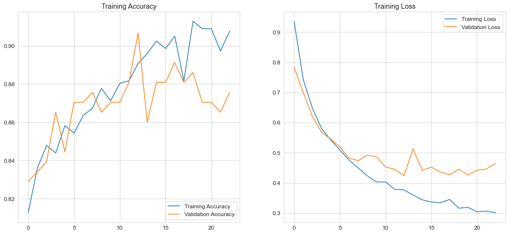
    


```python
cnn_results = {'eltime' : eltime_cnn, 'fpr' : fpr_cnn, 'tpr' : tpr_cnn, 'auc' : AUC_cnn, 'confusion_matrix' : cm_cnn, 'mse' : mse_cnn}
```

<h2> 16. XGradientBoost Classifier  </h2>


```python
param_grid_cxgb = [{
     "eta"    : [0.01, 0.05, 0.15] ,
     "max_depth"        : [ 7, 9, 11],
     "min_child_weight" : [ 1, 3, 7 ],
     "gamma"            : [ 0.0, 0.1, 0.3],
     "colsample_bytree" : [ 0.3, 0.5],
     "min_samples_split": np.linspace(0.1, 0.5, 5),
     "min_samples_leaf": np.linspace(0.1, 0.5, 5),
     }]
cxgb_reg = xgb.XGBClassifier()
cxgb = GridSearchCV(cxgb_reg, param_grid_cxgb, cv=5, scoring='f1')
cxgb.fit(X_train, y_train)
print(cxgb.best_params_)
print(cxgb.best_estimator_)
xgb_res = cxgb.cv_results_
xgb_best = cxgb.best_estimator_
```

    {'colsample_bytree': 0.5, 'eta': 0.01, 'gamma': 0.1, 'max_depth': 11, 'min_child_weight': 1, 'min_samples_leaf': 0.1, 'min_samples_split': 0.1}
    XGBClassifier(colsample_bytree=0.5, eta=0.01, gamma=0.1, max_depth=11,
                  min_samples_leaf=0.1, min_samples_split=0.1)
    


```python
xgb_results = calculate_results(xgb_best, X_test=X_test, y_test=y_test)
```

    [[103   8]
     [  9 121]]
    AUC 0.9604989604989604
                  precision    recall  f1-score   support
    
               0       0.92      0.93      0.92       111
               1       0.94      0.93      0.93       130
    
        accuracy                           0.93       241
       macro avg       0.93      0.93      0.93       241
    weighted avg       0.93      0.93      0.93       241
    
    


    
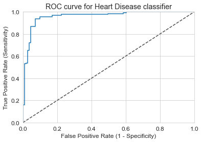
    


<h2> 17. Comparision AUCs of Classifiers  </h2>


```python
colors = ["yellow", "green", "orange", "magenta","cyan","black", "blue", "red"]
legend = ["Random Forest\nClassifier", "Linear\nRegression", "K-Nearest\nNeightbours", "Decision Tree\nClassifier", "Support Vector\nMachine",
         "Naive Bayes\nClassifier", "Neural Network", "XGradientBoost\nClassifier"]
AUCs = [crf_results['auc'], clgr_results['auc'], cknn_results['auc'], cdt_results['auc'],  csvm_results['auc'],  cnb_results['auc'], cnn_results['auc'], xgb_results['auc']]
sns.set_style("whitegrid")
plt.figure(figsize=(16,5))
plt.yticks(np.arange(0,1,0.1))
plt.ylabel("AUC")
plt.xlabel("Classifiers")
sns.barplot(x=legend, y=AUCs, palette=colors)
plt.show()
```


    
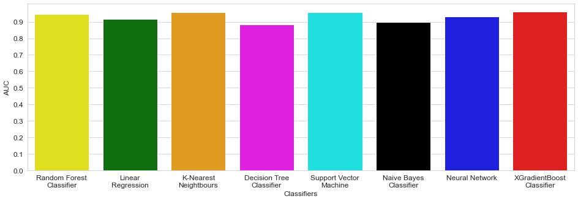
    


<h2> 18. Comparision Mean Squared Errors of Classifiers  </h2>


```python
mses = [crf_results['mse'], clgr_results['mse'], cknn_results['mse'], cdt_results['mse'],  csvm_results['mse'],  cnb_results['mse'], cnn_results['mse'], xgb_results['mse']]
sns.set_style("whitegrid")
plt.figure(figsize=(16,5))
plt.yticks(np.arange(0,1,0.1))
plt.ylabel("MSE")
plt.xlabel("Classifiers")
sns.barplot(x=legend, y=mses, palette=colors)
plt.show()
```


    
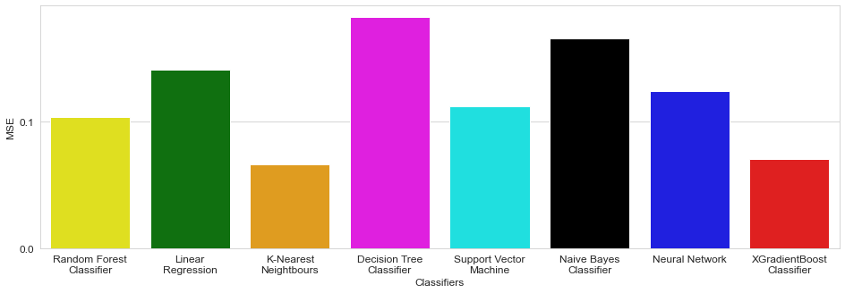
    


<h2> 19. Comparision times of Classifiers predictions  </h2>


```python
eltimes = [crf_results['eltime'], clgr_results['eltime'], cknn_results['eltime'], cdt_results['eltime'],  csvm_results['eltime'],  cnb_results['eltime'], cnn_results['eltime'], xgb_results['eltime']]
sns.set_style("whitegrid")
plt.figure(figsize=(16,5))
plt.yticks(np.arange(0,max(eltimes),0.01))
plt.ylabel("Prediction Time")
plt.xlabel("Classifiers")
sns.barplot(x= legend, y= eltimes, palette=colors)
plt.show()
```


    
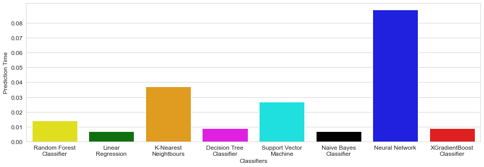
    


<h2> 20. Comparision Confusion Matricss of Classifiers  </h2>


```python
plt.figure(figsize=(240,120))

plt.suptitle("Confusion Matrixes",fontsize=600)
plt.subplots_adjust(wspace = 1, hspace= 1)

plt.subplot(4,2,1)
plt.title(legend[0],fontsize=200)
sns.heatmap(crf_results['confusion_matrix'], annot=True, cmap="Blues", fmt="d", cbar=False, annot_kws={"size": 120})

plt.subplot(4,2,2)
plt.title(legend[1],fontsize=200)
sns.heatmap(clgr_results['confusion_matrix'], annot=True, cmap="Blues", fmt="d",cbar=False, annot_kws={"size": 120})

plt.subplot(4,2,3)
plt.title(legend[2],fontsize=200)
sns.heatmap(cknn_results['confusion_matrix'], annot=True, cmap="Blues", fmt="d", cbar=False, annot_kws={"size": 120})

plt.subplot(4,2,4)
plt.title(legend[3],fontsize=200)
sns.heatmap(cdt_results['confusion_matrix'], annot=True, cmap="Blues", fmt="d", cbar=False, annot_kws={"size": 120})

plt.subplot(4,2,5)
plt.title(legend[4],fontsize=200)
sns.heatmap(csvm_results['confusion_matrix'], annot=True, cmap="Blues", fmt="d", cbar=False, annot_kws={"size": 120})

plt.subplot(4,2,6)
plt.title(legend[5],fontsize=200)
sns.heatmap(cnb_results['confusion_matrix'], annot=True, cmap="Blues", fmt="d", cbar=False, annot_kws={"size": 120})

plt.subplot(4,2,7)
plt.title(legend[6],fontsize=200)
sns.heatmap(cnn_results['confusion_matrix'], annot=True, cmap="Blues", fmt="d", cbar=False, annot_kws={"size": 120})

plt.subplot(4,2,8)
plt.title(legend[7],fontsize=200)
sns.heatmap(xgb_results['confusion_matrix'], annot=True, cmap="Blues", fmt="d", cbar=False, annot_kws={"size": 120})
plt.show()
```


    

    


<h2> 21. Summary </h2>


### In this project I compared eight different Machine Learning Classifiers. For each of models I used GridSearchCV to find the best hyperparameters. For CNN model I used HyperOpt module to optimize hyperparameters. The worst models are definitely Decision Tree Classifier and Gaussian Naive Bayes Classifier. The higher AUC has kNN, SVC, RandomForest Classifier and Neural Networks. To final classfication model I would choose kNN or RandomForestClassifier due to high recall value which is important during preparing models to predict diseases. XGBoost also obtained high recall value and can be considered in the future modeling.


```python

```
