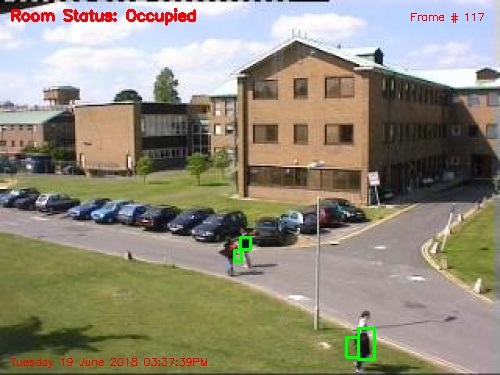
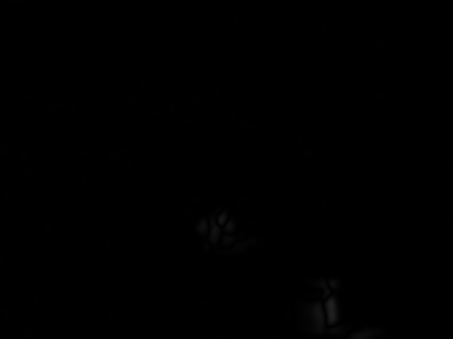
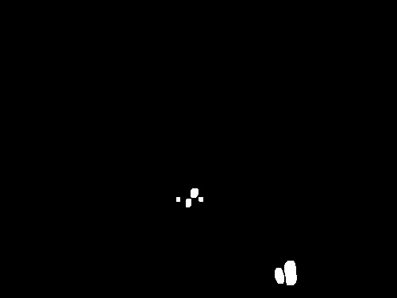

# Basic motion detection and tracking system
<!-- TOC depthFrom:2 depthTo:6 withLinks:1 updateOnSave:1 orderedList:0 -->

- [Introduction](#introduction)
- [Sample GIFs, videos, and images](#sample-gifs-videos-and-images)
- [Files description](#files-description)
- [Installation and dependencies](#installation-and-dependencies)
- [Options, usage, and inputs/outputs](#options-usage-and-inputsoutputs)
	- [Script configuration options (conf.json)](#script-configuration-options-confjson)
	- [Logging options (logging_conf.json)](#logging-options-logging_confjson)
	- [Script usage](#script-usage)
	- [Script Inputs/Outputs](#script-inputsoutputs)
- [Roadmap](#roadmap)
- [License](#license)
- [Notes](#notes)

<!-- /TOC -->

## Introduction
A simple motion detection and tracking system is implemented using two **basic**
background substitution models:
* First background model: **first frame** taken to model the background
* Second background model: **weighted average** of frames

The **Python** code implementation for these two background models are based
from **Adrian Rosebrock**'s tutorials @ www.pyimagesearch.com:
* [first-frame background model](https://www.pyimagesearch.com/2015/05/25/basic-motion-detection-and-tracking-with-python-and-opencv/)
* [weighted-average-of-frames background model](https://www.pyimagesearch.com/2015/06/01/home-surveillance-and-motion-detection-with-the-raspberry-pi-python-and-opencv/)

For each motion detected, a bounding box is drawn around the object like the
following:

The system can be configured through a configuration file
([conf.json](#script-configuration-options-confjson)), and its logging can be
setup with [logging_conf.json](#logging-options-logging_confjson).

## Sample GIFs, videos, and images
Here are some sample GIFs of how the two basic background
substitution methods work when applied on some of the images from the
[SBMnet dataset](http://pione.dinf.usherbrooke.ca/dataset/):

<b>First frame</b> background model: only the first 300 first
frames are shown, @ 4x normal speed

 
 

<b>Weighted average</b> background model: only the first 300
first frames are shown, @ 4x normal speed

 
These are the corresponding <b>complete</b> videos for each of the two
background models:
 
 

Video using the <b>first frame</b> background model: click on the image for
the full video

 
 

Video using the <b>weighted average</b> background model: click on the image
for the full video

 
 

Some sample images for the three types of images that are generated by the
script where the three images are from the same frame:

<b>Security feed</b> image with bounding boxes around detected
moving objects, <a href="#save_security_feed_images">v</a> 

 

<b>Frame delta</b> image: absolute difference between the current grayscale frame and the background image, <a href="#save_frame_delta_images">v</a> 

 

<b>Thresholded</b> image: binary images created out of the
'frame delta' grayscale images where the foreground is white and the background
black, <a href="#save_thresh_images">v</a> 

 

As a side-note, if you are wondering how I generated the GIFs or videos from the
test images, check my blog posts:
* [Make a GIF from a video file on a Mac](https://progsharing.blogspot.com/2018/06/make-gif-from-video-file-on-mac-no.html)
* [Make a split screen movie with iMovie and OpenShot (Mac)](https://progsharing.blogspot.com/2018/06/make-split-screen-movie-with-imovie-and.html)
* [Make a movie from a sequence of images (Mac)](https://progsharing.blogspot.com/2018/06/make-movie-from-sequence-of-images-mac.html)

## Files description
* [`run_system.py`](https://github.com/raul23/automated_visual_surveillance_system/blob/master/basic_motion_detection_and_tracking_system/run_system.py): main script that performs motion detection and tracking
of objects on images/videos
* [`imutils.py`](https://github.com/raul23/automated_visual_surveillance_system/blob/master/basic_motion_detection_and_tracking_system/imutils.py): module that only has the necessary functions from the
[`imutils`](https://github.com/jrosebr1/imutils) package from
[Adrian Rosebrock](https://www.pyimagesearch.com/). Hence, it is not necessary
to install the `imutils` package if only very few functions are used. For the
moment, only the `resize()` function from the `imutils` package is used in the
script.
* [`conf.json`](https://github.com/raul23/automated_visual_surveillance_system/blob/master/basic_motion_detection_and_tracking_system/conf.json): **main** configuration options
* [`logging_conf.json`](https://github.com/raul23/automated_visual_surveillance_system/blob/master/basic_motion_detection_and_tracking_system/logging_conf.json): **logging** configuration options. By default, logging
writes to a file.

## Installation and dependencies
These are the steps to use the Python script [`run_system.py`](https://github.com/raul23/automated_visual_surveillance_system/blob/master/basic_motion_detection_and_tracking_system/run_system.py):
1. Install the dependencies defined below
2. Clone the repository and extract it
3. You can now run the main script [`run_system.py`](https://github.com/raul23/automated_visual_surveillance_system/blob/master/basic_motion_detection_and_tracking_system/run_system.py). Go to the section
[Script usage](#script-usage) for more details.

Dependencies:
* OpenCV 3
* Python 3

I tested the code with Python 3.6, and macOS Sierra 10.12.6. See my
[blog post](https://progsharing.blogspot.com/2018/05/installing-opencv-3-on-macos-with.html)
if you need guidance on installing OpenCV 3 on macOS with Homebrew.

## Options, usage, and inputs/outputs

### Script configuration options (conf.json)

The [`run_system.py`](https://github.com/raul23/automated_visual_surveillance_system/blob/master/basic_motion_detection_and_tracking_system/run_system.py) script has the following configuration options (defined
in [conf.json](https://github.com/raul23/automated_visual_surveillance_system/blob/master/basic_motion_detection_and_tracking_system/conf.json)):
* `disable_logging`: a boolean variable (true/false) that specifies whether
logging should be disabled. If logging is disabled, then the console will be
used for writing the messages.
* `logging_conf_path`: path to the JSON configuration file for setting
up logging. Default is **logging_conf.json**.
* `background_model`: choices are "**first_frame**" and "**weighted_average**".
It is the type of background model. `first_frame` refers to the background model
where the first frame is used as model of the background. `weighted_average`
refers to modeling the background as a weighted average of the past and current
frames.
* `video_filepath` : full path to the video to be processed.
If no video provided, leave option empty, i.e. `video_filepath`:"". **Important:**
if `video_filepath` and `image_dirpath` are left empty, then the webcam feed will be
used.
* `image_dirpath` : full path to the sequence of images to
be processed. **Important**: the images must follow a naming pattern with zero
paddings, e.g. image%06d.jpg. If no images provided, leave option empty, i.e.
`image_dirpath`:""
* `reports_dirpath`: full path to the **main directory** for saving all the
results from running the scripts, e.g. debugging logs, security feed images.
Each run of the script will write in a separate folder (named as
'YYYYMMDD-HHMMSS-image_results') within `reports_dirpath/`. **IMPORTANT**:
if option left as empty (`reports_dirpath`:""), then no images will be
saved.
* `save_security_feed_images` : a boolean
variable (true/false) that specifies whether the 'security feed' images will be
saved. These are the images with the bounding boxes around the detected moving
objects. [Security feed sample image](#security_feed_sample_image)
* `save_frame_delta_images` : a boolean
variable (true/false) that specifies whether the 'frame delta' images will be
saved. These are the images that correspond to the absolute difference between
the current grayscale frame and the image representing the background.
[Frame delta sample image](#frame_delta_sample_image)
* `save_thresh_images` : a boolean variable
(true/false) that specifies whether the 'thresholded' images will be saved.
These are the binary images created out of the 'frame delta' grayscale images:
the foreground is white and the background black.
[Thresholded sample image](#thresh_sample_image)
* `image_format`: choices are "png", "jpg", and "jpeg". This is the format used
when saving the resulting images. If the entered image format is not supported,
png format is used by default.
* `show_video`: a boolean variable (true/false) that specifies whether to show
the videos (for the different types of images) on screen.
* `start_frame`: an integer variable (default is 1) that specifies the starting
frame to be processed.
* `end_frame`: an integer variable (default is 0) that specifies the ending
frame to be processed. 0 refers to the last frame.
* `min_area`: an integer variable (default is 500) that specifies the minimum
size (500 pixels) for a region of an image to be considered actual “motion”. If
the region (contour) is too small, then it will be ignored, i.e. it will not be
considered as motion.
* `delta_thresh`: an integer variable (default is 25) that specifies the
threshold value used for generating a binary image (thresholded image) out of a
grayscale image ('frame delta' image). Every pixel in the 'frame delta' image
greater than `delta_thresh` will be converted to white (i.e. foreground), and
the other pixels to black (i.e. background).
* `resize_image_width`: an integer variable (default is 500) that
specifies the width in pixels the image should be resized to. If
`resize_image_width` is 0, then the image will not be resized.
* `show_datetime`: a boolean variable (true/false) that specifies whether to
show the actual date & time on the 'security feed' video.
* `gaussian_kernel_size`: a `dict` variable that specifies the width and height
of the Gaussian kernel used for blurring the grayscale image:
  * `width`: an integer variable (default is 21) that specifies the width of the
	Gaussian kernel.
  * `height`: an integer variable (default is 21) that specifies the height of
	the Gaussian kernel.

### Logging options (logging_conf.json)
The [`run_system.py`](https://github.com/raul23/automated_visual_surveillance_system/blob/master/basic_motion_detection_and_tracking_system/run_system.py) script has the following important **logging**
configuration options (defined in [logging_conf.json](https://github.com/raul23/automated_visual_surveillance_system/blob/master/basic_motion_detection_and_tracking_system/logging_conf.json)):
* `formatters`: list of formatters. Two types of formatters (`verbose` and
	`simple`) are available by default depending on how much information you need
	for each log message.
* `handlers`: list of handlers that are in charge of "[dispatching the
appropriate log messages](https://docs.python.org/3/howto/logging.html#handlers)".
The most important handlers are for writing logs to files
(`logging.FileHandler`), and to the console (`logging.StreamHandler`). By
default, the log messages `debug.log` will be saved in
`.../reports_dirpath/YYYYMMDD-HHMMSS-image_results/`.
* `loggers`: list of all the loggers along with their options (e.g. severity
level) and handlers. By default, two loggers are available. One logger for the `run_system.py` script named `basic_motion_detection_and_tracking_system.run_system` which follows the
usual naming pattern for loggers in **Python**: `package_name.module_name`. The
second logger is the `root` logger with the `WARNING` severity level.

### Script usage
From a terminal, run the following command:

`$ python run_system.py -c conf.json`

**NOTES:**

* `conf.json` can also refer to your own configuration file named whatever you
want. Thus, you can leave the default `conf.json` as a template, and have your
own configuration file, named for example `my_conf.json`, that will be called
when running the script.

* Same for `logging_conf.json`, you could name it whatever you want, and refer it
in `conf.json`. Thus, `logging_conf.json` could also be used as a template.

**IMPORTANT:** when running the script for the first time, it might take some
time reading the images if there are a lot of them (e.g. more than 1000).

### Script Inputs/Outputs
The system can take as **inputs**:
* a video from a file (defined in <a href="#video_filepath">`video_filepath`
</a>), or your webcam feed (leave `video_filepath` and `image_dirpath` empty)
* an image sequence (**png** or **jpg**) having the naming pattern with zero
paddings, e.g. image%06d.jpg, and defined in <a href="#image_dirpath">`image_dirpath`</a>.

The system **outputs** the following by *default* within the folder
`.../reports_dirpath/YYYYMMDD-HHMMSS-image_results/`
<a href="#note_01">[1]</a>:
* `background_image%06d.png`: image representing the background. Depending on the
background model selected (*see the* [`background_model`](#script-configuration-options-confjson) *option*), it can
correspond to the first frame or a sequence of images representing the weighted average of the past and current
frames.
* `command.txt`: the **Python** command used for running the `run_system.py`
script
* `conf.json`: JSON configuration storing the script options. For the detailed
list of the script options, see
[Script configuration options (conf.json)](#script-configuration-options-confjson).
* `logging_conf.json`: JSON configuration file for setting up the logging. For
the list of the most important logging options, see
[Logging options (logging_conf.json)](#logging-options-loggingconfjson).
* `debug.log`: file of all the written log messages
* `security_feed/`: folder storing all the 'security feed' images
* `thresh/`: folder storing all the thresholded images
* `frame_delta/`: folder storing all the 'frame delta' images

## Roadmap
In order of importance, these are the changes I will work on:
* Add unit tests [**topmost**]
* Implement more sophisticated background substitution models
* Implement more sophisticated tracking systems (e.g. Kalman filter)
* Make the code Python 2.7 compatible
* Test the code on Linux
* Package the Python script
* Make a Docker image

## License
The code is licensed under the GNU GPL 3 license. See the [license](https://github.com/raul23/automated_visual_surveillance_system/blob/master/LICENSE)
for more details.

## Notes
<b id="note_01">1. <a href="#go_back_note_01">^</a></b> Each time the script is
run, a folder with the naming pattern `YYYYMMDD-HHMMSS-image_results` is
created within `.../reports_dirpath/`. It is inside this folder that all
the important results will be saved, such as the configuration file used
(`conf.json`), the logging file `debug.log`, etc
