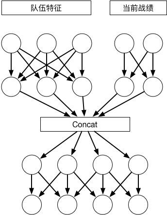
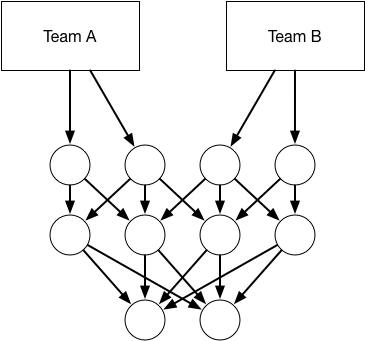

# Basketball Prediction

## Introduction

 Predict the probability of the basketball matches with Deep Neural Networks
 2017 Seedcup Preliminary Contest
 
## Run Step
#### GPU Version:
1.train:
`python train.py --model dnn --team_data_type reduce --cuda 1 --epoch 100 --batch-size 16`
 
2.test:
`python test.py --cuda 1 --model 'dnn' --epoch 200 --team_data_type 'reduce' --model_param 'train_dnn_30.pkl'`
#### CPU Version:
1.train:
`python train.py --model dnn --team_data_type reduce --cuda 0 --epoch 100 --batch-size 16`
 
2.test:
`python test.py --cuda 0 --model 'dnn' --epoch 200 --team_data_type 'reduce' --model_param 'train_dnn_30.pkl'`

#### Team Representation Network

#### Competition Network

## Environment

* Pytorch
* XGBoost(if you do not use train_xgboost.py, you can delete the file in project)
* Scikit-Learn

## Contributors

* [yueruchen](https://github.com/yueruchen)

* [VicChan](https://github.com/wondervictor)

* [Xiangru Tang](https://github.com/tangxiangru)

## Licence

**This Project is Under the MIT Licence**

