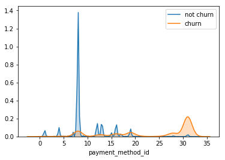
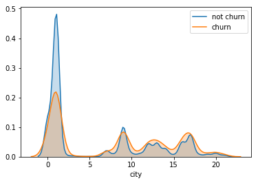
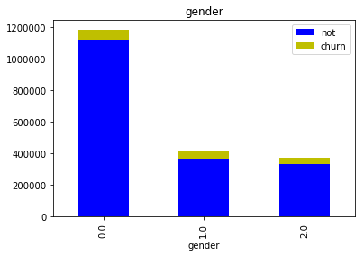
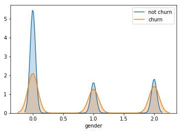
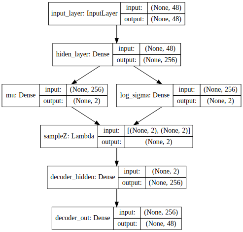
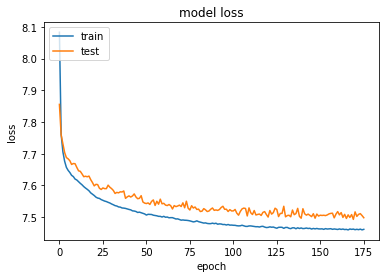
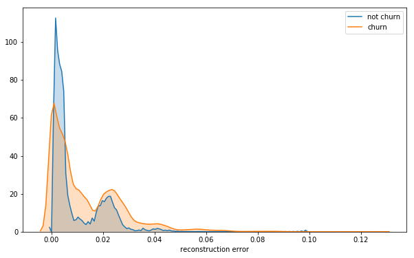
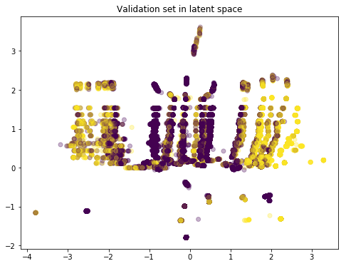
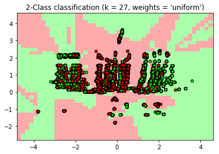
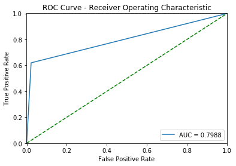

```python
import os

```

<h1> Deep Variational Autoencoder</h1>
# For 1D unbalanced classification problem
## Semi-supervised Churn Customer Prediction
* The project were written for kaggle Churn prediction competition
* WSDM - KKBox's Churn Prediction Challenge
* https://www.kaggle.com/c/kkbox-churn-prediction-challenge</br>
### <b>The work plan:</b>
1. Read the data and create dummy variables for the catecorial fetures.
2. Create, and train variational autoencoder, that decode the data into a 2 dimentional latent space.
3. View the data in the latent 2D space, and check classification astrategies.</br>
### <b>Reference to Variational Auto encoder:</b>
* https://wiseodd.github.io/techblog/2016/12/10/variational-autoencoder/</br>
### <b>The Data:</b>
* The data can be downloaded at the kaggle competition website.
* Data reading, aggregation and feture engeeniring, here: https://github.com/naomifridman/Neural-Network-Churn-Prediction. Small data sample can be found here as well.


```python
import pandas as pd
import numpy as np
from sklearn.preprocessing import StandardScaler,MinMaxScaler
import collections

# For plotting
%matplotlib inline
import matplotlib.pyplot as plt
import seaborn as sns

from sklearn.metrics import (confusion_matrix, precision_recall_curve, auc,
                             roc_curve, recall_score, classification_report, f1_score,
                             precision_recall_fscore_support)
```

## Read Data
#### train_data.csv - the train set, of kaggle competition, after feature ingeneering.
* msno: user id
* is_churn: This is the target variable. Churn is defined as whether the user did not continue the subscription within 30 days of expiration. is_churn = 1 means churn,is_churn = 0 means renewal.


```python
test=pd.read_csv('test_data.csv')
train= pd.read_csv('train_data.csv')
```


```python
print train.columns
from sklearn.utils import shuffle
train = shuffle(train)
```

    Index([u'msno', u'is_churn', u'trans_count', u'payment_method_id',
           u'payment_plan_days', u'plan_list_price', u'actual_amount_paid',
           u'is_auto_renew', u'transaction_date', u'membership_expire_date',
           u'is_cancel', u'logs_count', u'date', u'num_25', u'num_50', u'num_75',
           u'num_985', u'num_100', u'num_unq', u'total_secs', u'city', u'bd',
           u'gender', u'registered_via', u'registration_init_time'],
          dtype='object')


```python
train.head()
```


<div>
<style>
    .dataframe thead tr:only-child th {
        text-align: right;
    }

    .dataframe thead th {
        text-align: left;
    }

    .dataframe tbody tr th {
        vertical-align: top;
    }
</style>
<table border="1" class="dataframe">
  <thead>
    <tr style="text-align: right;">
      <th></th>
      <th>msno</th>
      <th>is_churn</th>
      <th>trans_count</th>
      <th>payment_method_id</th>
      <th>payment_plan_days</th>
      <th>plan_list_price</th>
      <th>actual_amount_paid</th>
      <th>is_auto_renew</th>
      <th>transaction_date</th>
      <th>membership_expire_date</th>
      <th>...</th>
      <th>num_75</th>
      <th>num_985</th>
      <th>num_100</th>
      <th>num_unq</th>
      <th>total_secs</th>
      <th>city</th>
      <th>bd</th>
      <th>gender</th>
      <th>registered_via</th>
      <th>registration_init_time</th>
    </tr>
  </thead>
  <tbody>
    <tr>
      <th>448226</th>
      <td>PpcGaLDnaqbR0rFnSjE1ePlq8Iwg+I/496p/3C1sk6M=</td>
      <td>0</td>
      <td>5</td>
      <td>41.0</td>
      <td>30.0</td>
      <td>99.0</td>
      <td>99.0</td>
      <td>1.0</td>
      <td>20170310.0</td>
      <td>20170410.0</td>
      <td>...</td>
      <td>1.0</td>
      <td>0.0</td>
      <td>73.0</td>
      <td>76.0</td>
      <td>19664.449</td>
      <td>5.0</td>
      <td>23.0</td>
      <td>1.0</td>
      <td>7.0</td>
      <td>20161110.0</td>
    </tr>
    <tr>
      <th>23523</th>
      <td>3mbiROk+stv5bpSoSBamETsOdsGvI2tYkizEyt5NLE4=</td>
      <td>1</td>
      <td>14</td>
      <td>0.0</td>
      <td>0.0</td>
      <td>0.0</td>
      <td>0.0</td>
      <td>0.0</td>
      <td>0.0</td>
      <td>0.0</td>
      <td>...</td>
      <td>0.0</td>
      <td>1.0</td>
      <td>39.0</td>
      <td>40.0</td>
      <td>10252.677</td>
      <td>15.0</td>
      <td>22.0</td>
      <td>1.0</td>
      <td>9.0</td>
      <td>20150825.0</td>
    </tr>
    <tr>
      <th>121396</th>
      <td>uYcPOte+AR3WoaBIyf/ZRMYw0lggV7SFLdgpQJHcsgg=</td>
      <td>0</td>
      <td>27</td>
      <td>36.0</td>
      <td>30.0</td>
      <td>180.0</td>
      <td>180.0</td>
      <td>1.0</td>
      <td>20170312.0</td>
      <td>20170411.0</td>
      <td>...</td>
      <td>1.0</td>
      <td>0.0</td>
      <td>0.0</td>
      <td>2.0</td>
      <td>126.171</td>
      <td>22.0</td>
      <td>21.0</td>
      <td>2.0</td>
      <td>7.0</td>
      <td>20150307.0</td>
    </tr>
    <tr>
      <th>984074</th>
      <td>YWiGHcibaJjX3HvGhHnvtm4YFWOAtaq+EqcEC9x1b+A=</td>
      <td>0</td>
      <td>22</td>
      <td>39.0</td>
      <td>30.0</td>
      <td>149.0</td>
      <td>149.0</td>
      <td>1.0</td>
      <td>20170331.0</td>
      <td>20170505.0</td>
      <td>...</td>
      <td>0.0</td>
      <td>1.0</td>
      <td>25.0</td>
      <td>33.0</td>
      <td>6721.551</td>
      <td>5.0</td>
      <td>36.0</td>
      <td>2.0</td>
      <td>9.0</td>
      <td>20100326.0</td>
    </tr>
    <tr>
      <th>1900366</th>
      <td>Y1hlZ5xC1BHdsayrSBRS7qjQ81aEbNIA8vWr9zuPL1M=</td>
      <td>0</td>
      <td>17</td>
      <td>41.0</td>
      <td>30.0</td>
      <td>100.0</td>
      <td>100.0</td>
      <td>1.0</td>
      <td>20170331.0</td>
      <td>20170430.0</td>
      <td>...</td>
      <td>1.0</td>
      <td>0.0</td>
      <td>150.0</td>
      <td>121.0</td>
      <td>35802.106</td>
      <td>1.0</td>
      <td>0.0</td>
      <td>0.0</td>
      <td>7.0</td>
      <td>20160107.0</td>
    </tr>
  </tbody>
</table>
<p>5 rows × 25 columns</p>
</div>


## Visualize and Analize data functionality


```python
def agg_col_by_chrn(dfo, col, drow = True):
    
    h = dfo.groupby([col,'is_churn']).agg(len)
    v= h.msno

    dn =pd.DataFrame()
    dn['not'] = v.loc[pd.IndexSlice[:,0]]
    dn['churn']= v.loc[pd.IndexSlice[:,1]]
    dn = dn.fillna(0.)
    if (drow):
        dn.plot(kind='bar', stacked=True, color=['b','y'])
        plt.title(col)
    dn['percent'] = dn.churn * 100. / (dn['not'] +  dn.churn)
    dn['sum'] = dn.churn +(dn['not'])
    dn = dn.sort_values('percent')
    dn = dn.reset_index()
    return dn
```


```python
def agg_col(dfo, col, drow = True):
    
    h = test.groupby([col,'is_churn']).agg(len)
    v= h.msno

    dn =pd.DataFrame()
    dn['sum'] = v.loc[pd.IndexSlice[:,0]]
    dn = dn.fillna(0.)
    if (drow):
        dn.plot(kind='bar', stacked=True, color=['b','y'])
        plt.title(col)
    dn = dn.reset_index()
    return dn
```


```python
def drow_col(df, col):
    
    
    dft = train[[col,'is_churn']]
    dft0 = dft[dft.is_churn==0]
    dft1 = dft[dft.is_churn==1]

    sns.kdeplot(dft0[col], label='not churn', shade=True)
    sns.kdeplot(dft1[col], label='churn', shade=True)
    
    plt.xlabel(col);

```

## Handle categorial features
* There are few categorial features in the data set. Lets view them and create dummy variables.


```python
def order_col_by_churn_percent(col,drow=True):
    
    dn = agg_col_by_chrn(train, col, drow = False)
    tmp = dn[[col]].to_dict()
    val_map=  tmp[col]

    inv_map = {v: k for k, v in val_map.items()}

    train[col] = train[col].replace(inv_map)
    test[col] = test[col].replace(inv_map)
    if (drow) :
        drow_col(train, col)
```

### registered_via


```python
col= 'registered_via'
print 'registered_via', collections.Counter(train['registered_via'])
```

    registered_via Counter({7.0: 945410, 9.0: 472309, 0.0: 225763, 3.0: 211904, 4.0: 102027, 13.0: 6478})


```python
order_col_by_churn_percent(col)
```


### payment_method_id


```python
col = 'payment_method_id'
print 'city',collections.Counter(train[col])
```

    city Counter({41.0: 1096538, 40.0: 145608, 36.0: 130614, 39.0: 128210, 0.0: 93166, 38.0: 79695, 37.0: 74482, 34.0: 57618, 30.0: 30987, 33.0: 28344, 29.0: 28074, 31.0: 20694, 32.0: 17269, 15.0: 4338, 23.0: 4190, 27.0: 3718, 35.0: 3435, 28.0: 3240, 19.0: 2588, 20.0: 1866, 21.0: 1758, 16.0: 1588, 18.0: 1272, 22.0: 1144, 14.0: 1085, 13.0: 823, 17.0: 616, 12.0: 490, 26.0: 171, 11.0: 150, 10.0: 74, 8.0: 21, 6.0: 14, 3.0: 11})


```python
order_col_by_churn_percent(col)
```





### city


```python
col = 'city'
print 'city',collections.Counter(train[col])
```

    city Counter({1.0: 897987, 0.0: 225763, 13.0: 195417, 5.0: 142005, 4.0: 95172, 15.0: 86543, 22.0: 84120, 6.0: 52088, 14.0: 40180, 12.0: 22937, 9.0: 19084, 11.0: 18174, 18.0: 15634, 8.0: 15279, 10.0: 13003, 17.0: 11022, 21.0: 10485, 3.0: 10146, 7.0: 5318, 16.0: 1900, 20.0: 1354, 19.0: 280})


```python
order_col_by_churn_percent(col)
```





### gender


```python
col = 'gender'
dn = agg_col_by_chrn(train, col)
```





```python
order_col_by_churn_percent('gender')
```





### Encode Categorial Features
Create dummy feature for each category.
We will not applt this on payment_method_id, becausea there are a lot of values,
and we will get big sparse matrix.


```python
def aply_oonehot(df, col):
    df_en = pd.get_dummies(df[col])
    
    df_en = df_en.drop(df_en.columns[0], 1)
    
    cols = [str(col)+'_'+str(c) for c in df_en.columns]
    df_en.columns = cols
    
    df = df.drop(col, 1)
    
    
    df = pd.concat([df, df_en], axis=1)
    return df
```


```python
train = aply_oonehot(train, 'city')
test =  aply_oonehot(test, 'city')

train = aply_oonehot(train, 'registered_via')
test =  aply_oonehot(test, 'registered_via')

train = aply_oonehot(train, 'gender')
test =  aply_oonehot(test, 'gender')
```


```python
# will not create dummy fetures for payment_method_id, because there are many categories, 
# and we will get big spars matrix
print train.columns
```

    Index([u'msno', u'is_churn', u'trans_count', u'payment_method_id',
           u'payment_plan_days', u'plan_list_price', u'actual_amount_paid',
           u'is_auto_renew', u'transaction_date', u'membership_expire_date',
           u'is_cancel', u'logs_count', u'date', u'num_25', u'num_50', u'num_75',
           u'num_985', u'num_100', u'num_unq', u'total_secs', u'bd',
           u'registration_init_time', u'city_1.0', u'city_2.0', u'city_3.0',
           u'city_4.0', u'city_5.0', u'city_6.0', u'city_7.0', u'city_8.0',
           u'city_9.0', u'city_10.0', u'city_11.0', u'city_12.0', u'city_13.0',
           u'city_14.0', u'city_15.0', u'city_16.0', u'city_17.0', u'city_18.0',
           u'city_19.0', u'city_20.0', u'city_21.0', u'registered_via_1.0',
           u'registered_via_2.0', u'registered_via_3.0', u'registered_via_4.0',
           u'registered_via_5.0', u'gender_1.0', u'gender_2.0'],
          dtype='object')


## Model evaluation and visualization functions


```python

from sklearn.metrics import confusion_matrix
from sklearn.metrics import classification_report
from sklearn.metrics import cohen_kappa_score
from sklearn.metrics import accuracy_score, log_loss

def print_stats(ytest, ypred):
    
    print("Accuracy: {:.5f}, Cohen's Kappa Score: {:.5f}".format(
        accuracy_score(ytest, ypred), 
        cohen_kappa_score(ytest, ypred, weights="quadratic")))
    ll = log_loss(ytest, ypred)
    print("Log Loss: {}".format(ll))
    print ' '
    print("Confusion Matrix:")
    print(confusion_matrix(ytest, ypred))
    print("Classification Report:")
    print(classification_report(ytest, ypred))
```


```python
def drow_roc_curve(y_true, y_pred):
    fpr, tpr, thresholds = roc_curve(y_true, y_pred)
    roc_auc = auc(fpr, tpr)

    plt.title('ROC Curve - Receiver Operating Characteristic')
    plt.plot(fpr, tpr, label='AUC = %0.4f'% roc_auc)
    plt.legend(loc='lower right')
    plt.plot([0,1],[0,1],'g--')
    plt.xlim([-0.001, 1])
    plt.ylim([0, 1.001])
    plt.ylabel('True Positive Rate')
    plt.xlabel('False Positive Rate')
    plt.show();
```


```python
def drow_history(history, metric):
    plt.plot(history.history[metric])
    plt.plot(history.history['val_'+ metric])
    plt.title('model '+metric)
    plt.ylabel(metric)
    plt.xlabel('epoch')
    plt.legend(['train', 'test'], loc='upper left')
    plt.show()    
```

# VAE - variational autoencoder
* refernce: https://wiseodd.github.io/techblog/2016/12/10/variational-autoencoder/

Since vae neural net is highly customized, data set size must be devided bt batch size 


```python
'''uniform
weights='uniform'
n_neighbors=27

Accuracy: 0.95342, Cohen's Kappa Score: 0.64526
Log Loss: 1.60892059163
 
Confusion Matrix:
[[355829   6603]
 [ 11690  18578]]
Classification Report:
             precision    recall  f1-score   support

          0       0.97      0.98      0.97    362432
          1       0.74      0.61      0.67     30268

avg / total       0.95      0.95      0.95    392700
'''
```


    "uniform\nweights='uniform'\nn_neighbors=27\n\nAccuracy: 0.95342, Cohen's Kappa Score: 0.64526\nLog Loss: 1.60892059163\n \nConfusion Matrix:\n[[355829   6603]\n [ 11690  18578]]\nClassification Report:\n             precision    recall  f1-score   support\n\n          0       0.97      0.98      0.97    362432\n          1       0.74      0.61      0.67     30268\n\navg / total       0.95      0.95      0.95    392700\n"


```python
from sklearn.model_selection import train_test_split
from sklearn.preprocessing import StandardScaler,MinMaxScaler

XX_train, XX_val = train_test_split(train, test_size=589200)

cols = [c for c in train.columns if c not in ['is_churn','msno']]

X_train = MinMaxScaler().fit_transform(XX_train[cols])
y_train = XX_train['is_churn'].as_matrix()
XX_val1 = MinMaxScaler().fit_transform(XX_val[cols])
yy_val1= XX_val['is_churn'].as_matrix()
X_real_test = MinMaxScaler().fit_transform(test[cols])
print y_train.shape, yy_val1.shape
```

    (1374691,) (589200,)


* Lets split validation set to validation and train sets


```python
X_val, X_test, y_val, y_test = train_test_split(XX_val1, yy_val1, test_size=294600, random_state=42)
print y_train.shape, y_val.shape, y_test.shape, train.shape
```

    (1374691,) (294600,) (294600,) (1963891, 50)


```python
print yy_val1.sum()
print y_val.sum()
print y_test.sum()
```

    45046
    22412
    22634


Since vae neural net is highly customized, data set size must be devided bt batch size 


```python
def cut_array_to_fit_batchsize(X,y,batch_size):
    n_size = (len(X)//batch_size)*batch_size
    
    X = X[0:n_size]
    
    y = y[0:n_size]
    return X, y
```


```python
batch_size = 100

X_train, y_train = cut_array_to_fit_batchsize(X_train,y_train, batch_size)
X_val, y_val = cut_array_to_fit_batchsize(X_val, y_val, batch_size)

X_test,y_test = cut_array_to_fit_batchsize(X_test,y_test, batch_size)
y_real_test=np.zeros((len(X_real_test)))
print X_val.shape, X_train.shape

```

    (294600, 48) (1374600, 48)


## Vaeuational autoencoder creation


```python
from keras.layers import Input, Dense, Lambda
from keras.models import Model
from keras.objectives import binary_crossentropy
from keras.callbacks import LearningRateScheduler
from IPython.display import SVG
from keras.utils.vis_utils import model_to_dot
from keras.callbacks import EarlyStopping, ModelCheckpoint

import keras.backend as K
from numpy.random import seed
seed(1)

# Define input layer
input_dim = X_train.shape[1]
input_layer = Input(shape=(input_dim,), name='input_layer')

# Define Encoder layers
hiden_layer_dim = 256
hiden_layer = Dense(hiden_layer_dim, activation='relu', 
            name='hiden_layer')(input_layer)

# Create 2 dense layer that outputs latent space dimention data
latent_space_dim = 2
mu = Dense(latent_space_dim, activation='linear', name='mu')(hiden_layer)
log_sigma = Dense(latent_space_dim, activation='linear', name='log_sigma')(hiden_layer)

# Encoder model, to encode input into latent variable
# We choose mu, the mean of the output as can be seen in the samle_z function.
# the mean is the center point, the representative of the gaussian
encoder = Model(input_layer, mu, name='encoder')

# Now the trick of the vae, to sample from the 2 dense layers
def sample_z(args):
    mu, log_sigma = args
    eps = K.random_normal(shape=(batch_size, latent_space_dim), mean=0., stddev=1.)
    return mu + K.exp(log_sigma / 2) * eps


# Sample from the output of the 2 dense layers
sampleZ = Lambda(sample_z, name='sampleZ', output_shape=(latent_space_dim,))([mu, log_sigma])

# Define decoder layers in VAE model
decoder_hidden = Dense(hiden_layer_dim, activation='relu', name='decoder_hidden') 
decoder_out = Dense(input_dim, activation='sigmoid', name = 'decoder_out')

h_p = decoder_hidden(sampleZ)
output_layer = decoder_out(h_p)

# VAE model, Unsupervised leraning for reconstruction of the input data
vae = Model(input_layer, output_layer, name='vae')


# Define a separate Decoder model, that recostruct data from latent variable 
# The decoder model uses eights that was trained with the VAE mode;,
# We need a separate model, if we want to generate data from given data in latent space.
d_in = Input(shape=(latent_space_dim,), name='decoder_input')
d_h = decoder_hidden(d_in)
d_out = decoder_out(d_h)

decoder = Model(d_in, d_out, name='decoder')

SVG(model_to_dot(vae, show_shapes='true').create(prog='dot', format='svg'))
```





```python
def vae_loss(y_true, y_pred):
    """ Calculate loss = reconstruction loss + KL loss for each data in minibatch """
    recon = K.sum(K.binary_crossentropy(y_pred, y_true), axis=1)
    kl = 0.5 * K.sum(K.exp(log_sigma) + K.square(mu) - 1. - log_sigma, axis=1)

    return recon + kl
```


```python
from keras.callbacks import Callback
vlos = float(10000.)

class SaveBest(Callback):
    global vlos
    vlos = float(10000.)
    
    '''def on_train_begin(self, logs={}):
        vlos = float(10000.)'''

    def on_epoch_end(self, batch, logs={}):
        global vlos
        tmp = logs.get('val_loss')
        if (tmp==None):
            tmp = 1000.
        
        if (vlos - float(tmp) > 0.000001) :
            print 'loss improoved from: ', vlos, ' to: ', tmp, 'saving models'
            vlos = float(tmp)
            encoder.save('best_encoder.h5')
            decoder.save('best_decoder.h5')
            vae.save('best_vae.h5')
        
```


```python
savebest = SaveBest()
vae.compile(optimizer='adam', loss=vae_loss)
vae_history = vae.fit(X_train, X_train, batch_size=batch_size, shuffle=True, 
                      validation_data = (X_val, X_val),
                    epochs=200, callbacks = [EarlyStopping(monitor='loss',patience = 8), savebest])
```

    Train on 1374600 samples, validate on 294600 samples
    Epoch 1/200
    1374500/1374600 [============================>.] - ETA: 0s - loss: 8.0833loss improoved from:  10000.0  to:  7.85568392657 saving models
    1374600/1374600 [==============================] - 57s - loss: 8.0833 - val_loss: 7.8557
    Epoch 2/200
    1374300/1374600 [============================>.] - ETA: 0s - loss: 7.7609loss improoved from:  7.85568392657  to:  7.75912235662 saving models
    1374600/1374600 [==============================] - 63s - loss: 7.7609 - val_loss: 7.7591
    Epoch 3/200
    1374000/1374600 [============================>.] - ETA: 0s - loss: 7.7060loss improoved from:  7.75912235662  to:  7.73122607909 saving models
    1374600/1374600 [==============================] - 67s - loss: 7.7060 - val_loss: 7.7312
    Epoch 4/200
    1374000/1374600 [============================>.] - ETA: 0s - loss: 7.6763loss improoved from:  7.73122607909  to:  7.7037429672 saving models
    1374600/1374600 [==============================] - 71s - loss: 7.6763 - val_loss: 7.7037
    Epoch 5/200
    1374000/1374600 [============================>.] - ETA: 0s - loss: 7.6571loss improoved from:  7.7037429672  to:  7.68796549051 saving models
    1374600/1374600 [==============================] - 72s - loss: 7.6572 - val_loss: 7.6880
    Epoch 6/200
    1373800/1374600 [============================>.] - ETA: 0s - loss: 7.6476loss improoved from:  7.68796549051  to:  7.6839558277 saving models
    1374600/1374600 [==============================] - 77s - loss: 7.6477 - val_loss: 7.6840
    Epoch 7/200
    1373500/1374600 [============================>.] - ETA: 0s - loss: 7.6408loss improoved from:  7.6839558277  to:  7.67795627536 saving models
    1374600/1374600 [==============================] - 86s - loss: 7.6408 - val_loss: 7.6780
    Epoch 8/200
    1374200/1374600 [============================>.] - ETA: 0s - loss: 7.6319loss improoved from:  7.67795627536  to:  7.66621088917 saving models
    1374600/1374600 [==============================] - 93s - loss: 7.6319 - val_loss: 7.6662
    Epoch 9/200
    1374600/1374600 [==============================] - 93s - loss: 7.6280 - val_loss: 7.6691
    Epoch 10/200
    1374600/1374600 [==============================] - 93s - loss: 7.6202 - val_loss: 7.6686
    Epoch 11/200
    1374300/1374600 [============================>.] - ETA: 0s - loss: 7.6171loss improoved from:  7.66621088917  to:  7.65689649585 saving models
    1374600/1374600 [==============================] - 96s - loss: 7.6172 - val_loss: 7.6569
    Epoch 12/200
    1374400/1374600 [============================>.] - ETA: 0s - loss: 7.6120loss improoved from:  7.65689649585  to:  7.64621785459 saving models
    1374600/1374600 [==============================] - 99s - loss: 7.6119 - val_loss: 7.6462
    Epoch 13/200
    1374000/1374600 [============================>.] - ETA: 0s - loss: 7.6067loss improoved from:  7.64621785459  to:  7.64453580261 saving models
    1374600/1374600 [==============================] - 100s - loss: 7.6067 - val_loss: 7.6445
    Epoch 14/200
    1374400/1374600 [============================>.] - ETA: 0s - loss: 7.6020loss improoved from:  7.64453580261  to:  7.63642444112 saving models
    1374600/1374600 [==============================] - 105s - loss: 7.6020 - val_loss: 7.6364
    Epoch 15/200
    1374500/1374600 [============================>.] - ETA: 0s - loss: 7.5963loss improoved from:  7.63642444112  to:  7.62762260291 saving models
    1374600/1374600 [==============================] - 107s - loss: 7.5963 - val_loss: 7.6276
    Epoch 16/200
    1374600/1374600 [==============================] - 109s - loss: 7.5918 - val_loss: 7.6291
    Epoch 17/200
    1374100/1374600 [============================>.] - ETA: 0s - loss: 7.5878loss improoved from:  7.62762260291  to:  7.62740716623 saving models
    1374600/1374600 [==============================] - 114s - loss: 7.5878 - val_loss: 7.6274
    Epoch 18/200
    1374600/1374600 [==============================] - 117s - loss: 7.5832 - val_loss: 7.6295
    Epoch 19/200
    1374300/1374600 [============================>.] - ETA: 0s - loss: 7.5766loss improoved from:  7.62740716623  to:  7.61818072704 saving models
    1374600/1374600 [==============================] - 118s - loss: 7.5766 - val_loss: 7.6182
    Epoch 20/200
    1374500/1374600 [============================>.] - ETA: 0s - loss: 7.5726loss improoved from:  7.61818072704  to:  7.60923195921 saving models
    1374600/1374600 [==============================] - 119s - loss: 7.5726 - val_loss: 7.6092
    Epoch 21/200
    1373800/1374600 [============================>.] - ETA: 0s - loss: 7.5682loss improoved from:  7.60923195921  to:  7.59866993312 saving models
    1374600/1374600 [==============================] - 121s - loss: 7.5683 - val_loss: 7.5987
    Epoch 22/200
    1374600/1374600 [==============================] - 123s - loss: 7.5632 - val_loss: 7.6036
    Epoch 23/200
    1374600/1374600 [==============================] - 131s - loss: 7.5602 - val_loss: 7.6026
    Epoch 24/200
    1374400/1374600 [============================>.] - ETA: 0s - loss: 7.5591loss improoved from:  7.59866993312  to:  7.59124615139 saving models
    1374600/1374600 [==============================] - 132s - loss: 7.5591 - val_loss: 7.5912
    Epoch 25/200
    1374100/1374600 [============================>.] - ETA: 0s - loss: 7.5554loss improoved from:  7.59124615139  to:  7.58732243873 saving models
    1374600/1374600 [==============================] - 135s - loss: 7.5555 - val_loss: 7.5873
    Epoch 26/200
    1374600/1374600 [==============================] - 123s - loss: 7.5530 - val_loss: 7.5921
    Epoch 27/200
    1374600/1374600 [==============================] - 125s - loss: 7.5507 - val_loss: 7.5900
    Epoch 28/200
    1374600/1374600 [==============================] - 128s - loss: 7.5492 - val_loss: 7.5899
    Epoch 29/200
    1374600/1374600 [==============================] - 130s - loss: 7.5467 - val_loss: 7.6009
    Epoch 30/200
    1374600/1374600 [==============================] - 129s - loss: 7.5446 - val_loss: 7.5944
    Epoch 31/200
    1374600/1374600 [==============================] - 128s - loss: 7.5416 - val_loss: 7.5900
    Epoch 32/200
    1374500/1374600 [============================>.] - ETA: 0s - loss: 7.5392loss improoved from:  7.58732243873  to:  7.58423926971 saving models
    1374600/1374600 [==============================] - 130s - loss: 7.5392 - val_loss: 7.5842
    Epoch 33/200
    1373900/1374600 [============================>.] - ETA: 0s - loss: 7.5363loss improoved from:  7.58423926971  to:  7.57477719785 saving models
    1374600/1374600 [==============================] - 129s - loss: 7.5363 - val_loss: 7.5748
    Epoch 34/200
    1374600/1374600 [==============================] - 130s - loss: 7.5351 - val_loss: 7.5781
    Epoch 35/200
    1374600/1374600 [==============================] - 134s - loss: 7.5323 - val_loss: 7.5767
    Epoch 36/200
    1374600/1374600 [==============================] - 134s - loss: 7.5316 - val_loss: 7.5799
    Epoch 37/200
    1374600/1374600 [==============================] - 130s - loss: 7.5290 - val_loss: 7.5794
    Epoch 38/200
    1374600/1374600 [==============================] - 132s - loss: 7.5285 - val_loss: 7.5826
    Epoch 39/200
    1374000/1374600 [============================>.] - ETA: 0s - loss: 7.5276loss improoved from:  7.57477719785  to:  7.55933579214 saving models
    1374600/1374600 [==============================] - 132s - loss: 7.5276 - val_loss: 7.5593
    Epoch 40/200
    1374600/1374600 [==============================] - 132s - loss: 7.5260 - val_loss: 7.5640
    Epoch 41/200
    1374600/1374600 [==============================] - 131s - loss: 7.5243 - val_loss: 7.5671
    Epoch 42/200
    1374600/1374600 [==============================] - 129s - loss: 7.5231 - val_loss: 7.5635
    Epoch 43/200
    1374600/1374600 [==============================] - 125s - loss: 7.5199 - val_loss: 7.5668
    Epoch 44/200
    1374600/1374600 [==============================] - 128s - loss: 7.5193 - val_loss: 7.5733
    Epoch 45/200
    1374600/1374600 [==============================] - 126s - loss: 7.5178 - val_loss: 7.5637
    Epoch 46/200
    1374300/1374600 [============================>.] - ETA: 0s - loss: 7.5148loss improoved from:  7.55933579214  to:  7.55819099223 saving models
    1374600/1374600 [==============================] - 127s - loss: 7.5148 - val_loss: 7.5582
    Epoch 47/200
    1374600/1374600 [==============================] - 129s - loss: 7.5158 - val_loss: 7.5594
    Epoch 48/200
    1374600/1374600 [==============================] - 127s - loss: 7.5139 - val_loss: 7.5677
    Epoch 49/200
    1373700/1374600 [============================>.] - ETA: 0s - loss: 7.5123loss improoved from:  7.55819099223  to:  7.54790398027 saving models
    1374600/1374600 [==============================] - 124s - loss: 7.5123 - val_loss: 7.5479
    Epoch 50/200
    1374000/1374600 [============================>.] - ETA: 0s - loss: 7.5101loss improoved from:  7.54790398027  to:  7.54430588475 saving models
    1374600/1374600 [==============================] - 123s - loss: 7.5102 - val_loss: 7.5443
    Epoch 51/200
    1374300/1374600 [============================>.] - ETA: 0s - loss: 7.5066loss improoved from:  7.54430588475  to:  7.54294145536 saving models
    1374600/1374600 [==============================] - 120s - loss: 7.5066 - val_loss: 7.5429
    Epoch 52/200
    1374600/1374600 [==============================] - 121s - loss: 7.5090 - val_loss: 7.5449
    Epoch 53/200
    1373900/1374600 [============================>.] - ETA: 0s - loss: 7.5085loss improoved from:  7.54294145536  to:  7.5401412209 saving models
    1374600/1374600 [==============================] - 114s - loss: 7.5086 - val_loss: 7.5401
    Epoch 54/200
    1374600/1374600 [==============================] - 115s - loss: 7.5084 - val_loss: 7.5497
    Epoch 55/200
    1374600/1374600 [==============================] - 115s - loss: 7.5062 - val_loss: 7.5544
    Epoch 56/200
    1374000/1374600 [============================>.] - ETA: 0s - loss: 7.5052loss improoved from:  7.5401412209  to:  7.53690909223 saving models
    1374600/1374600 [==============================] - 113s - loss: 7.5052 - val_loss: 7.5369
    Epoch 57/200
    1374600/1374600 [==============================] - 114s - loss: 7.5043 - val_loss: 7.5501
    Epoch 58/200
    1374600/1374600 [==============================] - 120s - loss: 7.5026 - val_loss: 7.5409
    Epoch 59/200
    1374600/1374600 [==============================] - 123s - loss: 7.5025 - val_loss: 7.5567
    Epoch 60/200
    1374600/1374600 [==============================] - 125s - loss: 7.5004 - val_loss: 7.5421
    Epoch 61/200
    1374600/1374600 [==============================] - 123s - loss: 7.5026 - val_loss: 7.5437
    Epoch 62/200
    1374600/1374600 [==============================] - 124s - loss: 7.4998 - val_loss: 7.5380
    Epoch 63/200
    1374400/1374600 [============================>.] - ETA: 0s - loss: 7.5004loss improoved from:  7.53690909223  to:  7.53657064548 saving models
    1374600/1374600 [==============================] - 122s - loss: 7.5004 - val_loss: 7.5366
    Epoch 64/200
    1374600/1374600 [==============================] - 125s - loss: 7.4981 - val_loss: 7.5399
    Epoch 65/200
    1373800/1374600 [============================>.] - ETA: 0s - loss: 7.4985loss improoved from:  7.53657064548  to:  7.53609511452 saving models
    1374600/1374600 [==============================] - 124s - loss: 7.4985 - val_loss: 7.5361
    Epoch 66/200
    1373900/1374600 [============================>.] - ETA: 0s - loss: 7.4985loss improoved from:  7.53609511452  to:  7.52583700107 saving models
    1374600/1374600 [==============================] - 124s - loss: 7.4984 - val_loss: 7.5258
    Epoch 67/200
    1374600/1374600 [==============================] - 125s - loss: 7.4965 - val_loss: 7.5364
    Epoch 68/200
    1374600/1374600 [==============================] - 124s - loss: 7.4942 - val_loss: 7.5333
    Epoch 69/200
    1374600/1374600 [==============================] - 126s - loss: 7.4946 - val_loss: 7.5352
    Epoch 70/200
    1374600/1374600 [==============================] - 123s - loss: 7.4927 - val_loss: 7.5379
    Epoch 71/200
    1374600/1374600 [==============================] - 124s - loss: 7.4905 - val_loss: 7.5336
    Epoch 72/200
    1374600/1374600 [==============================] - 125s - loss: 7.4912 - val_loss: 7.5452
    Epoch 73/200
    1374600/1374600 [==============================] - 124s - loss: 7.4904 - val_loss: 7.5297
    Epoch 74/200
    1374600/1374600 [==============================] - 125s - loss: 7.4901 - val_loss: 7.5503
    Epoch 75/200
    1374600/1374600 [==============================] - 123s - loss: 7.4894 - val_loss: 7.5283
    Epoch 76/200
    1374500/1374600 [============================>.] - ETA: 0s - loss: 7.4883loss improoved from:  7.52583700107  to:  7.52259157 saving models
    1374600/1374600 [==============================] - 125s - loss: 7.4883 - val_loss: 7.5226
    Epoch 77/200
    1374600/1374600 [==============================] - 126s - loss: 7.4868 - val_loss: 7.5361
    Epoch 78/200
    1374600/1374600 [==============================] - 126s - loss: 7.4851 - val_loss: 7.5288
    Epoch 79/200
    1374600/1374600 [==============================] - 125s - loss: 7.4860 - val_loss: 7.5320
    Epoch 80/200
    1374600/1374600 [==============================] - 126s - loss: 7.4884 - val_loss: 7.5244
    Epoch 81/200
    1374600/1374600 [==============================] - 125s - loss: 7.4858 - val_loss: 7.5253
    Epoch 82/200
    1374300/1374600 [============================>.] - ETA: 0s - loss: 7.4844loss improoved from:  7.52259157  to:  7.51782989793 saving models
    1374600/1374600 [==============================] - 125s - loss: 7.4843 - val_loss: 7.5178
    Epoch 83/200
    1374600/1374600 [==============================] - 125s - loss: 7.4829 - val_loss: 7.5189
    Epoch 84/200
    1374600/1374600 [==============================] - 126s - loss: 7.4813 - val_loss: 7.5269
    Epoch 85/200
    1374600/1374600 [==============================] - 126s - loss: 7.4819 - val_loss: 7.5231
    Epoch 86/200
    1374000/1374600 [============================>.] - ETA: 0s - loss: 7.4801loss improoved from:  7.51782989793  to:  7.51772542657 saving models
    1374600/1374600 [==============================] - 126s - loss: 7.4802 - val_loss: 7.5177
    Epoch 87/200
    1374600/1374600 [==============================] - 127s - loss: 7.4795 - val_loss: 7.5194
    Epoch 88/200
    1374600/1374600 [==============================] - 126s - loss: 7.4795 - val_loss: 7.5250
    Epoch 89/200
    1374600/1374600 [==============================] - 126s - loss: 7.4810 - val_loss: 7.5289
    Epoch 90/200
    1374600/1374600 [==============================] - 126s - loss: 7.4795 - val_loss: 7.5215
    Epoch 91/200
    1374600/1374600 [==============================] - 126s - loss: 7.4808 - val_loss: 7.5228
    Epoch 92/200
    1374600/1374600 [==============================] - 125s - loss: 7.4777 - val_loss: 7.5213
    Epoch 93/200
    1374600/1374600 [==============================] - 126s - loss: 7.4788 - val_loss: 7.5241
    Epoch 94/200
    1374600/1374600 [==============================] - 126s - loss: 7.4784 - val_loss: 7.5304
    Epoch 95/200
    1374600/1374600 [==============================] - 127s - loss: 7.4767 - val_loss: 7.5344
    Epoch 96/200
    1374600/1374600 [==============================] - 126s - loss: 7.4769 - val_loss: 7.5248
    Epoch 97/200
    1374600/1374600 [==============================] - 126s - loss: 7.4753 - val_loss: 7.5251
    Epoch 98/200
    1374600/1374600 [==============================] - 127s - loss: 7.4769 - val_loss: 7.5179
    Epoch 99/200
    1374600/1374600 [==============================] - 127s - loss: 7.4749 - val_loss: 7.5237
    Epoch 100/200
    1374600/1374600 [==============================] - 126s - loss: 7.4751 - val_loss: 7.5196
    Epoch 101/200
    1374600/1374600 [==============================] - 127s - loss: 7.4744 - val_loss: 7.5197
    Epoch 102/200
    1374600/1374600 [==============================] - 126s - loss: 7.4742 - val_loss: 7.5243
    Epoch 103/200
    1374300/1374600 [============================>.] - ETA: 0s - loss: 7.4730loss improoved from:  7.51772542657  to:  7.51254535773 saving models
    1374600/1374600 [==============================] - 125s - loss: 7.4730 - val_loss: 7.5125
    Epoch 104/200
    1374100/1374600 [============================>.] - ETA: 0s - loss: 7.4724loss improoved from:  7.51254535773  to:  7.5062426467 saving models
    1374600/1374600 [==============================] - 127s - loss: 7.4724 - val_loss: 7.5062
    Epoch 105/200
    1374600/1374600 [==============================] - 126s - loss: 7.4728 - val_loss: 7.5179
    Epoch 106/200
    1374600/1374600 [==============================] - 127s - loss: 7.4745 - val_loss: 7.5260
    Epoch 107/200
    1374600/1374600 [==============================] - 127s - loss: 7.4727 - val_loss: 7.5286
    Epoch 108/200
    1374600/1374600 [==============================] - 127s - loss: 7.4710 - val_loss: 7.5273
    Epoch 109/200
    1374400/1374600 [============================>.] - ETA: 0s - loss: 7.4708loss improoved from:  7.5062426467  to:  7.50381662129 saving models
    1374600/1374600 [==============================] - 126s - loss: 7.4708 - val_loss: 7.5038
    Epoch 110/200
    1374600/1374600 [==============================] - 124s - loss: 7.4723 - val_loss: 7.5293
    Epoch 111/200
    1374600/1374600 [==============================] - 126s - loss: 7.4724 - val_loss: 7.5139
    Epoch 112/200
    1374600/1374600 [==============================] - 126s - loss: 7.4714 - val_loss: 7.5083
    Epoch 113/200
    1374600/1374600 [==============================] - 125s - loss: 7.4707 - val_loss: 7.5209
    Epoch 114/200
    1374600/1374600 [==============================] - 126s - loss: 7.4698 - val_loss: 7.5068
    Epoch 115/200
    1374600/1374600 [==============================] - 127s - loss: 7.4700 - val_loss: 7.5086
    Epoch 116/200
    1374600/1374600 [==============================] - 127s - loss: 7.4689 - val_loss: 7.5099
    Epoch 117/200
    1374600/1374600 [==============================] - 127s - loss: 7.4706 - val_loss: 7.5054
    Epoch 118/200
    1374600/1374600 [==============================] - 126s - loss: 7.4711 - val_loss: 7.5150
    Epoch 119/200
    1374600/1374600 [==============================] - 126s - loss: 7.4687 - val_loss: 7.5175
    Epoch 120/200
    1374600/1374600 [==============================] - 125s - loss: 7.4672 - val_loss: 7.5083
    Epoch 121/200
    1374100/1374600 [============================>.] - ETA: 0s - loss: 7.4677loss improoved from:  7.50381662129  to:  7.50031721778 saving models
    1374600/1374600 [==============================] - 127s - loss: 7.4677 - val_loss: 7.5003
    Epoch 122/200
    1374600/1374600 [==============================] - 127s - loss: 7.4694 - val_loss: 7.5210
    Epoch 123/200
    1374600/1374600 [==============================] - 127s - loss: 7.4682 - val_loss: 7.5096
    Epoch 124/200
    1374600/1374600 [==============================] - 127s - loss: 7.4688 - val_loss: 7.5143
    Epoch 125/200
    1374600/1374600 [==============================] - 126s - loss: 7.4667 - val_loss: 7.5282
    Epoch 126/200
    1374600/1374600 [==============================] - 128s - loss: 7.4651 - val_loss: 7.5242
    Epoch 127/200
    1374600/1374600 [==============================] - 126s - loss: 7.4679 - val_loss: 7.5018
    Epoch 128/200
    1374600/1374600 [==============================] - 119s - loss: 7.4682 - val_loss: 7.5119
    Epoch 129/200
    1374600/1374600 [==============================] - 120s - loss: 7.4680 - val_loss: 7.5118
    Epoch 130/200
    1374600/1374600 [==============================] - 124s - loss: 7.4647 - val_loss: 7.5343
    Epoch 131/200
    1374600/1374600 [==============================] - 120s - loss: 7.4675 - val_loss: 7.5011
    Epoch 132/200
    1374600/1374600 [==============================] - 120s - loss: 7.4676 - val_loss: 7.5050
    Epoch 133/200
    1374600/1374600 [==============================] - 116s - loss: 7.4649 - val_loss: 7.5061
    Epoch 134/200
    1374600/1374600 [==============================] - 119s - loss: 7.4638 - val_loss: 7.5012
    Epoch 135/200
    1374600/1374600 [==============================] - 119s - loss: 7.4664 - val_loss: 7.5225
    Epoch 136/200
    1374600/1374600 [==============================] - 120s - loss: 7.4663 - val_loss: 7.5078
    Epoch 137/200
    1374600/1374600 [==============================] - 118s - loss: 7.4634 - val_loss: 7.5113
    Epoch 138/200
    1374600/1374600 [==============================] - 118s - loss: 7.4665 - val_loss: 7.5278
    Epoch 139/200
    1374600/1374600 [==============================] - 116s - loss: 7.4643 - val_loss: 7.5026
    Epoch 140/200
    1374500/1374600 [============================>.] - ETA: 0s - loss: 7.4659loss improoved from:  7.50031721778  to:  7.49666791568 saving models
    1374600/1374600 [==============================] - 119s - loss: 7.4659 - val_loss: 7.4967
    Epoch 141/200
    1374600/1374600 [==============================] - 118s - loss: 7.4639 - val_loss: 7.5266
    Epoch 142/200
    1374600/1374600 [==============================] - 120s - loss: 7.4644 - val_loss: 7.5107
    Epoch 143/200
    1374600/1374600 [==============================] - 120s - loss: 7.4657 - val_loss: 7.5063
    Epoch 144/200
    1374600/1374600 [==============================] - 120s - loss: 7.4642 - val_loss: 7.5096
    Epoch 145/200
    1374600/1374600 [==============================] - 119s - loss: 7.4650 - val_loss: 7.5059
    Epoch 146/200
    1374600/1374600 [==============================] - 111s - loss: 7.4625 - val_loss: 7.5017
    Epoch 147/200
    1374600/1374600 [==============================] - 118s - loss: 7.4644 - val_loss: 7.5108
    Epoch 148/200
    1374600/1374600 [==============================] - 120s - loss: 7.4631 - val_loss: 7.4967
    Epoch 149/200
    1374600/1374600 [==============================] - 122s - loss: 7.4643 - val_loss: 7.5098
    Epoch 150/200
    1374600/1374600 [==============================] - 118s - loss: 7.4630 - val_loss: 7.5034
    Epoch 151/200
    1374600/1374600 [==============================] - 119s - loss: 7.4628 - val_loss: 7.5061
    Epoch 152/200
    1374600/1374600 [==============================] - 120s - loss: 7.4632 - val_loss: 7.5054
    Epoch 153/200
    1374600/1374600 [==============================] - 127s - loss: 7.4616 - val_loss: 7.5060
    Epoch 154/200
    1374600/1374600 [==============================] - 131s - loss: 7.4638 - val_loss: 7.5049
    Epoch 155/200
    1374600/1374600 [==============================] - 130s - loss: 7.4625 - val_loss: 7.5070
    Epoch 156/200
    1374600/1374600 [==============================] - 130s - loss: 7.4630 - val_loss: 7.5103
    Epoch 157/200
    1374600/1374600 [==============================] - 130s - loss: 7.4636 - val_loss: 7.5119
    Epoch 158/200
    1374600/1374600 [==============================] - 130s - loss: 7.4617 - val_loss: 7.5125
    Epoch 159/200
    1374600/1374600 [==============================] - 130s - loss: 7.4628 - val_loss: 7.4978
    Epoch 160/200
    1374600/1374600 [==============================] - 130s - loss: 7.4619 - val_loss: 7.5096
    Epoch 161/200
    1374600/1374600 [==============================] - 132s - loss: 7.4612 - val_loss: 7.5176
    Epoch 162/200
    1374600/1374600 [==============================] - 119s - loss: 7.4628 - val_loss: 7.5072
    Epoch 163/200
    1374600/1374600 [==============================] - 119s - loss: 7.4614 - val_loss: 7.5144
    Epoch 164/200
    1374600/1374600 [==============================] - 121s - loss: 7.4625 - val_loss: 7.4991
    Epoch 165/200
    1374600/1374600 [==============================] - 127s - loss: 7.4609 - val_loss: 7.5088
    Epoch 166/200
    1374400/1374600 [============================>.] - ETA: 0s - loss: 7.4615loss improoved from:  7.49666791568  to:  7.49596815294 saving models
    1374600/1374600 [==============================] - 120s - loss: 7.4615 - val_loss: 7.4960
    Epoch 167/200
    1374600/1374600 [==============================] - 122s - loss: 7.4598 - val_loss: 7.5073
    Epoch 168/200
    1374600/1374600 [==============================] - 121s - loss: 7.4627 - val_loss: 7.4991
    Epoch 169/200
    1374600/1374600 [==============================] - 115s - loss: 7.4615 - val_loss: 7.5081
    Epoch 170/200
    1374500/1374600 [============================>.] - ETA: 0s - loss: 7.4623loss improoved from:  7.49596815294  to:  7.49299870878 saving models
    1374600/1374600 [==============================] - 114s - loss: 7.4623 - val_loss: 7.4930
    Epoch 171/200
    1374600/1374600 [==============================] - 114s - loss: 7.4605 - val_loss: 7.5167
    Epoch 172/200
    1374600/1374600 [==============================] - 119s - loss: 7.4617 - val_loss: 7.5024
    Epoch 173/200
    1374600/1374600 [==============================] - 116s - loss: 7.4605 - val_loss: 7.5088
    Epoch 174/200
    1374600/1374600 [==============================] - 119s - loss: 7.4623 - val_loss: 7.5111
    Epoch 175/200
    1374600/1374600 [==============================] - 120s - loss: 7.4599 - val_loss: 7.5051
    Epoch 176/200
    1374600/1374600 [==============================] - 120s - loss: 7.4616 - val_loss: 7.4982


```python

'''vae.compile(optimizer='adam', loss=vae_loss)
vae_history = vae.fit(X_train, X_train, batch_size=batch_size, shuffle=True, 
                      validation_data = (X_val, X_val),
                    epochs=200)'''
```


    "vae.compile(optimizer='adam', loss=vae_loss)\nvae_history = vae.fit(X_train, X_train, batch_size=batch_size, shuffle=True, \n                      validation_data = (X_val, X_val),\n                    epochs=200)"


```python
drow_history(vae_history, 'loss')
```





#### Reconstruction error
* We can see that distribution of reconstruction error is different bwtween Churn and Not Churn customers, but the difference is not big enought to perform classification.


```python
x_train_encoded = encoder.predict(X_train)

pred_train = decoder.predict(x_train_encoded)
mse = np.mean(np.power(X_train - pred_train, 2), axis=1)
error_df = pd.DataFrame({'recon_error': mse,
                        'churn': y_train})

plt.figure(figsize=(10,6))
sns.kdeplot(error_df.recon_error[error_df.churn==0], label='not churn', shade=True, clip=(0,10))
sns.kdeplot(error_df.recon_error[error_df.churn==1], label='churn', shade=True, clip=(0,10))
plt.xlabel('reconstruction error');
plt.title('Reconstruction error - Train set')
```


    <matplotlib.text.Text at 0x7f59a86dd910>


```python
x_train_encoded = encoder.predict(X_train)

pred_train = decoder.predict(x_train_encoded)
mseT = np.mean(np.power(X_train - pred_train, 2), axis=1)
error_df = pd.DataFrame({'recon_error': mseT,
                        'churn': y_train})

plt.figure(figsize=(10,6))
sns.kdeplot(error_df.recon_error[error_df.churn==0], label='not churn', shade=True, clip=(0,10))
sns.kdeplot(error_df.recon_error[error_df.churn==1], label='churn', shade=True, clip=(0,10))
plt.xlabel('reconstruction error');
```





```python
x_val_encoded = encoder.predict(X_val)

pred = decoder.predict(x_val_encoded)
mseV = np.mean(np.power(X_val - pred, 2), axis=1)
error_df = pd.DataFrame({'recon_error': mseV,
                        'churn': y_val})

plt.figure(figsize=(10,6))
sns.kdeplot(error_df.recon_error[error_df.churn==0], label='not churn', shade=True, clip=(0,10))
sns.kdeplot(error_df.recon_error[error_df.churn==1], label='churn', shade=True, clip=(0,10))
plt.xlabel('reconstruction error');
plt.title('Reconstruction error - Train set')
```


    <matplotlib.text.Text at 0x7f59a8428190>


### Latent space
* We can see that Curn and Not Churn customers, can be separable at latent space.


```python
x_train_encoded = encoder.predict(X_train)

plt.figure(figsize=(8, 6))
plt.scatter(x_train_encoded[:, 0], x_train_encoded[:, 1], 
            c=y_train, alpha=0.3)
plt.title('Train set in latent space')
plt.show()
```


```python
x_val_encoded = encoder.predict(X_val)

plt.figure(figsize=(8, 6))
plt.scatter(x_val_encoded[:, 0], x_val_encoded[:, 1], 
            c=y_val, alpha=0.3)

plt.title('Validation set in latent space')
plt.show()
```





```python
x_train_encoded = encoder.predict(X_train)

print x_train_encoded.shape, x_train_encoded[:, 0].shape, x_train_encoded[:, 1].shape, X_train.shape

#color_bar.set_alpha(1)
plt.figure(figsize=(8, 6))
plt.scatter(100.*x_train_encoded[:, 0], 100.*x_train_encoded[:, 1], 
            c=y_train, alpha=0.3)

plt.show()
```

    (1374600, 2) (1374600,) (1374600,) (1374600, 48)


### Lest classify in Latent spacw
* Any classification method can be used, lets try nearest neighbour
* Playing with classification parameter to get best prediction on Validation set


```python
from matplotlib.colors import ListedColormap
from sklearn import neighbors, datasets
weights='uniform'
n_neighbors=27
clf = neighbors.KNeighborsClassifier(n_neighbors, weights=weights)
X=x_train_encoded
y=y_train
clf.fit(X, y)

h=0.2
cmap_light = ListedColormap(['#FFAAAA', '#AAFFAA'])
cmap_bold = ListedColormap(['#FF0000', '#00FF00'])
# Plot the decision boundary. For that, we will assign a color to each
# point in the mesh [x_min, x_max]x[y_min, y_max].
x_min, x_max = X[:, 0].min() - 1, X[:, 0].max() + 1
y_min, y_max = X[:, 1].min() - 1, X[:, 1].max() + 1
xx, yy = np.meshgrid(np.arange(x_min, x_max, h),
                         np.arange(y_min, y_max, h))
Z = clf.predict(np.c_[xx.ravel(), yy.ravel()])

# Put the result into a color plot
Z = Z.reshape(xx.shape)
plt.figure()
plt.pcolormesh(xx, yy, Z, cmap=cmap_light)

# Plot also the training points
plt.scatter(X[:, 0], X[:, 1], c=y, cmap=cmap_bold,
            edgecolor='k', s=20)
plt.xlim(xx.min(), xx.max())
plt.ylim(yy.min(), yy.max())
plt.title("2-Class classification (k = %i, weights = '%s')"
            % (n_neighbors, weights))
```


    <matplotlib.text.Text at 0x7f59a8262ad0>





#### Prediction on validation set


```python
x_val_encoded = encoder.predict(X_val)

y_val_neibghour = clf.predict(x_val_encoded)
drow_roc_curve(y_val, y_val_neibghour)

print_stats(y_val, y_val_neibghour)
```


    Accuracy: 0.95058, Cohen's Kappa Score: 0.62989
    Log Loss: 1.70702453317
     
    Confusion Matrix:
    [[266131   6057]
     [  8503  13909]]
    Classification Report:
                 precision    recall  f1-score   support
    
              0       0.97      0.98      0.97    272188
              1       0.70      0.62      0.66     22412
    
    avg / total       0.95      0.95      0.95    294600
    


#### Prediction on Test set


```python
x_test_encoded = encoder.predict(X_test)

y_test_neibghour = clf.predict(x_test_encoded)

drow_roc_curve(y_test, y_test_neibghour)

print_stats(y_test , y_test_neibghour)
```





    Accuracy: 0.95029, Cohen's Kappa Score: 0.63031
    Log Loss: 1.71710708706
     
    Confusion Matrix:
    [[265927   6039]
     [  8607  14027]]
    Classification Report:
                 precision    recall  f1-score   support
    
              0       0.97      0.98      0.97    271966
              1       0.70      0.62      0.66     22634
    
    avg / total       0.95      0.95      0.95    294600
    


* The results are not bad, lets try improve then by adding reconstruction error, to the classification


```python
weights='uniform'
n_neighbors=27

clf = neighbors.KNeighborsClassifier(n_neighbors, weights=weights)

X=np.concatenate((x_train_encoded, np.reshape(mse, (mse.shape[0],1))), axis=1)

y=y_train

clf.fit(X, y)
x_val_encoded = encoder.predict(X_val)

vals = np.concatenate((x_val_encoded, np.reshape(mseV, (mseV.shape[0],1))), axis=1)

y_val_neibghour = clf.predict(vals)
drow_roc_curve(y_val, y_val_neibghour)

print_stats(y_val, y_val_neibghour)
```


    Accuracy: 0.94979, Cohen's Kappa Score: 0.62739
    Log Loss: 1.73422500022
     
    Confusion Matrix:
    [[265804   6384]
     [  8408  14004]]
    Classification Report:
                 precision    recall  f1-score   support
    
              0       0.97      0.98      0.97    272188
              1       0.69      0.62      0.65     22412
    
    avg / total       0.95      0.95      0.95    294600
    


```python

```
